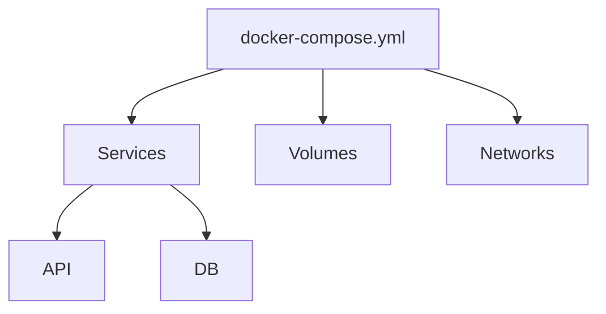

# Structure du docker-compose.yml

## Objectifs pédagogiques

- Comprendre la structure d’un fichier docker-compose.yml  
- Comprendre les éléments clés (services, ports, volumes, networks)  
- Savoir lire et modifier un fichier Compose  
- Construire une configuration complète  

---

## Contexte et problématique

Dans le chapitre précédent, tu as utilisé un fichier simple :

```yaml
services:
  db:
    image: postgres

  api:
    image: mon-api
```

👉 Mais en pratique, ce fichier doit être enrichi.

---

## Définition

Le fichier `docker-compose.yml` est un fichier YAML* qui décrit :

👉 toute ton architecture applicative

---

## Architecture



---

## Structure générale

```yaml
version: "3"

services:
  service1:
    image: image1

  service2:
    image: image2

volumes:
  mon-volume:

networks:
  mon-reseau:
```

---

## Les éléments clés

### 1 — services

👉 cœur du fichier

```yaml
services:
  api:
    image: mon-api
```

---

### 2 — ports

```yaml
ports:
  - "3000:3000"
```

👉 expose un port

---

### 3 — volumes

```yaml
volumes:
  - db-data:/var/lib/postgresql/data
```

---

### 4 — environment

```yaml
environment:
  - NODE_ENV=production
```

---

### 5 — networks

```yaml
networks:
  - mon-reseau
```

---

## Exemple complet

```yaml
version: "3"

services:
  db:
    image: postgres
    volumes:
      - db-data:/var/lib/postgresql/data

  api:
    image: mon-api
    ports:
      - "3000:3000"
    environment:
      - DB_HOST=db

volumes:
  db-data:
```

---

## Fonctionnement interne

💡 Astuce  
Chaque service devient un conteneur.

⚠️ Erreur fréquente  
Mauvaise indentation YAML (très sensible).

💣 Piège classique  
Oublier que YAML dépend des espaces.  
👉 Une mauvaise indentation peut casser tout le fichier.  
👉 Docker Compose peut échouer sans message clair.  
👉 Toujours vérifier l’alignement des blocs.

🧠 Concept clé  
Compose = configuration déclarative

---

## Cas réel

Projet classique :

- API  
- base de données  
- configuration via variables  
- persistance via volumes  

👉 Tout centralisé dans un seul fichier

---

## Bonnes pratiques

- garder un fichier lisible  
- utiliser des noms clairs  
- éviter les configurations inutiles  
- commenter si nécessaire  

---

## Résumé

Le fichier docker-compose.yml permet de :

- décrire une architecture complète  
- centraliser la configuration  
- simplifier le déploiement  

👉 C’est le cœur de Docker Compose  

---

## Notes

*YAML : format de fichier basé sur l’indentation pour structurer des données
