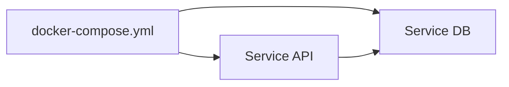

# Définir des services (approfondi)

## Objectifs pédagogiques

- Comprendre les différentes façons de définir un service  
- Comprendre la différence entre `image` et `build`  
- Gérer les dépendances entre services  
- Configurer un service de manière robuste  

---

## Contexte et problématique

Dans le chapitre précédent, tu as défini des services simples.

👉 Mais dans un projet réel :

- tu construis tes propres images  
- tu gères des dépendances  
- tu veux des services fiables  

---

## Définition

### Service*

Un service dans Docker Compose correspond à :

👉 un conteneur configuré dans le fichier YAML

---

## Architecture



👉 Les services peuvent dépendre les uns des autres

---

## image vs build

### Utiliser une image

```yaml
services:
  api:
    image: mon-api
```

---

### Construire une image

```yaml
services:
  api:
    build: .
```

👉 `build` permet d’utiliser un Dockerfile local

---

## depends_on

```yaml
services:
  api:
    build: .
    depends_on:
      - db

  db:
    image: postgres
```

👉 Garantit l’ordre de démarrage

---

## restart

```yaml
restart: always
```

👉 Redémarre automatiquement le conteneur

---

## Exemple complet

```yaml
version: "3"

services:
  db:
    image: postgres
    restart: always

  api:
    build: .
    depends_on:
      - db
    ports:
      - "3000:3000"
```

---

## Fonctionnement interne

💡 Astuce  
Utiliser `build` pour tes projets, `image` pour des services externes.

⚠️ Erreur fréquente  
Penser que `depends_on` attend que le service soit prêt.

💣 Piège classique  
Croire que `depends_on` garantit que la base de données est prête.  
👉 En réalité, il garantit seulement que le conteneur est démarré.  
👉 L’application peut échouer si elle se connecte trop tôt.  
👉 Solution : ajouter un mécanisme d’attente (retry, script, healthcheck).

🧠 Concept clé  
Dépendance ≠ disponibilité réelle

---

## Cas réel

API + DB :

- DB démarre  
- API démarre  
- API tente de se connecter  

👉 sans gestion → crash possible

---

## Bonnes pratiques

- utiliser `build` pour ton code  
- utiliser `depends_on` intelligemment  
- prévoir des retries côté application  
- configurer `restart`  

---

## Résumé

Définir un service permet de :

- structurer ton application  
- gérer les dépendances  
- améliorer la stabilité  

👉 C’est une étape clé pour une architecture propre  

---

## Notes

*Service : conteneur défini dans Docker Compose

---
[← Module précédent](docker_ch4_2.md) | [Module suivant →](docker_ch4_4.md)
---
