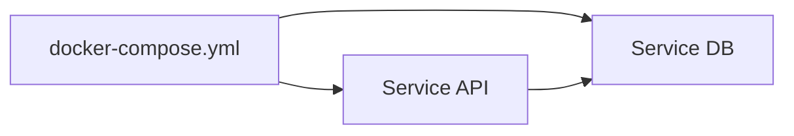

# Définir des services (approfondi)

## Objectifs pédagogiques

- Comprendre les différentes façons de définir un service  
- Comprendre la différence entre `image` et `build`  
- Gérer les dépendances entre services  
- Configurer un service de manière robuste  

---

## Contexte et problématique

Dans le chapitre précédent, tu as défini des services simples.

👉 Mais dans un projet réel :

- tu construis tes propres images  
- tu gères des dépendances  
- tu veux des services fiables  

---

## Définition

### Service*

Un service dans Docker Compose correspond à :

👉 un conteneur configuré dans le fichier YAML

---

## Architecture



👉 Les services peuvent dépendre les uns des autres

---

## image vs build

### Utiliser une image

```yaml
services:
  api:
    image: mon-api
```

---

### Construire une image

```yaml
services:
  api:
    build: .
```

👉 `build` permet d’utiliser un Dockerfile local

---

## depends_on

```yaml
services:
  api:
    build: .
    depends_on:
      - db

  db:
    image: postgres
```

👉 Garantit l’ordre de démarrage

---

## restart

```yaml
restart: always
```

👉 Redémarre automatiquement le conteneur

---

## Exemple complet

```yaml
version: "3"

services:
  db:
    image: postgres
    restart: always

  api:
    build: .
    depends_on:
      - db
    ports:
      - "3000:3000"
```

---

## Fonctionnement interne

💡 Astuce  
Utiliser `build` pour tes projets, `image` pour des services externes.

⚠️ Erreur fréquente  
Penser que `depends_on` attend que le service soit prêt.

💣 Piège classique  
Croire que `depends_on` garantit que la base de données est prête.  
👉 En réalité, il garantit seulement que le conteneur est démarré.  
👉 L’application peut échouer si elle se connecte trop tôt.  
👉 Solution : ajouter un mécanisme d’attente (retry, script, healthcheck).

🧠 Concept clé  
Dépendance ≠ disponibilité réelle

---

## Cas réel

API + DB :

- DB démarre  
- API démarre  
- API tente de se connecter  

👉 sans gestion → crash possible

---

## Bonnes pratiques

- utiliser `build` pour ton code  
- utiliser `depends_on` intelligemment  
- prévoir des retries côté application  
- configurer `restart`  

---

## Résumé

Définir un service permet de :

- structurer ton application  
- gérer les dépendances  
- améliorer la stabilité  

👉 C’est une étape clé pour une architecture propre  

---

## Notes

*Service : conteneur défini dans Docker Compose

---

<!-- snippet
id: docker_compose_service_concept
type: concept
tech: docker
level: intermediate
importance: high
format: knowledge
tags: compose,service,conteneur
title: Service Compose — un conteneur configuré dans le YAML
content: Un service dans Docker Compose correspond à un conteneur configuré dans le fichier YAML. Chaque service peut utiliser une image existante ou être construit depuis un Dockerfile local.
-->

<!-- snippet
id: docker_compose_build_directive
type: concept
tech: docker
level: intermediate
importance: medium
format: knowledge
tags: compose,build,dockerfile
title: `build` — construire une image depuis un Dockerfile local
content: La directive `build` permet de construire l'image d'un service à partir d'un Dockerfile local, contrairement à `image` qui utilise une image déjà existante (Docker Hub ou locale).
description: Utiliser `build` pour ton propre code, `image` pour les services externes (postgres, redis…)
-->

<!-- snippet
id: docker_compose_depends_on_limit
type: concept
tech: docker
level: intermediate
importance: high
format: knowledge
tags: compose,depends_on,demarrage
title: `depends_on` ne garantit pas que le service est prêt
content: `depends_on` garantit uniquement que le conteneur dépendant est démarré, pas qu'il est prêt à recevoir des connexions. Une API peut crasher si elle tente de se connecter à la DB trop tôt.
description: Solution : ajouter un mécanisme de retry côté application, un script d'attente, ou un healthcheck
-->

<!-- snippet
id: docker_compose_restart_always
type: concept
tech: docker
level: intermediate
importance: medium
format: knowledge
tags: compose,restart,stabilite
title: `restart: always` — redémarrage automatique du conteneur
content: La directive `restart: always` redémarre automatiquement un conteneur s'il s'arrête ou échoue, ce qui améliore la stabilité en production.
description: Attention : `restart: always` redémarre aussi au reboot du serveur — c'est le comportement voulu en prod. En dev, préférer `restart: unless-stopped` pour ne pas relancer après un arrêt manuel.
-->

<!-- snippet
id: docker_compose_depends_not_ready
type: concept
tech: docker
level: intermediate
importance: high
format: knowledge
tags: compose,dependance,disponibilite
title: Dépendance de démarrage ≠ disponibilité réelle
content: L'ordre de démarrage garanti par `depends_on` ne signifie pas que le service dépendant est opérationnel. La DB peut être en cours d'initialisation alors que l'API tente déjà de s'y connecter.
-->
