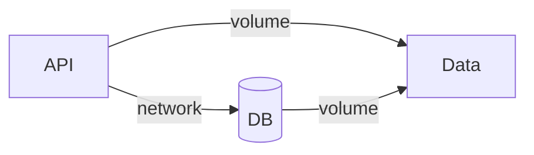

# Volumes et networks dans Compose

## Objectifs pédagogiques

- Déclarer et utiliser des volumes dans Compose
- Comprendre les réseaux implicites et explicites
- Partager des données entre services
- Structurer une architecture complète

---

## Contexte et problématique

Tu sais définir des services.

👉 Mais une application réelle nécessite aussi :

- du stockage
- de la communication réseau

👉 Compose permet de gérer tout ça dans un seul fichier.

---

## Architecture



---

## Volumes dans Compose

### Déclaration

```yaml
volumes:
  db-data:
```

---

### Utilisation

```yaml
services:
  db:
    image: postgres
    volumes:
      - db-data:/var/lib/postgresql/data
```

👉 Le volume est partagé et persistant

---

## Networks dans Compose

### Réseau implicite

👉 Par défaut, Compose crée un réseau automatique

👉 Tous les services peuvent communiquer

---

### Réseau explicite

```yaml
networks:
  app-net:

services:
  api:
    networks:
      - app-net

  db:
    networks:
      - app-net
```

---

## Exemple complet

```yaml
version: "3"

services:
  db:
    image: postgres
    volumes:
      - db-data:/var/lib/postgresql/data

  api:
    build: .
    ports:
      - "3000:3000"
    depends_on:
      - db

volumes:
  db-data:
```

---

## Fonctionnement interne

💡 Astuce
Tu n'as pas besoin de définir un réseau dans la plupart des cas.

⚠️ Erreur fréquente
Déclarer des volumes sans les utiliser correctement.

💣 Piège classique
Penser que chaque service a ses propres volumes automatiquement.
👉 En réalité, il faut déclarer explicitement les volumes partagés.
👉 Sinon, les données ne seront pas persistantes ou accessibles entre services.

🧠 Concept clé
Compose centralise réseau et stockage

---

## Cas réel

Application classique :

- API
- base de données
- stockage persistant

👉 Tout est géré dans le même fichier

---

## Bonnes pratiques

- déclarer les volumes en bas du fichier
- utiliser les réseaux implicites sauf besoin spécifique
- structurer clairement les services
- éviter les configurations inutiles

---

## Résumé

Compose permet de :

- gérer le stockage
- gérer le réseau
- centraliser l'architecture

👉 Un seul fichier = tout ton système

---

## Notes

*Volume : stockage persistant partagé
*Network : communication entre services

---

<!-- snippet
id: docker_compose_volume_declaration
type: concept
tech: docker
level: intermediate
importance: medium
format: knowledge
tags: compose,volumes,persistance
title: Déclarer un volume nommé dans Compose
content: Les volumes doivent être déclarés dans la section racine `volumes:` du fichier docker-compose.yml, puis référencés dans chaque service. Un volume non déclaré ne sera pas persistant.
description: Format : `nom-volume:/chemin/dans/conteneur`
-->

<!-- snippet
id: docker_compose_implicit_network
type: concept
tech: docker
level: intermediate
importance: medium
format: knowledge
tags: compose,network,reseau
title: Réseau implicite — Compose crée un réseau automatique
content: Par défaut, Compose crée automatiquement un réseau partagé pour tous les services. Chaque service est joignable via son nom de service.
description: Pas besoin de définir un réseau explicite dans la majorité des cas
-->

<!-- snippet
id: docker_compose_explicit_network
type: concept
tech: docker
level: intermediate
importance: medium
format: knowledge
tags: compose,network,isolation
title: Réseau explicite — isoler certains services
content: Un réseau explicite contrôle quels services peuvent communiquer entre eux. Utile pour isoler des services sensibles ou structurer une architecture en couches.
-->

<!-- snippet
id: docker_compose_volume_not_auto
type: warning
tech: docker
level: intermediate
importance: medium
format: knowledge
tags: compose,volumes,piege
title: Les volumes partagés doivent être déclarés explicitement
content: Chaque service n'a pas de volume automatique. Il faut déclarer les volumes dans la section `volumes:` racine.
-->

<!-- snippet
id: docker_compose_volume_not_auto_b
type: warning
tech: docker
level: intermediate
importance: medium
format: knowledge
tags: compose,volumes,piege
title: Volume non déclaré = données ni persistantes ni partagées
content: Sans déclaration explicite du volume, les données ne sont ni persistantes ni accessibles entre services.
-->

<!-- snippet
id: docker_compose_network_storage_central
type: concept
tech: docker
level: intermediate
importance: medium
format: knowledge
tags: compose,architecture,reseau,stockage
title: Compose centralise réseau et stockage
content: Docker Compose gère réseau et stockage persistant dans un seul fichier. Cela simplifie l'orchestration d'architectures multi-services.
-->
