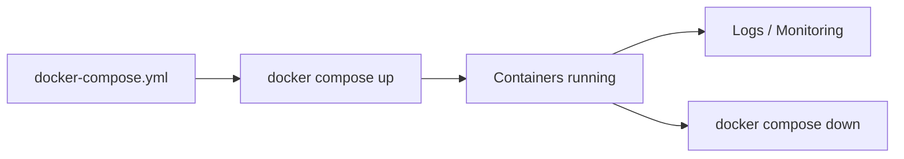

# Lancer et gérer une stack Docker Compose

## Objectifs pédagogiques

- Comprendre le cycle de vie d’une stack Compose  
- Utiliser `docker compose up`, `down`, `logs`, `build`  
- Gérer les mises à jour d’une application  
- Diagnostiquer des problèmes dans une stack  

---

## Contexte et problématique

Tu sais maintenant définir une stack complète avec Docker Compose.

👉 Mais en pratique :

- comment la lancer ?  
- comment la mettre à jour ?  
- comment voir ce qu’il se passe ?  

👉 Il faut savoir **piloter la stack**

---

## Architecture



---

## Commandes essentielles

### Lancer une stack

```bash
docker compose up
```

👉 Lance tous les services

---

### Mode détaché

```bash
docker compose up -d
```

👉 Lance en arrière-plan

---

### Reconstruire les images

```bash
docker compose up --build
```

👉 Rebuild + restart

---

### Arrêter une stack

```bash
docker compose down
```

👉 Supprime les conteneurs + réseau

---

### Voir les logs

```bash
docker compose logs
```

---

### Suivre les logs

```bash
docker compose logs -f
```

---

### Voir les services actifs

```bash
docker compose ps
```

---

## Fonctionnement interne

💡 Astuce  
`up` recrée automatiquement les conteneurs si nécessaire.

⚠️ Erreur fréquente  
Modifier le code sans rebuild (`--build`).

💣 Piège classique  
Oublier que `docker compose down` supprime les conteneurs.  
👉 Les données non persistées (sans volume) sont perdues.  
👉 Cela peut entraîner une perte de travail ou de données si mal anticipé.

🧠 Concept clé  
Compose gère le cycle de vie complet de ton application

---

## Cas réel

Tu modifies ton application :

```bash
docker compose up --build -d
```

👉 Les services sont reconstruits et redémarrés

---

## Bonnes pratiques

- utiliser `-d` en usage normal  
- utiliser `--build` après modification  
- vérifier les logs régulièrement  
- éviter `down` si données non persistées  

---

## Résumé

Docker Compose permet de :

- lancer une stack  
- gérer les services  
- monitorer l’application  

👉 C’est l’outil principal pour piloter ton architecture  

---

## Notes

*Stack : ensemble de services définis dans docker-compose.yml
