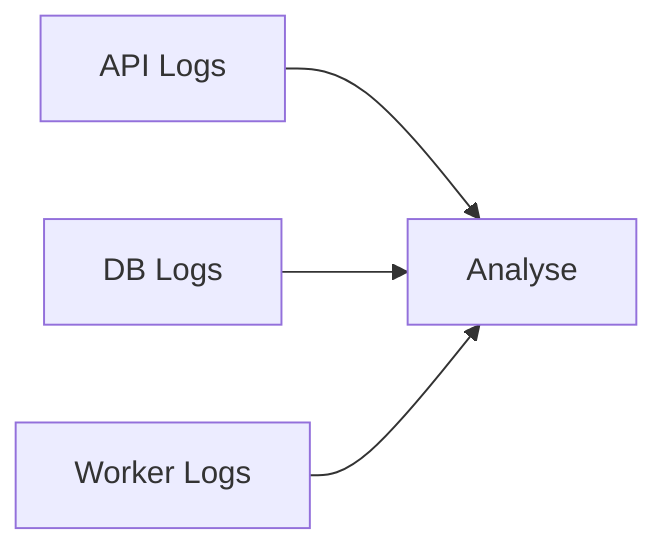

# Debug et logs avec Docker Compose

## Objectifs pédagogiques

- Lire les logs de plusieurs services  
- Comprendre les erreurs dans une stack complète  
- Utiliser les commandes de debug Compose  
- Diagnostiquer une architecture multi-conteneurs  

---

## Contexte et problématique

Avec Docker Compose, tu ne gères plus un conteneur…

👉 mais plusieurs services en même temps

👉 Donc le debug devient plus complexe :

- quel service plante ?  
- où regarder ?  
- dans quel ordre analyser ?  

---

## Architecture



👉 Tous les services produisent des logs

---

## Commandes essentielles

### Voir tous les logs

```bash
docker compose logs
```

---

### Suivre les logs en direct

```bash
docker compose logs -f
```

---

### Logs d’un service spécifique

```bash
docker compose logs api
```

---

### Voir l’état des services

```bash
docker compose ps
```

---

### Relancer un service

```bash
docker compose restart api
```

---

## Fonctionnement interne

💡 Astuce  
Commence toujours par lire les logs avant de modifier quoi que ce soit.

⚠️ Erreur fréquente  
Chercher l’erreur dans le mauvais service.

💣 Piège classique  
Regarder uniquement les logs de l’API.  
👉 Souvent, le problème vient d’un autre service (ex : base de données).  
👉 Une erreur de connexion DB apparaît côté API mais la cause est côté DB.  
👉 Toujours analyser l’ensemble de la stack.

🧠 Concept clé  
Une stack = plusieurs sources de logs interconnectées  

---

## Cas réel

Erreur API :

```text
Connection refused
```

👉 Vérification :

```bash
docker compose logs db
```

👉 Problème identifié : DB non prête

---

## Bonnes pratiques

- analyser tous les services  
- utiliser `logs -f` pour suivre en temps réel  
- identifier le service source du problème  
- redémarrer uniquement le service concerné  

---

## Résumé

Docker Compose permet de :

- centraliser les logs  
- analyser plusieurs services  
- diagnostiquer rapidement  

👉 C’est essentiel pour maintenir une application  

---

## Notes

*Logs : messages générés par les services pour indiquer leur état
