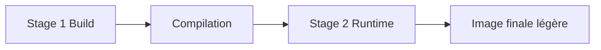

# Multi-stage build

## Objectifs pédagogiques

- Comprendre le principe du multi-stage build
- Réduire la taille des images Docker
- Séparer build et runtime
- Optimiser une image pour la production

---

## Contexte et problématique

Dans un Dockerfile classique :

- tu installes des dépendances
- tu compiles
- tu gardes tout dans l'image finale

👉 Résultat :

- image lourde
- outils inutiles en production
- surface d'attaque plus grande

---

## Définition

### Multi-stage build*

Le multi-stage build permet de :

👉 utiliser plusieurs étapes de build dans un même Dockerfile

👉 et ne garder que le résultat final

---

## Architecture



---

## Exemple sans multi-stage

```Dockerfile
FROM node:18

WORKDIR /app

COPY . .

RUN npm install && npm run build

CMD ["node", "dist/app.js"]
```

👉 Problème :
- dépendances de build présentes
- image lourde

---

## Exemple avec multi-stage

```Dockerfile
FROM node:18 AS build

WORKDIR /app

COPY . .

RUN npm install && npm run build


FROM node:18-alpine

WORKDIR /app

COPY --from=build /app/dist ./dist

CMD ["node", "dist/app.js"]
```

👉 Résultat :
- image plus légère
- uniquement le nécessaire

---

## Fonctionnement interne

💡 Astuce
Chaque `FROM` démarre une nouvelle étape.

⚠️ Erreur fréquente
Copier tout le projet dans l'image finale.

💣 Piège classique
Oublier de copier les bons fichiers depuis le stage de build.
👉 L'application peut ne pas fonctionner (fichiers manquants).
👉 Toujours vérifier les chemins (`COPY --from=build`).

🧠 Concept clé
Build ≠ Runtime

---

## Cas réel

Application front-end :

- build avec Node
- servir avec nginx

👉 multi-stage indispensable

---

## Bonnes pratiques

- séparer build et runtime
- utiliser images légères (`alpine`)
- copier uniquement les fichiers nécessaires
- tester l'image finale

---

## Résumé

Le multi-stage build permet de :

- réduire la taille des images
- améliorer la sécurité
- optimiser les performances

👉 C'est une pratique essentielle en production

---

## Notes

*Multi-stage build : technique utilisant plusieurs étapes pour construire une image optimisée

---

<!-- snippet
id: docker_multistage_concept
type: concept
tech: docker
level: intermediate
importance: high
format: knowledge
tags: multistage,build,optimisation,image
title: Multi-stage build — définition
content: Le multi-stage build utilise plusieurs étapes dans un même Dockerfile pour ne conserver que le résultat final. Chaque `FROM` démarre une étape indépendante.
description: Technique essentielle pour séparer environnement de build et environnement de runtime
-->

<!-- snippet
id: docker_multistage_copy_from
type: command
tech: docker
level: intermediate
importance: medium
format: knowledge
tags: multistage,COPY,stage,Dockerfile
title: Copier un artefact depuis un stage de build
command: COPY --from=build /app/dist ./dist
description: Copie uniquement les fichiers compilés depuis le stage nommé "build" vers l'image finale, sans embarquer les outils de build
-->

<!-- snippet
id: docker_multistage_build_runtime_separation
type: concept
tech: docker
level: intermediate
importance: high
format: knowledge
tags: multistage,bonne-pratique,alpine,optimisation
title: Séparer build et runtime avec alpine
content: Utiliser une image lourde (ex. node:18) pour compiler, puis une image alpine légère pour le runtime. Cela réduit drastiquement la taille de l'image finale.
description: Une image node:18 pèse ~1 Go. Avec multi-stage + alpine, la même app en prod peut peser < 50 Mo — moins de surface d'attaque, transfert plus rapide en CI.
-->

<!-- snippet
id: docker_multistage_missing_files_warning
type: warning
tech: docker
level: intermediate
importance: medium
format: knowledge
tags: multistage,COPY,piege,Dockerfile
title: Piège — fichiers manquants depuis le stage de build
content: Oublier de copier les bons fichiers depuis le stage de build rend l'application non fonctionnelle. Toujours vérifier les chemins dans `COPY --from=`.
-->

<!-- snippet
id: docker_multistage_full_example
type: concept
tech: docker
level: intermediate
importance: low
format: knowledge
tags: multistage,node,alpine,exemple
title: Exemple complet multi-stage Node.js
content: Stage 1 (build) utilise node:18 pour compiler. Stage 2 (runtime) utilise node:18-alpine et ne copie que le dossier dist — image finale légère.
-->
