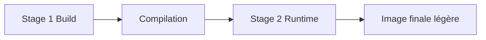

# Multi-stage build

## Objectifs pédagogiques

- Comprendre le principe du multi-stage build  
- Réduire la taille des images Docker  
- Séparer build et runtime  
- Optimiser une image pour la production  

---

## Contexte et problématique

Dans un Dockerfile classique :

- tu installes des dépendances  
- tu compiles  
- tu gardes tout dans l’image finale  

👉 Résultat :

- image lourde  
- outils inutiles en production  
- surface d’attaque plus grande  

---

## Définition

### Multi-stage build*

Le multi-stage build permet de :

👉 utiliser plusieurs étapes de build dans un même Dockerfile

👉 et ne garder que le résultat final

---

## Architecture



---

## Exemple sans multi-stage

```Dockerfile
FROM node:18

WORKDIR /app

COPY . .

RUN npm install && npm run build

CMD ["node", "dist/app.js"]
```

👉 Problème :
- dépendances de build présentes
- image lourde

---

## Exemple avec multi-stage

```Dockerfile
FROM node:18 AS build

WORKDIR /app

COPY . .

RUN npm install && npm run build


FROM node:18-alpine

WORKDIR /app

COPY --from=build /app/dist ./dist

CMD ["node", "dist/app.js"]
```

👉 Résultat :
- image plus légère
- uniquement le nécessaire

---

## Fonctionnement interne

💡 Astuce  
Chaque `FROM` démarre une nouvelle étape.

⚠️ Erreur fréquente  
Copier tout le projet dans l’image finale.

💣 Piège classique  
Oublier de copier les bons fichiers depuis le stage de build.  
👉 L’application peut ne pas fonctionner (fichiers manquants).  
👉 Toujours vérifier les chemins (`COPY --from=build`).

🧠 Concept clé  
Build ≠ Runtime

---

## Cas réel

Application front-end :

- build avec Node  
- servir avec nginx  

👉 multi-stage indispensable

---

## Bonnes pratiques

- séparer build et runtime  
- utiliser images légères (`alpine`)  
- copier uniquement les fichiers nécessaires  
- tester l’image finale  

---

## Résumé

Le multi-stage build permet de :

- réduire la taille des images  
- améliorer la sécurité  
- optimiser les performances  

👉 C’est une pratique essentielle en production  

---

## Notes

*Multi-stage build : technique utilisant plusieurs étapes pour construire une image optimisée

---
[← Module précédent](docker_ch4_7.md) | [Module suivant →](docker_ch5_2.md)
---
