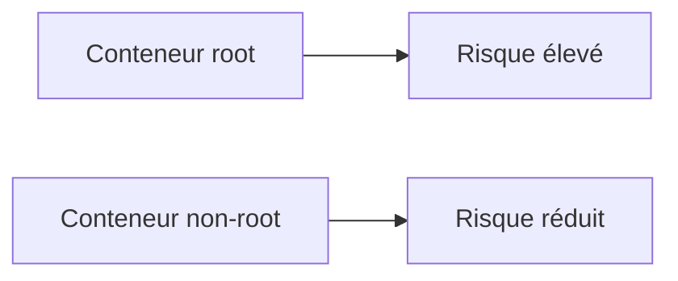

# Sécurité des conteneurs

## Objectifs pédagogiques

- Comprendre les enjeux de sécurité avec Docker
- Exécuter un conteneur avec un utilisateur non root
- Réduire la surface d'attaque
- Appliquer les bonnes pratiques de sécurité

---

## Contexte et problématique

Par défaut, beaucoup de conteneurs Docker s'exécutent en tant que :

👉 **root (administrateur)**

👉 Cela peut être dangereux :

- accès complet au système
- risque en cas de faille
- propagation possible

---

## Définition

### Root*

Root est l'utilisateur avec tous les droits sur un système Linux.

👉 Dans un conteneur, cela donne des privilèges élevés.

---

## Architecture



---

## Commandes essentielles

### Créer un utilisateur

```Dockerfile
RUN adduser -D appuser
```

---

### Changer d'utilisateur

```Dockerfile
USER appuser
```

---

### Exemple sécurisé

```Dockerfile
FROM node:18-alpine

WORKDIR /app

RUN adduser -D appuser

COPY . .

RUN chown -R appuser /app

USER appuser

CMD ["node", "app.js"]
```

---

## Fonctionnement interne

💡 Astuce
Toujours exécuter les applications avec un utilisateur non root.

⚠️ Erreur fréquente
Penser qu'un conteneur est sécurisé par défaut.

💣 Piège classique
Laisser des permissions root en production.
👉 Si une faille est exploitée, l'attaquant peut avoir un contrôle total.
👉 Cela peut compromettre le serveur hôte.
👉 Il faut limiter les privilèges au maximum.

🧠 Concept clé
Moins de privilèges = moins de risques

---

## Cas réel

Une application web exposée sur Internet :

- conteneur root → risque élevé
- conteneur non-root → surface réduite

👉 standard en production

---

## Bonnes pratiques

- ne jamais utiliser root en production
- utiliser des images officielles et sécurisées
- limiter les permissions
- supprimer les outils inutiles

---

## Résumé

La sécurité Docker repose sur :

- la réduction des privilèges
- la limitation des accès
- une configuration propre

👉 C'est indispensable pour un usage réel

---

## Notes

*Root : utilisateur avec tous les privilèges sur un système

---

<!-- snippet
id: docker_security_root_concept
type: concept
tech: docker
level: intermediate
importance: high
format: knowledge
tags: securite,root,privileges,conteneur
title: Risque root dans les conteneurs Docker
content: Par défaut, de nombreux conteneurs s'exécutent en tant que root. Cela donne des privilèges élevés qui peuvent être exploités en cas de faille pour compromettre le système hôte.
description: Principe de sécurité fondamental : moins de privilèges = moins de risques
-->

<!-- snippet
id: docker_security_adduser
type: command
tech: docker
level: intermediate
importance: high
format: knowledge
tags: securite,utilisateur,Dockerfile,non-root
title: Créer un utilisateur non-root dans un Dockerfile
command: RUN adduser -D appuser
description: Crée un utilisateur sans mot de passe (-D) pour exécuter l'application sans privilèges root
-->

<!-- snippet
id: docker_security_user_directive
type: command
tech: docker
level: intermediate
importance: high
format: knowledge
tags: securite,USER,Dockerfile,privileges
title: Changer d'utilisateur dans un Dockerfile
command: USER appuser
description: Toutes les instructions suivantes et le processus final s'exécuteront avec cet utilisateur non-root
-->

<!-- snippet
id: docker_security_chown
type: command
tech: docker
level: intermediate
importance: medium
format: knowledge
tags: securite,permissions,chown,Dockerfile
title: Donner les droits sur le répertoire applicatif
command: RUN chown -R appuser /app
description: Nécessaire pour que l'utilisateur non-root puisse lire et écrire dans le répertoire de travail
-->

<!-- snippet
id: docker_security_root_production_warning
type: warning
tech: docker
level: intermediate
importance: medium
format: knowledge
tags: securite,root,production,piege
title: Piège — laisser des permissions root en production
content: Laisser un conteneur s'exécuter en root en production est dangereux. En cas de faille exploitée, l'attaquant peut obtenir un contrôle total du conteneur voire du serveur hôte.
-->

<!-- snippet
id: docker_security_not_secure_by_default
type: warning
tech: docker
level: intermediate
importance: medium
format: knowledge
tags: securite,conteneur,idee-recue
title: Erreur fréquente — croire qu'un conteneur est sécurisé par défaut
content: Un conteneur Docker n'est pas sécurisé par défaut. Il faut explicitement réduire les privilèges, limiter les permissions et supprimer les outils inutiles.
-->
