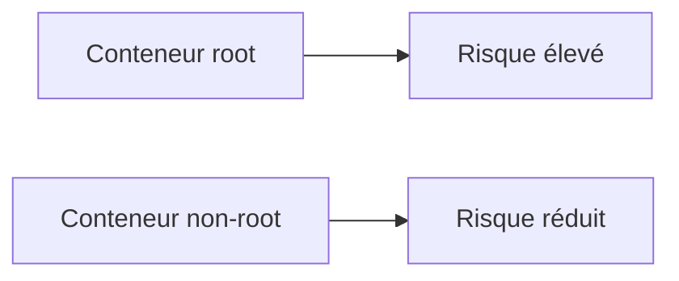

# Sécurité des conteneurs

## Objectifs pédagogiques

- Comprendre les enjeux de sécurité avec Docker  
- Exécuter un conteneur avec un utilisateur non root  
- Réduire la surface d’attaque  
- Appliquer les bonnes pratiques de sécurité  

---

## Contexte et problématique

Par défaut, beaucoup de conteneurs Docker s’exécutent en tant que :

👉 **root (administrateur)**

👉 Cela peut être dangereux :

- accès complet au système  
- risque en cas de faille  
- propagation possible  

---

## Définition

### Root*

Root est l’utilisateur avec tous les droits sur un système Linux.

👉 Dans un conteneur, cela donne des privilèges élevés.

---

## Architecture



---

## Commandes essentielles

### Créer un utilisateur

```Dockerfile
RUN adduser -D appuser
```

---

### Changer d’utilisateur

```Dockerfile
USER appuser
```

---

### Exemple sécurisé

```Dockerfile
FROM node:18-alpine

WORKDIR /app

RUN adduser -D appuser

COPY . .

RUN chown -R appuser /app

USER appuser

CMD ["node", "app.js"]
```

---

## Fonctionnement interne

💡 Astuce  
Toujours exécuter les applications avec un utilisateur non root.

⚠️ Erreur fréquente  
Penser qu’un conteneur est sécurisé par défaut.

💣 Piège classique  
Laisser des permissions root en production.  
👉 Si une faille est exploitée, l’attaquant peut avoir un contrôle total.  
👉 Cela peut compromettre le serveur hôte.  
👉 Il faut limiter les privilèges au maximum.

🧠 Concept clé  
Moins de privilèges = moins de risques

---

## Cas réel

Une application web exposée sur Internet :

- conteneur root → risque élevé  
- conteneur non-root → surface réduite  

👉 standard en production

---

## Bonnes pratiques

- ne jamais utiliser root en production  
- utiliser des images officielles et sécurisées  
- limiter les permissions  
- supprimer les outils inutiles  

---

## Résumé

La sécurité Docker repose sur :

- la réduction des privilèges  
- la limitation des accès  
- une configuration propre  

👉 C’est indispensable pour un usage réel  

---

## Notes

*Root : utilisateur avec tous les privilèges sur un système
