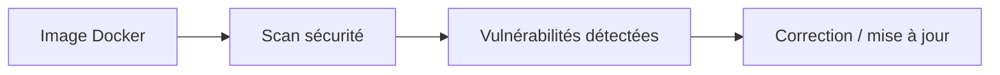

# Vulnérabilités et scan des images

## Objectifs pédagogiques

- Comprendre les vulnérabilités dans les images Docker
- Utiliser des outils de scan
- Mettre à jour et sécuriser ses images
- Réduire les risques en production

---

## Contexte et problématique

Quand tu utilises une image Docker :

👉 tu utilises du code que tu ne maîtrises pas totalement

👉 Exemple :

- image officielle
- dépendances
- librairies système

👉 Ces éléments peuvent contenir des failles de sécurité

---

## Définition

### Vulnérabilité*

Une vulnérabilité est une faille de sécurité exploitable.

👉 Elle peut permettre :

- accès non autorisé
- fuite de données
- exécution de code

---

## Architecture



---

## Commandes essentielles

### Scanner une image avec Docker (scan intégré*)

```bash
docker scan mon-image
```

---

### Utiliser un outil externe (ex : Trivy)

```bash
trivy image mon-image
```

👉 Analyse complète des vulnérabilités

---

## Fonctionnement interne

💡 Astuce
Scanner régulièrement ses images.

⚠️ Erreur fréquente
Utiliser des images anciennes non mises à jour.

💣 Piège classique
Penser qu'une image officielle est toujours sécurisée.
👉 Même les images officielles peuvent contenir des vulnérabilités.
👉 Elles doivent être mises à jour régulièrement.
👉 Toujours vérifier les versions utilisées.

🧠 Concept clé
La sécurité est un processus continu

---

## Cas réel

Une image Node.js :

- contient une version vulnérable d'OpenSSL
- scan → vulnérabilité détectée

👉 solution :

- mettre à jour l'image
- rebuild

---

## Bonnes pratiques

- utiliser des images à jour
- scanner régulièrement
- minimiser les dépendances
- utiliser des images légères

---

## Résumé

Le scan permet de :

- détecter les failles
- améliorer la sécurité
- prévenir les attaques

👉 Indispensable en production

---

## Notes

*Vulnérabilité : faille de sécurité exploitable
*Scan : analyse automatique de sécurité

---

<!-- snippet
id: docker_vulnerability_concept
type: concept
tech: docker
level: intermediate
importance: medium
format: knowledge
tags: securite,vulnerabilite,faille,images
title: Vulnérabilité dans une image Docker — définition
content: Une vulnérabilité est une faille exploitable dans une image Docker, ses dépendances ou ses librairies système. Elle peut permettre un accès non autorisé ou une fuite de données.
-->

<!-- snippet
id: docker_scan_builtin
type: command
tech: docker
level: intermediate
importance: medium
format: knowledge
tags: scan,securite,vulnerabilite,docker-scan
title: Scanner une image avec docker scan
command: docker scan <IMAGE>
example: docker scan nginx:latest
description: Outil de scan intégré à Docker pour détecter les vulnérabilités connues dans une image
-->

<!-- snippet
id: docker_scan_trivy
type: command
tech: docker
level: intermediate
importance: high
format: knowledge
tags: scan,trivy,securite,vulnerabilite
title: Scanner une image avec Trivy
command: trivy image <IMAGE>
example: trivy image postgres:15
description: Trivy est un outil open-source de scan de sécurité fournissant une analyse complète des vulnérabilités d'une image Docker
-->

<!-- snippet
id: docker_scan_regular_tip
type: tip
tech: docker
level: intermediate
importance: medium
format: knowledge
tags: scan,securite,bonne-pratique
title: Bonne pratique — scanner régulièrement ses images
content: Scanner ses images régulièrement détecte de nouvelles vulnérabilités sur des images déjà déployées. La sécurité est un processus continu, pas un état figé.
-->

<!-- snippet
id: docker_scan_official_image_warning
type: warning
tech: docker
level: intermediate
importance: medium
format: knowledge
tags: securite,images-officielles,piege,vulnerabilite
title: Piège — penser qu'une image officielle est toujours sécurisée
content: Même les images officielles Docker Hub peuvent contenir des vulnérabilités. Les scanner et les mettre à jour régulièrement reste indispensable.
-->
