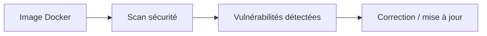

# Vulnérabilités et scan des images

## Objectifs pédagogiques

- Comprendre les vulnérabilités dans les images Docker  
- Utiliser des outils de scan  
- Mettre à jour et sécuriser ses images  
- Réduire les risques en production  

---

## Contexte et problématique

Quand tu utilises une image Docker :

👉 tu utilises du code que tu ne maîtrises pas totalement

👉 Exemple :

- image officielle  
- dépendances  
- librairies système  

👉 Ces éléments peuvent contenir des failles de sécurité

---

## Définition

### Vulnérabilité*

Une vulnérabilité est une faille de sécurité exploitable.

👉 Elle peut permettre :

- accès non autorisé  
- fuite de données  
- exécution de code  

---

## Architecture



---

## Commandes essentielles

### Scanner une image avec Docker (scan intégré*)

```bash
docker scan mon-image
```

---

### Utiliser un outil externe (ex : Trivy)

```bash
trivy image mon-image
```

👉 Analyse complète des vulnérabilités

---

## Fonctionnement interne

💡 Astuce  
Scanner régulièrement ses images.

⚠️ Erreur fréquente  
Utiliser des images anciennes non mises à jour.

💣 Piège classique  
Penser qu’une image officielle est toujours sécurisée.  
👉 Même les images officielles peuvent contenir des vulnérabilités.  
👉 Elles doivent être mises à jour régulièrement.  
👉 Toujours vérifier les versions utilisées.

🧠 Concept clé  
La sécurité est un processus continu

---

## Cas réel

Une image Node.js :

- contient une version vulnérable d’OpenSSL  
- scan → vulnérabilité détectée  

👉 solution :

- mettre à jour l’image  
- rebuild  

---

## Bonnes pratiques

- utiliser des images à jour  
- scanner régulièrement  
- minimiser les dépendances  
- utiliser des images légères  

---

## Résumé

Le scan permet de :

- détecter les failles  
- améliorer la sécurité  
- prévenir les attaques  

👉 Indispensable en production  

---

## Notes

*Vulnérabilité : faille de sécurité exploitable  
*Scan : analyse automatique de sécurité

---
[← Module précédent](docker_ch5_2.md) | [Module suivant →](docker_ch5_4.md)
---
