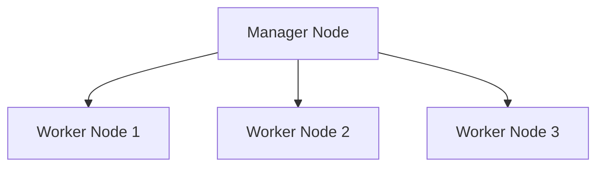

# Introduction à Docker Swarm

## Objectifs pédagogiques

- Comprendre ce qu’est Docker Swarm  
- Comprendre le concept d’orchestration  
- Comprendre la notion de cluster  
- Identifier les différences avec Docker Compose  

---

## Contexte et problématique

Avec Docker Compose, tu peux gérer plusieurs conteneurs…

👉 mais uniquement sur **une seule machine**

👉 Problème en production :

- besoin de haute disponibilité  
- besoin de scalabilité  
- besoin de gérer plusieurs serveurs  

👉 C’est là qu’intervient Docker Swarm

---

## Définition

### Docker Swarm*

Docker Swarm est un orchestrateur de conteneurs.

👉 Il permet de :

- gérer plusieurs machines (cluster)  
- déployer des services  
- répartir la charge automatiquement  

---

### Orchestrateur*

Un orchestrateur est un outil qui :

👉 gère automatiquement des conteneurs à grande échelle

---

## Architecture

👉 Le manager contrôle le cluster  
👉 Les workers exécutent les conteneurs  

---

## Compose vs Swarm

| Fonction | Compose | Swarm |
|----------|--------|------|
| Multi-machine | ❌ | ✔️ |
| Scalabilité | limitée | ✔️ |
| Orchestration | ❌ | ✔️ |
| Production | limité | ✔️ |

---

## Fonctionnement interne

💡 Astuce  
Swarm est intégré directement dans Docker.

⚠️ Erreur fréquente  
Penser que Swarm remplace complètement Compose.

💣 Piège classique  
Utiliser Swarm sans comprendre les concepts de base Docker.  
👉 Swarm ajoute une couche de complexité.  
👉 Sans maîtrise des bases (réseau, volumes, images), les erreurs deviennent difficiles à diagnostiquer.

🧠 Concept clé  
Swarm = Docker + orchestration

---

## Cas réel

Une application doit :

- tourner sur plusieurs serveurs  
- rester disponible même en cas de panne  
- gérer plusieurs instances  

👉 Swarm permet de répondre à ces besoins

---

## Bonnes pratiques

- maîtriser Docker avant Swarm  
- commencer avec un petit cluster  
- tester en local avant production  
- comprendre les rôles manager / worker  

---

## Résumé

Docker Swarm permet de :

- gérer plusieurs machines  
- orchestrer des conteneurs  
- améliorer la disponibilité  

👉 C’est une introduction à l’orchestration  

---

## Notes

*Docker Swarm : orchestrateur natif de Docker
*Orchestrateur : outil de gestion automatisée de conteneurs

---

<!-- snippet
id: docker_swarm_definition
type: concept
tech: docker
level: advanced
importance: high
format: knowledge
tags: swarm,orchestration,cluster
title: Docker Swarm — définition
content: Docker Swarm est l'orchestrateur natif de Docker. Il gère plusieurs machines (cluster), déploie des services et répartit la charge automatiquement.
description: Swarm est intégré directement dans Docker, aucune installation supplémentaire n'est nécessaire.
-->

<!-- snippet
id: docker_swarm_vs_compose
type: concept
tech: docker
level: advanced
importance: medium
format: knowledge
tags: swarm,compose,orchestration,comparaison
title: Docker Swarm vs Docker Compose
content: Compose gère plusieurs conteneurs sur une seule machine. Swarm orchestre sur plusieurs machines avec scalabilité et haute disponibilité — il étend Compose sans le remplacer.
-->

<!-- snippet
id: docker_swarm_orchestrateur
type: concept
tech: docker
level: advanced
importance: medium
format: knowledge
tags: swarm,orchestration,cluster
title: Concept d'orchestrateur
content: Un orchestrateur gère automatiquement des conteneurs à grande échelle : déploiement, montée en charge, tolérance aux pannes et distribution multi-machines.
-->

<!-- snippet
id: docker_swarm_complexite_prerequis
type: concept
tech: docker
level: advanced
importance: low
format: knowledge
tags: swarm,bases,complexite
title: Swarm sans maîtrise des bases Docker
content: Utiliser Swarm sans comprendre les concepts de base Docker (réseau, volumes, images) rend les erreurs très difficiles à diagnostiquer. Swarm ajoute une couche de complexité importante.
-->

<!-- snippet
id: docker_swarm_roles_manager_worker
type: concept
tech: docker
level: advanced
importance: high
format: knowledge
tags: swarm,manager,worker,architecture
title: Rôles manager et worker dans Swarm
content: Le manager contrôle le cluster et distribue les tâches. Les workers exécutent les conteneurs. Plusieurs managers en production évitent un point de défaillance unique.
-->
