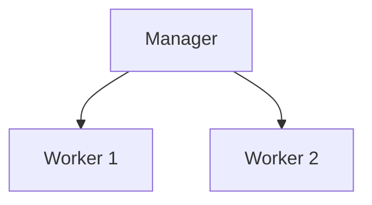

# Initialiser un cluster Docker Swarm

## Objectifs pédagogiques

- Initialiser un cluster Swarm  
- Comprendre les rôles manager et worker  
- Ajouter des nœuds au cluster  
- Vérifier l’état du cluster  

---

## Contexte et problématique

Tu sais maintenant ce qu’est Swarm.

👉 Mais concrètement :

- comment créer un cluster ?  
- comment ajouter des machines ?  

👉 C’est ce qu’on va faire ici.

---

## Architecture



---

## Commandes essentielles

### Initialiser un cluster

```bash
docker swarm init
```

👉 Cette commande :

- transforme la machine en manager  
- initialise le cluster  

---

### Résultat

Docker te donne une commande :

```bash
docker swarm join --token XXXXX IP:PORT
```

👉 à exécuter sur les autres machines

---

### Ajouter un worker

Sur une autre machine :

```bash
docker swarm join --token XXXXX IP:PORT
```

---

### Voir les nœuds

```bash
docker node ls
```

---

## Fonctionnement interne

💡 Astuce  
Le manager est le cerveau du cluster.

⚠️ Erreur fréquente  
Confondre manager et worker.

💣 Piège classique  
Perdre le manager principal.  
👉 Si le manager tombe sans backup, le cluster devient inutilisable.  
👉 En production, il faut plusieurs managers.

🧠 Concept clé  
Manager = contrôle  
Worker = exécution  

---

## Cas réel

Cluster minimal :

- 1 manager  
- 2 workers  

👉 permet :

- répartition des services  
- tolérance aux pannes  

---

## Bonnes pratiques

- utiliser plusieurs managers en production  
- sécuriser les tokens  
- surveiller l’état des nœuds  
- tester en local avant déploiement réel  

---

## Résumé

Initialiser un cluster permet de :

- créer une architecture distribuée  
- ajouter des machines  
- préparer l’orchestration  

👉 C’est la base de Docker Swarm  

---

## Notes

*Manager : nœud qui contrôle le cluster  
*Worker : nœud qui exécute les conteneurs

---
[← Module précédent](docker_ch6_1.md) | [Module suivant →](docker_ch6_3.md)
---
