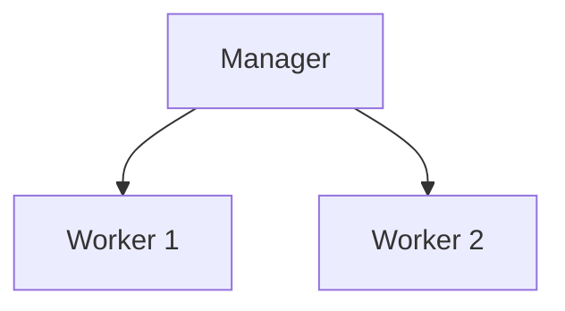

# Initialiser un cluster Docker Swarm

## Objectifs pédagogiques

- Initialiser un cluster Swarm  
- Comprendre les rôles manager et worker  
- Ajouter des nœuds au cluster  
- Vérifier l’état du cluster  

---

## Contexte et problématique

Tu sais maintenant ce qu’est Swarm.

👉 Mais concrètement :

- comment créer un cluster ?  
- comment ajouter des machines ?  

👉 C’est ce qu’on va faire ici.

---

## Architecture



---

## Commandes essentielles

### Initialiser un cluster

```bash
docker swarm init
```

👉 Cette commande :

- transforme la machine en manager  
- initialise le cluster  

---

### Résultat

Docker te donne une commande :

```bash
docker swarm join --token XXXXX IP:PORT
```

👉 à exécuter sur les autres machines

---

### Ajouter un worker

Sur une autre machine :

```bash
docker swarm join --token XXXXX IP:PORT
```

---

### Voir les nœuds

```bash
docker node ls
```

---

## Fonctionnement interne

💡 Astuce  
Le manager est le cerveau du cluster.

⚠️ Erreur fréquente  
Confondre manager et worker.

💣 Piège classique  
Perdre le manager principal.  
👉 Si le manager tombe sans backup, le cluster devient inutilisable.  
👉 En production, il faut plusieurs managers.

🧠 Concept clé  
Manager = contrôle  
Worker = exécution  

---

## Cas réel

Cluster minimal :

- 1 manager  
- 2 workers  

👉 permet :

- répartition des services  
- tolérance aux pannes  

---

## Bonnes pratiques

- utiliser plusieurs managers en production  
- sécuriser les tokens  
- surveiller l’état des nœuds  
- tester en local avant déploiement réel  

---

## Résumé

Initialiser un cluster permet de :

- créer une architecture distribuée  
- ajouter des machines  
- préparer l’orchestration  

👉 C’est la base de Docker Swarm  

---

## Notes

*Manager : nœud qui contrôle le cluster
*Worker : nœud qui exécute les conteneurs

---

<!-- snippet
id: docker_swarm_init
type: command
tech: docker
level: advanced
importance: high
format: knowledge
tags: swarm,cluster,init,manager
title: Initialiser un cluster Swarm
command: docker swarm init
description: Transforme la machine courante en nœud manager et initialise le cluster. Docker retourne ensuite un token à utiliser pour ajouter des workers.
-->

<!-- snippet
id: docker_swarm_join_worker
type: command
tech: docker
level: advanced
importance: high
format: knowledge
tags: swarm,cluster,join,worker
title: Ajouter un worker au cluster Swarm
context: Sur la machine worker à joindre au cluster
command: docker swarm join --token <TOKEN> <IP_MANAGER>:2377
example: docker swarm join --token SWMTKN-1-49nj1cmql0jkz5s954yi3oex3nedyz0fb0xx14ie39trti4wxv-8vxv8rssmk743ojnwacrr2e7c 192.168.1.100:2377
description: Rejoint le cluster Swarm en tant que worker. Le token est fourni après docker swarm init sur le manager.
-->

<!-- snippet
id: docker_swarm_node_ls
type: command
tech: docker
level: advanced
importance: high
format: knowledge
tags: swarm,nodes,cluster,supervision
title: Lister les nœuds du cluster
command: docker node ls
description: Affiche tous les nœuds du cluster avec leur rôle (manager/worker) et leur statut.
-->

<!-- snippet
id: docker_swarm_manager_perte
type: concept
tech: docker
level: advanced
importance: high
format: knowledge
tags: swarm,manager,haute-disponibilite,production
title: Perte du manager principal
content: Si le seul manager tombe, le cluster devient inutilisable. En production, il est impératif d'avoir plusieurs managers pour garantir la continuité du cluster.
-->

<!-- snippet
id: docker_swarm_manager_worker_roles
type: concept
tech: docker
level: advanced
importance: medium
format: knowledge
tags: swarm,manager,worker,cluster
title: Manager = contrôle, Worker = exécution
content: Dans Swarm, le manager est le cerveau du cluster (planification, orchestration). Le worker se contente d'exécuter les conteneurs assignés. Ne pas confondre les deux rôles.
-->

