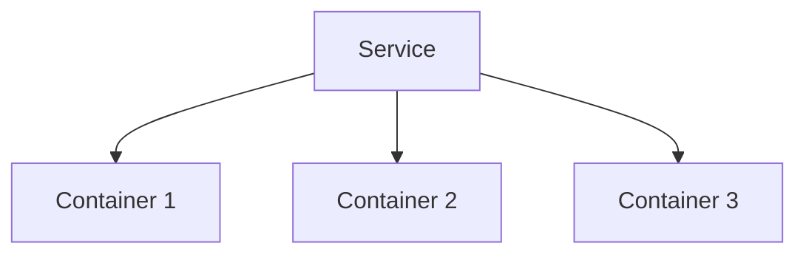

# Déployer un service avec Docker Swarm

## Objectifs pédagogiques

- Comprendre ce qu’est un service dans Swarm  
- Déployer un service avec `docker service`  
- Comprendre la notion de réplication  
- Différencier conteneur vs service  

---

## Contexte et problématique

Jusqu’ici, tu utilisais :

```bash
docker run
```

👉 Problème :

- conteneur unique  
- pas de gestion automatique  
- pas de scalabilité  

👉 Swarm introduit un nouveau concept :

👉 **le service**

---

## Définition

### Service*

Un service est une abstraction qui permet de :

👉 exécuter un ou plusieurs conteneurs  
👉 gérer leur cycle de vie automatiquement  

---

## Architecture



👉 Un service peut gérer plusieurs instances

---

## Commandes essentielles

### Créer un service

```bash
docker service create --name web nginx
```

---

### Voir les services

```bash
docker service ls
```

---

### Voir les tâches (conteneurs)

```bash
docker service ps web
```

---

### Supprimer un service

```bash
docker service rm web
```

---

## Scaling (très important)

### Déployer avec plusieurs replicas

```bash
docker service create --name web --replicas 3 nginx
```

👉 3 conteneurs automatiquement

---

### Modifier le nombre de replicas

```bash
docker service scale web=5
```

---

## Fonctionnement interne

💡 Astuce  
Swarm recrée automatiquement un conteneur s’il tombe.

⚠️ Erreur fréquente  
Confondre service et conteneur.

💣 Piège classique  
Modifier un conteneur au lieu du service.  
👉 Les modifications sont perdues car Swarm recrée les conteneurs automatiquement.  
👉 Il faut toujours modifier la définition du service.

🧠 Concept clé  
Service = état désiré (desired state)

---

## Cas réel

Tu veux un site web :

```bash
docker service create --name web --replicas 3 nginx
```

👉 Résultat :

- 3 instances  
- réparties sur les nodes  
- auto-restart si crash  

---

## Bonnes pratiques

- toujours utiliser des services en Swarm  
- définir un nombre de replicas adapté  
- éviter la gestion manuelle des conteneurs  
- surveiller les services  

---

## Résumé

Un service permet de :

- gérer plusieurs conteneurs  
- assurer la disponibilité  
- automatiser le cycle de vie  

👉 C’est le cœur de Docker Swarm  

---

## Notes

*Service : abstraction permettant de gérer plusieurs conteneurs automatiquement
