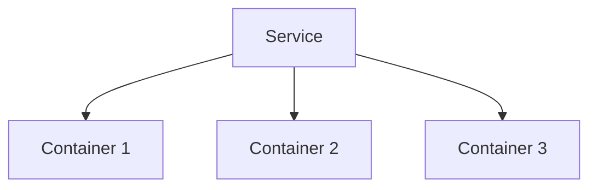

# Déployer un service avec Docker Swarm

## Objectifs pédagogiques

- Comprendre ce qu’est un service dans Swarm  
- Déployer un service avec `docker service`  
- Comprendre la notion de réplication  
- Différencier conteneur vs service  

---

## Contexte et problématique

Jusqu’ici, tu utilisais :

```bash
docker run
```

👉 Problème :

- conteneur unique  
- pas de gestion automatique  
- pas de scalabilité  

👉 Swarm introduit un nouveau concept :

👉 **le service**

---

## Définition

### Service*

Un service est une abstraction qui permet de :

👉 exécuter un ou plusieurs conteneurs  
👉 gérer leur cycle de vie automatiquement  

---

## Architecture



👉 Un service peut gérer plusieurs instances

---

## Commandes essentielles

### Créer un service

```bash
docker service create --name web nginx
```

---

### Voir les services

```bash
docker service ls
```

---

### Voir les tâches (conteneurs)

```bash
docker service ps web
```

---

### Supprimer un service

```bash
docker service rm web
```

---

## Scaling (très important)

### Déployer avec plusieurs replicas

```bash
docker service create --name web --replicas 3 nginx
```

👉 3 conteneurs automatiquement

---

### Modifier le nombre de replicas

```bash
docker service scale web=5
```

---

## Fonctionnement interne

💡 Astuce  
Swarm recrée automatiquement un conteneur s’il tombe.

⚠️ Erreur fréquente  
Confondre service et conteneur.

💣 Piège classique  
Modifier un conteneur au lieu du service.  
👉 Les modifications sont perdues car Swarm recrée les conteneurs automatiquement.  
👉 Il faut toujours modifier la définition du service.

🧠 Concept clé  
Service = état désiré (desired state)

---

## Cas réel

Tu veux un site web :

```bash
docker service create --name web --replicas 3 nginx
```

👉 Résultat :

- 3 instances  
- réparties sur les nodes  
- auto-restart si crash  

---

## Bonnes pratiques

- toujours utiliser des services en Swarm  
- définir un nombre de replicas adapté  
- éviter la gestion manuelle des conteneurs  
- surveiller les services  

---

## Résumé

Un service permet de :

- gérer plusieurs conteneurs  
- assurer la disponibilité  
- automatiser le cycle de vie  

👉 C’est le cœur de Docker Swarm  

---

## Notes

*Service : abstraction permettant de gérer plusieurs conteneurs automatiquement

---

<!-- snippet
id: docker_swarm_service_create
tech: docker
level: advanced
importance: high
format: knowledge
tags: swarm,service,deploiement
title: Créer un service Swarm
command: docker service create --name <NOM> <IMAGE>
description: Crée un service géré par Swarm. Swarm gère automatiquement le cycle de vie du conteneur.
-->

<!-- snippet
id: docker_swarm_service_ls
tech: docker
level: advanced
importance: medium
format: knowledge
tags: swarm,service,supervision
title: Lister les services Swarm
command: docker service ls
description: Affiche la liste de tous les services déployés dans le cluster avec leur statut et le nombre de replicas actifs.
-->

<!-- snippet
id: docker_swarm_service_ps
tech: docker
level: advanced
importance: medium
format: knowledge
tags: swarm,service,taches,supervision
title: Voir les tâches (conteneurs) d'un service
command: docker service ps <SERVICE>
description: Affiche les conteneurs (tâches) associés au service, leur état et sur quel node ils tournent.
-->

<!-- snippet
id: docker_swarm_service_replicas
tech: docker
level: advanced
importance: high
format: knowledge
tags: swarm,service,replicas,scaling
title: Créer un service avec plusieurs replicas
command: docker service create --name <NOM> --replicas 3 <IMAGE>
description: Lance 3 instances du service, réparties automatiquement sur les nœuds disponibles.
-->

<!-- snippet
id: docker_swarm_service_scale
tech: docker
level: advanced
importance: high
format: knowledge
tags: swarm,service,scaling,replicas
title: Modifier le nombre de replicas d'un service
command: docker service scale <SERVICE>=5
description: Ajuste à la volée le nombre d'instances du service sans interruption de service.
-->

<!-- snippet
id: docker_swarm_service_rm
tech: docker
level: advanced
importance: medium
format: knowledge
tags: swarm,service,suppression
title: Supprimer un service Swarm
command: docker service rm <SERVICE>
description: Supprime le service et arrête tous les conteneurs associés sur l'ensemble des nœuds du cluster.
-->

<!-- snippet
id: docker_swarm_desired_state
tech: docker
level: advanced
importance: high
format: knowledge
tags: swarm,service,desired-state,auto-restart
title: Concept de desired state dans Swarm
content: Un service Swarm représente un état désiré. Si un conteneur tombe, Swarm le recrée pour maintenir le nombre de replicas configuré.
-->

<!-- snippet
id: docker_swarm_modifier_conteneur_direct
tech: docker
level: advanced
importance: medium
format: knowledge
tags: swarm,service,piege,conteneur
title: Modifier un conteneur au lieu du service
content: Modifier directement un conteneur dans Swarm est inutile : les modifications manuelles sont perdues à chaque recréation. Toujours modifier la définition du service.
-->

