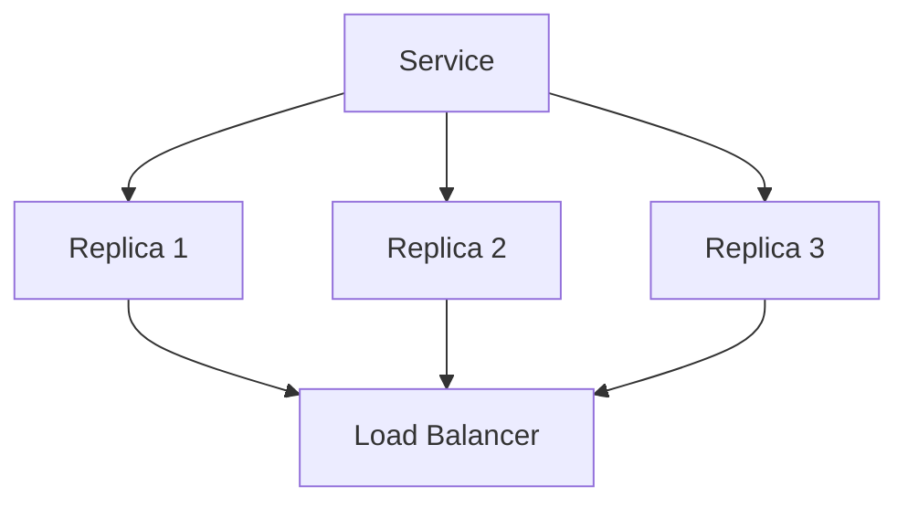

# Scaling et haute disponibilité

## Objectifs pédagogiques

- Comprendre le scaling dans Docker Swarm  
- Comprendre la haute disponibilité  
- Comprendre le load balancing  
- Observer le comportement en cas de panne  

---

## Contexte et problématique

Une application en production doit :

- supporter du trafic  
- rester disponible  
- résister aux pannes  

👉 Un seul conteneur ne suffit pas.

---

## Définition

### Scaling*

Le scaling consiste à :

👉 augmenter ou diminuer le nombre d’instances d’un service

---

### Haute disponibilité*

La haute disponibilité permet :

👉 de maintenir le service actif même en cas de panne

---

## Architecture



👉 Le trafic est réparti automatiquement

---

## Commandes essentielles

### Créer un service scalable

```bash
docker service create --name web --replicas 3 nginx
```

---

### Modifier le scaling

```bash
docker service scale web=5
```

---

### Voir la répartition

```bash
docker service ps web
```

---

## Fonctionnement interne

💡 Astuce  
Swarm répartit automatiquement les conteneurs sur les nodes disponibles.

⚠️ Erreur fréquente  
Penser que plusieurs replicas = toujours meilleure performance.

💣 Piège classique  
Ne pas tester le comportement en cas de panne.  
👉 Si un conteneur tombe, Swarm le recrée automatiquement.  
👉 Mais si l’application elle-même n’est pas stateless*, cela peut poser problème.  
👉 Il faut concevoir des services adaptés au scaling.

🧠 Concept clé  
Scaling efficace = application adaptée

---

## Cas réel

Tu déploies un service web :

```bash
docker service create --name web --replicas 3 nginx
```

👉 Si un conteneur tombe :

- Swarm le recrée  
- le service reste disponible  

---

## Load balancing

👉 Swarm intègre un load balancer interne :

- répartit les requêtes  
- équilibre la charge  
- transparent pour l’utilisateur  

---

## Bonnes pratiques

- utiliser des applications stateless  
- tester les pannes  
- adapter le nombre de replicas  
- surveiller les performances  

---

## Résumé

Le scaling permet :

- d’augmenter la capacité  
- d’améliorer la disponibilité  

👉 La haute disponibilité est un pilier de l’infrastructure moderne  

---

## Notes

*Scaling : ajustement du nombre d’instances
*Haute disponibilité : capacité à rester fonctionnel malgré les pannes
*Stateless : application sans état stocké localement

---

<!-- snippet
id: docker_swarm_scaling_definition
type: concept
tech: docker
level: advanced
importance: high
format: knowledge
tags: swarm,scaling,replicas,haute-disponibilite
title: Scaling dans Docker Swarm
content: Le scaling augmente ou diminue le nombre de replicas d’un service. Swarm les répartit sur les nœuds disponibles et maintient l’état désiré en cas de panne.
-->

<!-- snippet
id: docker_swarm_haute_dispo_definition
type: concept
tech: docker
level: advanced
importance: high
format: knowledge
tags: swarm,haute-disponibilite,resilience
title: Haute disponibilité avec Swarm
content: La haute disponibilité maintient le service actif même en cas de panne. Swarm recrée les conteneurs défaillants pour atteindre le nombre de replicas configuré.
-->

<!-- snippet
id: docker_swarm_scale_ha
type: command
tech: docker
level: advanced
importance: high
format: knowledge
tags: swarm,scaling,service
title: Scaler un service Swarm
command: docker service scale <SERVICE>=5
example: docker service scale webapp=5
description: Augmente ou diminue le nombre de replicas du service. La modification est appliquée progressivement sans interruption.
-->

<!-- snippet
id: docker_swarm_load_balancer_interne
type: concept
tech: docker
level: advanced
importance: medium
format: knowledge
tags: swarm,load-balancing,reseau
title: Load balancer intégré dans Swarm
content: Swarm intègre un load balancer interne qui répartit automatiquement les requêtes entre les replicas d’un service. Ce mécanisme est transparent pour l’utilisateur et pour l’application.
-->

<!-- snippet
id: docker_swarm_stateless_requis
type: concept
tech: docker
level: advanced
importance: medium
format: knowledge
tags: swarm,stateless,architecture,scaling
title: Applications stateless pour le scaling
content: Pour scaler efficacement, les applications doivent être stateless. Si des données sont stockées localement, la répartition sur plusieurs conteneurs crée des incohérences.
-->

<!-- snippet
id: docker_swarm_panne_non_testee
type: concept
tech: docker
level: advanced
importance: medium
format: knowledge
tags: swarm,test,panne,resilience
title: Ne pas tester le comportement en cas de panne
content: Si l’application n’est pas stateless, Swarm recrée les conteneurs mais l’état est perdu. Toujours tester le comportement en cas de panne avant la production.
-->

