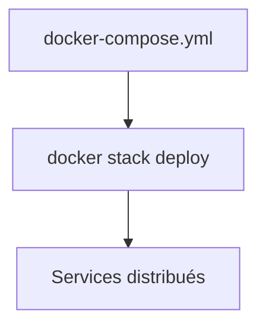

# Déployer une stack avec Docker Swarm

## Objectifs pédagogiques

- Comprendre la notion de stack dans Swarm  
- Réutiliser un fichier docker-compose.yml  
- Déployer une application distribuée  
- Gérer une stack complète  

---

## Contexte et problématique

Tu sais maintenant :

- lancer des services  
- scaler une application  

👉 Mais en pratique, une application = plusieurs services

👉 Il faut donc déployer une **stack complète**

---

## Définition

### Stack*

Une stack est un ensemble de services déployés ensemble.

👉 équivalent d’un projet Docker Compose… mais en Swarm

---

## Architecture



---

## Commandes essentielles

### Déployer une stack

```bash
docker stack deploy -c docker-compose.yml mon-app
```

👉 `-c` = fichier compose  
👉 `mon-app` = nom de la stack  

---

### Voir les stacks

```bash
docker stack ls
```

---

### Voir les services d’une stack

```bash
docker stack services mon-app
```

---

### Supprimer une stack

```bash
docker stack rm mon-app
```

---

## Exemple de fichier compatible Swarm

```yaml
version: "3.8"

services:
  db:
    image: postgres
    volumes:
      - db-data:/var/lib/postgresql/data

  api:
    image: mon-api
    deploy:
      replicas: 3
    ports:
      - "3000:3000"

volumes:
  db-data:
```

👉 Note importante :
- section `deploy` utilisée uniquement en Swarm

---

## Fonctionnement interne

💡 Astuce  
Compose et Swarm utilisent presque le même fichier.

⚠️ Erreur fréquente  
Utiliser `docker compose up` au lieu de `docker stack deploy`.

💣 Piège classique  
Oublier que certaines options Compose ne fonctionnent pas en Swarm.  
👉 Par exemple : `depends_on` est ignoré en Swarm.  
👉 Il faut adapter le fichier pour l’orchestration.

🧠 Concept clé  
Stack = orchestration complète

---

## Cas réel

Application complète :

- API (3 replicas)  
- base de données  
- volume persistant  

👉 Déployée avec une seule commande

---

## Bonnes pratiques

- adapter le fichier Compose pour Swarm  
- utiliser la section `deploy`  
- tester en local avant cluster  
- versionner les stacks  

---

## Résumé

Une stack permet de :

- déployer une architecture complète  
- gérer plusieurs services  
- simplifier l’orchestration  

👉 C’est l’équivalent de Compose en version distribuée  

---

## Notes

*Stack : ensemble de services déployés ensemble en Swarm

---

<!-- snippet
id: docker_swarm_stack_definition
type: concept
tech: docker
level: advanced
importance: high
format: knowledge
tags: swarm,stack,compose,orchestration
title: Concept de stack dans Docker Swarm
content: Une stack est un ensemble de services déployés ensemble en Swarm. C'est l'équivalent d'un projet Docker Compose dans un contexte distribué, avec le même format de fichier.
-->

<!-- snippet
id: docker_swarm_stack_deploy
type: command
tech: docker
level: advanced
importance: high
format: knowledge
tags: swarm,stack,deploiement,compose
title: Déployer une stack Swarm
command: docker stack deploy -c docker-compose.yml <NOM>
example: docker stack deploy -c docker-compose.yml myapp
description: Déploie l'ensemble des services définis dans le fichier docker-compose.yml sous le nom de stack spécifié.
-->

<!-- snippet
id: docker_swarm_stack_ls
type: command
tech: docker
level: advanced
importance: medium
format: knowledge
tags: swarm,stack,supervision
title: Lister les stacks Swarm
command: docker stack ls
description: Affiche la liste de toutes les stacks déployées sur le cluster Swarm avec leur nombre de services.
-->

<!-- snippet
id: docker_swarm_stack_services
type: command
tech: docker
level: advanced
importance: medium
format: knowledge
tags: swarm,stack,services,supervision
title: Voir les services d'une stack
command: docker stack services <NOM>
example: docker stack services myapp
description: Liste les services appartenant à la stack avec leur état, le nombre de replicas et les ports exposés.
-->

<!-- snippet
id: docker_swarm_stack_rm
type: command
tech: docker
level: advanced
importance: medium
format: knowledge
tags: swarm,stack,suppression
title: Supprimer une stack Swarm
command: docker stack rm <NOM>
example: docker stack rm myapp
description: Supprime la stack et arrête tous les services associés sur le cluster Swarm.
-->

<!-- snippet
id: docker_swarm_depends_on_ignore
type: concept
tech: docker
level: advanced
importance: medium
format: knowledge
tags: swarm,stack,compose,depends_on
title: depends_on ignoré en Swarm
content: L'option `depends_on` est ignorée en Swarm. Gérer les dépendances via des healthchecks ou des retry dans l'application.
-->

<!-- snippet
id: docker_swarm_section_deploy
type: concept
tech: docker
level: advanced
importance: medium
format: knowledge
tags: swarm,stack,compose,deploy
title: Section deploy dans docker-compose.yml
content: La section `deploy` est utilisée uniquement en Swarm. Elle configure le nombre de replicas, les ressources et la stratégie de mise à jour de chaque service.
-->

