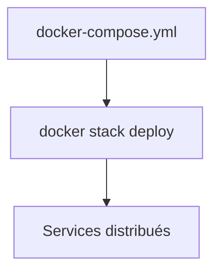

# Déployer une stack avec Docker Swarm

## Objectifs pédagogiques

- Comprendre la notion de stack dans Swarm  
- Réutiliser un fichier docker-compose.yml  
- Déployer une application distribuée  
- Gérer une stack complète  

---

## Contexte et problématique

Tu sais maintenant :

- lancer des services  
- scaler une application  

👉 Mais en pratique, une application = plusieurs services

👉 Il faut donc déployer une **stack complète**

---

## Définition

### Stack*

Une stack est un ensemble de services déployés ensemble.

👉 équivalent d’un projet Docker Compose… mais en Swarm

---

## Architecture



---

## Commandes essentielles

### Déployer une stack

```bash
docker stack deploy -c docker-compose.yml mon-app
```

👉 `-c` = fichier compose  
👉 `mon-app` = nom de la stack  

---

### Voir les stacks

```bash
docker stack ls
```

---

### Voir les services d’une stack

```bash
docker stack services mon-app
```

---

### Supprimer une stack

```bash
docker stack rm mon-app
```

---

## Exemple de fichier compatible Swarm

```yaml
version: "3.8"

services:
  db:
    image: postgres
    volumes:
      - db-data:/var/lib/postgresql/data

  api:
    image: mon-api
    deploy:
      replicas: 3
    ports:
      - "3000:3000"

volumes:
  db-data:
```

👉 Note importante :
- section `deploy` utilisée uniquement en Swarm

---

## Fonctionnement interne

💡 Astuce  
Compose et Swarm utilisent presque le même fichier.

⚠️ Erreur fréquente  
Utiliser `docker compose up` au lieu de `docker stack deploy`.

💣 Piège classique  
Oublier que certaines options Compose ne fonctionnent pas en Swarm.  
👉 Par exemple : `depends_on` est ignoré en Swarm.  
👉 Il faut adapter le fichier pour l’orchestration.

🧠 Concept clé  
Stack = orchestration complète

---

## Cas réel

Application complète :

- API (3 replicas)  
- base de données  
- volume persistant  

👉 Déployée avec une seule commande

---

## Bonnes pratiques

- adapter le fichier Compose pour Swarm  
- utiliser la section `deploy`  
- tester en local avant cluster  
- versionner les stacks  

---

## Résumé

Une stack permet de :

- déployer une architecture complète  
- gérer plusieurs services  
- simplifier l’orchestration  

👉 C’est l’équivalent de Compose en version distribuée  

---

## Notes

*Stack : ensemble de services déployés ensemble en Swarm
