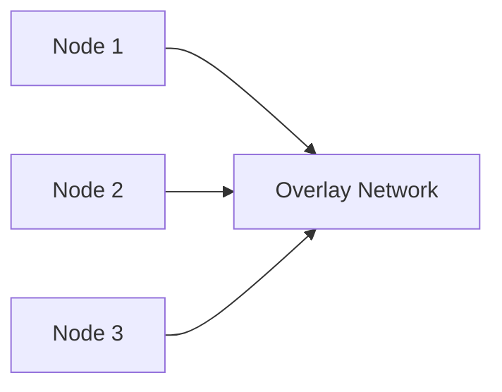

# Réseau Swarm (overlay network)

## Objectifs pédagogiques

- Comprendre le réseau overlay dans Swarm  
- Comprendre la communication entre machines  
- Différencier bridge vs overlay  
- Déployer des services multi-nodes  

---

## Contexte et problématique

Avec Docker classique :

- les conteneurs communiquent sur une seule machine  

👉 Mais en Swarm :

- les conteneurs sont répartis sur plusieurs machines  

👉 Il faut donc un réseau adapté.

---

## Définition

### Overlay network*

Un overlay network permet :

👉 de connecter des conteneurs sur plusieurs machines  

👉 comme s’ils étaient sur le même réseau  

---

## Architecture



👉 Tous les conteneurs peuvent communiquer  

---

## Bridge vs Overlay

| Type | Scope | Usage |
|------|------|------|
| Bridge | 1 machine | Docker classique |
| Overlay | multi-machines | Docker Swarm |

---

## Commandes essentielles

### Créer un réseau overlay

```bash
docker network create --driver overlay mon-reseau
```

---

### Déployer un service avec réseau

```bash
docker service create   --name web   --network mon-reseau   nginx
```

---

## Fonctionnement interne

💡 Astuce  
L’overlay utilise le réseau interne du cluster.

⚠️ Erreur fréquente  
Penser que le réseau bridge fonctionne entre nodes.

💣 Piège classique  
Ne pas ouvrir les ports nécessaires entre machines.  
👉 Swarm utilise des ports spécifiques pour le cluster.  
👉 Si le réseau est mal configuré (firewall), la communication échoue.  
👉 Toujours vérifier la connectivité entre nodes.

🧠 Concept clé  
Overlay = réseau distribué transparent  

---

## Cas réel

Application distribuée :

- API sur Node 1  
- DB sur Node 2  

👉 communication via overlay :

```
DB_HOST=db
```

👉 fonctionne comme en local

---

## Bonnes pratiques

- utiliser overlay pour les services Swarm  
- vérifier la connectivité réseau  
- sécuriser les communications  
- isoler les réseaux par application  

---

## Résumé

Le réseau overlay permet de :

- connecter plusieurs machines  
- simplifier la communication  
- créer une architecture distribuée  

👉 C’est un élément clé de Swarm  

---

## Notes

*Overlay network : réseau permettant la communication entre conteneurs sur plusieurs machines

---

<!-- snippet
id: docker_swarm_overlay_definition
type: concept
tech: docker
level: advanced
importance: high
format: knowledge
tags: swarm,overlay,reseau,multi-nodes
title: Overlay network dans Docker Swarm
content: Un overlay network connecte des conteneurs répartis sur plusieurs machines comme s'ils étaient sur le même réseau local.
-->

<!-- snippet
id: docker_swarm_overlay_vs_bridge
type: concept
tech: docker
level: advanced
importance: high
format: knowledge
tags: swarm,overlay,reseau,bridge
title: Overlay vs bridge — réseau Docker Swarm
content: Le bridge est limité à une machine (Docker classique). L'overlay fonctionne sur plusieurs machines — c'est le réseau adapté à Docker Swarm.
-->

<!-- snippet
id: docker_swarm_network_create_overlay
type: command
tech: docker
level: advanced
importance: medium
format: knowledge
tags: swarm,overlay,reseau
title: Créer un réseau overlay
command: docker network create --driver overlay <NOM>
description: Crée un réseau distribué accessible par tous les nœuds du cluster Swarm.
-->

<!-- snippet
id: docker_swarm_service_avec_reseau
type: command
tech: docker
level: advanced
importance: medium
format: knowledge
tags: swarm,service,overlay,reseau
title: Déployer un service avec un réseau overlay
command: docker service create --name <NOM> --network <NOM> <IMAGE>
description: Attache le service au réseau overlay, permettant la communication avec d'autres services sur n'importe quel nœud du cluster.
-->

<!-- snippet
id: docker_swarm_bridge_vs_overlay
type: concept
tech: docker
level: advanced
importance: medium
format: knowledge
tags: swarm,overlay,bridge,reseau,comparaison
title: Bridge vs Overlay network
content: Le réseau bridge est limité à une machine (Docker classique). Le réseau overlay fonctionne sur plusieurs machines, indispensable pour Swarm.
-->

<!-- snippet
id: docker_swarm_ports_firewall
type: concept
tech: docker
level: advanced
importance: medium
format: knowledge
tags: swarm,overlay,reseau,firewall,ports
title: Ports réseau nécessaires pour Swarm
content: Swarm utilise des ports spécifiques : 2377 TCP (management), 7946 TCP/UDP (découverte), 4789 UDP (overlay). Si le firewall bloque ces ports, la communication inter-nœuds échoue.
-->

