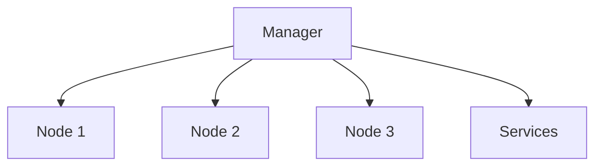

# Gestion des nodes et services

## Objectifs pédagogiques

- Gérer les nodes du cluster  
- Superviser les services  
- Mettre à jour un service  
- Effectuer un rollback  

---

## Contexte et problématique

Dans un cluster Swarm :

- plusieurs machines (nodes)  
- plusieurs services  

👉 Il faut pouvoir :

- surveiller  
- maintenir  
- mettre à jour  

---

## Architecture



---

## Commandes essentielles

### Voir les nodes

```bash
docker node ls
```

---

### Inspecter un node

```bash
docker node inspect <node-id>
```

---

### Voir les services

```bash
docker service ls
```

---

### Inspecter un service

```bash
docker service inspect web
```

---

### Mettre à jour un service

```bash
docker service update --image nginx:latest web
```

---

### Rollback

```bash
docker service rollback web
```

---

## Fonctionnement interne

💡 Astuce  
Les mises à jour sont progressives (rolling update).

⚠️ Erreur fréquente  
Mettre à jour tous les services en même temps.

💣 Piège classique  
Déployer une mise à jour sans possibilité de rollback.  
👉 Si la nouvelle version casse l’application, le service devient indisponible.  
👉 Toujours prévoir une stratégie de rollback.

🧠 Concept clé  
Swarm permet des mises à jour contrôlées

---

## Cas réel

Tu déploies une nouvelle version :

```bash
docker service update --image mon-app:v2 api
```

👉 Si problème :

```bash
docker service rollback api
```

---

## Bonnes pratiques

- surveiller les nodes régulièrement  
- tester les mises à jour  
- utiliser des versions d’image (tags)  
- éviter les mises à jour en production sans test  

---

## Résumé

Swarm permet de :

- gérer les machines  
- superviser les services  
- mettre à jour en sécurité  

👉 C’est essentiel pour maintenir une application  

---

## Notes

*Node : machine dans le cluster  
*Rollback : retour à une version précédente

---
[← Module précédent](docker_ch6_6.md) | [Module suivant →](docker_ch6_8.md)
---
