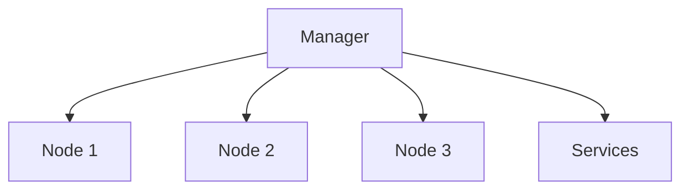

# Gestion des nodes et services

## Objectifs pédagogiques

- Gérer les nodes du cluster  
- Superviser les services  
- Mettre à jour un service  
- Effectuer un rollback  

---

## Contexte et problématique

Dans un cluster Swarm :

- plusieurs machines (nodes)  
- plusieurs services  

👉 Il faut pouvoir :

- surveiller  
- maintenir  
- mettre à jour  

---

## Architecture



---

## Commandes essentielles

### Voir les nodes

```bash
docker node ls
```

---

### Inspecter un node

```bash
docker node inspect <node-id>
```

---

### Voir les services

```bash
docker service ls
```

---

### Inspecter un service

```bash
docker service inspect web
```

---

### Mettre à jour un service

```bash
docker service update --image nginx:latest web
```

---

### Rollback

```bash
docker service rollback web
```

---

## Fonctionnement interne

💡 Astuce  
Les mises à jour sont progressives (rolling update).

⚠️ Erreur fréquente  
Mettre à jour tous les services en même temps.

💣 Piège classique  
Déployer une mise à jour sans possibilité de rollback.  
👉 Si la nouvelle version casse l’application, le service devient indisponible.  
👉 Toujours prévoir une stratégie de rollback.

🧠 Concept clé  
Swarm permet des mises à jour contrôlées

---

## Cas réel

Tu déploies une nouvelle version :

```bash
docker service update --image mon-app:v2 api
```

👉 Si problème :

```bash
docker service rollback api
```

---

## Bonnes pratiques

- surveiller les nodes régulièrement  
- tester les mises à jour  
- utiliser des versions d’image (tags)  
- éviter les mises à jour en production sans test  

---

## Résumé

Swarm permet de :

- gérer les machines  
- superviser les services  
- mettre à jour en sécurité  

👉 C’est essentiel pour maintenir une application  

---

## Notes

*Node : machine dans le cluster
*Rollback : retour à une version précédente

---

<!-- snippet
id: docker_swarm_node_inspect
type: command
tech: docker
level: advanced
importance: medium
format: knowledge
tags: swarm,nodes,supervision,inspect
title: Inspecter un nœud Swarm
command: docker node inspect <NOM>
example: docker node inspect worker-1
description: Affiche les détails complets d'un nœud : ressources, labels, statut, disponibilité.
-->

<!-- snippet
id: docker_swarm_service_inspect
type: command
tech: docker
level: advanced
importance: medium
format: knowledge
tags: swarm,service,inspect,supervision
title: Inspecter un service Swarm
command: docker service inspect <SERVICE>
example: docker service inspect api
description: Affiche la configuration complète du service : image, replicas, réseau, contraintes de placement.
-->

<!-- snippet
id: docker_swarm_service_update_image
type: command
tech: docker
level: advanced
importance: high
format: knowledge
tags: swarm,service,update,image,rolling-update
title: Mettre à jour l'image d'un service
command: docker service update --image <IMAGE> <SERVICE>
example: docker service update --image nginx:1.25 webapp
description: Met à jour le service de manière progressive (rolling update). Swarm remplace les conteneurs un par un pour éviter toute interruption de service.
-->

<!-- snippet
id: docker_swarm_service_rollback
type: command
tech: docker
level: advanced
importance: medium
format: knowledge
tags: swarm,service,rollback,deploiement
title: Rollback d'un service Swarm
command: docker service rollback <SERVICE>
example: docker service rollback webapp
description: Revient à la version précédente du service. À utiliser immédiatement si une mise à jour casse l'application.
-->

<!-- snippet
id: docker_swarm_rolling_update
type: concept
tech: docker
level: advanced
importance: high
format: knowledge
tags: swarm,update,rolling,service
title: Rolling update dans Swarm
content: Les mises à jour de services dans Swarm sont progressives (rolling update). Swarm remplace les conteneurs un par un, ce qui permet de maintenir la disponibilité du service pendant la mise à jour.
-->

<!-- snippet
id: docker_swarm_rollback_strategie
type: concept
tech: docker
level: advanced
importance: medium
format: knowledge
tags: swarm,rollback,deploiement,production
title: Prévoir une stratégie de rollback
content: Avant chaque mise à jour en production, s'assurer qu'un rollback est possible. Utiliser des tags versionnés (v1, v2) plutôt que latest pour revenir facilement à une version stable.
-->

<!-- snippet
id: docker_swarm_update_sans_rollback
type: concept
tech: docker
level: advanced
importance: medium
format: knowledge
tags: swarm,update,rollback,production
title: Déployer sans possibilité de rollback
content: Sans rollback prévu, une version cassée rend le service indisponible. Toujours versionner les images et tester les mises à jour hors production.
-->

