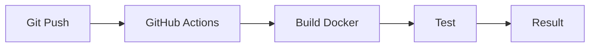

# Pipeline CI avec GitHub Actions et Docker

## Objectifs pédagogiques

- Comprendre le fonctionnement de GitHub Actions  
- Créer un pipeline CI simple  
- Builder une image Docker automatiquement  
- Automatiser les tests  

---

## Contexte et problématique

Tu sais maintenant ce qu’est le CI/CD.

👉 Mais concrètement :

- comment automatiser ?  
- avec quels outils ?  

👉 GitHub Actions permet de créer des pipelines directement dans ton repo.

---

## Définition

### GitHub Actions*

GitHub Actions est un outil CI/CD intégré à GitHub.

👉 Il permet d’exécuter des workflows automatiquement.

---

## Architecture



---

## Structure d’un workflow

Créer un fichier :

```
.github/workflows/ci.yml
```

---

## Exemple de pipeline

```yaml
name: CI Pipeline

on:
  push:
    branches: [ "main" ]

jobs:
  build:
    runs-on: ubuntu-latest

    steps:
      - name: Checkout code
        uses: actions/checkout@v3

      - name: Build Docker image
        run: docker build -t mon-app .

      - name: Run container
        run: docker run mon-app
```

---

## Commandes essentielles

### Déclenchement automatique

👉 Le pipeline se lance à chaque push

---

### Étapes clés

- checkout du code  
- build Docker  
- exécution  

---

## Fonctionnement interne

💡 Astuce  
Chaque étape s’exécute dans un environnement isolé.

⚠️ Erreur fréquente  
Oublier de tester l’image après build.

💣 Piège classique  
Ne pas gérer les erreurs dans le pipeline.  
👉 Si une étape échoue mais n’est pas vérifiée correctement, le pipeline peut continuer.  
👉 Toujours vérifier que chaque étape est critique.

🧠 Concept clé  
Pipeline = suite d’étapes automatisées

---

## Cas réel

Un développeur push du code :

👉 GitHub Actions :

- build l’image  
- lance le conteneur  
- valide le fonctionnement  

---

## Bonnes pratiques

- découper les étapes clairement  
- tester après build  
- utiliser des logs  
- versionner les workflows  

---

## Résumé

GitHub Actions permet de :

- automatiser le build  
- tester les applications  
- standardiser les pipelines  

👉 C’est un outil clé pour le CI/CD moderne  

---

## Notes

*GitHub Actions : outil CI/CD intégré à GitHub

---

<!-- snippet
id: docker_github_actions_concept
type: concept
tech: docker
level: advanced
importance: medium
format: knowledge
tags: github-actions,cicd,pipeline,workflow
title: GitHub Actions — Outil CI/CD intégré à GitHub
content: GitHub Actions est un outil CI/CD intégré à GitHub. Il exécute des workflows automatiquement (push, pull request…) via des fichiers YAML sous `.github/workflows/`.
description: Aucune infrastructure tierce nécessaire : le pipeline vit dans le dépôt.
-->

<!-- snippet
id: docker_github_actions_build_image
type: command
tech: docker
level: advanced
importance: medium
format: knowledge
tags: github-actions,build,image,ci
title: Build d'une image Docker dans GitHub Actions
command: docker build -t <IMAGE> .
description: Construit l'image Docker à partir du Dockerfile présent à la racine du dépôt dans un step GitHub Actions.
-->

<!-- snippet
id: docker_github_actions_run_container
type: command
tech: docker
level: advanced
importance: medium
format: knowledge
tags: github-actions,run,conteneur,test,ci
title: Lancer un conteneur dans GitHub Actions
command: docker run <IMAGE>
description: Exécute le conteneur construit pour valider le fonctionnement de l'image après le build.
-->

<!-- snippet
id: docker_github_actions_pipeline_concept
type: concept
tech: docker
level: advanced
importance: medium
format: knowledge
tags: github-actions,pipeline,etapes,automatisation
title: Pipeline GitHub Actions — étapes automatisées
content: Un pipeline GitHub Actions enchaîne : checkout, build Docker, exécution du conteneur. Chaque étape s'exécute dans un environnement isolé (ubuntu-latest par défaut).
description: Isoler chaque étape garantit la reproductibilité et facilite le débogage.
-->

<!-- snippet
id: docker_github_actions_warning_test_apres_build
type: warning
tech: docker
level: advanced
importance: medium
format: knowledge
tags: github-actions,test,erreur-frequente,ci
title: Oublier de tester l'image après build
content: Builder l'image sans la tester laisse passer une image cassée vers le registry et la production.
-->

<!-- snippet
id: docker_github_actions_warning_erreurs_pipeline
type: warning
tech: docker
level: advanced
importance: medium
format: knowledge
tags: github-actions,pipeline,erreur,piege
title: Ne pas gérer les erreurs dans le pipeline
content: Si une étape échoue sans que l'erreur soit vérifiée, le pipeline continue et déploie un artefact défectueux. Chaque étape doit faire échouer le pipeline en cas de problème.
-->
