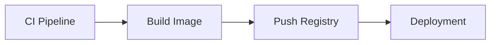

# Push vers un Docker Registry

## Objectifs pédagogiques

- Comprendre le rôle d’un registry Docker  
- Publier une image Docker  
- Automatiser le push via CI  
- Gérer les versions d’image  

---

## Contexte et problématique

Construire une image Docker c’est bien…

👉 mais il faut la rendre disponible :

- pour le déploiement  
- pour d’autres environnements  

👉 Solution : un registry

---

## Définition

### Registry*

Un registry est un service de stockage d’images Docker.

👉 Exemples :

- Docker Hub  
- GitHub Container Registry (GHCR)  

---

## Architecture



---

## Commandes essentielles

### Login

```bash
docker login
```

---

### Tagger une image

```bash
docker tag mon-app username/mon-app:1.0
```

---

### Push

```bash
docker push username/mon-app:1.0
```

---

## Pipeline GitHub Actions avec push

```yaml
name: CI

on:
  push:
    branches: [ "main" ]

jobs:
  build:
    runs-on: ubuntu-latest

    steps:
      - uses: actions/checkout@v3

      - name: Login DockerHub
        run: echo "${{ secrets.DOCKER_PASSWORD }}" | docker login -u "${{ secrets.DOCKER_USERNAME }}" --password-stdin

      - name: Build
        run: docker build -t username/mon-app:latest .

      - name: Push
        run: docker push username/mon-app:latest
```

---

## Fonctionnement interne

💡 Astuce  
Utiliser des tags pour versionner les images.

⚠️ Erreur fréquente  
Utiliser uniquement `latest`.

💣 Piège classique  
Ne pas sécuriser les credentials.  
👉 Les identifiants Docker doivent être stockés dans les secrets GitHub.  
👉 Ne jamais les mettre en clair dans le code.  
👉 Sinon → fuite de credentials.

🧠 Concept clé  
Registry = source des images en production

---

## Cas réel

Pipeline complet :

- build image  
- push vers Docker Hub  
- déploiement depuis registry  

---

## Bonnes pratiques

- utiliser des tags de version (`v1`, `v2`)  
- éviter `latest` en production  
- sécuriser les credentials  
- nettoyer les images inutilisées  

---

## Résumé

Le registry permet de :

- stocker les images  
- partager les builds  
- déployer facilement  

👉 C’est indispensable en CI/CD  

---

## Notes

*Registry : service de stockage d’images Docker

---

<!-- snippet
id: docker_registry_concept
type: concept
tech: docker
level: advanced
importance: high
format: knowledge
tags: registry,dockerhub,ghcr,stockage,image
title: Registry Docker — Service de stockage d’images
content: Un registry stocke des images Docker et constitue la source des images en production. Exemples : Docker Hub et GitHub Container Registry (GHCR).
description: Sans registry, il est impossible de partager des images entre machines ou environnements.
-->

<!-- snippet
id: docker_registry_concept_b
type: concept
tech: docker
level: advanced
importance: medium
format: knowledge
tags: registry,dockerhub,cicd,deploiement
title: Registry — maillon entre CI et déploiement
content: Une image buildée en CI doit être poussée dans un registry pour être déployée. Sans cette étape, l’image n’est pas accessible depuis d’autres machines.
-->

<!-- snippet
id: docker_registry_login
type: command
tech: docker
level: advanced
importance: high
format: knowledge
tags: registry,login,dockerhub,authentification
title: Se connecter à un Docker Registry
command: docker login
description: Authentifie le client Docker auprès du registry (Docker Hub par défaut). Utilisé avant de pusher une image.
-->

<!-- snippet
id: docker_registry_tag_image
type: command
tech: docker
level: advanced
importance: high
format: knowledge
tags: registry,tag,image,versionning
title: Tagger une image Docker pour le registry
command: docker tag <IMAGE> <NOM>:1.0
example: docker tag mon-api monuser/mon-api:1.0
description: Associe un nom complet (username/nom:tag) à une image locale avant de la pousser vers un registry.
-->

<!-- snippet
id: docker_registry_push_image
type: command
tech: docker
level: advanced
importance: high
format: knowledge
tags: registry,push,image,dockerhub
title: Pousser une image vers un registry
command: docker push <IMAGE>:1.0
example: docker push monuser/mon-api:1.0
description: Envoie l’image taguée vers le registry distant. L’image doit être taguée avec le bon préfixe (username ou organisation) avant le push.
-->

<!-- snippet
id: docker_registry_warning_latest_only
type: warning
tech: docker
level: advanced
importance: medium
format: knowledge
tags: registry,tag,latest,erreur-frequente
title: Utiliser uniquement le tag latest
content: Le tag `latest` est écrasé à chaque build — impossible de revenir à une version précédente. Toujours utiliser des tags explicites (v1, v2, sha du commit).
-->

<!-- snippet
id: docker_registry_warning_credentials
type: warning
tech: docker
level: advanced
importance: high
format: knowledge
tags: registry,credentials,secrets,securite,piege
title: Ne pas sécuriser les credentials Docker dans le pipeline
content: Stocker les identifiants Docker Hub en clair dans le code est un piège de sécurité. Les utiliser via les secrets GitHub (DOCKER_USERNAME, DOCKER_PASSWORD).
description: Une fuite de credentials peut entraîner la compromission du compte registry et des images publiées.
-->

<!-- snippet
id: docker_registry_tip_versioning
type: tip
tech: docker
level: advanced
importance: low
format: knowledge
tags: registry,tag,versionning,bonne-pratique
title: Versionner les images avec des tags explicites
content: Utiliser des tags versionnés (v1, v2, SHA du commit) permet de tracer l’image en production et de rollback facilement. Éviter `latest` en production.
description: Tagger avec le SHA du commit Git lie directement l’image au code exact qui l’a produite — traçabilité parfaite pour les audits et les post-mortems.
-->
