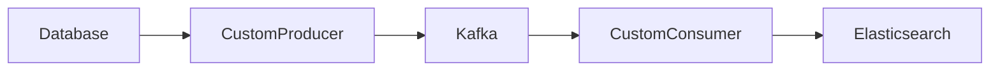
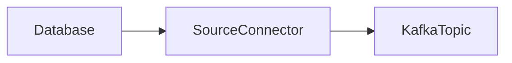
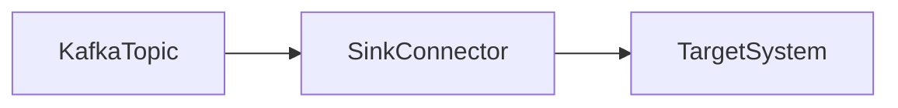
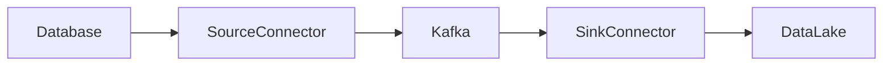
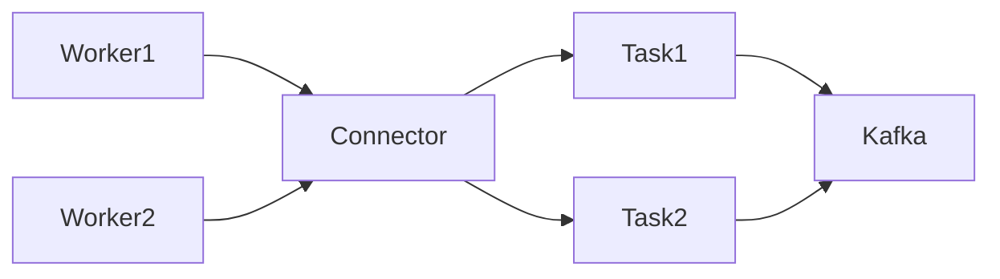
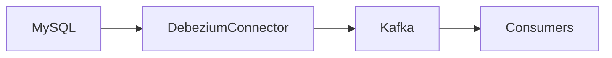
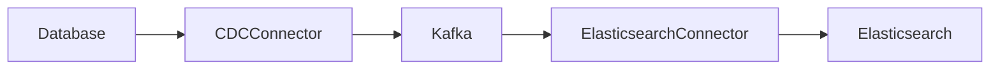
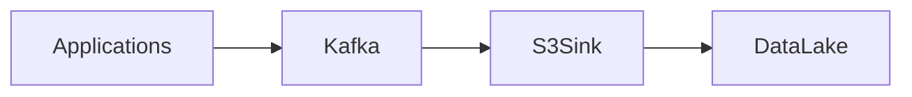
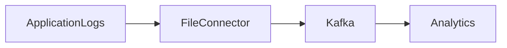

# Kafka Connect

Dans les modules précédents nous avons vu :

1. comment Kafka transporte les événements
2. comment Kafka stocke les données et scale avec les partitions
3. comment transformer les flux avec **Kafka Streams**

Mais une question fondamentale reste ouverte :

**comment les données arrivent réellement dans Kafka ?**

Dans une architecture réelle, les données proviennent souvent de :

- bases de données
- APIs
- fichiers
- data lakes
- systèmes métiers
- applications legacy

Écrire un producer personnalisé pour chaque source serait coûteux.

Kafka Connect a été créé pour résoudre ce problème.

---

# Objectifs pédagogiques

À la fin de ce module vous serez capable de :

- comprendre le rôle de **Kafka Connect**
- comprendre la différence entre **source connector et sink connector**
- comprendre l’architecture interne de Kafka Connect
- comprendre le fonctionnement des **workers et tasks**
- comprendre les pipelines **CDC (Change Data Capture)**
- comprendre les cas d’usage réels
- comprendre comment déployer un connecteur

---

# Le problème que Kafka Connect résout

Sans Kafka Connect, un pipeline ressemblerait à cela :



Problèmes :

- beaucoup de code à maintenir
- gestion des erreurs complexe
- pas standardisé
- difficile à scaler

Kafka Connect permet de standardiser ces pipelines.

---

# Principe de Kafka Connect

Kafka Connect est un **framework d’intégration de données**.

Il permet de connecter Kafka avec des systèmes externes.

Deux types de connecteurs existent :

- **Source Connectors**
- **Sink Connectors**

---

# Source Connector

Un **source connector** lit des données depuis un système externe et les envoie dans Kafka.

Exemples :

- base de données
- API REST
- fichiers
- systèmes legacy

Exemple de pipeline :



---

# Sink Connector

Un **sink connector** lit des données depuis Kafka et les envoie vers un système externe.

Exemples :

- Elasticsearch
- S3
- Data Warehouse
- base analytique



---

# Pipeline complet

Dans une architecture data moderne :



Kafka devient le **hub central des données**.

---

# Architecture interne de Kafka Connect

Kafka Connect repose sur plusieurs composants.

| Composant | Description |
|-----------|-------------|
Worker | instance du service Kafka Connect |
Connector | configuration du pipeline |
Task | unité d'exécution |
Converter | conversion du format de données |
Transforms | transformation des messages |

---

# Workers

Un **worker** est un processus Kafka Connect.

Deux modes existent :

## Standalone mode

- un seul worker
- utilisé pour tests ou développement

## Distributed mode

- plusieurs workers
- haute disponibilité
- scaling automatique

---

# Diagramme architecture Connect



Chaque worker peut exécuter plusieurs tasks.

---

# Les Tasks

Une **task** est une unité de travail.

Exemple :

source connector pour une base MySQL.

Si la table contient beaucoup de données :

- plusieurs tasks peuvent lire les données en parallèle.

---

# Change Data Capture (CDC)

Un des usages les plus importants de Kafka Connect est le **CDC**.

CDC signifie :

Change Data Capture

Il consiste à capturer les changements d’une base de données :

- INSERT
- UPDATE
- DELETE

---

# Exemple CDC avec Debezium

Architecture :



Quand une ligne est modifiée dans la base :

Kafka reçoit immédiatement un événement.

---

# Exemple événement CDC

Modification dans la base :

UPDATE users SET email="new@mail.com"

Kafka reçoit :

```json
{
 "operation": "UPDATE",
 "table": "users",
 "before": {
   "email": "old@mail.com"
 },
 "after": {
   "email": "new@mail.com"
 }
}
```

Cela permet de synchroniser les systèmes.

---

# Cas d’usage réel : synchronisation base → Elasticsearch

Architecture :



Utilité :

- indexation temps réel
- recherche rapide
- analytics

---

# Cas d’usage : data lake



Kafka Connect peut écrire automatiquement les données dans :

- S3
- GCS
- HDFS

---

# Cas d’usage : ingestion logs



---

# Configuration d'un connector

Les connecteurs sont configurés via JSON.

Exemple MySQL source connector :

```json
{
 "name": "mysql-source",
 "config": {
   "connector.class": "io.debezium.connector.mysql.MySqlConnector",
   "database.hostname": "mysql",
   "database.port": "3306",
   "database.user": "user",
   "database.password": "password",
   "database.server.name": "dbserver1"
 }
}
```

---

# Déploiement d’un connecteur

En pratique :

1. démarrer Kafka Connect
2. envoyer la configuration via API REST

Exemple :

```
POST /connectors
```

Avec le fichier JSON.

---

# Monitoring Kafka Connect

Indicateurs importants :

- nombre de tasks
- erreurs
- latence
- throughput

Outils souvent utilisés :

- Prometheus
- Grafana

---

# Bonnes pratiques

Utiliser **Schema Registry** pour gérer les schémas.

Surveiller les erreurs des connectors.

Limiter le débit pour éviter la saturation.

Isoler les pipelines critiques.

---

# Résumé

Kafka Connect permet de :

- connecter Kafka aux systèmes externes
- ingérer automatiquement les données
- exporter les données vers d'autres systèmes
- construire des pipelines data sans écrire beaucoup de code

Dans les architectures modernes, Kafka Connect est souvent utilisé pour :

- CDC des bases de données
- ingestion de logs
- export vers data lake
- indexation dans Elasticsearch

---

# Prochain module

Dans le prochain module nous verrons :

**Kafka avec Docker et Kubernetes**.

Nous verrons comment :

- déployer Kafka
- gérer un cluster
- monitorer Kafka
- exploiter Kafka en production.
