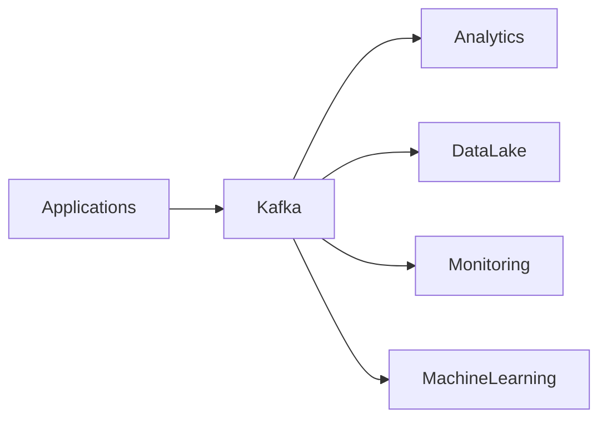
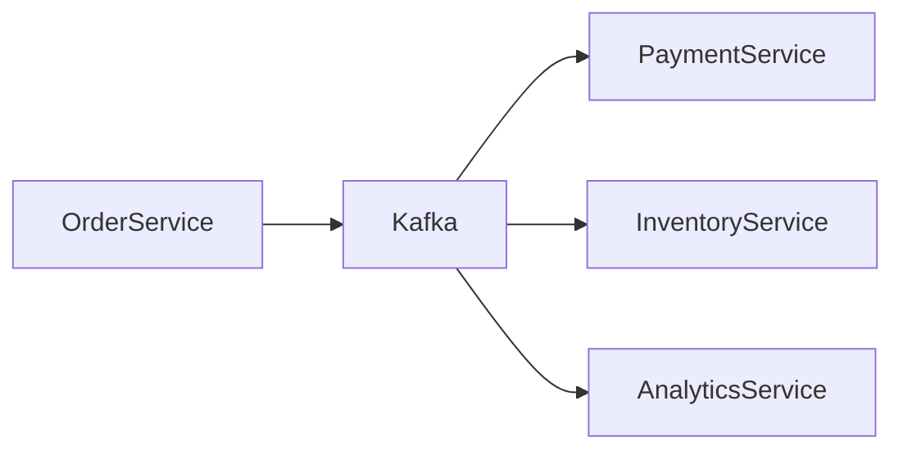
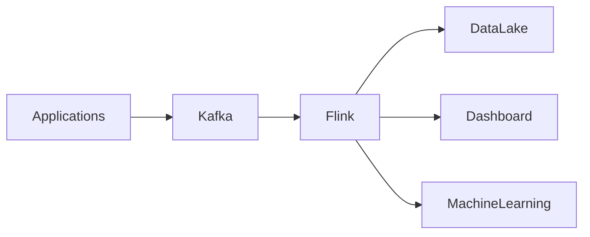
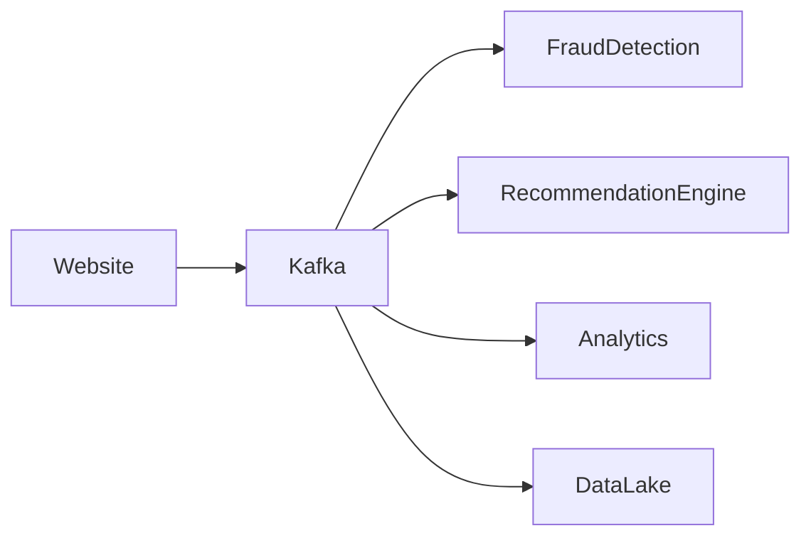
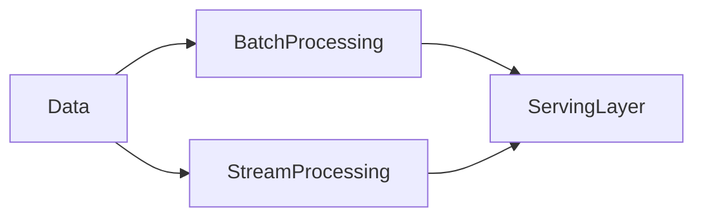
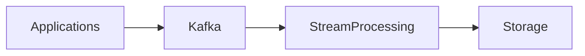
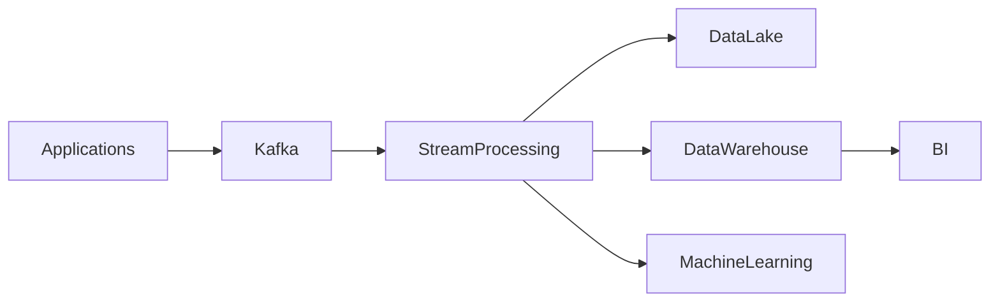

---
layout: page
title: "Kafka dans une architecture Data Engineering"

course: Data Engineering
theme: "Streaming de données"
type: lesson

chapter: 1
section: 6

tags: kafka, architecture, data-engineering, event-driven, pipelines
difficulty: advanced
duration: 110 min
mermaid: true

theme_icon: "📡"
theme_group: Data Streaming
theme_group_icon: "⚙️"
theme_order: 6
status: "En construction"
---

# Kafka dans une architecture Data Engineering

Dans les modules précédents nous avons vu :

1. les concepts fondamentaux de Kafka
2. le fonctionnement interne (partitions, réplication, offsets)
3. le traitement de flux avec Kafka Streams
4. l'intégration avec les systèmes externes via Kafka Connect
5. le déploiement avec Docker et Kubernetes

Dans ce dernier module, nous allons comprendre **comment Kafka s'intègre réellement dans une architecture Data Engineering complète**.

L'objectif est de comprendre **le rôle de Kafka dans un système de données moderne**.

---

# Objectifs pédagogiques

À la fin de ce module vous serez capable de :

- comprendre ce qu'est une **architecture data moderne**
- comprendre le rôle de Kafka comme **data backbone**
- comprendre ce qu'est une **Event‑Driven Architecture**
- comprendre la différence entre **Data Lake et Data Warehouse**
- comprendre les pipelines **temps réel**
- comprendre les architectures **Lambda et Kappa**
- comprendre comment Kafka s'intègre avec Spark, Flink et d'autres outils

---

# Pourquoi les architectures data ont changé

Historiquement, les architectures data fonctionnaient principalement en **batch**.

Exemple :

```
Applications → Base de données → ETL nocturne → Data Warehouse
```

Les données étaient traitées :

- une fois par jour
- une fois par heure

Problème :

- latence élevée
- impossible de réagir en temps réel
- pipelines rigides

Avec l'augmentation des volumes de données, les entreprises ont besoin de :

- traiter les données immédiatement
- connecter plusieurs systèmes
- analyser les événements en temps réel

C'est là que Kafka devient essentiel.

---

# Kafka comme Data Backbone

Dans une architecture moderne, Kafka agit comme **colonne vertébrale des données**.

Le terme *data backbone* signifie :

> un système central qui transporte les données entre les services.

Diagramme simplifié :



Kafka devient un **hub central de distribution des événements**.

---

# Comprendre l'Event‑Driven Architecture

Une **Event‑Driven Architecture (EDA)** est une architecture où les systèmes communiquent via des événements.

Un événement représente quelque chose qui s'est produit.

Exemples :

- utilisateur créé
- commande passée
- paiement validé
- capteur IoT mis à jour

Dans une architecture classique :

```
Service A → API → Service B
```

Les services sont fortement couplés.

Dans une architecture événementielle :

```
Service A → Event → Kafka → Consumers
```

Les services deviennent indépendants.

---

# Diagramme Event Driven



Chaque service réagit à l'événement.

Cela permet :

- découplage
- scalabilité
- évolutivité

---

# Data Pipeline moderne

Un **data pipeline** est un système qui transporte et transforme les données.

Architecture typique :


Chaque étape ajoute de la valeur.

---

# Comprendre le Data Lake

Un **Data Lake** est un système de stockage de données brutes.

Caractéristiques :

- stocke de grandes quantités de données
- données structurées et non structurées
- stockage peu coûteux

Exemples :

- Amazon S3
- Google Cloud Storage
- HDFS

Kafka est souvent utilisé pour **alimenter le Data Lake en continu**.

---

# Comprendre le Data Warehouse

Un **Data Warehouse** est un système optimisé pour l'analyse.

Contrairement au Data Lake :

- les données sont structurées
- elles sont optimisées pour les requêtes SQL

Exemples :

- Snowflake
- BigQuery
- Redshift

Pipeline typique :

```
Kafka → ETL → Data Warehouse → BI
```

---

# Stream Processing dans l'architecture

Le **stream processing** permet de transformer les données en temps réel.

Outils populaires :

| Outil | Description |
|------|-------------|
Kafka Streams | traitement intégré à Kafka |
Flink | moteur de streaming distribué |
Spark Streaming | traitement streaming basé sur Spark |

---

# Exemple architecture avec Flink



Flink peut :

- transformer les données
- détecter des anomalies
- calculer des métriques temps réel

---

# Cas réel : plateforme e‑commerce

Flux d'événements :

```
user_login
product_view
add_to_cart
purchase
```

Architecture :



Chaque système consomme les mêmes événements.

---

# Architecture Lambda

La **Lambda Architecture** combine batch et streaming.

Principe :

- batch layer : traitement complet
- speed layer : traitement temps réel

Diagramme :



Avantage :

- précision du batch
- rapidité du streaming

Inconvénient :

- complexité élevée

---

# Architecture Kappa

La **Kappa Architecture** simplifie Lambda.

Elle repose uniquement sur le streaming.

Kafka est utilisé comme source principale.

Diagramme :



Les traitements peuvent être rejoués à partir de Kafka.

---

# Pourquoi Kafka est central

Kafka possède plusieurs propriétés clés :

- stockage durable
- traitement en temps réel
- distribution massive
- relecture des événements

Cela permet de construire des architectures robustes.

---

# Cas d'utilisation industriels

Kafka est utilisé pour :

### Data Platform

centralisation des flux de données.

### Observabilité

collecte de logs et métriques.

### IoT

gestion de millions d'événements capteurs.

### Machine Learning

alimentation de pipelines de données.

---

# Architecture complète moderne



Kafka agit comme **colonne vertébrale des flux de données**.

---

# Résumé

Dans une architecture Data Engineering moderne :

Kafka sert de :

- bus d'événements
- système de transport des données
- base du streaming temps réel

Il permet de construire :

- des architectures Event‑Driven
- des pipelines temps réel
- des plateformes data modernes

---

# Fin du module

Vous avez maintenant une vision complète :

1. Kafka concepts
2. Kafka internals
3. Kafka Streams
4. Kafka Connect
5. Kafka deployment
6. Kafka architecture data
