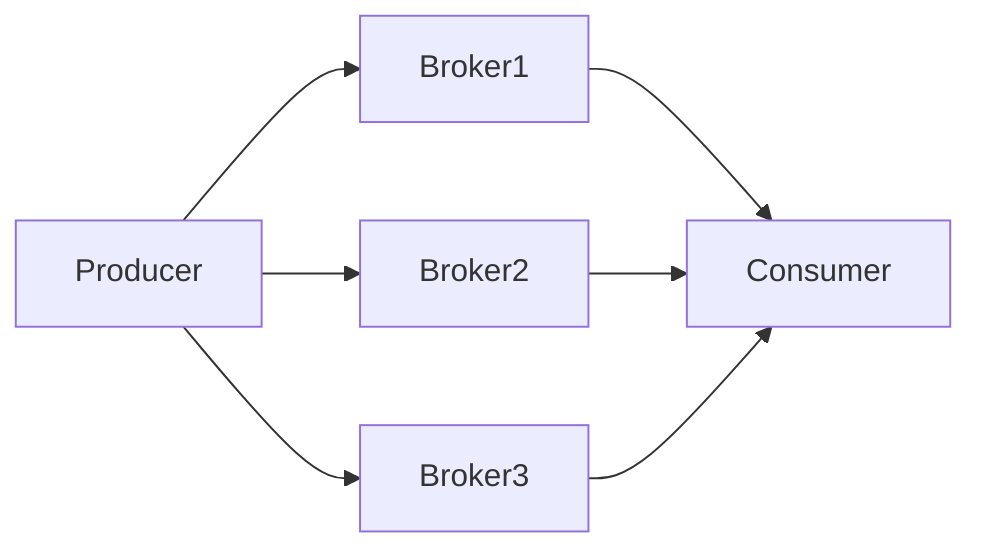
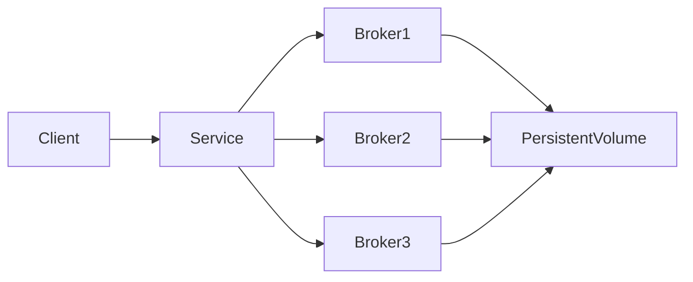

# Kafka avec Docker et Kubernetes

Dans les modules précédents nous avons vu :

1. comment Kafka fonctionne
2. comment Kafka traite les flux
3. comment connecter Kafka aux systèmes externes

Dans ce module nous allons voir **comment déployer Kafka réellement**.

Ce chapitre est particulièrement important pour les **profils DevOps**.

---

# Objectifs pédagogiques

À la fin de ce module vous serez capable de :

- déployer Kafka avec **Docker**
- comprendre l’architecture d’un **cluster Kafka**
- lancer et tester Kafka avec **docker-compose**
- utiliser les **commandes Kafka essentielles**
- comprendre le déploiement sur **Kubernetes**
- comprendre les outils DevOps utilisés avec Kafka

---

# Architecture d'un cluster Kafka

Un cluster Kafka contient plusieurs brokers.



Chaque broker stocke certaines partitions.

---

# Lancer Kafka avec Docker

Pour les environnements de développement, Kafka est souvent lancé avec **Docker Compose**.

---

# Exemple docker-compose

```yaml
version: "3"

services:

  zookeeper:
    image: confluentinc/cp-zookeeper:latest
    environment:
      ZOOKEEPER_CLIENT_PORT: 2181
      ZOOKEEPER_TICK_TIME: 2000
    ports:
      - "2181:2181"

  kafka:
    image: confluentinc/cp-kafka:latest
    depends_on:
      - zookeeper
    ports:
      - "9092:9092"
    environment:
      KAFKA_BROKER_ID: 1
      KAFKA_ZOOKEEPER_CONNECT: zookeeper:2181
      KAFKA_ADVERTISED_LISTENERS: PLAINTEXT://localhost:9092
      KAFKA_OFFSETS_TOPIC_REPLICATION_FACTOR: 1
```

---

# Lancer l'environnement

Commande clé :

```
docker compose up -d
```

Vérifier les conteneurs :

```
docker ps
```

Voir les logs Kafka :

```
docker logs kafka
```

---

# Commandes Kafka essentielles

Créer un topic :

```
kafka-topics.sh --create --topic orders --bootstrap-server localhost:9092 --partitions 3 --replication-factor 1
```

Lister les topics :

```
kafka-topics.sh --list --bootstrap-server localhost:9092
```

---

# Produire des messages

Kafka fournit un producer CLI.

```
kafka-console-producer.sh --topic orders --bootstrap-server localhost:9092
```

Ensuite saisir des messages.

---

# Consommer des messages

Consumer CLI :

```
kafka-console-consumer.sh --topic orders --bootstrap-server localhost:9092 --from-beginning
```

---

# Vérifier les partitions

```
kafka-topics.sh --describe --topic orders --bootstrap-server localhost:9092
```

---

# Vérifier le consumer lag

```
kafka-consumer-groups.sh --bootstrap-server localhost:9092 --describe --group my-consumer-group
```

---

# Exemple workflow DevOps

1. lancer Kafka

```
docker compose up -d
```

2. créer un topic

```
kafka-topics.sh --create ...
```

3. envoyer des messages

```
kafka-console-producer.sh
```

4. vérifier la consommation

```
kafka-console-consumer.sh
```

---

# Déploiement sur Kubernetes

Pour la production, Kafka est souvent déployé sur Kubernetes.

---

# Pourquoi Kubernetes

Kafka nécessite :

- haute disponibilité
- scaling
- orchestration
- gestion du stockage

Kubernetes permet de gérer ces aspects.

---

# Composants Kubernetes

Kafka utilise généralement :

| Composant | Rôle |
|-----------|------|
StatefulSet | gestion des brokers |
PersistentVolume | stockage |
Service | communication réseau |
ConfigMap | configuration |

---

# Architecture Kubernetes



---

# Déployer Kafka avec Strimzi

Strimzi est un **operator Kafka pour Kubernetes**.

Installation :

```
kubectl create namespace kafka
```

```
kubectl apply -f https://strimzi.io/install/latest?namespace=kafka -n kafka
```

---

# Déployer un cluster Kafka

Exemple fichier YAML :

```yaml
apiVersion: kafka.strimzi.io/v1beta2
kind: Kafka
metadata:
  name: kafka-cluster
spec:
  kafka:
    replicas: 3
    storage:
      type: persistent-claim
```

Appliquer la configuration :

```
kubectl apply -f kafka-cluster.yaml
```

---

# Vérifier les pods

```
kubectl get pods -n kafka
```

---

# Voir les logs

```
kubectl logs kafka-cluster-kafka-0 -n kafka
```

---

# Monitoring Kafka

En production il faut surveiller :

- consumer lag
- throughput
- latence
- utilisation disque

Outils utilisés :

- Prometheus
- Grafana

---

# Bonnes pratiques DevOps

Automatiser les déploiements.

Utiliser des partitions adaptées.

Surveiller les performances.

Sauvegarder les configurations.

---

# Résumé

Dans ce module nous avons vu :

- comment lancer Kafka avec Docker
- les commandes Kafka essentielles
- comment tester Kafka
- comment déployer Kafka sur Kubernetes

---

# Prochain module

Dans le dernier module nous verrons :

Kafka dans une **architecture Data Engineering**.

Nous verrons comment Kafka s'intègre dans :

- data lake
- pipelines analytics
- machine learning
- architectures event-driven
