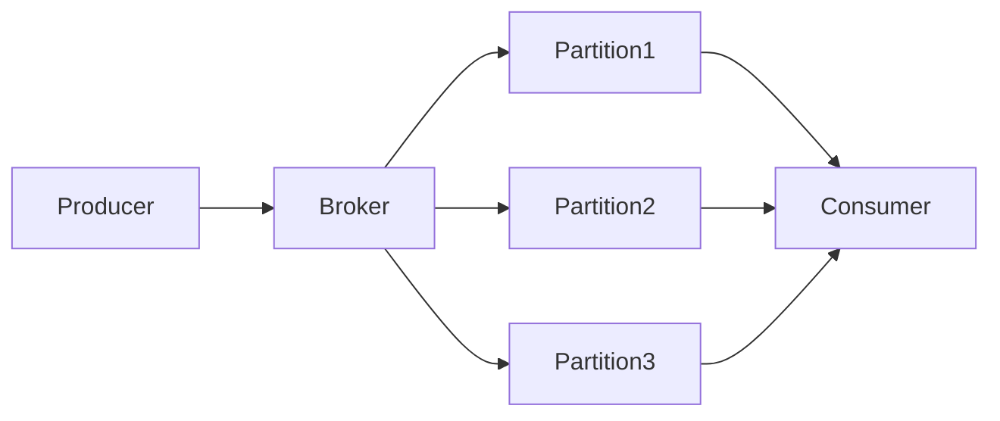

# Introduction à Apache Kafka

## Objectifs pédagogiques

À la fin de ce module vous serez capable de :

- expliquer ce qu'est **Apache Kafka**
- comprendre ce qu'est le **streaming de données**
- comprendre les concepts fondamentaux :
  - event
  - topic
  - partition
  - offset
  - producer
  - consumer
- comprendre pourquoi Kafka est devenu une **brique centrale des architectures data modernes**
- comprendre les différences entre **Kafka et une message queue traditionnelle**

---

# Contexte : pourquoi Kafka existe

Les systèmes modernes produisent énormément de données.

Exemples :

- logs applicatifs
- événements utilisateurs
- transactions financières
- capteurs IoT
- métriques d’infrastructure
- événements métiers

Dans une entreprise moderne, plusieurs systèmes doivent consommer ces données :

- systèmes d’analytics
- moteurs de recommandation
- pipelines data
- monitoring
- machine learning
- microservices

Le problème est que ces systèmes doivent :

- recevoir les données rapidement
- être découplés les uns des autres
- être capables de traiter de grands volumes

Historiquement, plusieurs solutions étaient utilisées.

| Technologie | Limites |
|---|---|
Base de données | difficile à scaler pour des flux continus |
Message queue | consommation destructive |
Batch ETL | latence élevée |
APIs synchrones | fort couplage entre services |

Kafka a été conçu pour résoudre ces problèmes.

---

# Le concept fondamental : le Distributed Commit Log

Le cœur de Kafka repose sur une idée simple :

> Kafka est un **log distribué append-only**

Un log est simplement une liste d'événements.

Exemple :

offset 0 → user login  
offset 1 → product view  
offset 2 → purchase  
offset 3 → logout  

Les événements sont :

- **ajoutés à la fin**
- **jamais modifiés**
- **conservés pendant un certain temps**

---

# Qu'est-ce que le streaming de données

Le **data streaming** consiste à traiter les données **en continu**.

Contrairement au batch.

## Batch

Les données sont traitées périodiquement.

Exemple :

toutes les nuits → traitement des ventes

## Streaming

Les données sont traitées immédiatement.

Exemple :

transaction → détection fraude instantanée

Kafka est une plateforme conçue pour gérer ce type de flux.

---

# Concepts fondamentaux de Kafka

## Event (message)

Un **event** représente quelque chose qui s'est produit.

Exemple :

```json
{
"user_id": 123,
"event": "purchase",
"product": "shoes"
}
```

---

## Topic

Un **topic** est un flux d'événements.

Exemples :

orders  
payments  
user-events  
logs  

---

## Partition

Un topic est divisé en **partitions**.

Pourquoi ?

- parallélisme
- scalabilité
- distribution

---

## Offset

Chaque message possède un identifiant appelé **offset**.

partition 0

offset 0  
offset 1  
offset 2  

---

## Producer

Le **producer** est l'application qui envoie les messages dans Kafka.

---

## Broker

Un **broker** est un serveur Kafka qui stocke les messages.

---

## Consumer

Un **consumer** est une application qui lit les messages.

---

## Consumer Group

Un **consumer group** est un groupe de consommateurs permettant de répartir la charge.

---

# Architecture simplifiée



---

# Cycle de vie d'un message Kafka

1. Producer envoie un événement  
2. Kafka écrit le message dans une partition  
3. Un offset est attribué  
4. Le message est stocké dans le broker  
5. Les consumers lisent les messages  

---

# Rétention des données

Kafka conserve les messages pendant une durée définie.

Exemples :

- 24 heures
- 7 jours
- 30 jours

Cela permet le **replay des données**.

---

# Cas d'utilisation réels

## LinkedIn

Kafka a été créé chez LinkedIn pour gérer le tracking et l’activité utilisateur.

## Netflix

Kafka est utilisé pour les logs et pipelines data.

## Uber

Kafka gère les événements temps réel comme les positions des chauffeurs.

---

# Résumé

Kafka est :

- une **plateforme de streaming**
- un **log distribué**
- un **bus de données**

Le modèle principal :

Producer → Kafka → Consumer
