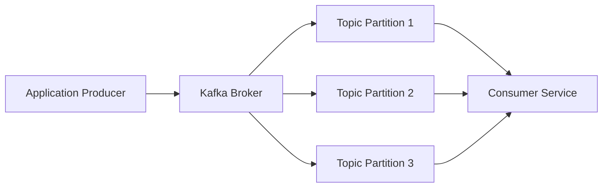

# Introduction à Apache Kafka

## Objectifs pédagogiques

À la fin de ce module, vous serez capable de :

-   Comprendre ce qu'est **Apache Kafka**
-   Comprendre le rôle du **streaming de données**
-   Identifier les composants principaux d'une architecture Kafka
-   Comprendre le fonctionnement **producer → broker → consumer**
-   Savoir dans quels cas Kafka est utilisé en entreprise

------------------------------------------------------------------------

## Contexte

Dans les systèmes modernes, les entreprises doivent gérer :

-   des **flux de données massifs**
-   des **applications distribuées**
-   des **microservices**
-   des **analyses en temps réel**

Exemples :

-   logs d'applications
-   événements utilisateurs
-   transactions financières
-   capteurs IoT
-   monitoring d'infrastructure

Avant Kafka, les systèmes utilisaient souvent :

-   des bases de données
-   des queues traditionnelles (RabbitMQ, ActiveMQ)
-   des batchs

Mais ces solutions ont des limites :

-   difficulté à scaler
-   perte de messages
-   latence élevée
-   architecture trop couplée

Kafka a été conçu pour résoudre ces problèmes.

Il permet de créer un **pipeline de données distribué, scalable et
fiable**.

------------------------------------------------------------------------

## Concepts fondamentaux

Kafka repose sur quelques concepts clés.

### Event / Message

Un **message** représente un événement.

Exemple :

``` json
{
"user_id": 123,
"event": "purchase",
"product": "shoes"
}
```

Chaque événement est envoyé dans Kafka.

------------------------------------------------------------------------

### Topic

Un **topic** est un flux de messages.

Exemples :

    user-events
    payments
    logs
    orders

Chaque type de donnée possède généralement son topic.

------------------------------------------------------------------------

### Partition

Un topic peut être **divisé en partitions**.

Pourquoi ?

Pour permettre :

-   la parallélisation
-   la scalabilité
-   le traitement distribué

------------------------------------------------------------------------

### Offset

Chaque message possède un **offset**.

C'est un identifiant séquentiel dans une partition.

Exemple :

    offset 0
    offset 1
    offset 2
    offset 3

Cela permet aux consommateurs de savoir **où ils en sont dans la
lecture**.

------------------------------------------------------------------------

## Architecture

  Composant        Rôle                                    Exemple
  ---------------- --------------------------------------- ---------------------
  Producer         Envoie des messages dans Kafka          Application web
  Broker           Serveur Kafka qui stocke les messages   Cluster Kafka
  Topic            Flux de messages                        user-events
  Partition        Division d'un topic                     partition-1
  Consumer         Lit les messages                        Service d'analytics
  Consumer Group   Groupe de consommateurs                 microservices

------------------------------------------------------------------------

## Diagramme d'architecture



------------------------------------------------------------------------

## Workflow du système

Le flux Kafka classique est :

    Producer → Broker → Consumer

### Producer

Une application produit des événements.

Exemple :

-   un site e‑commerce
-   un service backend
-   un microservice

------------------------------------------------------------------------

### Broker

Le broker Kafka :

-   stocke les messages
-   gère les partitions
-   distribue les messages

Un cluster Kafka contient souvent **plusieurs brokers**.

------------------------------------------------------------------------

### Consumer

Les consumers lisent les messages.

Exemples :

-   service d'analytics
-   pipeline ETL
-   base de données
-   moteur de recommandation

------------------------------------------------------------------------

## Mise en pratique

Exemple avec Docker.

### Lancer Kafka avec Docker

``` bash
docker run -p 9092:9092 apache/kafka
```

------------------------------------------------------------------------

### Envoyer un message

``` bash
kafka-console-producer.sh --topic test --bootstrap-server localhost:9092
```

Puis taper :

    hello kafka

------------------------------------------------------------------------

### Lire les messages

``` bash
kafka-console-consumer.sh --topic test --from-beginning --bootstrap-server localhost:9092
```

------------------------------------------------------------------------

## Cas réel

Kafka est utilisé par de nombreuses entreprises.

### LinkedIn

Kafka a été créé chez LinkedIn pour gérer :

-   activité utilisateur
-   tracking
-   analytics temps réel

------------------------------------------------------------------------

### Netflix

Kafka est utilisé pour :

-   monitoring
-   pipeline de données
-   logs streaming

------------------------------------------------------------------------

### Uber

Kafka permet de gérer :

-   position des chauffeurs
-   commandes
-   événements temps réel

------------------------------------------------------------------------

## Bonnes pratiques

### 1. Utiliser plusieurs partitions

Pour permettre la scalabilité.

------------------------------------------------------------------------

### 2. Utiliser des Consumer Groups

Pour répartir la charge.

------------------------------------------------------------------------

### 3. Conserver les données suffisamment longtemps

Kafka est souvent utilisé comme **buffer de données**.

------------------------------------------------------------------------

### 4. Monitorer le cluster

Outils populaires :

-   Prometheus
-   Grafana
-   Kafka Manager

------------------------------------------------------------------------

## Résumé

Kafka est une **plateforme de streaming distribuée**.

Elle permet de :

-   collecter des événements
-   stocker des flux de données
-   distribuer les messages à plusieurs services

Le modèle principal est :

    Producer → Kafka → Consumer

Kafka est devenu une **brique centrale des architectures data modernes**
:

-   data engineering
-   microservices
-   event-driven architecture
-   pipelines temps réel

Dans les prochains modules, nous verrons :

-   Kafka en profondeur
-   Kafka Streams
-   Kafka Connect
-   Kafka avec Docker et Kubernetes
-   Kafka dans une architecture Data Engineering
