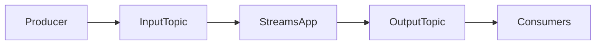
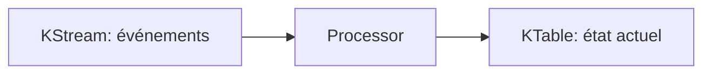
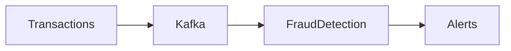
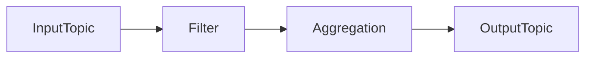
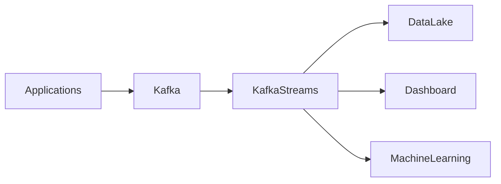

---
layout: page
title: "Kafka Streams"

course: Data Engineering
theme: "Streaming de données"
type: lesson

chapter: 1
section: 3

tags: kafka, kafka-streams, streaming, data-engineering
difficulty: intermediate
duration: 90 min
mermaid: true

theme_icon: "📡"
theme_group: Data Streaming
theme_group_icon: "⚙️"
theme_order: 3
status: "En construction"
---

# Kafka Streams

Dans les modules précédents nous avons vu :

- comment Kafka transporte les données
- comment Kafka stocke et distribue les événements
- comment Kafka garantit la scalabilité avec les partitions

Mais Kafka ne sert pas uniquement à **transporter les données**.

Il peut aussi servir à **les transformer et les analyser en temps réel**.

C’est précisément le rôle de **Kafka Streams**.

---

# Objectifs pédagogiques

À la fin de ce module vous serez capable de :

- comprendre ce qu’est **Kafka Streams**
- comprendre le **stream processing**
- comprendre la différence entre **KStream et KTable**
- comprendre les traitements **stateless et stateful**
- comprendre le **windowing**
- comprendre le **state store**
- comprendre comment Kafka Streams **scale**
- comprendre comment Kafka Streams s'intègre dans une architecture data

---

# Qu'est-ce que Kafka Streams

Kafka Streams est une **bibliothèque de stream processing**.

Elle permet de :

- lire des données depuis Kafka
- transformer ces données
- produire de nouveaux événements

Contrairement à certains frameworks de streaming, Kafka Streams :

- ne nécessite pas de cluster supplémentaire
- fonctionne directement dans une application Java

---

# Streaming vs Batch

## Batch processing

Dans un système batch :

les données sont traitées périodiquement.

Exemple :

```
toutes les nuits → calcul du chiffre d'affaires
```

Problème :

- latence élevée
- pas de réaction immédiate

---

## Stream processing

Dans un système streaming :

les données sont traitées **au moment où elles arrivent**.

Exemple :

```
transaction → détection fraude instantanée
```

Kafka Streams est conçu pour ce type de traitement.

---

# Architecture générale

Une application Kafka Streams se situe **entre deux topics**.



Étapes :

1. un producer écrit dans un topic
2. Kafka Streams lit ce topic
3. les données sont transformées
4. un nouveau topic est produit

---

# Exemple concret

Plateforme e‑commerce :

Topic :

```
orders
```

Pipeline :

```
orders → Kafka Streams → revenue
```

Le pipeline calcule le revenu total par produit.

---

# KStream

Un **KStream** représente un flux d'événements.

Chaque événement est indépendant.

Exemple :

```
order1
order2
order3
order4
```

Chaque événement est traité séparément.

---

# KTable

Une **KTable** représente un état.

Exemple :

```
user_id → balance
```

Chaque nouvelle valeur remplace la précédente.

Exemple :

```
user1 → 100
user1 → 150
user1 → 200
```

La table garde uniquement :

```
user1 → 200
```

---

# Diagramme KStream vs KTable



---

# Stateless processing

Les opérations stateless ne dépendent pas d'un état.

Exemples :

- filter
- map
- flatMap

Exemple :

```
orders → filter(status=PAID)
```

Chaque message est traité indépendamment.

---

# Stateful processing

Les opérations stateful nécessitent un état.

Exemples :

- count
- aggregate
- join
- window

Exemple :

```
orders → groupBy product → count
```

Ici le système doit conserver un compteur.

---

# State Store

Pour stocker cet état, Kafka Streams utilise un **state store**.

Le state store est généralement basé sur :

```
RocksDB
```

Cela permet :

- accès rapide
- stockage local
- haute performance

---

# Windowing

Le windowing permet de calculer des agrégations **sur une période de temps**.

Exemple :

```
nombre de commandes par minute
```

---

# Types de fenêtres

## Tumbling window

Fenêtres fixes non chevauchantes.

Exemple :

```
12:00 - 12:01
12:01 - 12:02
12:02 - 12:03
```

---

## Hopping window

Fenêtres qui se chevauchent.

Exemple :

```
12:00 - 12:05
12:01 - 12:06
12:02 - 12:07
```

---

## Sliding window

Fenêtres basées sur la différence entre deux événements.

Très utile pour détecter :

- anomalies
- pics d'activité

---

# Exemple réel : détection fraude

Pipeline :



Règle :

```
si 5 transactions en moins de 10 secondes
→ alerte fraude
```

Kafka Streams peut implémenter ce type de logique.

---

# Scaling Kafka Streams

Le scaling dépend de :

- partitions
- instances d'application
- tasks Kafka Streams

Règle importante :

```
nombre de partitions = niveau maximum de parallélisme
```

---

# Exemple

Topic :

```
orders
partitions = 4
```

Applications Kafka Streams :

```
instance 1
instance 2
instance 3
instance 4
```

Chaque instance traite une partition.

---

# Topologie Kafka Streams

Une application Kafka Streams est décrite sous forme de **topology**.

Une topology est un graphe de traitements.



---

# Exemple de code

```java
StreamsBuilder builder = new StreamsBuilder();

KStream<String, String> orders =
builder.stream("orders");

orders
.filter((key, value) -> value.contains("PAID"))
.to("paid-orders");
```

Pipeline :

```
orders → filter → paid-orders
```

---

# Cas d'utilisation réels

Kafka Streams est utilisé pour :

- analytics temps réel
- détection d'anomalies
- enrichissement de données
- pipelines de transformation
- monitoring

---

# Architecture complète



Kafka Streams agit comme un **moteur de transformation temps réel**.

---

# Bonnes pratiques

Utiliser suffisamment de partitions.

Optimiser les state stores.

Surveiller :

- latence
- throughput
- consumer lag

---

# Résumé

Kafka Streams permet :

- transformation de flux
- traitement temps réel
- agrégation
- enrichissement de données

Kafka Streams transforme Kafka en **plateforme complète de streaming data**.

---

# Prochain module

Dans le prochain module nous verrons :

Kafka Connect.

Kafka Connect permet d'**ingérer et d'exporter les données automatiquement** entre Kafka et les systèmes externes.
