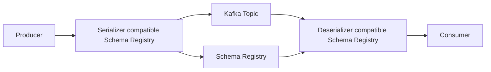

# Schema Registry et formats Avro / Protobuf / JSON Schema

## Objectifs pédagogiques

À la fin de ce module, vous serez capable de :

- expliquer **à quoi sert un Schema Registry** dans un écosystème Kafka
- distinguer **schéma**, **payload**, **sérialisation**, **désérialisation**, **compatibilité** et **évolution de schéma**
- comprendre les différences entre **Avro**, **Protobuf** et **JSON Schema**
- choisir un format selon le besoin métier et technique
- comprendre ce que l’on peut **produire** avec ces formats :
  - événements Kafka robustes
  - contrats de données versionnés
  - validation de messages
  - pipelines Kafka Connect fiables
  - applications Kafka Streams plus sûres
- comprendre les principaux modes de compatibilité
- mettre en place une stratégie de versioning lisible
- éviter les erreurs classiques qui cassent les consumers

---

# Contexte

Quand on débute avec Kafka, on envoie souvent des messages en **JSON libre**.

Exemple :

```json
{
  "order_id": 1452,
  "customer_id": 99,
  "amount": 129.90,
  "currency": "EUR"
}
```

Au début, cela semble simple.

Mais dès que plusieurs équipes produisent et consomment les mêmes événements, des problèmes apparaissent :

- un producteur renomme un champ
- un autre rend un champ obligatoire
- un consumer attend un type `string` alors qu’un producteur envoie maintenant un `integer`
- deux applications n’ont pas la même version du message
- un pipeline Kafka Connect ou Kafka Streams casse après une évolution mal gérée

Le vrai problème n’est donc pas Kafka lui-même.  
Le vrai problème est le **contrat de données**.

Un événement Kafka n’est pas seulement un message.  
C’est aussi un **engagement structurel** entre producteurs et consommateurs.

C’est précisément là qu’intervient le **Schema Registry**.

---

# Pourquoi un Schema Registry existe

## Idée générale

Un **Schema Registry** est un service central qui stocke, versionne, valide et contrôle les schémas utilisés par les applications qui lisent et écrivent des données.

En pratique, il sert à :

- enregistrer un schéma
- lui attribuer un identifiant
- conserver ses versions
- vérifier si une nouvelle version est compatible avec les précédentes
- permettre aux producteurs et consommateurs d’utiliser le même contrat de données

---

## Définition simple

Un **schéma** est une description formelle de la structure d’une donnée.

Il précise par exemple :

- les champs attendus
- leur type
- parfois leur caractère obligatoire ou optionnel
- parfois des contraintes supplémentaires

Exemple très simplifié :

```json
{
  "type": "record",
  "name": "OrderCreated",
  "fields": [
    { "name": "order_id", "type": "string" },
    { "name": "customer_id", "type": "string" },
    { "name": "amount", "type": "double" }
  ]
}
```

Ici, le schéma ne dit pas seulement **ce qui est envoyé**.  
Il dit **comment le lire correctement**.

---

## NOTE pédagogique — schéma vs message

Ne confonds pas ces deux notions :

### Le schéma
C’est le **plan**.

### Le message
C’est la **valeur réelle** envoyée.

Exemple :

**Schéma :**
```json
{
  "type": "record",
  "name": "UserCreated",
  "fields": [
    { "name": "user_id", "type": "string" },
    { "name": "email", "type": "string" }
  ]
}
```

**Message réel :**
```json
{
  "user_id": "u-145",
  "email": "alice@example.com"
}
```

Sans schéma, le consumer doit deviner ou supposer la structure.  
Avec schéma, il sait exactement ce qu’il doit attendre.

---

# Le rôle exact du Schema Registry

## 1. Centraliser les contrats de données

Au lieu d’avoir des schémas dispersés :

- dans des projets Java
- dans des scripts Python
- dans une documentation Confluence
- dans un wiki jamais mis à jour

on les centralise dans un registre unique.

C’est plus propre, plus traçable, plus robuste.

---

## 2. Versionner les schémas

Un même événement peut évoluer.

Exemple :

### Version 1
```json
{
  "order_id": "A001",
  "amount": 120.0
}
```

### Version 2
```json
{
  "order_id": "A001",
  "amount": 120.0,
  "currency": "EUR"
}
```

Le Schema Registry garde l’historique de ces versions.

---

## 3. Vérifier la compatibilité

Avant qu’un nouveau schéma soit accepté, le registre peut vérifier si cette évolution est autorisée.

Exemples de questions qu’il aide à trancher :

- peut-on ajouter un champ ?
- peut-on supprimer un champ ?
- peut-on changer un type ?
- peut-on renommer un champ ?
- peut-on rejouer les anciens messages avec les nouveaux consumers ?

Sans contrôle, les erreurs apparaissent directement en production.

---

## 4. Éviter l’inclusion répétée du schéma dans chaque message

Dans un fonctionnement typique avec les serializers compatibles Schema Registry, le message Kafka ne contient pas tout le schéma complet à chaque fois.  
Il contient un **identifiant de schéma** qui permet au consumer de récupérer la bonne définition.

C’est plus compact et plus efficace.

---

## 5. Sécuriser les pipelines de données

Avec un registre de schémas, on réduit le risque de :

- casse silencieuse
- messages incohérents
- divergence entre équipes
- dette technique liée aux contrats non maîtrisés

---

# Architecture logique



---

## Explication de la séquence

### Étape 1 — le producer prépare le message
L’application crée un objet ou une structure de données.

### Étape 2 — le serializer regarde le schéma
Le serializer sait quel schéma utiliser pour encoder le message.

### Étape 3 — le schéma est enregistré ou récupéré
Si le schéma n’existe pas encore dans le registre, il peut être enregistré.  
Sinon, son identifiant est récupéré.

### Étape 4 — le message est écrit dans Kafka
Le payload est sérialisé, et un identifiant de schéma permet au consumer de retrouver le contrat exact.

### Étape 5 — le consumer lit le message
Le deserializer consulte le registre, récupère le schéma correspondant, puis reconstruit la donnée.

---

# Vocabulaire essentiel

## Sérialisation

Transformer une donnée applicative en une représentation transmissible ou stockable.

Exemple :
- objet Java
- dictionnaire Python
- structure Go

vers :
- binaire Avro
- binaire Protobuf
- payload JSON validé

---

## Désérialisation

Opération inverse : reconstruire une donnée exploitable à partir du message reçu.

---

## Sujet / Subject

Dans un Schema Registry, un **subject** représente souvent une ligne de versioning pour un schéma.

En pratique, un subject peut être lié :

- à la valeur d’un topic
- à la clé d’un topic
- à un nom d’enregistrement logique

Le choix de la stratégie de nommage a un impact direct sur la gouvernance.

---

## Compatibilité

Règle qui dit si une nouvelle version de schéma peut coexister avec l’ancienne sans casser les applications.

---

## Évolution de schéma

Modification contrôlée d’un schéma dans le temps.

---

## Contrat de données

Engagement explicite entre producteurs et consommateurs sur :

- la structure
- les types
- parfois les règles métier minimales

---

# Les trois formats principaux

Dans les environnements Kafka avec Schema Registry, trois formats ressortent très souvent :

- **Avro**
- **Protobuf**
- **JSON Schema**

Ils ne répondent pas exactement aux mêmes besoins.

---

# 1. Avro

## Ce que c’est

Avro est un format de sérialisation historiquement très présent dans les écosystèmes data.  
Il utilise des schémas décrits en JSON, mais le message sérialisé est généralement en **binaire compact**.

---

## Pourquoi Avro est souvent utilisé avec Kafka

Avro est populaire avec Kafka parce qu’il combine bien :

- compacité
- performance correcte
- forte culture de l’évolution de schéma
- intégration historique dans les pipelines data

---

## Exemple de schéma Avro

```json
{
  "type": "record",
  "name": "OrderCreated",
  "namespace": "com.acme.events",
  "fields": [
    { "name": "order_id", "type": "string" },
    { "name": "customer_id", "type": "string" },
    { "name": "amount", "type": "double" },
    { "name": "currency", "type": ["null", "string"], "default": null }
  ]
}
```

---

## Explication ligne par ligne

### `type: "record"`
Le schéma représente une structure nommée, équivalente à un objet structuré.

### `name`
Nom logique du record.

### `namespace`
Permet d’éviter les collisions de nommage.

### `fields`
Liste ordonnée des champs.

### `["null", "string"]`
Union de types, utilisée ici pour rendre le champ nullable.

### `default`
Valeur par défaut utilisée dans certains scénarios d’évolution.

---

## Forces d’Avro

- format compact
- bonne gestion des évolutions
- très adapté aux événements Kafka
- bon choix pour pipelines data et analytics
- très répandu dans les stacks Kafka

---

## Faiblesses d’Avro

- moins lisible pour des équipes très orientées API web
- modèle parfois moins naturel pour des développeurs qui vivent surtout avec JSON
- certaines subtilités sur unions et defaults sont mal comprises au début

---

## Quand choisir Avro

Avro est un très bon choix si :

- tu veux des événements robustes et efficaces
- tu construis une plateforme data
- tu veux standardiser les contrats d’événements
- tu travailles déjà dans un écosystème Kafka / Connect / Streams

---

# 2. Protobuf

## Ce que c’est

Protobuf, ou Protocol Buffers, est un format créé autour d’une définition fortement typée, compilable, très utilisé dans les systèmes distribués et les architectures orientées contrats.

---

## Exemple de schéma Protobuf

```proto
syntax = "proto3";

package com.acme.events;

message OrderCreated {
  string order_id = 1;
  string customer_id = 2;
  double amount = 3;
  string currency = 4;
}
```

---

## Explication des notions

### `syntax = "proto3"`
Version de la syntaxe utilisée.

### `package`
Organisation logique des messages.

### `message`
Structure décrivant le contrat.

### `= 1`, `= 2`, etc.
Chaque champ porte un numéro de tag.  
Ces numéros sont essentiels pour la compatibilité et le décodage.

---

## Forces de Protobuf

- très efficace en binaire
- très bon typage
- excellent pour les environnements polyglottes
- apprécié dans les systèmes backend et RPC
- bonne discipline de contrat

---

## Faiblesses de Protobuf

- moins naturel pour des équipes non techniques
- la gestion de l’évolution demande de respecter sérieusement les règles sur les tags
- plus “ingénierie backend” que “data analyst”

---

## Quand choisir Protobuf

Protobuf est pertinent si :

- tu travailles dans une culture très backend / microservices
- tu veux des contrats stricts
- tu fais déjà du gRPC ou des systèmes orientés IDL
- la compacité et la discipline de typage sont prioritaires

---

# 3. JSON Schema

## Ce que c’est

JSON Schema est un langage déclaratif qui décrit la structure attendue d’un document JSON.

Il est souvent plus parlant pour des équipes qui manipulent déjà :

- APIs REST
- payloads JSON
- intégrations web
- outillage documentaire autour de JSON

---

## Exemple de schéma JSON Schema

```json
{
  "$schema": "https://json-schema.org/draft/2020-12/schema",
  "title": "OrderCreated",
  "type": "object",
  "properties": {
    "order_id": { "type": "string" },
    "customer_id": { "type": "string" },
    "amount": { "type": "number" },
    "currency": { "type": "string" }
  },
  "required": ["order_id", "customer_id", "amount"]
}
```

---

## Forces de JSON Schema

- très lisible
- naturel pour des équipes web
- utile quand le monde API et le monde événementiel se croisent
- bon support des contraintes de validation

---

## Faiblesses de JSON Schema

- souvent plus verbeux
- moins compact en perception de gouvernance que Protobuf
- certaines règles d’évolution peuvent être plus subtiles à piloter
- peut inciter des équipes à rester trop “JSON libre” si la discipline n’est pas là

---

## Quand choisir JSON Schema

Choisis-le surtout si :

- tu veux rester proche des modèles JSON
- plusieurs équipes non spécialisées data doivent lire les contrats
- tu veux faire converger APIs JSON et événements Kafka
- la lisibilité et la validation déclarative comptent plus que l’optimisation maximale

---

# Comparaison pratique

| Critère | Avro | Protobuf | JSON Schema |
|---|---|---|---|
| Lisibilité humaine | moyenne | moyenne | élevée |
| Compacité binaire | bonne | très bonne | variable selon implémentation |
| Culture data engineering | forte | moyenne | moyenne |
| Culture backend stricte | bonne | très forte | moyenne |
| Évolution de schéma | bonne | bonne | bonne mais à cadrer |
| Adoption en environnement Kafka | très forte | forte | forte |
| Facilité pour équipes web | moyenne | moyenne | élevée |

---

# Ce qu’on peut produire avec Schema Registry

C’est un point important : il ne faut pas voir le registre comme un simple outil d’infrastructure.

Il permet de produire des choses concrètes et utiles.

---

## 1. Des événements Kafka fiables

Exemple :

- `order-created`
- `invoice-generated`
- `payment-authorized`
- `user-profile-updated`

Ces événements ont alors :

- un format connu
- une version
- une compatibilité contrôlée

---

## 2. Des contrats de données versionnés

Au lieu de dépendre d’un PDF ou d’un wiki, tu as un registre central des versions de schémas.

C’est beaucoup plus exploitable dans un SI réel.

---

## 3. Des pipelines Kafka Connect plus robustes

Quand tu relies :

- une base relationnelle
- un topic Kafka
- un sink Elasticsearch ou S3

les schémas permettent de garder de la cohérence de bout en bout.

---

## 4. Des applications Kafka Streams plus sûres

Kafka Streams dépend beaucoup de la stabilité des données d’entrée.  
Des schémas gouvernés réduisent le risque de casse pendant les évolutions.

---

## 5. De la validation automatique

Un producteur ne peut pas envoyer n’importe quoi si le serializer et le registre sont bien utilisés.

---

## 6. Une base pour la gouvernance des données

Le schéma devient un point d’entrée vers :

- qualité des données
- versioning
- audit de changements
- documentation vivante
- data contracts

---

# Modes de compatibilité

C’est l’un des sujets les plus importants.

---

## Pourquoi la compatibilité est cruciale

Supposons ce cas :

- un consumer lit encore l’ancienne version d’un message
- un producer commence à publier une nouvelle version

Question :

**est-ce que le consumer continue à fonctionner ?**

La réponse dépend du mode de compatibilité choisi.

---

## BACKWARD

Le nouveau schéma doit pouvoir lire des données écrites avec la version précédente.

### Lecture simple
Le consumer mis à jour sait lire les anciens messages.

### Utilité
C’est souvent un bon choix pour Kafka, surtout quand on veut pouvoir **relire l’historique**.

---

## BACKWARD_TRANSITIVE

Le nouveau schéma doit être compatible avec **toutes** les versions passées, pas seulement la dernière.

### Utilité
Plus strict, plus sûr pour les historiques longs.

---

## FORWARD

L’ancien schéma doit pouvoir lire les données écrites avec le nouveau schéma.

### Utilité
Moins intuitif pour beaucoup d’équipes.  
Demande plus d’anticipation.

---

## FORWARD_TRANSITIVE

Même logique, mais vis-à-vis de toutes les versions.

---

## FULL

Le nouveau schéma doit être à la fois backward et forward compatible avec la version comparée.

### Utilité
Très bon niveau de sécurité, mais plus contraignant.

---

## FULL_TRANSITIVE

Le plus strict parmi les grands classiques.

### Utilité
Très robuste, mais peut ralentir certaines évolutions.

---

## NONE

Aucun contrôle de compatibilité.

### Avis honnête
À éviter sauf cas très spécifique, temporaire ou parfaitement maîtrisé.  
En pratique, c’est souvent le mode qui réintroduit le chaos qu’on cherchait précisément à éviter.

---

# Comment raisonner simplement sur la compatibilité

## Cas sûr classique : ajouter un champ optionnel

Version 1 :
```json
{
  "order_id": "A001",
  "amount": 120.0
}
```

Version 2 :
```json
{
  "order_id": "A001",
  "amount": 120.0,
  "currency": "EUR"
}
```

Si `currency` est optionnel ou a une valeur par défaut bien gérée, cette évolution peut être compatible.

---

## Cas risqué : rendre obligatoire un champ nouveau

Si tu ajoutes `currency` mais que tous les anciens messages n’ont pas ce champ, le nouveau consumer peut ne pas savoir quoi faire.

---

## Cas dangereux : changer un type

Passer de :

```json
"amount": 120.0
```

à

```json
"amount": "120.0"
```

peut casser brutalement les consumers.

---

## Cas très dangereux : réutiliser un champ de façon différente

Exemple :

avant :
```json
"status": "PAID"
```

après :
```json
"status": 2
```

Même nom, sens changé, type changé.  
C’est une mauvaise évolution.

---

# NOTE pédagogique — compatibilité technique vs compatibilité métier

Un schéma peut être techniquement compatible tout en cassant le métier.

Exemple :

- tu gardes le champ `status` en `string`
- mais tu changes les valeurs possibles sans prévenir
- le consumer compile toujours
- le pipeline ne plante pas
- mais la logique métier devient fausse

Conclusion :  
Le Schema Registry protège fortement la structure, mais il ne remplace pas totalement la gouvernance métier.

---

# Stratégies de nommage des subjects

C’est un sujet souvent négligé, puis regretté plus tard.

---

## Pourquoi c’est important

Le nom d’un subject détermine :

- comment les versions sont regroupées
- comment les schémas sont réutilisés
- comment plusieurs topics ou records cohabitent

---

## Stratégie simple orientée topic

Exemple logique :

- `orders-value`
- `orders-key`

### Avantage
Simple à comprendre.

### Limite
Moins flexible si plusieurs types d’événements cohabitent dans un même topic.

---

## Stratégie orientée record

Le subject suit le nom logique du record plutôt que le nom du topic.

### Avantage
Réutilisation plus propre dans certains cas multi-topics.

### Limite
Demande une vraie discipline de gouvernance.

---

## Conseil pratique

Pour démarrer une plateforme, choisis une stratégie simple, documentée, stable.  
Le pire choix n’est pas une stratégie imparfaite.  
Le pire choix est l’absence de stratégie.

---

# Exemple de séquence d’évolution saine

## Version 1 — événement minimal

```json
{
  "order_id": "A001",
  "amount": 120.0
}
```

## Version 2 — ajout d’un champ optionnel

```json
{
  "order_id": "A001",
  "amount": 120.0,
  "currency": "EUR"
}
```

## Version 3 — ajout d’un champ métier secondaire

```json
{
  "order_id": "A001",
  "amount": 120.0,
  "currency": "EUR",
  "sales_channel": "web"
}
```

Cette trajectoire est saine si :

- les nouveaux champs sont bien pensés
- la compatibilité est vérifiée
- les consumers ne dépendent pas d’hypothèses fragiles

---

# Exemple de mauvaise évolution

## Version 1

```json
{
  "customer_id": "C001",
  "email": "alice@example.com"
}
```

## Version 2

```json
{
  "client_id": 1,
  "email_address": "alice@example.com"
}
```

Ici, tu as :

- renommé des champs
- changé potentiellement les types
- changé le vocabulaire
- probablement cassé les consumers

En pratique, ce genre de refonte mérite souvent :

- soit une vraie stratégie de migration
- soit un nouvel événement
- soit un nouveau record

---

# Ce qu’il faut expliquer aux équipes

Quand plusieurs équipes travaillent avec Kafka, il faut leur faire comprendre ceci :

## Un événement n’est pas une simple structure technique

C’est :
- un contrat
- une API asynchrone
- un objet de gouvernance
- parfois une preuve fonctionnelle importante dans le SI

---

## Le producteur n’est pas propriétaire absolu du schéma

Dès que d’autres applications consomment l’événement, le producteur ne peut plus changer librement la structure.

---

## Le consumer doit rester tolérant quand c’est raisonnable

Un consumer trop rigide casse vite.  
Un consumer trop permissif laisse passer des dérives.  
Il faut un équilibre.

---

# Ce qu’on peut construire autour du Schema Registry

## 1. Documentation vivante des événements

Le registre peut servir de base pour documenter :

- les topics
- les schémas
- les versions
- les équipes responsables
- les règles de compatibilité

---

## 2. CI/CD de contrats de données

Tu peux mettre en place une chaîne qui :

- valide un schéma
- teste la compatibilité
- refuse un merge si la règle est violée

C’est très utile dans une plateforme sérieuse.

---

## 3. Contrôles avant déploiement

Avant de déployer un producteur :

- vérifier qu’il publie bien le bon schéma
- vérifier que l’évolution est compatible
- vérifier que les consumers critiques ne seront pas cassés

---

## 4. Normalisation des événements d’entreprise

Exemple :
- conventions de nommage
- types standardisés pour les identifiants
- formats de dates cohérents
- enveloppes d’événements homogènes

---

# NOTE pédagogique — ce que le Schema Registry ne fait pas tout seul

Il ne résout pas magiquement :

- la qualité métier de la donnée
- la sémantique métier
- le nommage mal pensé
- les doublons fonctionnels d’événements
- les modèles conceptuels faibles

Autrement dit :  
le registre améliore fortement la gouvernance technique, mais il ne remplace pas l’architecture de données.

---

# Exemples d’usages concrets

## Cas 1 — e-commerce

Événements :
- `order-created`
- `payment-authorized`
- `invoice-issued`

Pourquoi un registre aide :
- plusieurs services consomment les mêmes événements
- les schémas évoluent dans le temps
- il faut rejouer l’historique sans casse

---

## Cas 2 — IoT

Événements :
- mesures capteurs
- alertes techniques
- état des équipements

Pourquoi un registre aide :
- beaucoup de producteurs
- besoin de contrôle des types
- forte volumétrie
- pipelines downstream multiples

---

## Cas 3 — Data Platform

Sources :
- CDC base de données
- applications backend
- APIs

Destinations :
- Kafka Streams
- Flink
- Data Lake
- Data Warehouse

Pourquoi un registre aide :
- cohérence des contrats
- réduction des erreurs de mapping
- meilleure traçabilité

---

# Bonnes pratiques

## 1. Commencer simple mais cadré

Choisis :
- un format principal
- une stratégie de nommage
- un mode de compatibilité par défaut
- une convention claire pour les champs

---

## 2. Éviter le JSON libre sans gouvernance

Le JSON libre est pratique pour prototyper.  
Il devient vite toxique à l’échelle.

---

## 3. Ajouter des champs plutôt que casser les anciens

L’évolution additive est souvent la plus saine.

---

## 4. Ne pas changer le sens métier d’un champ existant

Si le sens change vraiment, crée un nouveau champ ou un nouvel événement.

---

## 5. Documenter les événements importants

Un schéma ne suffit pas toujours à expliquer :
- le moment d’émission
- la source de vérité
- la signification métier
- les valeurs possibles

---

## 6. Tester la compatibilité avant production

Le contrôle ne doit pas être seulement manuel.

---

## 7. Uniformiser les types structurants

Exemples :
- identifiants toujours en `string`
- dates en ISO 8601
- montants dans une convention explicite
- devise toujours normalisée

---

# Erreurs classiques

## 1. Confondre événement métier et vue technique temporaire

Un événement d’entreprise doit survivre à l’évolution interne d’un service.

---

## 2. Renommer des champs sans stratégie de migration

Très fréquent, très mauvais.

---

## 3. Changer les types en sous-estimant l’impact

Passer de `int` à `string` peut sembler mineur.  
Ça ne l’est pas.

---

## 4. Mélanger plusieurs conventions selon les équipes

Exemple :
- `customerId`
- `customer_id`
- `client_id`

C’est une dette immédiate.

---

## 5. Utiliser `NONE` trop longtemps

Le mode “temporaire” devient souvent permanent.

---

## 6. Ne pas penser à la relecture historique

Kafka permet le replay.  
Le schéma doit être pensé en conséquence.

---

# Choisir entre Avro, Protobuf et JSON Schema

## Choisis Avro si
- tu es très orienté data engineering
- tu veux une base standard Kafka très répandue
- tu privilégies un compromis robuste entre performance et gouvernance

## Choisis Protobuf si
- tu es très orienté backend / contrats stricts
- tu veux un modèle fortement typé
- tu as déjà un écosystème gRPC ou Protobuf

## Choisis JSON Schema si
- beaucoup d’équipes lisent déjà du JSON
- tu veux une courbe d’entrée plus douce
- tes contrats doivent être très lisibles rapidement

---

# Recommandation honnête

Pour une plateforme Kafka orientée data engineering classique :

- **Avro** reste souvent le choix le plus naturel

Pour une plateforme très orientée backend polyglotte :

- **Protobuf** peut être excellent

Pour une organisation où la lisibilité JSON et l’adoption transverse priment :

- **JSON Schema** est un bon candidat

Le mauvais choix n’est pas toujours le format.  
Le mauvais choix est souvent :
- l’absence de gouvernance
- l’absence de règles d’évolution
- l’absence de discipline sur les contrats

---

# Mise en pratique conceptuelle

## Producteur

Le producteur sérialise un événement selon un schéma connu.

Exemple logique :

```text
Objet applicatif
→ serializer
→ schéma validé
→ message Kafka + référence de schéma
```

---

## Consumer

Le consumer lit le message, récupère le schéma correspondant, puis reconstruit une structure fiable.

Exemple logique :

```text
message Kafka
→ identifiant de schéma
→ récupération du schéma
→ désérialisation
→ traitement applicatif
```

---

# Ce module prépare quoi ensuite

Ce chapitre prépare très bien la suite de ton parcours Kafka parce qu’il relie :

- **Kafka Connect** : les connecteurs reposent beaucoup sur la qualité des schémas
- **Kafka Streams** : les traitements sont plus fiables avec des contrats propres
- **architecture data engineering** : la gouvernance des schémas devient un pilier transverse
- **data contracts** : sujet plus avancé mais directement lié

---

# Résumé

Le Schema Registry sert à :

- centraliser les schémas
- versionner les contrats
- contrôler la compatibilité
- réduire la casse entre producteurs et consommateurs
- rendre les pipelines Kafka plus robustes

Les formats les plus utilisés sont :

- **Avro**
- **Protobuf**
- **JSON Schema**

Le choix dépend de la culture technique, des besoins de lisibilité, de performance et de gouvernance.

Le point à retenir est simple :

> Kafka transporte des événements.  
> Le Schema Registry permet de les transporter avec un **contrat maîtrisé**.

---

# Mini glossaire

## Schéma
Description formelle de la structure d’une donnée.

## Payload
Contenu réel du message.

## Serializer
Composant qui encode la donnée avant l’envoi.

## Deserializer
Composant qui reconstruit la donnée à la réception.

## Compatibility
Règle qui définit si une nouvelle version de schéma peut coexister avec les précédentes.

## Subject
Nom logique sous lequel un schéma est versionné dans le registre.

## Evolution de schéma
Modification maîtrisée d’un schéma dans le temps.

## Data contract
Contrat explicite entre producteurs et consommateurs sur la structure et le comportement attendu des données.

---

# Auto-évaluation

1. Pourquoi un JSON libre devient-il risqué dans un écosystème Kafka multi-équipes ?  
2. Quelle différence fais-tu entre un schéma et un message ?  
3. À quoi sert un mode de compatibilité ?  
4. Quelle évolution est généralement plus saine : renommer un champ ou ajouter un champ optionnel ?  
5. Dans quel cas choisirais-tu Protobuf plutôt qu’Avro ?  
6. Qu’est-ce qu’un subject ?  
7. Pourquoi un registre de schémas améliore-t-il Kafka Connect et Kafka Streams ?

---

# Conclusion

Kafka seul résout le transport et la diffusion des événements.  
Le Schema Registry résout une autre partie du problème : **la stabilité et la gouvernance du contrat**.

Sans cette couche, une architecture événementielle grossit vite mais vieillit mal.  
Avec cette couche, elle devient beaucoup plus industrialisable.

Le vrai gain n’est pas seulement technique.  
Le vrai gain est organisationnel : les équipes peuvent évoluer plus vite sans casser tout le monde.
