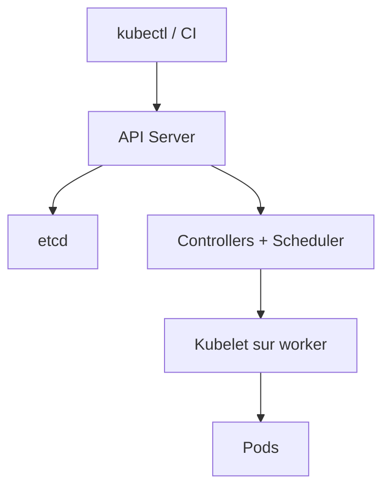

# Architecture Kubernetes et boucle de réconciliation

## Objectifs pédagogiques

- Identifier le rôle des composants du control plane et des workers.
- Expliquer la différence entre état désiré et état observé.
- Suivre la création d’un Deployment jusqu’au démarrage d’un conteneur.
- Utiliser labels, sélecteurs et namespaces sans les confondre.

## Mise en situation

Une équipe exploite dix conteneurs sur trois VM. Les redémarrages et placements sont manuels : après la perte d’une VM, personne ne sait quelles instances recréer. Kubernetes répond à ce problème par une API déclarative et des contrôleurs qui rapprochent continuellement le réel de l’intention.

## Du manifeste au conteneur

Kubernetes n’exécute pas directement une suite d’ordres. On lui confie un état désiré : « trois réplicas de cette application ». L’API Server valide et enregistre cette intention dans etcd. Les contrôleurs constatent l’écart, le scheduler choisit des nœuds, puis le kubelet demande au runtime de lancer les conteneurs.

| Élément | Responsabilité | Question de diagnostic |
|---|---|---|
| API Server | Point d’entrée et validation | La requête est-elle autorisée ? |
| etcd | État durable du cluster | Le control plane peut-il lire/écrire ? |
| Scheduler | Affectation des Pods | Pourquoi le Pod reste-t-il Pending ? |
| Controller | Réconciliation | Quel écart empêche l’état désiré ? |
| Kubelet | Exécution sur un nœud | Le runtime démarre-t-il le conteneur ? |

🧠 **Concept clé — la réconciliation.** Un contrôleur ne « lance pas une fois » une action : il observe périodiquement et corrige les écarts. Supprimer un Pod géré par un Deployment conduit donc à sa recréation.

Les labels décrivent les objets ; les sélecteurs établissent des relations. Un Service trouve par exemple les Pods dont les labels correspondent à son sélecteur. Un namespace isole surtout les noms, politiques et quotas : ce n’est pas une frontière de sécurité suffisante à lui seul.

## Cas réel et raisonnement

Trois Pods sont demandés, mais deux seulement tournent. La bonne question n’est pas « Kubernetes est-il cassé ? », mais « à quelle étape la réconciliation bloque-t-elle ? ». Un Pod Pending oriente vers scheduling, ressources ou stockage. Un Pod Running non Ready oriente vers l’application ou sa probe. Cette lecture par état réduit fortement le diagnostic au hasard.

⚠️ **Erreur fréquente.** Traiter un Pod comme une VM persistante conduit à modifier manuellement un conteneur. La correction doit vivre dans l’image, le manifeste ou la configuration déclarative.

## Bonnes pratiques

- Versionner les manifests et faire relire les changements.
- Utiliser des labels stables et explicites.
- Séparer les namespaces selon responsabilités et politiques, pas seulement par commodité.
- Observer les événements et conditions avant toute suppression.
- Sauvegarder etcd selon la méthode de la distribution managée ou auto-hébergée.

## Résumé

Kubernetes expose une API déclarative. L’API Server reçoit l’intention, etcd conserve l’état, les contrôleurs réduisent les écarts, le scheduler place les Pods et le kubelet les exécute. Les objets sont reliés par labels et sélecteurs. La réconciliation explique pourquoi une ressource gérée revient après suppression. Le module suivant transforme cette carte mentale en gestes concrets avec `kubectl` et un cluster local.

<!-- snippet
id: kubernetes_reconciliation_loop
type: concept
tech: kubernetes
level: beginner
importance: high
format: knowledge
tags: kubernetes,reconciliation,controller
title: La boucle de réconciliation
content: Un contrôleur compare l'état désiré stocké via l'API à l'état observé, puis agit jusqu'à réduire l'écart ; l'opération se répète continuellement.
description: Ce mécanisme explique l'auto-réparation et la recréation des Pods gérés.
-->
<!-- snippet
id: kubernetes_api_server_role
type: concept
tech: kubernetes
level: beginner
importance: high
format: knowledge
tags: kubernetes,api,control-plane
title: Rôle de l'API Server
content: L'API Server authentifie, autorise, valide puis persiste les objets ; kubectl et les contrôleurs passent par cette interface.
description: Il constitue le point d'entrée du control plane, pas le scheduler.
-->
<!-- snippet
id: kubernetes_scheduler_pending
type: concept
tech: kubernetes
level: beginner
importance: medium
format: knowledge
tags: kubernetes,scheduler,pod
title: Scheduler et Pod Pending
content: Le scheduler choisit un nœud compatible selon ressources et contraintes ; sans placement possible, le Pod reste Pending et les événements donnent la raison.
description: Pending indique souvent un problème de placement, pas de démarrage applicatif.
-->
<!-- snippet
id: kubernetes_labels_selectors
type: concept
tech: kubernetes
level: beginner
importance: high
format: knowledge
tags: kubernetes,labels,service
title: Labels et sélecteurs
content: Les labels décrivent les objets ; un sélecteur choisit dynamiquement ceux qui correspondent, par exemple les Pods ciblés par un Service.
description: Une incohérence de labels peut laisser un Service sans endpoint.
-->
<!-- snippet
id: kubernetes_pod_not_vm
type: warning
tech: kubernetes
level: beginner
importance: high
format: knowledge
tags: kubernetes,pod,immutable
title: Un Pod n'est pas une VM
content: Modifier manuellement un conteneur crée un état non reproductible qui disparaît au remplacement du Pod ; corriger l'image ou le manifeste versionné.
description: Les workloads Kubernetes doivent rester remplaçables et déclaratifs.
-->
