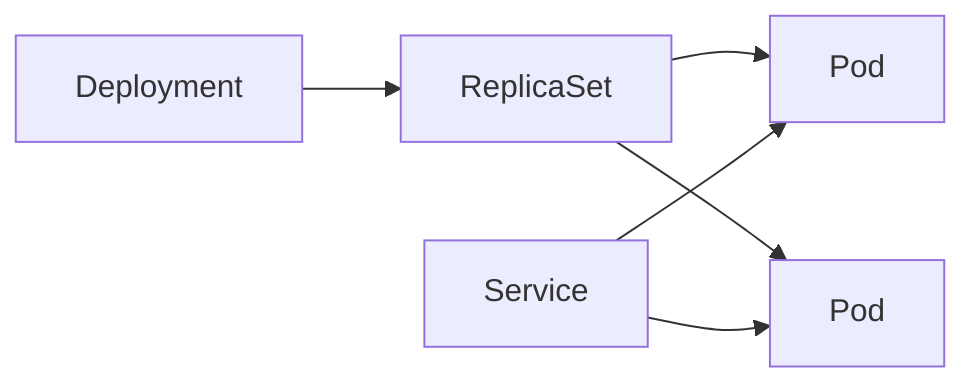

# Pods, Deployments et Services

## Objectifs pédagogiques

- Déployer une application répliquée plutôt qu’un Pod isolé.
- Relier un Service aux bons Pods.
- Distinguer vie du processus, disponibilité et démarrage.
- Encadrer CPU et mémoire avec requests et limits.

## Mise en situation

Une API lancée dans un Pod unique disparaît après maintenance du nœud. Son adresse IP change à la recréation et le proxy continue de viser l’ancienne. Deployment et Service séparent alors deux responsabilités : maintenir les instances et fournir un point d’accès stable.

## La chaîne applicative



Le Deployment gère le rollout et crée un ReplicaSet. Le ReplicaSet maintient le nombre de Pods. Le Service sélectionne les Pods par labels et publie une IP/DNS stable. Il n’attend pas un nom de Pod précis.

```yaml
apiVersion: apps/v1
kind: Deployment
metadata:
  name: web
spec:
  replicas: 2
  selector:
    matchLabels: { app: web }
  template:
    metadata:
      labels: { app: web }
    spec:
      containers:
        - name: web
          image: nginx:1.27
          ports: [{ containerPort: 80 }]
          readinessProbe:
            httpGet: { path: /, port: 80 }
          resources:
            requests: { cpu: 50m, memory: 64Mi }
            limits: { memory: 128Mi }
---
apiVersion: v1
kind: Service
metadata:
  name: web
spec:
  selector: { app: web }
  ports: [{ port: 80, targetPort: 80 }]
```

Appliquez, puis vérifiez la relation :

```bash
kubectl apply -f web.yaml
kubectl rollout status deployment/web
kubectl get pods -l app=web
kubectl get endpointslices -l kubernetes.io/service-name=web
```

## Trois probes, trois questions

- `startupProbe` : l’application a-t-elle fini son démarrage initial ?
- `readinessProbe` : peut-elle recevoir du trafic maintenant ?
- `livenessProbe` : faut-il redémarrer le conteneur bloqué ?

⚠️ Une liveness probe dépendant d’une base distante peut redémarrer toute l’API pendant une panne de base et amplifier l’incident. La readiness doit retirer le Pod du trafic ; la liveness doit détecter un blocage local récupérable par redémarrage.

Les requests servent au placement et à la réservation logique. Une limite mémoire dépassée mène généralement à `OOMKilled`. Une limite CPU bride le processus ; l’absence de limite CPU peut parfois être volontaire, mais doit rester un choix documenté.

## Cas réel

Le Service existe mais renvoie zéro endpoint. Les Pods sont Running, pourtant non Ready à cause d’un mauvais chemin `/health`. Le diagnostic passe par EndpointSlice puis `describe pod`, pas par le redémarrage du Service. Corriger la probe rétablit automatiquement les endpoints.

## Bonnes pratiques

- Faire correspondre explicitement sélecteurs et labels.
- Définir des requests mesurées, puis ajuster avec les métriques.
- Choisir une stratégie de rollout adaptée à la capacité disponible.
- Tester le comportement lors d’un arrêt gracieux.
- Éviter le tag `latest` pour conserver un déploiement reproductible.

## Résumé

Le Pod exécute, le Deployment maintient et fait évoluer, le Service stabilise l’accès. Les labels relient ces objets. La readiness contrôle l’entrée dans le trafic, la liveness décide d’un redémarrage et la startup protège les démarrages lents. Requests et limits influencent placement et comportement sous contrainte. Le prochain module sort configuration et données persistantes de l’image.

<!-- snippet
id: kubernetes_service_endpoints
type: concept
tech: kubernetes
level: beginner
importance: high
format: knowledge
tags: kubernetes,service,endpoints
title: Service et EndpointSlice
content: Un Service sélectionne des Pods par labels ; seuls les Pods prêts deviennent normalement des endpoints vers lesquels le trafic peut être dirigé.
description: Un Service sans endpoint indique souvent un sélecteur ou une readiness incorrecte.
-->
<!-- snippet
id: kubernetes_rollout_status
type: command
tech: kubernetes
level: beginner
importance: high
format: knowledge
tags: kubernetes,deployment,rollout
title: Attendre un rollout
command: kubectl rollout status deployment/<NOM> -n <NAMESPACE> --timeout=120s
example: kubectl rollout status deployment/web -n demo --timeout=120s
description: Échoue si le Deployment ne devient pas disponible dans le délai.
-->
<!-- snippet
id: kubernetes_readiness_vs_liveness
type: concept
tech: kubernetes
level: beginner
importance: high
format: knowledge
tags: kubernetes,probe,availability
title: Readiness ou liveness
content: Readiness retire temporairement un Pod du trafic ; liveness redémarre son conteneur. Elles ne répondent donc pas au même symptôme.
description: Utiliser liveness pour une dépendance distante peut amplifier une panne.
-->
<!-- snippet
id: kubernetes_memory_limit_oom
type: warning
tech: kubernetes
level: beginner
importance: high
format: knowledge
tags: kubernetes,memory,oomkilled
title: Limite mémoire et OOMKilled
content: Dépasser la limite mémoire provoque l'arrêt du conteneur avec OOMKilled ; mesurer l'usage puis ajuster request, limit ou application.
description: Une hausse aveugle de la limite peut seulement déplacer la saturation vers le nœud.
-->
<!-- snippet
id: kubernetes_list_service_endpoints
type: command
tech: kubernetes
level: beginner
importance: medium
format: knowledge
tags: kubernetes,service,diagnostic
title: Vérifier les endpoints d'un Service
command: kubectl get endpointslices -l kubernetes.io/service-name=<SERVICE> -n <NAMESPACE>
example: kubectl get endpointslices -l kubernetes.io/service-name=web -n demo
description: Vérifie si le Service dispose réellement de backends prêts.
-->
