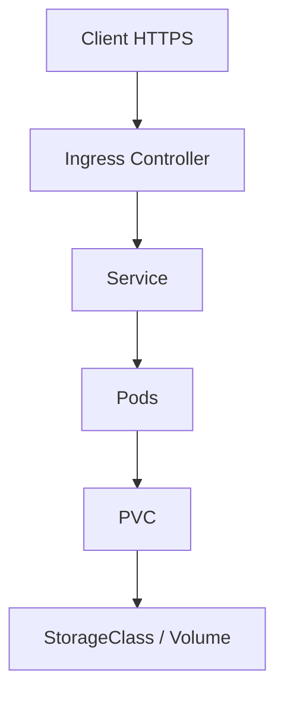

# Configuration, secrets, stockage et exposition

## Objectifs pédagogiques

- Choisir entre ConfigMap, Secret et stockage persistant.
- Expliquer le chemin PVC → StorageClass → volume.
- Exposer un Service via un contrôleur Ingress.
- Éviter de confondre encodage et chiffrement des secrets.

## Mise en situation

Une application embarque URL de base, mot de passe et fichiers utilisateurs dans son image. Chaque environnement impose alors une reconstruction, et le remplacement d’un Pod efface les données. L’architecture doit séparer binaire, configuration, secret et état persistant.

## Quatre besoins, quatre mécanismes

| Besoin | Objet | Exemple |
|---|---|---|
| Configuration non sensible | ConfigMap | URL, niveau de logs |
| Valeur sensible | Secret | mot de passe, jeton |
| Données durables | PVC | fichiers, données applicatives |
| Entrée HTTP(S) | Ingress + contrôleur | `app.example.com` |

Les Secrets Kubernetes sont encodés en base64 dans les manifests, pas chiffrés par cette seule opération. La protection réelle exige contrôle RBAC, chiffrement au repos côté cluster et idéalement une source externe ou un mécanisme de chiffrement Git adapté.



Un PVC exprime une demande de stockage. La StorageClass décrit le provisionnement. Le volume obtenu est monté dans le Pod. Le mode d’accès et la topologie du stockage doivent être compatibles avec le workload ; une base de données n’est pas rendue hautement disponible par le simple ajout d’un PVC.

## Vérifications opérationnelles

```bash
kubectl get configmap,secret,pvc,ingress -n demo
kubectl describe pvc data -n demo
kubectl get storageclass
kubectl describe ingress web -n demo
```

Pour une configuration montée, prévoyez comment l’application recharge la valeur. Une mise à jour du ConfigMap ne garantit pas que le processus relira immédiatement son fichier, et une variable d’environnement injectée ne change pas dans un conteneur déjà démarré.

## Cas réel et arbitrage

Une API stateless et PostgreSQL sont déployés ensemble. L’API utilise ConfigMap/Secret et peut être répliquée. PostgreSQL nécessite un stockage persistant, une stratégie de sauvegarde et une restauration testée. En production, l’équipe choisit finalement une base managée : Kubernetes reste responsable de l’API, le fournisseur de la durabilité de la base. Le bon choix est opérationnel, pas idéologique.

## Bonnes pratiques

- Ne jamais committer de secret en clair, même encodé en base64.
- Donner au ServiceAccount uniquement l’accès nécessaire.
- Versionner ou checksummer la configuration lorsqu’un rollout doit suivre sa modification.
- Tester restauration et modes d’accès du stockage.
- Configurer TLS et observer le contrôleur Ingress, pas seulement l’objet Ingress.
- Séparer les valeurs propres à chaque environnement.

## Résumé

ConfigMap porte la configuration non sensible, Secret les valeurs sensibles, PVC la demande de stockage durable et Ingress les règles d’entrée HTTP(S). Un Secret base64 n’est pas chiffré. Le stockage persistant ne remplace ni sauvegarde ni architecture haute disponibilité. L’objet Ingress nécessite un contrôleur effectif. Cette séparation prépare naturellement le système de valeurs de Helm.

<!-- snippet
id: kubernetes_secret_base64
type: warning
tech: kubernetes
level: intermediate
importance: high
format: knowledge
tags: kubernetes,secret,security
title: Base64 ne chiffre pas un Secret
content: Un Secret encodé en base64 reste décodable ; sans RBAC strict et chiffrement au repos, sa confidentialité n'est pas assurée.
description: Ne jamais traiter un manifeste Secret base64 comme un coffre-fort.
-->
<!-- snippet
id: kubernetes_pvc_role
type: concept
tech: kubernetes
level: intermediate
importance: high
format: knowledge
tags: kubernetes,pvc,storage
title: Le PVC exprime une demande
content: Le PVC décrit capacité et mode d'accès ; une StorageClass peut provisionner le volume compatible qui sera ensuite monté dans le Pod.
description: PVC et volume ne sont pas synonymes : l'un demande, l'autre fournit.
-->
<!-- snippet
id: kubernetes_describe_pvc
type: command
tech: kubernetes
level: intermediate
importance: medium
format: knowledge
tags: kubernetes,pvc,diagnostic
title: Diagnostiquer un PVC
command: kubectl describe pvc <PVC> -n <NAMESPACE>
example: kubectl describe pvc data -n demo
description: Affiche statut, StorageClass, volume associé et événements de provisioning.
-->
<!-- snippet
id: kubernetes_ingress_controller_required
type: concept
tech: kubernetes
level: intermediate
importance: high
format: knowledge
tags: kubernetes,ingress,http
title: Ingress nécessite un contrôleur
content: L'objet Ingress déclare des règles ; seul un contrôleur installé les traduit en proxy ou load balancer effectif.
description: Créer l'objet sans contrôleur ne publie généralement aucun trafic.
-->
<!-- snippet
id: kubernetes_env_config_reload
type: warning
tech: kubernetes
level: intermediate
importance: medium
format: knowledge
tags: kubernetes,configmap,rollout
title: Une variable injectée ne se recharge pas
content: Modifier un ConfigMap ne change pas les variables d'environnement d'un conteneur existant ; déclencher un rollout ou concevoir un rechargement explicite.
description: Le manifest à jour ne signifie pas que le processus utilise déjà la nouvelle valeur.
-->
