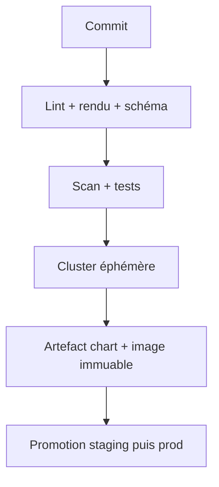

# Livraison continue et exploitation des releases Helm

## Objectifs pédagogiques

- Construire une chaîne de validation progressive d’un chart.
- Promouvoir un artefact immuable entre environnements.
- Déployer avec attente, atomicité et timeout explicites.
- Positionner push CI/CD et GitOps selon le modèle d’exploitation.

## Mise en situation

Chaque environnement reconstruit l’image et un opérateur lance Helm depuis son poste. Deux versions différentes portent le même tag ; personne ne sait quelles valeurs ont été utilisées. La livraison doit rendre artefact, configuration, approbation et résultat traçables.

## Une chaîne qui réduit le risque par étapes



La CI ne doit pas reconstruire un artefact différent pour prod. Elle produit une image identifiée par digest et un chart versionné, puis les mêmes artefacts sont promus avec une configuration contrôlée.

Exemple de séquence :

```bash
helm lint ./chart --strict
helm template web ./chart -f env/prod.yaml > rendered.yaml
kubectl apply --dry-run=server -f rendered.yaml
helm package ./chart --destination dist
helm upgrade --install web ./chart -n web -f env/prod.yaml --atomic --wait --timeout 10m
```

`--atomic` marque l’upgrade comme échoué et tente un retour en arrière si l’opération ne réussit pas ; il implique l’attente. Le timeout doit refléter le démarrage réel, pas masquer une probe mal conçue. Le pipeline doit conserver logs, manifest rendu, version du chart, digest d’image et revision Helm.

## Push ou GitOps ?

Dans un modèle push, la CI possède des droits de déploiement et appelle Helm. C’est simple, mais les credentials et l’audit doivent être solides. En GitOps, un contrôleur dans le cluster réconcilie un dépôt déclarant l’état attendu. Cela améliore détection de dérive et séparation des accès, au prix d’un composant et d’un modèle mental supplémentaires.

Choisissez GitOps lorsque plusieurs équipes/clusters et le contrôle de dérive le justifient. Pour une petite plateforme, une CI bien bornée peut rester plus simple et sûre qu’un GitOps mal maîtrisé.

## Changements de données et rollback

Préférez des migrations compatibles avec l’ancienne et la nouvelle version : expansion du schéma, déploiement applicatif, puis nettoyage ultérieur. Un rollback de manifests ne peut pas annuler magiquement une suppression de colonne. Les hooks de migration doivent être observables, idempotents ou accompagnés d’une procédure explicite.

## Cas réel

Un rollout échoue car la nouvelle image ne passe pas la readiness. `--atomic` restaure les ressources précédentes, mais l’analyse est possible grâce aux logs archivés et au manifest rendu. Le pipeline bloque ensuite la promotion, ouvre un incident lié au commit et conserve le cluster stable.

## Bonnes pratiques

- Promouvoir images par digest et charts versionnés.
- Utiliser des identités CI courtes et limitées à leur namespace.
- Séparer validation, approbation et déploiement.
- Archiver manifest rendu, valeurs non sensibles et résultat du rollout.
- Tester rollback et migrations sur staging avec données représentatives.
- Définir l’ownership : qui corrige, qui peut rollback, qui approuve prod.
- Mesurer fréquence, délai, taux d’échec et temps de restauration.

## Résumé

Une livraison fiable valide le chart par couches, produit des artefacts immuables et promeut exactement ces artefacts. Helm peut attendre et tenter un rollback atomique, mais ne restaure pas les données. Push CI et GitOps sont deux modèles valides avec des compromis d’accès et de complexité. L’exploitation exige enfin preuves, responsabilités et métriques de livraison explicites.

<!-- snippet
id: helm_atomic_upgrade
type: command
tech: helm
level: advanced
importance: high
format: knowledge
tags: helm,atomic,deployment
title: Upgrade atomique avec attente
command: helm upgrade --install <RELEASE> <CHART> -n <NAMESPACE> -f <VALUES> --atomic --wait --timeout <DUREE>
example: helm upgrade --install web ./chart -n web -f env/prod.yaml --atomic --wait --timeout 10m
description: Tente un retour à l'état précédent si l'upgrade échoue dans le délai.
-->
<!-- snippet
id: cicd_promote_digest
type: concept
tech: helm
level: advanced
importance: high
format: knowledge
tags: cicd,image,digest
title: Promouvoir le même artefact
content: Construire une fois puis promouvoir l'image par digest garantit que staging et prod exécutent les mêmes octets, contrairement à un tag mutable.
description: La configuration varie entre environnements, pas le binaire validé.
-->
<!-- snippet
id: gitops_reconciliation
type: concept
tech: kubernetes
level: advanced
importance: medium
format: knowledge
tags: gitops,kubernetes,drift
title: Réconciliation GitOps
content: Un contrôleur dans le cluster compare en continu l'état déclaré dans Git à l'état vivant et applique les écarts autorisés.
description: Ce modèle détecte la dérive sans donner directement les credentials cluster à la CI.
-->
<!-- snippet
id: helm_atomic_data_limit
type: warning
tech: helm
level: advanced
importance: high
format: knowledge
tags: helm,atomic,database
title: Atomic ne rembobine pas la base
content: --atomic peut restaurer les ressources Helm après échec, mais pas annuler automatiquement une migration de données ; concevoir des migrations compatibles et réversibles.
description: Le succès du rollback dépend du contrat entre version applicative et schéma.
-->
<!-- snippet
id: cicd_archive_deployment_evidence
type: tip
tech: helm
level: advanced
importance: medium
format: knowledge
tags: cicd,helm,audit
title: Archiver les preuves du déploiement
content: Conserver à chaque pipeline le manifest rendu, chart, digest d'image, valeurs non sensibles, revision Helm et résultat du rollout.
description: Ces artefacts rendent un incident reproductible et une promotion auditable.
-->
