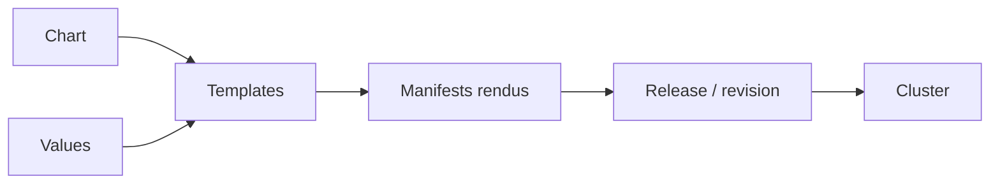

# Helm : charts, templates et valeurs

## Objectifs pédagogiques

- Expliquer chart, release et revision sans les confondre.
- Créer et rendre un chart local.
- Surcharger les valeurs de façon prévisible.
- Installer, mettre à niveau et restaurer une release.

## Mise en situation

L’équipe maintient douze manifests presque identiques pour dev, staging et prod. Chaque correctif doit être recopié et les divergences se multiplient. Helm transforme des templates et des valeurs en manifests Kubernetes, puis suit leur déploiement comme une release versionnée.

## Le modèle mental



Un chart est le paquet source. Une release est une installation nommée de ce chart dans un namespace. Chaque upgrade produit une revision. Helm n’exécute pas les templates dans le cluster : il les rend en YAML puis envoie les ressources à l’API Kubernetes.

## Premier chart et boucle de validation

```bash
helm create web
helm lint web
helm template demo web --namespace demo --values web/values.yaml
helm install demo web --namespace demo --create-namespace --wait
helm status demo -n demo
```

La structure minimale comprend `Chart.yaml`, `values.yaml`, `templates/` et souvent `_helpers.tpl`. Dans un template, `.Values.image.repository` lit une valeur ; `include` appelle un helper ; `required` échoue tôt si une valeur indispensable manque.

```yaml
image:
  repository: nginx
  tag: "1.27"
replicaCount: 2
```

```yaml
image: "{{ .Values.image.repository }}:{{ .Values.image.tag }}"
replicas: {{ .Values.replicaCount }}
```

Les valeurs sont fusionnées par ordre de priorité. Un fichier `-f` surcharge les valeurs du chart ; une option `--set` appliquée ensuite prend le dessus. Pour les configurations durables et relues en revue de code, préférez un fichier versionné à une longue chaîne de `--set`.

## Faire évoluer sans perdre le contrôle

```bash
helm upgrade --install demo web -n demo -f values-staging.yaml --wait --timeout 5m
helm history demo -n demo
helm rollback demo 1 -n demo --wait
helm uninstall demo -n demo
```

⚠️ Un `helm lint` réussi ne prouve pas que le cluster acceptera toutes les ressources ni que l’application démarrera. Ajoutez rendu, validation Kubernetes et test sur cluster éphémère.

## Cas réel

Un upgrade produit une image `repository:<nil>` à cause d’une clé déplacée. L’équipe ajoute `required`, rend systématiquement les manifests en CI et les inspecte avant déploiement. Le problème est bloqué avant le cluster au lieu de devenir un `ImagePullBackOff`.

## Bonnes pratiques

- Épingler les versions d’image et de dépendances.
- Garder la logique de template simple ; déplacer les conventions dans des helpers.
- Documenter les valeurs publiques du chart.
- Utiliser `upgrade --install` pour une opération idempotente.
- Vérifier `helm get values` et `helm get manifest` lors d’un incident.
- Tester réellement le rollback, y compris les changements incompatibles de données.

## Résumé

Helm combine chart, templates et valeurs pour produire des manifests. Une release représente une installation et chaque upgrade une revision. `lint` vérifie le chart, `template` rend le YAML, `upgrade --install` converge vers une release et `rollback` revient à une revision. Les valeurs doivent rester lisibles et prévisibles. Le module suivant structure cette mécanique en chart durablement maintenable.

<!-- snippet
id: helm_chart_release_revision
type: concept
tech: helm
level: intermediate
importance: high
format: knowledge
tags: helm,chart,release
title: Chart, release et revision
content: Le chart est le paquet source ; la release est son installation nommée dans un namespace ; chaque upgrade crée une revision de cette release.
description: Séparer ces notions évite de confondre version du paquet et historique déployé.
-->
<!-- snippet
id: helm_render_chart
type: command
tech: helm
level: intermediate
importance: high
format: knowledge
tags: helm,template,validation
title: Rendre un chart localement
command: helm template <RELEASE> <CHART> -n <NAMESPACE> -f <VALUES>
example: helm template demo ./web -n demo -f values-staging.yaml
description: Affiche les manifests finaux sans modifier le cluster.
-->
<!-- snippet
id: helm_upgrade_install
type: command
tech: helm
level: intermediate
importance: high
format: knowledge
tags: helm,upgrade,release
title: Installer ou mettre à niveau
command: helm upgrade --install <RELEASE> <CHART> -n <NAMESPACE> -f <VALUES> --wait
example: helm upgrade --install demo ./web -n demo -f values-staging.yaml --wait
description: Crée la release si elle manque, sinon applique une nouvelle revision.
-->
<!-- snippet
id: helm_lint_not_cluster_test
type: warning
tech: helm
level: intermediate
importance: high
format: knowledge
tags: helm,lint,kubernetes
title: Lint ne valide pas le déploiement
content: Un chart peut passer helm lint puis rendre une ressource refusée ou une application défaillante ; ajouter rendu, validation API et test sur cluster.
description: Lint contrôle le chart, pas tout le comportement du cluster et du workload.
-->
<!-- snippet
id: helm_get_manifest
type: command
tech: helm
level: intermediate
importance: medium
format: knowledge
tags: helm,manifest,diagnostic
title: Lire le manifest d'une release
command: helm get manifest <RELEASE> -n <NAMESPACE>
example: helm get manifest demo -n demo
description: Affiche ce que Helm a enregistré pour la release déployée.
-->
