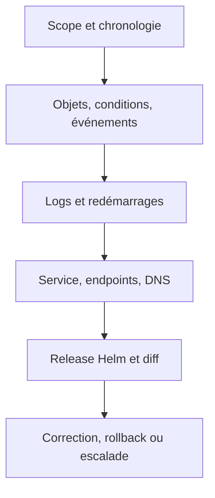

# Diagnostic Kubernetes et Helm

## Objectifs pédagogiques

- Délimiter l’impact avant de modifier le système.
- Relier états Kubernetes à des familles de causes.
- Comparer chart, manifest de release et ressource vivante.
- Constituer une preuve exploitable avant rollback ou escalade.

## Mise en situation

Après un upgrade Helm, l’API renvoie des erreurs 503. Redémarrer tous les Pods peut masquer la cause, augmenter l’impact et détruire les indices. Une méthode L2 commence par le périmètre et remonte le chemin de requête.

## Une démarche reproductible



Commencez par : un utilisateur ou tous ? un Pod ou tous ? un namespace ou le cluster ? depuis quel changement ? Ensuite seulement, cherchez la couche fautive.

| Symptôme | Causes probables | Première preuve |
|---|---|---|
| Pending | ressources, taint, PVC | événements du Pod |
| ImagePullBackOff | image, tag, registre, credentials | `describe pod` |
| CrashLoopBackOff | processus quitte, config, probe | logs actuels/précédents |
| OOMKilled | limite trop basse ou fuite | lastState + métriques |
| Service sans endpoint | labels ou readiness | EndpointSlice |
| 503 après upgrade | Pods non prêts, port, Ingress | rollout + endpoints |

## Commandes par couche

```bash
kubectl get pods -n demo -o wide
kubectl describe pod web-abc123 -n demo
kubectl logs web-abc123 -n demo --all-containers --previous
kubectl get endpointslices -n demo
kubectl run dns-test --rm -it --image=busybox:1.36 -- nslookup web.demo.svc.cluster.local
helm status demo -n demo
helm history demo -n demo
helm get values demo -n demo --all
helm get manifest demo -n demo
```

Pour Helm, comparez trois réalités : les sources du chart, le manifest enregistré dans la release et l’objet vivant du cluster. Un opérateur ou une modification manuelle peut créer une dérive. `helm get manifest` n’est donc pas toujours identique à `kubectl get ... -o yaml`.

## Choisir entre correction et rollback

Rollback si la revision précédente est connue comme saine, si les données restent compatibles et si restaurer vite réduit l’impact. Corriger en avant si un rollback casserait une migration de schéma ou si l’incident vient d’une dépendance externe inchangée. Dans les deux cas, consignez heure, revision, image, valeurs et preuves.

⚠️ `helm rollback` ne rembobine pas automatiquement les données persistantes ni tous les effets produits par des hooks. La réversibilité doit être conçue et testée.

## Cas réel

Le 503 suit une modification du port de Service de 8080 à 80, tandis que `targetPort` pointe encore vers un nom absent du conteneur. Les Pods sont Ready mais l’EndpointSlice expose un port incohérent. L’équipe corrige le template, ajoute un test de connectivité sur kind et documente la timeline dans le post-mortem.

## Bonnes pratiques

- Capturer les preuves avant redémarrage ou suppression.
- Utiliser timestamps et correlation IDs dans les logs.
- Limiter les commandes de debug à un namespace et une durée.
- Vérifier rollout, endpoints et DNS avant d’accuser le réseau externe.
- Écrire une hypothèse testable par commande, pas une liste aléatoire.
- Escalader avec impact, chronologie, changements, preuves et actions déjà tentées.

## Résumé

Le diagnostic commence par l’impact et la chronologie, puis suit les couches. Les conditions et événements expliquent souvent Pending ou pull d’image ; les logs précédents éclairent les crashes ; EndpointSlice relie Service et Pods. Helm ajoute la comparaison entre source, release et état vivant. Le rollback reste un choix soumis à la compatibilité des données et aux effets annexes.

<!-- snippet
id: kubernetes_diagnostic_scope_first
type: concept
tech: kubernetes
level: intermediate
importance: high
format: knowledge
tags: kubernetes,diagnostic,incident
title: Délimiter avant de modifier
content: Mesurer utilisateurs, Pods, namespaces et heure de début réduit l'espace de recherche et évite qu'une action globale aggrave un incident local.
description: Le scope transforme un symptôme vague en hypothèses testables.
-->
<!-- snippet
id: kubernetes_crashloop_previous_logs
type: command
tech: kubernetes
level: intermediate
importance: high
format: knowledge
tags: kubernetes,crashloop,logs
title: Logs d'un conteneur crashé
command: kubectl logs <POD> -n <NAMESPACE> --all-containers --previous
example: kubectl logs web-abc123 -n demo --all-containers --previous
description: Récupère la sortie de l'instance terminée avant son redémarrage.
-->
<!-- snippet
id: helm_release_values_all
type: command
tech: helm
level: intermediate
importance: medium
format: knowledge
tags: helm,values,diagnostic
title: Lire toutes les valeurs effectives
command: helm get values <RELEASE> -n <NAMESPACE> --all
example: helm get values demo -n demo --all
description: Affiche valeurs fournies et valeurs calculées pour la release.
-->
<!-- snippet
id: helm_rollback_data_warning
type: warning
tech: helm
level: intermediate
importance: high
format: knowledge
tags: helm,rollback,data
title: Rollback ne restaure pas les données
content: Revenir à une revision Helm ne rembobine pas une migration de base ni tous les effets de hooks ; vérifier la compatibilité avant rollback.
description: La réversibilité applicative dépasse les manifests Kubernetes.
-->
<!-- snippet
id: kubernetes_service_no_endpoint
type: error
tech: kubernetes
level: intermediate
importance: high
format: knowledge
tags: kubernetes,service,readiness
title: Service sans endpoint
content: Symptôme : Service présent mais aucun backend. Causes : sélecteur incohérent ou Pods non Ready. Correction : comparer labels, sélecteur et conditions de readiness.
description: Vérifier EndpointSlice distingue exposition et disponibilité des backends.
-->
