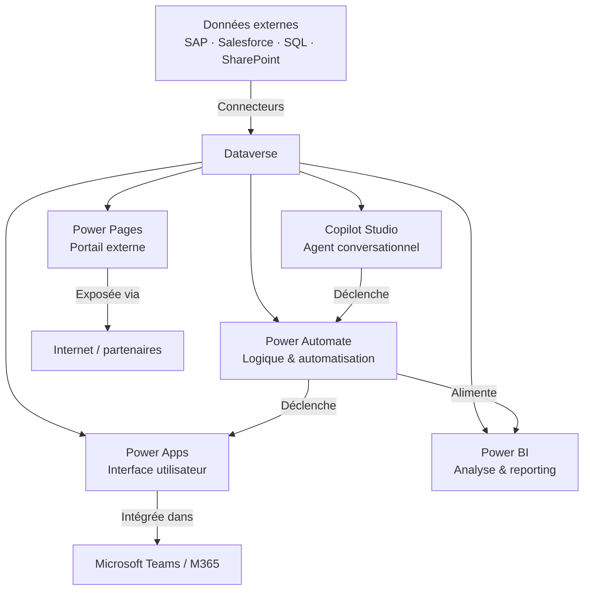

# Vue d'ensemble de l'écosystème Power Platform

## Objectifs pédagogiques

À l'issue de ce module, vous serez capable de :

- Nommer et situer les 5 composants principaux de Power Platform et expliquer le rôle distinct de chacun
- Expliquer pourquoi Dataverse occupe une position centrale dans l'écosystème, et ce que ça change concrètement
- Distinguer ce que fait un connecteur de ce que fait une application, un flux ou un rapport
- Identifier, face à un besoin métier donné, quel(s) outil(s) Power Platform mobiliser en premier
- Comprendre comment Power Platform s'articule avec Microsoft 365 sans en être dépendant

---

## Mise en situation

Imaginez une PME de 200 personnes. Le service RH gère les demandes de congés dans Excel. Le service financier suit les notes de frais par email. Le support client saisit les incidents dans un Google Sheets partagé. Chaque équipe a ses propres données, dans ses propres outils, et personne ne peut croiser les informations sans export manuel.

Un développeur propose une solution custom Node.js + PostgreSQL. Le projet prend 8 mois, coûte 150K€, et la moitié des fonctionnalités ne seront jamais maintenues faute de ressources.

C'est exactement le contexte dans lequel Power Platform a été conçu : **des équipes métier avec des besoins réels, des données dispersées, et peu ou pas de ressources dev disponibles**. Pas pour remplacer les applications de gestion core (SAP, Dynamics…), mais pour combler les espaces entre elles — ce qu'on appelle souvent les *gap solutions*.

La question de ce module n'est pas "qu'est-ce que Power Platform ?" au sens marketing. C'est : **comment ses pièces s'assemblent, pourquoi elles sont séparées, et ce que cette architecture implique pour vous en tant que développeur ou architecte.**

---

## Ce que c'est — et pourquoi ça existe sous cette forme

Power Platform est une suite de 5 outils à faible friction de développement (*low-code / no-code*), construite par Microsoft et intégrée nativement dans l'écosystème Azure / M365. Mais ce qui est important à comprendre dès le départ, c'est que **ces 5 outils ne sont pas indépendants** : ils partagent un moteur de données commun, un système d'authentification, un modèle de sécurité, et une couche d'intégration unifiée.

L'idée de départ est simple : la majorité des applications métier en entreprise font la même chose — afficher des données, permettre de les modifier, les automatiser, en faire des rapports. La différence, c'est la façon dont les données circulent et qui les consulte. Power Platform part du principe que **si on standardise le socle (données + sécurité + intégrations), on peut laisser les équipes construire par-dessus sans repartir de zéro à chaque fois.**

Avant ça, deux problèmes coexistaient :

- Les solutions *shadow IT* (Excel, Google Sheets, scripts VBA) — rapides à créer, impossibles à gouverner
- Les projets dev classiques — robustes mais lents et coûteux pour des besoins souvent simples

Power Platform occupe **intentionnellement l'espace entre les deux** : plus structuré que le shadow IT, plus rapide qu'un développement custom. Ce n'est pas une compromission — c'est un positionnement architectural assumé.

---

## Les 5 outils — rôles et responsabilités

Chaque composant couvre un type de besoin distinct. Les connaître en surface ne suffit pas — il faut comprendre **ce qu'il fait de manière unique** et ce qu'il délègue aux autres.

### Power Apps — L'interface utilisateur

Power Apps permet de créer des applications métier sans écrire de code backend. Deux modes existent :

- **Canvas Apps** : vous dessinez l'interface pixel par pixel, vous contrôlez tout. Comparable à un fichier PowerPoint qui interagit avec des données.
- **Model-driven Apps** : vous définissez un modèle de données dans Dataverse, et l'interface se génère automatiquement à partir de ce modèle. Moins flexible visuellement, mais beaucoup plus scalable sur des applications complexes.

La distinction est importante : une Canvas App est souvent le bon choix pour une tâche précise (soumettre une demande, scanner un QR code sur le terrain), une Model-driven App convient mieux à une application de gestion complète (CRM léger, gestion des actifs).

> 🧠 **Concept clé** — Power Apps ne "stocke" pas les données. Il les affiche et les modifie là où elles se trouvent : Dataverse, SharePoint, SQL Server, Salesforce… L'app est une fenêtre, pas un entrepôt.

### Power Automate — La logique métier et l'automatisation

Power Automate construit des flux de travail automatisés : "quand X se produit, faire Y, puis Z". Il couvre trois familles de flux :

- **Cloud flows** : déclenchés par un événement (réception d'un email, modification d'un enregistrement, appui sur un bouton dans une app), ils orchestrent des actions sur des services connectés
- **Desktop flows** (RPA) : automatisent des applications de bureau ou des interfaces web sans API — utiles pour les systèmes legacy
- **Process flows** : guidage étape par étape d'un utilisateur dans un processus métier (souvent couplés à Model-driven Apps)

Ce que Power Automate fait bien : **l'orchestration inter-services**. Envoyer un email quand un formulaire est rempli, créer un enregistrement Dataverse quand une ligne SharePoint change, approuver une dépense via Teams. Ce qu'il ne fait pas : de la logique métier complexe, des transformations de données massives, du traitement temps-réel haute fréquence.

### Power BI — La donnée visible

Power BI transforme des données brutes en rapports interactifs et tableaux de bord. Il ne crée pas de données, il les visualise — à partir de Dataverse, SQL, Excel, fichiers CSV, APIs, et des dizaines d'autres sources.

La nuance à bien avoir en tête : **Power BI n'est pas un outil de reporting statique**. Son moteur analytique (DAX + modèle sémantique) permet des calculs sophistiqués — glissement temporel, ratios dynamiques, segmentation ad hoc. Un rapport Power BI bien construit remplace souvent des heures d'analyse manuelle dans Excel.

Dans l'écosystème Power Platform, Power BI joue un rôle d'observabilité : vous construisez une app Power Apps, vous automatisez avec Power Automate, et Power BI vous dit ce qui se passe réellement dans vos données au fil du temps.

### Power Pages — Les portails externes

Power Pages (anciennement Power Apps Portals) permet de créer des **sites web accessibles à des utilisateurs anonymes ou externes** — clients, partenaires, citoyens — qui interagissent avec des données Dataverse sans avoir de licence Microsoft 365.

C'est le composant le moins connu, mais souvent le plus stratégique pour les scénarios B2B ou B2C : portail de support client, extranet partenaire, formulaire de candidature public, espace self-service.

> ⚠️ **Erreur fréquente** — Beaucoup pensent que Power Pages est "une Canvas App publiée sur le web". C'est faux. Power Pages a son propre moteur de rendu (Liquid + Bootstrap), son propre modèle d'authentification externe (Azure AD B2C, Google, Facebook…), et sa propre gestion des droits d'accès aux données Dataverse. C'est un outil à part entière.

### Copilot Studio — L'intelligence conversationnelle

Copilot Studio (anciennement Power Virtual Agents) permet de créer des agents conversationnels — des chatbots — qui peuvent répondre à des questions, guider des processus, et déclencher des actions via Power Automate.

Ce qui a radicalement changé depuis l'intégration des LLM (GPT-4 via Azure OpenAI) : les agents ne suivent plus seulement des arbres de décision prédéfinis. Ils peuvent **raisonner sur une base de connaissances** (documents SharePoint, Dataverse, sites web) et générer des réponses contextuelles. Un agent Copilot Studio peut aujourd'hui être déployé dans Teams, sur un site web, dans Power Pages, ou même déclenché par Power Automate.

---

## Dataverse — Le socle qui change tout

Dataverse est la pièce centrale. Pas un outil visible en soi, mais la fondation sur laquelle les 5 autres s'appuient.

Concrètement, Dataverse est une **base de données relationnelle managée dans Azure**, avec en plus :

- Un modèle de sécurité à plusieurs niveaux (organisation, business unit, utilisateur, enregistrement)
- Des types de données riches (choix, devise, géolocalisation, fichiers…)
- Un moteur de règles métier et de validation côté serveur
- Des APIs REST/OData automatiquement générées pour chaque table
- Un système d'audit et de journalisation natif
- Un catalogue de tables standard (contacts, comptes, activités…) aligné sur le Common Data Model de Microsoft

Ce dernier point est structurellement important : quand vous créez une table "Contact" dans Dataverse, elle suit un schéma commun à tous les produits Microsoft (Dynamics 365, Teams, Outlook…). Ça signifie que **vos données peuvent être consommées par d'autres produits sans transformation**.

> 💡 **Astuce** — La distinction entre "List SharePoint" et "Table Dataverse" revient souvent. Pour une app simple avec peu d'utilisateurs et peu de relations entre données : SharePoint suffit. Dès que vous avez des relations entre entités, des règles métier, de la sécurité granulaire, ou plus de 100 000 lignes : Dataverse est le bon choix. Et une fois dans Dataverse, vous avez accès à tout l'écosystème — Model-driven Apps, portails, analytics avancés.

---

## Les connecteurs — La couche d'intégration

Les connecteurs sont souvent traités comme un détail technique. Ils méritent mieux.

Un connecteur est une **abstraction d'API** : il encapsule les appels HTTP vers un service externe (Salesforce, SAP, GitHub, Twitter, une API maison…) et les expose sous forme d'actions et déclencheurs réutilisables dans Power Apps et Power Automate.

Microsoft propose plus de 1 000 connecteurs. Ils se divisent en :

- **Connecteurs standard** : inclus dans la plupart des licences (SharePoint, Teams, Outlook, SQL Server…)
- **Connecteurs premium** : nécessitent une licence supérieure (Dataverse, HTTP, Salesforce, SAP…)
- **Connecteurs personnalisés** : vous écrivez la définition OpenAPI d'une API et Power Platform la traite comme n'importe quel autre connecteur

> 🧠 **Concept clé** — Un connecteur n'exécute rien lui-même. Il décrit les opérations disponibles sur un service. C'est Power Automate ou Power Apps qui appelle le connecteur, qui appelle l'API cible. La distinction compte pour comprendre où se trouvent les limites (throttling, authentification, données sensibles).

---

## Comment les pièces s'assemblent

Voici ce que donne une architecture typique, du terrain à la décision :

Ce schéma dit quelque chose d'important : **Dataverse est le hub, pas les outils**. Les 5 composants lisent et écrivent dans Dataverse. C'est ce qui permet de construire une solution où un utilisateur remplit un formulaire dans Power Apps, ce qui déclenche un flux Power Automate, qui notifie via Teams, pendant qu'un tableau de bord Power BI se met à jour automatiquement — sans aucune ligne de code d'intégration à écrire.

---

## Le rôle de Microsoft 365

Power Platform s'intègre avec M365 de manière organique — ce n'est pas une dépendance, c'est une extension naturelle.

Concrètement :

- **SharePoint** peut servir de source de données pour des Canvas Apps simples
- **Teams** peut héberger des Power Apps, des chatbots Copilot Studio, et afficher des rapports Power BI directement dans un canal
- **Outlook** est l'un des déclencheurs et actions les plus utilisés dans Power Automate
- **OneDrive / Excel** peuvent alimenter des flux ou des rapports Power BI pour des scénarios moins structurés
- **Azure AD** gère l'authentification pour toutes les apps Power Platform — pas besoin de reconstruire un système de login

Ce lien avec M365 explique pourquoi Power Platform est souvent déjà *disponible* dans les entreprises qui ont Microsoft 365 — certaines licences M365 incluent des versions limitées de Power Apps et Power Automate. Mais attention : "disponible" ne veut pas dire "prêt pour la production". Les contraintes de licences seront traitées dans le module suivant.

---

## Cas réel — Portail de gestion des fournisseurs

**Contexte :** Une entreprise industrielle de 800 personnes gère ses fournisseurs dans Excel + emails. Les équipes achats, qualité et finance travaillent en silo. L'onboarding d'un nouveau fournisseur prend 3 semaines.

**Solution construite en 6 semaines :**

1. **Dataverse** comme base centralisée : tables Fournisseur, Contrat, Évaluation, Document avec le modèle de sécurité adapté à chaque service
2. **Model-driven App** pour les équipes internes (acheteurs, qualité) — gestion complète des fournisseurs depuis un espace unique
3. **Power Pages** pour les fournisseurs eux-mêmes — portail externe sécurisé pour soumettre documents, voir statut de leurs commandes
4. **Power Automate** pour les workflows d'approbation — chaque étape de l'onboarding déclenche une notification Teams et met à jour le statut dans Dataverse
5. **Power BI** pour le suivi — taux de conformité fournisseur, délais d'approbation, volumes par catégorie

**Résultats mesurés :** Onboarding réduit de 21 jours à 5 jours. Zéro email d'échange de documents. Toutes les données dans Dataverse — consultables et auditables.

Ce qui aurait pris 6 à 9 mois en développement custom a été livré en 6 semaines — non pas parce que Power Platform est "magique", mais parce que **l'intégration entre les outils était déjà construite**.

---

## Bonnes pratiques et pièges à connaître dès le départ

**Ne pas tout mettre dans une seule Canvas App.** La tentation est réelle : Power Apps permet de tout faire dans une seule app. Mais une app avec 50 écrans, 200 collections et des flux embarqués devient ingérable. La règle : une app = un périmètre fonctionnel cohérent.

**Choisir le bon niveau de données dès le départ.** Migrer de SharePoint vers Dataverse après coup est possible mais douloureux. Si le projet a vocation à grandir, autant partir sur Dataverse.

**Les connecteurs premium ont un coût de licence.** Le connecteur Dataverse est premium. Si vous construisez une app sur Dataverse, chaque utilisateur final a besoin d'une licence adéquate. Ce point est fréquemment ignoré en phase de prototypage — et découvert trop tard.

> ⚠️ **Erreur fréquente** — Beaucoup utilisent Power Automate pour faire de la logique métier complexe (calculs, transformations, branchements imbriqués). Power Automate est fait pour l'orchestration, pas pour le traitement. Si votre flux dépasse 20 actions avec des conditions imbriquées, demandez-vous si une Power Apps custom page, une logique côté Dataverse (règles métier, plugins) ou une Azure Function ne serait pas plus appropriée.

**Dataverse n'est pas une base de données générique.** Elle est optimisée pour des données métier structurées, pas pour du stockage de fichiers massifs, des séries temporelles, ou des millions de lignes en écriture intensive. Connaître ses limites évite les mauvaises surprises en production.

> 💡 **Astuce** — Power Platform s'utilise rarement seul. Dans les projets matures, les composants les plus critiques (logique métier complexe, sécurité avancée, intégrations SAP/legacy) sont souvent délégués à Azure Functions, Azure Logic Apps, ou des API custom — et consommés depuis Power Platform via des connecteurs personnalisés. Ce n'est pas un échec du low-code : c'est une architecture hybride saine.

---

## Résumé

Power Platform est un écosystème de 5 outils complémentaires — Power Apps (interfaces), Power Automate (automatisation), Power BI (analyse), Power Pages (portails externes), Copilot Studio (agents conversationnels) — tous articulés autour de Dataverse comme source de vérité commune. Cette architecture n'est pas une contrainte : elle permet à des équipes de construire des solutions intégrées sans reconstruire la plomberie à chaque fois. Les connecteurs assurent le lien avec l'extérieur (M365, SAP, Salesforce, APIs custom), et l'intégration native avec Microsoft 365 fait de Power Platform une extension naturelle de l'environnement que la plupart des entreprises utilisent déjà. Savoir quel outil mobiliser pour quel besoin — et connaître leurs limites respectives — est la compétence fondamentale que ce module pose comme base pour la suite du parcours.

---

<!-- snippet
id: pp_ecosysteme_canvas_vs_modeldriven
type: concept
tech: power-platform
level: intermediate
importance: high
format: knowledge
tags: power-apps, canvas, model-driven, architecture, dataverse
title: Canvas App vs Model-driven App — quand choisir
content: Canvas App = vous contrôlez l'interface pixel par pixel, données n'importe où (SharePoint, SQL, Dataverse). Model-driven App = l'interface se génère depuis le modèle Dataverse, idéale pour des apps de gestion complexes avec relations entre entités. Règle : tâche ponctuelle ou interface sur mesure → Canvas. Application métier complète avec plusieurs entités liées → Model-driven.
description: La distinction fondamentale entre les deux modes Power Apps — mauvais choix ici = refonte coûteuse plus tard.
-->

<!-- snippet
id: pp_dataverse_vs_sharepoint
type: tip
tech: power-platform
level: intermediate
importance: high
format: knowledge
tags: dataverse, sharepoint, donnees, architecture, choix
title: Dataverse ou SharePoint — critères de décision concrets
content: SharePoint suffit pour : app simple, < 100k lignes, peu de relations entre entités, utilisateurs internes uniquement. Dataverse s'impose dès que : relations entre tables, règles métier côté serveur, sécurité par enregistrement, portail externe (Power Pages), ou plus de 100 000 lignes. Migrer après coup est possible mais coûteux — choisir dès le départ.
description: Le critère de bascule SharePoint → Dataverse est souvent atteint plus vite qu'on ne le pense. Mieux vaut l'anticiper.
-->

<!-- snippet
id: pp_connecteurs_standard_vs_premium
type: warning
tech: power-platform
level: intermediate
importance: high
format: knowledge
tags: connecteurs, licences, dataverse, premium, cout
title: Connecteur Dataverse = connecteur premium = licence requise
content: Piège : le connecteur Dataverse est classé "premium". Toute Canvas App qui se connecte à Dataverse exige une licence Power Apps per app ou per user pour chaque utilisateur final. Conséquence : un prototype fonctionnel sur le tenant dev ne coûte rien — en production avec 200 utilisateurs, la note peut surprendre. Vérifier le type de connecteur avant de choisir la source de données.
description: Oublier le coût de licence Dataverse en phase de prototypage est l'une des erreurs les plus fréquentes sur les projets Power Platform.
-->

<!-- snippet
id: pp_powerautomate_orchestration_pas_logique
type: warning
tech: power-platform
level: intermediate
importance: high
format: knowledge
tags: power-automate, architecture, logique-metier, bonnes-pratiques
title: Power Automate = orchestration, pas logique métier complexe
content: Piège : utiliser Power Automate pour des calculs imbriqués, transformations de données ou branchements complexes (>15–20 actions). Conséquence : flux illisibles, difficiles à déboguer, lents. Correction : logique métier complexe → règles Dataverse, plugins, ou Azure Function consommée via connecteur HTTP custom. Power Automate orchestre, il ne calcule pas.
description: Un flux Power Automate avec 40 actions et des Switch imbriqués est un anti-pattern — la logique doit vivre dans Dataverse ou Azure.
-->

<!-- snippet
id: pp_dataverse_hub_architecture
type: concept
tech: power-platform
level: intermediate
importance: high
format: knowledge
tags: dataverse, architecture, ecosysteme, integration
title: Dataverse comme hub — ce que ça change architecturalement
content: Dataverse est une base relationnelle Azure managée avec sécurité multiniveaux (org/BU/user/enregistrement), APIs REST/OData auto-générées, audit natif, et un Common Data Model aligné avec Dynamics 365 et M365. Les 5 outils Power Platform lisent et écrivent dans Dataverse — ce partage de socle permet l'intégration native sans code d'orchestration supplémentaire entre les composants.
description: Comprendre Dataverse comme hub explique pourquoi Power Platform peut livrer des solutions multi-composants sans plomberie d'intégration custom.
-->

<!-- snippet
id: pp_powerpages_pas_canvas_web
type: warning
tech: power-platform
level: intermediate
importance: medium
format: knowledge
tags: power-pages, portail, authentification, externe, architecture
title: Power Pages ≠ Canvas App publiée sur le web
content: Piège fréquent : assimiler Power Pages à une Canvas App accessible depuis un navigateur. Power Pages a son propre moteur (Liquid + Bootstrap), son propre système d'authentification externe (Azure AD B2C, Google, Facebook), et sa propre gestion des droits d'accès Dataverse pour utilisateurs anonymes ou non-Microsoft. C'est un outil distinct, pas une variante de Power Apps.
description: Confondre Power Pages et Power Apps mène à de mauvais choix d'architecture pour les portails B2B/B2C.
-->

<!-- snippet
id: pp_copilotstudio_llm_vs_arbre
type: concept
tech: power-platform
level: intermediate
importance: medium
format: knowledge
tags: copilot-studio, llm, azure-openai, agent, ia-generative
title: Copilot Studio — arbre de décision vs raisonnement LLM
content: Avant l'intégration GPT-4 (Azure OpenAI), Copilot Studio suivait des arbres de décision fixes. Maintenant, un agent peut raisonner sur une base de connaissances (SharePoint, Dataverse, sites web) et générer des réponses contextuelles sans règle prédéfinie. Les deux modes coexistent : topics classiques pour les flux structurés, generative answers pour les questions ouvertes sur contenu documentaire.
description: La distinction arbre vs LLM dans Copilot Studio détermine comment concevoir la base de connaissances de l'agent.
-->

<!-- snippet
id: pp_m365_integration_naturelle
type: tip
tech: power-platform
level: beginner
importance: medium
format: knowledge
tags: microsoft-365, teams, sharepoint, integration, licences
title: Power Platform dans M365 — ce qui est déjà là sans effort
content: Avec une licence M365, vous avez déjà : Power Apps (limité, sans Dataverse), Power Automate (connecteurs standard), Power BI (lecture de rapports). Pour déployer dans Teams : insérer une Canvas App directement dans un onglet via "Ajouter une application". Pour déclencher un flux depuis Outlook : utiliser le connecteur Outlook natif. Aucune installation supplémentaire nécessaire.
description: Savoir ce qui est inclus dans M365 avant d'acheter des licences supplémentaires évite de surpayer pour des besoins simples.
-->
