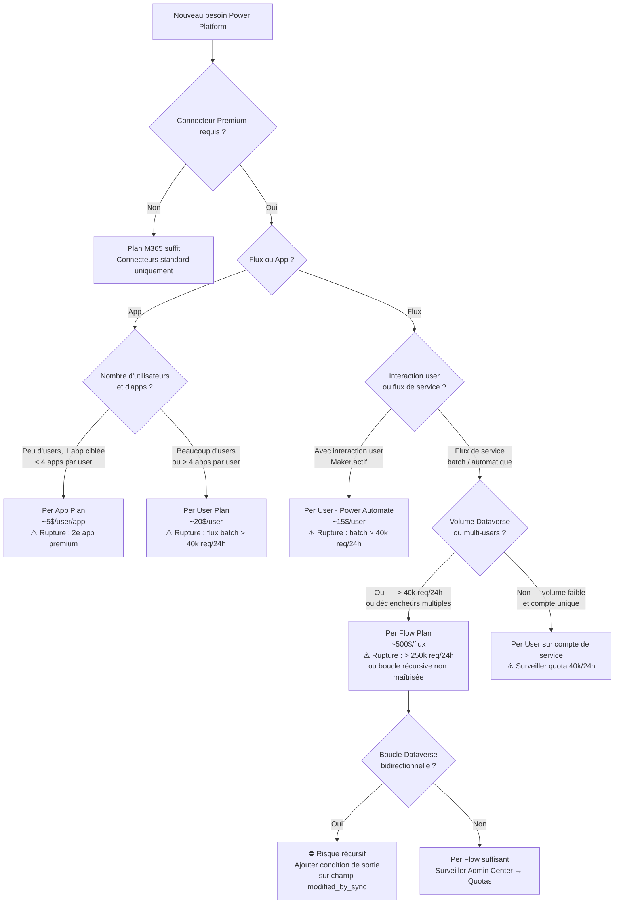

# Licences, plans et limites réelles

## Objectifs pédagogiques

À l'issue de ce module, vous serez capable de :

1. **Identifier** quel plan licence est requis pour un scénario donné (App Pass, Premium, per-user, per-flow)
2. **Distinguer** les limites de débit API réelles et leur impact concret sur les architectures de flux
3. **Anticiper** les points de rupture en production pour chaque plan, avec des seuils chiffrés
4. **Comparer** les options de licences selon le profil utilisateur (maker, end-user, service account) et leur coût caché sur la durée
5. **Décider** quand consolider des flux sur une licence per-flow plutôt que per-user, en tenant compte du TCO réel

---

## Mise en situation

Une entreprise déploie une solution Power Automate pour synchroniser ses commandes Salesforce vers Dataverse, en temps réel, à raison de 2 000 commandes par heure en pic. Le projet passe les tests de recette sans problème. Le jour du déploiement en production, les flux commencent à échouer après 45 minutes. Le message d'erreur : `Request limit exceeded`. Personne n'avait regardé les limites de requêtes Dataverse liées au plan licence de l'utilisateur de service.

Ce n'est pas un bug. C'est une lacune de qualification au moment de l'architecture. Ce module est là pour éviter exactement ce type d'incident — et pour vous donner les seuils précis qui permettent de qualifier un projet avant le POC, pas après.

---

## Pourquoi les licences Power Platform ne sont pas juste une question administrative

La licence Power Platform n'est pas un simple ticket d'accès. Elle définit :

- quels **connecteurs** sont utilisables (standard vs. premium)
- quels **volumes de requêtes API** sont autorisés (par utilisateur, par flux, par tenant)
- quels **environnements** sont accessibles (production, sandbox, Managed Environments)
- si **Dataverse** peut être utilisé comme source de données

Ignorer ces contraintes au moment de la conception, c'est garantir soit un blocage en prod, soit un surcoût de licence non anticipé. La suite de ce module vous donne les valeurs exactes — celles qui permettent de répondre à la question "ce plan tiendra-t-il en charge réelle ?" avant de signer le bon de commande.

---

## La structure des plans — vue comparative

Il existe trois grandes logiques de licences sur Power Platform. Chacune répond à un profil d'usage différent.

### Plans utilisateur ("per user")

| Plan | Cible | Connecteurs | Dataverse | Prix indicatif |
|------|-------|-------------|-----------|----------------|
| Microsoft 365 (inclus) | End-user standard | Standard uniquement | Non (lecture limitée via connecteur) | Inclus M365 |
| Power Apps per user | End-user apps métier | Premium inclus | Oui | ~20 $/user/mois |
| Power Automate per user | Maker / utilisateur de flux | Premium inclus | Oui | ~15 $/user/mois |
| Power Automate per user + RPA | Automatisation desktop | Premium + Desktop flows | Oui | ~40 $/user/mois |

> 🧠 **Concept clé** : Le plan Microsoft 365 inclus autorise l'utilisation de Power Automate et Power Apps, mais uniquement avec des **connecteurs standard**. Dès qu'un connecteur marqué "Premium" apparaît dans un flux ou une app (Dataverse, HTTP, SQL Server…), une licence dédiée est obligatoire pour **chaque utilisateur** qui exécute ce flux ou ouvre cette app — pas seulement pour le maker qui l'a créé.

### Plans flux ("per flow")

Le plan **per flow** (environ 500 $/flux/mois) est conçu pour les flux d'arrière-plan qui s'exécutent sans interaction utilisateur directe. Avantage majeur : tous les utilisateurs du tenant peuvent déclencher le flux sans licence Power Automate individuelle. Le quota Dataverse associé (250 000 req/24h) est aussi six fois supérieur au plan per-user — c'est souvent ce chiffre qui décide.

⚠️ **Erreur fréquente** : Assigner un plan per-user à un compte de service partagé utilisé par 50 personnes, en pensant que "ça couvre tout". Un plan per-user est attaché à un identifiant unique. Les utilisateurs qui déclenchent le flux en amont ne sont pas couverts, et le quota de 40 000 requêtes/24h s'applique à ce seul compte — pas à l'ensemble des déclencheurs.

### Plans App Pass (anciennement "per app")

Le plan **Power Apps per app** (environ 5 $/user/app/mois) autorise un utilisateur à accéder à **une application spécifique**, connecteurs premium inclus. Utile pour un déploiement ciblé sans payer un plan complet.

```
Exemple de comparaison de coût :
- 200 utilisateurs, 1 application avec connecteur Premium
  → Per app  : 200 × 5 $ = 1 000 $/mois
  → Per user : 200 × 20 $ = 4 000 $/mois
  → Économie : 3 000 $/mois — mais limité à cette app uniquement

Seuil de bascule : si un utilisateur a besoin de 4 apps premium ou plus,
per-user (~20 $) devient moins cher que per-app (4 × 5 $ = 20 $).
Au-delà de 4 apps, per-user est toujours plus avantageux.
```

---

## Ce que "connecteur Premium" signifie réellement

Le catalogue des connecteurs Power Platform est divisé en trois niveaux :

| Niveau | Exemples | Licence requise |
|--------|---------|-----------------|
| Standard | SharePoint, Outlook, Teams, Excel Online | M365 inclus |
| Premium | Dataverse, SQL Server, HTTP, Salesforce, SAP | Power Apps/Automate payant |
| On-premises | Via data gateway — SQL, Oracle, SAP local | Premium + Gateway configurée |

💡 **Astuce** : Pour identifier rapidement si un connecteur est Premium dans l'interface Make, l'icône affiche un diamant ♦ dans le coin supérieur droit de la vignette du connecteur sur make.powerautomate.com.

Deux exemples courants qui piègent les équipes débutantes : **Dataverse** (Premium, contrairement à SharePoint qui est Standard) et **HTTP** (Premium — un simple appel REST vers une API externe depuis un flux requiert une licence payante pour chaque utilisateur qui exécute ce flux).

---

## Les limites de débit API — le vrai risque en production

C'est ici que la plupart des architectures échouent silencieusement.

### Request limits Dataverse

Chaque identité exécutant un flux ou une app a un quota de **requêtes API Dataverse par période glissante de 24 heures**. Ces limites s'appliquent à toutes les interactions avec Dataverse : create, read, update, delete, appels via connecteur, appels via SDK Web API.

| Licence | Requêtes Dataverse / 24h |
|---------|--------------------------|
| Microsoft 365 (accès Dataverse limité) | 2 000 |
| Power Apps per app | 6 000 |
| Power Apps per user | 40 000 |
| Power Automate per user | 40 000 |
| Dynamics 365 Enterprise | 100 000 |
| Power Automate per flow | 250 000 |

**Comment lire ce tableau en pratique** : Si un flux batch traite 60 000 enregistrements Dataverse (lecture + mise à jour, soit 2 opérations par enregistrement = 120 000 requêtes) sur un compte de service per-user (quota 40 000), il échouera après un tiers du traitement. Le plan per-flow est le seul qui absorbe ce volume. Au-delà de 250 000 requêtes par flux, l'architecture doit être repensée (découpage temporel, Azure Data Factory, batching).

> 🔴 **Piège des boucles** : Un flux déclenché par une modification Dataverse qui lui-même modifie Dataverse peut générer un trigger récursif. Chaque itération consomme le quota — et le flux ne s'arrête pas proprement. Les exécutions suivantes échouent avec une erreur 429 jusqu'à la réinitialisation du quota le lendemain. Le flux d'origine peut avoir consommé plusieurs dizaines de milliers de requêtes en quelques minutes. Pour un flux de synchronisation bi-directionnelle, ajouter impérativement une condition de sortie sur un champ "modified_by_sync" avant d'écrire dans Dataverse.

**Les quotas sont indépendants par identité.** Si 5 flux s'exécutent sous 5 identités per-user distinctes, chaque identité dispose de son propre quota de 40 000 requêtes — soit 200 000 au total côté tenant. Ce n'est pas un quota partagé de 40 000. À l'inverse, si les 5 flux utilisent le même compte de service per-user, ils partagent un seul quota de 40 000 requêtes/24h.

### Power Automate — limites d'exécution

Les flux Power Automate ont leurs propres limites, indépendantes de Dataverse :

| Limite | Valeur |
|--------|--------|
| Actions par exécution de flux (plan standard) | 100 000 |
| Durée max d'une exécution de flux | 30 jours (workflows longs avec "Do until") |
| Connexions simultanées par connecteur | Dépend du connecteur — souvent 6 à 20 |

### Limites des connecteurs individuels

Chaque connecteur a ses propres limites de débit, indépendamment du plan Power Platform :

| Connecteur | Limite |
|-----------|--------|
| SharePoint | 600 requêtes / minute (par connexion) |
| Dataverse (via connecteur) | Soumis aux API limits ci-dessus |
| SQL Server | Pas de limite plateforme, mais throttling côté SQL |
| HTTP | Pas de limite plateforme, mais dépend de l'API cible |
| Office 365 Outlook | 300 requêtes/minute pour les actions |

Pour le connecteur HTTP, les erreurs 429 proviennent de l'API cible, pas de Power Platform. La stratégie recommandée : activer la **retry policy** sur l'action HTTP (paramètre avancé → Retry Policy → Exponential interval), configurer un délai entre 5 et 30 secondes, et limiter à 3 ou 4 tentatives. Sans retry configuré, Power Automate abandonne dès le premier 429.

---

## Points de rupture par plan — ce qui fait échouer chaque licence en production

Avant de choisir un plan, identifier le premier scénario qui le met en échec :

| Plan | Premier scénario de rupture |
|------|-----------------------------|
| M365 inclus | Dès qu'un connecteur Premium apparaît dans le flux ou l'app |
| Per app (~5 $/user/app) | Dès qu'un utilisateur accède à une deuxième app Premium |
| Per user (~20 $/user) | Flux batch dépassant 40 000 requêtes Dataverse/24h sur le compte d'exécution |
| Per flow (~500 $/flux) | Flux récursif non maîtrisé ou traitement dépassant 250 000 requêtes Dataverse/24h |
| M365 + Dataverse limité | Toute opération d'écriture Dataverse en volume (quota 2 000 req/24h) |

Cette lecture par rupture est plus utile qu'une simple liste de fonctionnalités : elle permet de qualifier directement si un plan tient face au volume réel du projet.

---

## Le vrai coût : per-user vs per-flow au-delà du prix affiché

Le prix affiché n'est qu'une partie du calcul. Voici ce qui se cache derrière :

**Plan per-user** — coûts cachés :
- Chaque nouveau collaborateur sur le projet ajoute une licence individuelle
- Si le nombre d'utilisateurs grandit (croissance d'équipe, fusion, déploiement étendu), le coût scale linéairement
- Monitoring individuel : chaque identité a son propre quota, les incidents de quota sont difficiles à détecter globalement
- Sur 3 ans, une équipe passant de 20 à 80 utilisateurs multiplie la facture par 4

**Plan per-flow** — coûts cachés :
- Coût fixe par flux, mais l'infrastructure d'orchestration (gestion des erreurs, retry, logging) doit être construite et maintenue
- Un flux mal conçu (boucle récursive, pas de gestion d'erreur) consomme tout le quota et bloque les autres traitements sur la même identité
- Le monitoring devient une responsabilité technique : sans alerting sur le quota consommé, un dépassement est détecté après échec

**Règle pratique** : Per-flow est plus prévisible et moins cher à long terme dès qu'un flux est un service d'arrière-plan à fort volume ou qu'il est partagé entre plusieurs équipes. Per-user est adapté aux makers et aux utilisateurs finaux d'apps interactives, avec un nombre d'utilisateurs stable.

---

## Modèle de décision : quel plan pour quel usage ?



---

## Prise de décision sécurité et architecture

### Situation 1 : Flux batch nocturne, 50 000 enregistrements Dataverse

**Profil** : Aucun utilisateur humain impliqué. Traitement automatique.

**Option naïve** : Compte de service avec plan per-user (40 000 req/24h). Insuffisant — le flux dépassera le quota à mi-traitement.

**Option correcte** : Plan per-flow (250 000 req/24h). Coût fixe, indépendant du nombre d'utilisateurs.

**Calcul de charge** : 50 000 enregistrements × 2 opérations (lecture + mise à jour) = 100 000 requêtes Dataverse. Le plan per-flow absorbe ce volume avec une marge de 150 000 requêtes. Prévoir un mécanisme de logging du quota consommé en fin de batch pour détecter une dérive avant dépassement.

**Implémentation résiliente** : Dans le flux, encapsuler le bloc de traitement dans un scope "Try", ajouter un scope "Catch" qui enregistre l'erreur dans Dataverse et envoie une notification Teams, et configurer la retry policy sur les actions Dataverse avec un intervalle exponentiel (5s, 15s, 45s). Sans ce dispositif, un échec à 80% du traitement laisse les données dans un état partiel sans trace exploitable.

**Limite à surveiller** : Si le batch dépasse 250 000 requêtes, envisager un découpage temporel (plusieurs flux décalés) ou une intégration via Azure Data Factory pour les volumes très élevés.

### Situation 2 : Application interne, 300 utilisateurs, connecteur SQL Server

**Profil** : App Canvas connectée à SQL Server On-premises via Gateway.

**Option naïve** : Plan per-user pour les 300 utilisateurs (6 000 $/mois).

**Option correcte** : Évaluer si un plan per-app suffit. Si l'app est unique et ciblée : 300 × 5 $ = 1 500 $/mois. Économie de 4 500 $/mois.

**Limite** : Le plan per-app ne couvre qu'une app. Dès qu'un utilisateur a besoin d'une deuxième app Premium, le calcul change. Sur 3 ans avec une équipe qui grandit, comparer le coût total de possession : per-app scale avec le nombre d'apps, per-user scale avec le nombre d'users.

### Situation 3 : Déploiement multi-tenant, plusieurs environnements

🔒 **Contrôle de sécurité** : Les plans de licence Power Platform s'appliquent **au niveau tenant**. Un utilisateur invité (B2B) accédant à une app Power Apps doit avoir sa propre licence dans son tenant d'origine ou être couvert par un plan App Pass dans votre tenant. L'absence de licence invité est une source fréquente de blocage lors d'ouvertures multi-entités.

### Situation 4 : Flux récursif Dataverse avec synchronisation bi-directionnelle

**Profil** : Flux qui écoute les modifications d'une table Dataverse et met à jour une autre table — elle-même source d'un deuxième flux.

**Risque** : Chaque modification déclenche le flux, qui modifie Dataverse, qui re-déclenche le flux. Sans condition de sortie, la boucle consomme le quota en quelques minutes (plusieurs milliers de requêtes par cycle). Le flux ne s'arrête pas proprement — les exécutions échouent avec une erreur 429 jusqu'à réinitialisation J+1, et les données restent dans un état incohérent.

**Correction architecturale** : Ajouter un champ booléen `sync_in_progress` ou un champ `modified_by_sync` sur la table Dataverse. Avant chaque écriture, vérifier si le champ est déjà positionné à `true` — si oui, sortir du flux sans écriture. Ce pattern casse la récursivité sans complexifier la logique métier.

**Quota à anticiper** : Même avec la condition de sortie, une synchronisation bi-directionnelle active génère facilement 2× le volume d'une synchronisation unidirectionnelle. Sur un plan per-flow (250 000 req/24h), ce volume reste absorbable jusqu'à environ 60 000 enregistrements synchronisés par jour.

---

## Licences et environnements — ce qui change selon le type

Tous les environnements ne sont pas équivalents du point de vue des licences :

| Type d'environnement | Dataverse inclus | Licence Managed Env. requise | Capacité stockage |
|----------------------|-----------------|------------------------------|-------------------|
| Default | Non (limité) | Non | Partagée tenant |
| Sandbox | Oui (si licence) | Non | Allouée |
| Production | Oui (si licence) | Non | Allouée |
| Managed Environment | Oui | Oui (Power Apps Premium ou Automate Premium) | Allouée + monitoring |
| Developer | Oui | Non | Limitée — non prod |

> ⚠️ **Erreur fréquente** : Utiliser un environnement Developer pour un test avec des utilisateurs réels. L'environnement Developer est nominatif (1 maker = 1 env Developer), ses SLA sont différents et Microsoft peut en réinitialiser les données. Un POC qui fonctionne en env Developer ne garantit pas le fonctionnement en prod — les licences du maker masquent les erreurs de qualification des licences end-user.

### Managed Environments et impact TCO

Les Managed Environments ajoutent une couche de gouvernance (pipelines ALM intégrés, IP firewall, weekly digest, solution checker enforcement) mais nécessitent que **chaque utilisateur actif dans cet environnement dispose d'une licence Power Apps Premium ou Power Automate Premium**. Ce prérequis est souvent découvert après la mise en place de la gouvernance, non avant.

Impact sur le TCO : dans un tenant de 500 utilisateurs dont 200 utilisent des apps dans un Managed Environment, les 200 utilisateurs doivent être licenciés en Premium — même si leur usage est occasionnel. Avant d'activer les Managed Environments sur l'environnement de production, valider que l'ensemble des utilisateurs actifs dispose déjà du niveau de licence requis.

---

## Capacité de stockage Dataverse — un plafond souvent oublié

La capacité de stockage Dataverse est calculée à l'échelle du tenant, selon les licences actives :

| Source | Capacité ajoutée |
|--------|-----------------|
| Base tenant | 10 Go (Database) + 20 Go (File) + 2 Go (Log) |
| Par utilisateur Power Apps per user | + 250 Mo Database |
| Par utilisateur Power Automate per user | + 50 Mo Database |
| Par utilisateur Dynamics 365 Enterprise | + 250 Mo Database |
| Achat add-on | À la demande |

💡 **Astuce** : Suivre la consommation dans le Power Platform Admin Center → Capacity. Un dépassement ne bloque pas immédiatement les opérations, mais Microsoft envoie des alertes et peut restreindre la création de nouveaux environnements.

**Cas concret** : 800 salariés, 2 Mo de justificatif par dossier de congé, 3 ans de rétention → 800 × 3 × 2 Mo ≈ 4,7 Go. Gérable sur un tenant de base. Mais si le même projet intègre photos de profil (500 Ko chacune), contrats signés (1 Mo), et bulletins de paie (300 Ko × 12 mois × 3 ans), la consommation dépasse 20 Go en moins d'un an.

**Alternative architecturale** : Rediriger les pièces jointes vers SharePoint ou Azure Blob Storage, et stocker uniquement le lien dans Dataverse. Cette approche réduit la consommation File Dataverse à quasi zéro, mais introduit une architecture à deux niveaux. Conséquence à anticiper : si l'UI expose les deux sources (Dataverse + SharePoint), un problème de synchronisation (fichier supprimé SharePoint, lien toujours présent dans Dataverse) génère des erreurs 404 silencieuses côté utilisateur. Le choix entre stockage Dataverse natif et stockage externe dépend du volume projeté, du besoin de cohérence transactionnelle et de la politique de rétention.

---

## Cas réel en entreprise

**Contexte** : Une DSI déploie une solution Power Apps pour la gestion des congés de 800 salariés. L'app utilise un connecteur Dataverse et un connecteur SharePoint (pour les justificatifs). Le projet est validé avec des licences M365 standard existantes.

**Incident** : Lors du pilote à 50 utilisateurs, tout fonctionne. Au déploiement global, les utilisateurs reçoivent une erreur "You do not have a license to use this application". L'équipe IT découvre à ce moment que le connecteur Dataverse est Premium — la totalité des 800 utilisateurs doit avoir une licence Power Apps.

**Impact** : Délai de 3 semaines pour procurement des licences, déploiement bloqué, crédibilité de l'équipe projet atteinte.

**Pourquoi le pilote n'a pas détecté le problème** : Les 50 utilisateurs pilotes étaient des membres de l'équipe projet, qui disposaient déjà de licences Power Apps per user dans leur profil maker. Les utilisateurs finaux standard n'avaient que des licences M365.

**Leçon** : La qualification des licences doit être faite **avant la conception**, avec les licences réelles des utilisateurs cibles — pas après le POC. Utiliser un environnement Sandbox et des comptes de test avec les licences end-user pour valider dès le départ.

---

## Erreurs fréquentes

**1. Confondre la licence du maker et la licence de l'utilisateur final**

Un maker avec Power Apps per user peut créer une app avec des connecteurs premium. Mais si les utilisateurs qui l'ouvrent n'ont pas de licence adéquate, l'app est bloquée pour eux — même si elle fonctionne parfaitement sur le compte du maker. Cette erreur représente probablement 80% des incidents de licence en déploiement initial.

**2. Utiliser un compte de service avec plan per-user pour des flux à fort volume**

Un flux batch à 60 000 enregistrements Dataverse (lecture + mise à jour = 120 000 requêtes) sur un compte de service per-user (quota 40 000) échouera systématiquement après un tiers du traitement. Correction : plan per-flow (250 000 req/24h). Le calcul de charge doit toujours inclure le nombre d'opérations Dataverse par enregistrement, pas seulement le nombre d'enregistrements.

**3. Ignorer les limites des connecteurs SharePoint**

SharePoint a une limite de 600 requêtes/minute par connexion. Un flux qui itère sur des milliers d'éléments sans filtre OData déclenche un throttling — les exécutions ralentissent d'abord, puis échouent. Le throttling SharePoint ne génère pas toujours une erreur immédiate visible dans le run history : l'exécution dure 10× plus longtemps avant d'échouer. Correction : filtrer à la source avec une requête OData ciblée, utiliser la pagination, limiter à 500 items max par appel.

**4. Oublier la capacité de stockage Dataverse dans les projets avec fichiers**

Stocker des pièces jointes directement dans Dataverse sans projection de stockage. À 800 salariés avec justificatifs, photos et contrats sur 3 ans, la capacité File (20 Go de base) peut être saturée en moins d'un an. Anticiper ou rerouter vers SharePoint / Azure Blob — en gardant à l'esprit les implications de synchronisation décrites ci-dessus.

**5. Ne pas configurer de retry sur les appels HTTP**

Un flux qui appelle une API externe via le connecteur HTTP sans retry policy abandonne au premier 429. Les API à fort trafic (Salesforce, SAP, services internes) peuvent throttler ponctuellement même sur des volumes modérés. Activer systématiquement la retry policy avec intervalle exponentiel sur toutes les actions HTTP critiques.

---

## Résumé

Les licences Power Platform définissent trois contraintes indépendantes : l'accès aux **connecteurs Premium**, les **quotas de requêtes API** (par utilisateur ou par flux), et la **capacité de stockage Dataverse** au niveau tenant. Le plan Microsoft 365 inclus couvre les connecteurs standard uniquement — dès qu'un connecteur Premium apparaît dans une app ou un flux, tous les utilisateurs finaux doivent avoir une licence adaptée, pas seulement le maker.

Le plan per-flow est le choix naturel pour les flux de service à fort volume (quota 250 000 req/24h contre 40 000 pour per-user), et le seul plan qui tient face à un batch de plus de 40 000 opérations Dataverse par jour. Les quotas sont indépendants par identité — 5 flux sous 5 identités per-user distinctes disposent de 5 × 40 000 requêtes, pas d'un quota partagé. Les Managed Environments ajoutent de la gouvernance mais imposent un niveau de licence Premium à tous les utilisateurs actifs de l'environnement, ce qui peut doubler le TCO si mal anticipé.

La capacité de stockage Dataverse est un plafond tenant-wide souvent ignoré jusqu'à la première alerte — projeter la consommation fichiers dès la conception, et arbitrer entre stockage natif Dataverse et architecture à deux niveaux (Dataverse + SharePoint/Blob) selon le volume et les exigences de cohérence. Toute qualification de projet doit inclure une analyse des licences et des volumes réels avant le POC — pas après.

---

<!-- snippet
id: powerplatform_licence_connector_premium
type: concept
tech: power-platform
level: intermediate
importance: high
format: knowledge
tags: licence, connecteur, premium, power-apps, power-automate
title: Connecteur Premium — ce que ça change sur les licences
context: Valable pour Power Apps et Power Automate — s'applique à l'utilisateur final qui exécute, pas au maker qui crée
content: Un connecteur marqué "Premium" (Dataverse, HTTP, SQL Server, Salesforce…) impose une licence payante à TOUS les utilisateurs finaux qui exécutent le flux ou ouvrent l'app. Le plan M365 inclus ne couvre que les connecteurs Standard (SharePoint, Outlook, Teams, Excel Online
