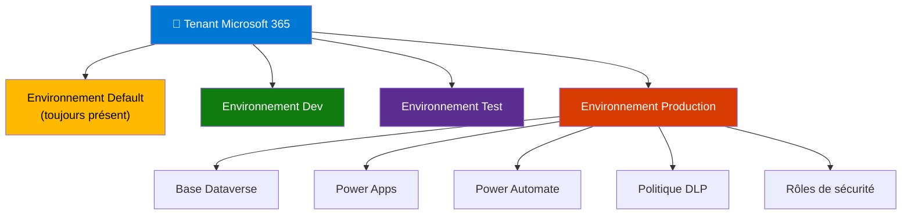
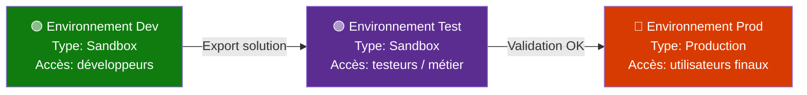

# Environnements Power Platform

## Objectifs pédagogiques

À l'issue de ce module, vous serez capable de :

1. **Expliquer** ce qu'est un environnement Power Platform et pourquoi il constitue la frontière fondamentale de toute organisation saine
2. **Distinguer** les différents types d'environnements et savoir lequel utiliser selon le contexte
3. **Créer et configurer** un environnement via le Power Platform Admin Center
4. **Organiser** vos environnements selon une stratégie ALM réaliste (dev → test → prod)
5. **Identifier** les erreurs de gouvernance classiques et les corriger avant qu'elles ne coûtent cher

---

## Mise en situation

Vous rejoignez l'équipe IT d'une entreprise de 800 personnes. Le déploiement Power Platform est déjà en cours depuis quelques mois — mais personne n'a vraiment structuré les choses. Résultat : une vingtaine de collaborateurs ont créé leurs applications directement dans l'environnement par défaut. Des flux de production côtoient des tests. Un consultant externe a créé ses propres ressources dans ce même espace. Et personne ne sait exactement qui peut voir quoi.

Quand vous demandez comment déployer une application de dev vers la production, la réponse est : "On la recrée à la main."

C'est précisément le problème que les environnements Power Platform sont conçus à résoudre — à condition de les utiliser correctement dès le départ.

---

## Contexte et problématique

Un environnement, dans Power Platform, c'est un **conteneur isolé**. Il embarque ses propres ressources : applications, flux, connexions, données Dataverse, et règles de sécurité. Ce qui est dans un environnement ne "voit" pas ce qui est dans un autre — à moins qu'on l'y autorise explicitement.

L'analogie la plus utile : pensez à un environnement comme à un **locataire séparé dans un immeuble**. Les appartements partagent l'immeuble (le tenant Azure AD / Microsoft 365), mais chacun a sa propre porte, ses propres meubles et ses propres règles d'accès. Un développeur qui expérimente dans son appartement ne peut pas casser la cuisine du voisin.

Ce mécanisme d'isolation est ce qui rend possible :
- la **séparation dev / test / prod** (ALM propre)
- la **délégation régionale ou métier** (chaque BU gère ses ressources)
- la **conformité et la sécurité des données** (résidence des données, DLP par périmètre)

Sans cette structure, tout le monde travaille dans le même espace, les risques se cumulent, et le moindre déploiement devient une opération à risque.

---

## Architecture : comment s'organise un environnement

Chaque environnement est attaché à un tenant Microsoft 365 et à une région géographique. Il contient un ensemble cohérent de ressources.

| Composant | Rôle | Remarque |
|---|---|---|
| **Environnement lui-même** | Frontière d'isolation : sécurité, données, DLP | Obligatoire, pas optionnel |
| **Base de données Dataverse** | Stockage relationnel intégré, optionnel à la création | Peut être ajoutée après coup, mais pas supprimée |
| **Applications (Canvas / Model-driven)** | Vivent dans l'environnement, non transférables directement | Sauf via solution |
| **Flux Power Automate** | Attachés à l'environnement, pas au compte utilisateur | Point critique pour la gouvernance |
| **Connexions** | Identifiants d'accès aux sources de données | Personnelles ou partagées selon la config |
| **Rôles de sécurité** | Contrôlent l'accès aux données Dataverse | Gérés par environnement |
| **Stratégies DLP** | Classifient les connecteurs autorisés | Appliquées au niveau environnement ou tenant |

> 🧠 **Concept clé** — Un flux Power Automate appartient à un environnement, pas à son créateur. Si le créateur quitte l'entreprise, le flux reste — mais il peut perdre ses connexions si elles étaient personnelles. C'est un piège courant dans les environnements non structurés.

---

## Types d'environnements

Tous les environnements ne se ressemblent pas. Microsoft en définit plusieurs types, et le choix a des conséquences concrètes sur ce que vous pouvez en faire.

**Production** — L'environnement de référence pour les ressources en service. La base Dataverse a un backup automatique, les ressources sont censées être stables. C'est ici que vivent les applications utilisées par les métiers.

**Sandbox** — Techniquement identique à la production, mais conçu pour les tests et le développement. L'intérêt principal : vous pouvez le **réinitialiser ou copier** depuis/vers un autre environnement. Pratique pour reproduire un bug prod en sandbox sans risque.

**Developer** — Environnement personnel, lié à un utilisateur individuel. Gratuit par compte, avec Dataverse inclus. Parfait pour expérimenter, créer des solutions perso, passer des certifications. Limité à un seul utilisateur.

**Default** — Créé automatiquement à l'activation du tenant. Tout utilisateur avec une licence Power Platform y a accès par défaut. C'est l'environnement qui concentre la plupart des problèmes de gouvernance dans les organisations qui n'ont pas structuré leur déploiement.

**Trial** — Environnement temporaire (30 jours), sans licence payante. Utile pour tester une fonctionnalité premium avant achat, mais il expire et tout ce qu'il contient disparaît.

⚠️ **Erreur fréquente** — Beaucoup d'équipes font tout dans l'environnement Default parce que c'est "déjà là". Le Default n'a pas de Dataverse par défaut, n'a pas de politique DLP renforcée, et tout le monde y a accès. En production, c'est un risque de sécurité et de conformité. Réservez-le aux explorations rapides, jamais à des apps critiques.

---

## Mise en place : créer et configurer un environnement

Tout se passe dans le **Power Platform Admin Center** : [admin.powerplatform.microsoft.com](https://admin.powerplatform.microsoft.com).

### Créer un environnement

**Admin Center → Environments → + New**

Vous renseignez :

| Champ | Ce qu'il fait | Conseil |
|---|---|---|
| **Name** | Nom affiché partout dans les interfaces | Adopter une convention : `[Org]-[Projet]-[Env]` ex: `Contoso-CRM-Dev` |
| **Type** | Production / Sandbox / Trial / Developer | Voir section précédente |
| **Region** | Résidence des données (France, Europe, US…) | Choisir en fonction des exigences RGPD / contrat client |
| **Add a Dataverse data store** | Active la base Dataverse dans cet environnement | Requis pour les model-driven apps et Copilot Studio |
| **Language / Currency** | Locale de l'interface Dataverse | Modifiable ensuite, mais avec précautions |

💡 **Astuce** — La région ne peut pas être changée après création. Si vous vous trompez, vous devrez recréer l'environnement de zéro. Prenez 30 secondes pour la valider.

La création prend généralement 1 à 3 minutes. Un environnement avec Dataverse peut prendre jusqu'à 5 minutes.

### Vérifier que l'environnement fonctionne

Une fois créé, l'environnement apparaît dans la liste avec le statut **Ready**. Cliquez dessus pour accéder à son tableau de bord : état, ressources, capacité consommée (storage), utilisateurs, et politiques DLP actives.

Vous pouvez aussi basculer vers cet environnement directement dans Power Apps ou Power Automate via le **sélecteur d'environnement** (coin supérieur droit de l'interface — l'engrenage ou le nom de l'environnement courant).

### Configurer les rôles d'accès

Par défaut, deux rôles existent dans chaque environnement :

- **Environment Admin** — Peut tout faire dans l'environnement, y compris gérer les utilisateurs et les ressources
- **Environment Maker** — Peut créer des apps, flux et connexions. Ne peut pas administrer l'environnement

Ces rôles se gèrent depuis : **Admin Center → Environments → [votre env] → Settings → Users + permissions → Environment roles**

> 🧠 **Concept clé** — Le rôle Environment Maker est attribué par défaut à tous les utilisateurs avec une licence dans l'environnement Default. Dans un environnement de production dédié, vous devez attribuer ce rôle explicitement. Ne jamais laisser le Default gérer vos autorisations de production.

---

## Organiser ses environnements : stratégie ALM réaliste

L'ALM (Application Lifecycle Management) Power Platform repose sur un principe simple : **chaque environnement correspond à une étape du cycle de vie**, et les ressources se déplacent entre eux via des **solutions** (un mécanisme que vous verrez dans un module dédié). Ce module ne couvre pas les solutions — mais il faut comprendre pourquoi la structure d'environnements est la première pièce du puzzle.

### Structure minimale recommandée

**Pourquoi trois environnements et pas un seul ?**

Parce que modifier une app directement en production pour "corriger un petit truc" est le chemin le plus court vers une panne utilisateur. La séparation permet de tester sans risquer les données réelles, et de livrer de manière contrôlée.

### Variante pour les grandes organisations

Certaines structures ajoutent un environnement **Integration** entre Test et Prod (pour les tests de connecteurs tiers), ou un environnement **Formation** isolé pour onboarder les nouveaux utilisateurs sans polluer les données de production.

💡 **Astuce** — Pour les projets d'équipe, ne créez pas un environnement Dev par développeur — créez un environnement Dev partagé avec un Dataverse, et laissez chaque développeur avoir son environnement Developer personnel pour ses expérimentations locales. Ça évite la fragmentation des données de référence.

---

## Cas réel en entreprise

**Contexte :** Une DSI régionale de 1 200 utilisateurs déploie une application de gestion des demandes RH sur Power Platform. Au départ, tout est développé dans l'environnement Default — par faute de temps pour structurer.

**Problèmes rencontrés après 3 mois :**
- Des flux de tests envoient des emails à de vrais utilisateurs parce que l'environnement n'est pas isolé
- Un développeur modifie un flux partagé et casse une automatisation en production
- Impossible de savoir qui a créé quoi — aucune traçabilité

**Remédiation :**
1. Création de trois environnements (Dev Sandbox, UAT Sandbox, Production) avec Dataverse
2. Migration des ressources "propres" via solutions (les autres sont recréées)
3. Politique DLP restrictive sur la production (connecteurs limités à SharePoint, Dataverse, Exchange)
4. Suppression du rôle Maker sur Default pour tous sauf l'équipe Power Platform

**Résultat après 2 mois :** Zéro incident lié à un déploiement non maîtrisé. Temps de livraison d'une nouvelle fonctionnalité : de "quand on a le courage" à 2 jours cycle standard.

---

## Bonnes pratiques

**1. Nommez vos environnements avec une convention claire dès le départ.**
`[Org]-[Domaine]-[Stage]` évite la prolifération d'environnements anonymes. Une liste de 30 environnements sans convention devient ingérable en 6 mois.

**2. Ne jamais développer ni livrer en production dans l'environnement Default.**
Réservez le Default aux tests rapides et à l'exploration. Il n'a pas les garanties d'un environnement structuré.

**3. Activer Dataverse dès la création si vous en avez besoin.**
Vous ne pouvez pas supprimer Dataverse une fois activé. Inversement, un environnement sans Dataverse ne peut pas accueillir certaines fonctionnalités (model-driven apps, Copilot Studio). Décidez avant, pas après.

**4. Associer une DLP à chaque environnement de production dès sa création.**
Une DLP vide = aucune restriction. En production, vous voulez contrôler quels connecteurs peuvent être utilisés et lesquels sont bloqués. Ne laissez jamais un environnement de production sans politique DLP explicite.

**5. Limiter explicitement le rôle Environment Maker en production.**
Par défaut dans les environnements non-Default, ce rôle n'est pas attribué automatiquement — mais vérifiez-le. Un Maker en production peut créer des ressources non gouvernées.

**6. Documenter la capacité consommée.**
Chaque environnement consomme du stockage Dataverse sur votre quota tenant (lié aux licences). Surveiller la consommation dans Admin Center évite les blocages surprises.

**7. Utiliser des environnements Sandbox pour les copies de production.**
Avant une migration ou une mise à jour risquée, copiez votre environnement de production en sandbox. Vous pouvez tester la procédure sans risquer les données réelles.

---

## Résumé

Un environnement Power Platform est la frontière d'isolation fondamentale de toute solution sérieuse : il définit qui peut faire quoi, où les données sont stockées, et quelles règles s'appliquent. Sans structure d'environnements, développement et production cohabitent dans le même espace — et les incidents deviennent inévitables.

Les types d'environnements (Production, Sandbox, Developer, Default) correspondent à des usages précis : l'erreur la plus commune est de tout concentrer dans le Default parce qu'il est "déjà là". Une stratégie ALM minimale repose sur trois environnements distincts (Dev → Test → Prod), avec les ressources qui transitent via des solutions.

La configuration se fait intégralement depuis le Power Platform Admin Center — région, type, Dataverse, rôles et DLP. La plupart de ces choix sont difficiles à corriger après coup, notamment la région et la présence de Dataverse.

Le module suivant entre dans Dataverse lui-même : maintenant que vous savez où il vit, il est temps de comprendre comment il organise vos données.

---

<!-- snippet
id: powerplatform_env_default_warning
type: warning
tech: power platform
level: intermediate
importance: high
format: knowledge
tags: environnement,gouvernance,default,securite,alm
title: Environnement Default — le piège de gouvernance classique
content: Tout utilisateur avec une licence a le rôle Maker sur le Default → il peut créer apps et flux sans contrôle. En production, ça génère des ressources orphelines, des fuites de données et une traçabilité nulle. Correction : désactiver le rôle Maker sur Default pour les non-admins, et créer des environnements dédiés par usage.
description: L'environnement Default est ouvert à tous par conception — ne jamais y héberger des ressources de production ou des données sensibles.
-->

<!-- snippet
id: powerplatform_env_region_irreversible
type: warning
tech: power platform
level: intermediate
importance: high
format: knowledge
tags: environnement,region,dataverse,creation,rgpd
title: La région d'un environnement ne peut pas être changée après création
content: Piège : choisir la mauvaise région (ex : US au lieu de France/Europe) lors de la création. Conséquence : les données Dataverse sont hébergées hors de la zone contractuelle ou RGPD requise. Correction : supprimer et recréer l'environnement — aucune migration in-place possible. Vérifier la région AVANT de cliquer sur Créer.
description: Région et résidence des données sont définitives à la création. Une erreur implique de recréer l'environnement de zéro.
-->

<!-- snippet
id: powerplatform_env_types
type: concept
tech: power platform
level: intermediate
importance: high
format: knowledge
tags: environnement,sandbox,production,developer,types
title: Types d'environnements Power Platform et leurs usages réels
content: Production → ressources en service, backup Dataverse automatique. Sandbox → identique mais peut être réinitialisé ou copié (idéal pour ALM et test). Developer → personnel, 1 utilisateur, Dataverse inclus gratuit. Default → automatique, tout le monde y accède, aucune garantie. Trial → expire sous 30 jours, tout est perdu. Le type conditionne ce que vous pouvez faire : seul un Sandbox peut être copié depuis/vers un autre environnement.
description: Chaque type d'environnement a des capacités distinctes — Sandbox est le seul copiable/réinitialisable, ce qui en fait le choix pour Dev et Test.
-->

<!-- snippet
id: powerplatform_env_dataverse_irremovable
type: warning
tech: power platform
level: intermediate
importance: high
format: knowledge
tags: environnement,dataverse,creation,configuration
title: Dataverse activé sur un environnement ne peut plus être supprimé
content: Piège : activer Dataverse "pour voir" sur un environnement de test, puis vouloir le désactiver pour économiser du stockage. Ce n'est pas possible. La base Dataverse est permanente une fois activée. Conséquence : consommation de capacité tenant impossible à récupérer sans supprimer l'environnement entier. Décider avant la création si Dataverse est nécessaire.
description: L'activation de Dataverse est irréversible sur un environnement — ne l'activer que si le besoin est confirmé (model-driven app, Copilot Studio, etc.).
-->

<!-- snippet
id: powerplatform_env_maker_role
type: concept
tech: power platform
level: intermediate
importance: high
format: knowledge
tags: securite,roles,maker,environnement,gouvernance
title: Rôle Environment Maker — qui peut créer des ressources dans un environnement
content: Le rôle Maker permet de créer apps, flux et connexions. Sur l'environnement Default, il est attribué automatiquement à tous les utilisateurs licenciés. Sur les environnements dédiés (hors Default), il doit être attribué explicitement. En production, ne jamais attribuer ce rôle par défaut à tous — seuls les membres de l'équipe de déploiement doivent l'avoir.
description: Maker = droit de création dans l'environnement. Attribué automatiquement sur Default, explicitement ailleurs — à restreindre en production.
-->

<!-- snippet
id: powerplatform_env_flow_ownership
type: concept
tech: power platform
level: intermediate
importance: high
format: knowledge
tags: power-automate,flux,gouvernance,propriete,environnement
title: Un flux Power Automate appartient à l'environnement, pas à son créateur
content: Quand un utilisateur quitte l'organisation, ses flux restent dans l'environnement — mais les connexions personnelles qu'il avait configurées deviennent inactives. Le flux est "vivant" mais cassé. Prévention : utiliser des comptes de service pour les connexions des flux critiques, ou transférer la propriété avant le départ via Admin Center → Environments → Resources → Flows.
description: Les flux survivent au départ de leur créateur mais perdent ses connexions personnelles — utiliser des comptes de service pour les flux de production.
-->

<!-- snippet
id: powerplatform_env_naming_convention
type: tip
tech: power platform
level: intermediate
importance: medium
format: knowledge
tags: gouvernance,nommage,environnement,alm,organisation
title: Convention de nommage recommandée pour les environnements
content: Adopter le format `[Org]-[Domaine]-[Stage]` dès le premier environnement. Exemples : `Contoso-RH-Dev`, `Contoso-RH-Prod`, `Contoso-Finance-UAT`. Sans convention, une liste de 20 environnements devient illisible en quelques mois. Le nom est visible dans tous les sélecteurs Power Apps / Power Automate — le rendre auto-explicatif économise des erreurs de déploiement.
description: Format `[Org]-[Domaine]-[Stage]` dès le départ — un environnement mal nommé est un environnement dans lequel on déploie au mauvais endroit.
-->

<!-- snippet
id: powerplatform_env_alm_structure
type: concept
tech: power platform
level: intermediate
importance: high
format: knowledge
tags: alm,environnement,dev,test,prod,solutions
title: Structure ALM minimale : trois environnements distincts
content: Dev (Sandbox) → développement actif. Test/UAT (Sandbox) → validation métier. Prod (Production) → utilisateurs finaux. Les ressources transitent entre environnements via des Solutions (package exportable/importable). Sans cette séparation, un correctif dev peut casser la production. Le type Sandbox est obligatoire pour Dev et Test car il permet la copie et la réinitialisation.
description: ALM minimal = 3 environnements Sandbox/Sandbox/Production + Solutions pour le transport. Ne pas mélanger les étapes sous peine d'incidents de déploiement.
-->

<!-- snippet
id: powerplatform_env_dlp_production
type: tip
tech: power platform
level: intermediate
importance: high
format: knowledge
tags: dlp,securite,gouvernance,production,connecteurs
title: Associer une politique DLP à chaque environnement de production dès sa création
content: Sans DLP explicite, un utilisateur peut connecter n'importe quel connecteur (y compris Twitter, services tiers non approuvés) à une app manipulant des données sensibles. En production : créer une DLP qui place Dataverse, SharePoint, Exchange en "Business" et bloque les connecteurs non approuvés en "Blocked". Se configure dans Admin Center → Policies → New Policy → sélectionner l'environnement cible.
description: Un environnement de production sans DLP = aucune restriction sur les connecteurs. Configurer la DLP avant les premiers déploiements, pas après.
-->
