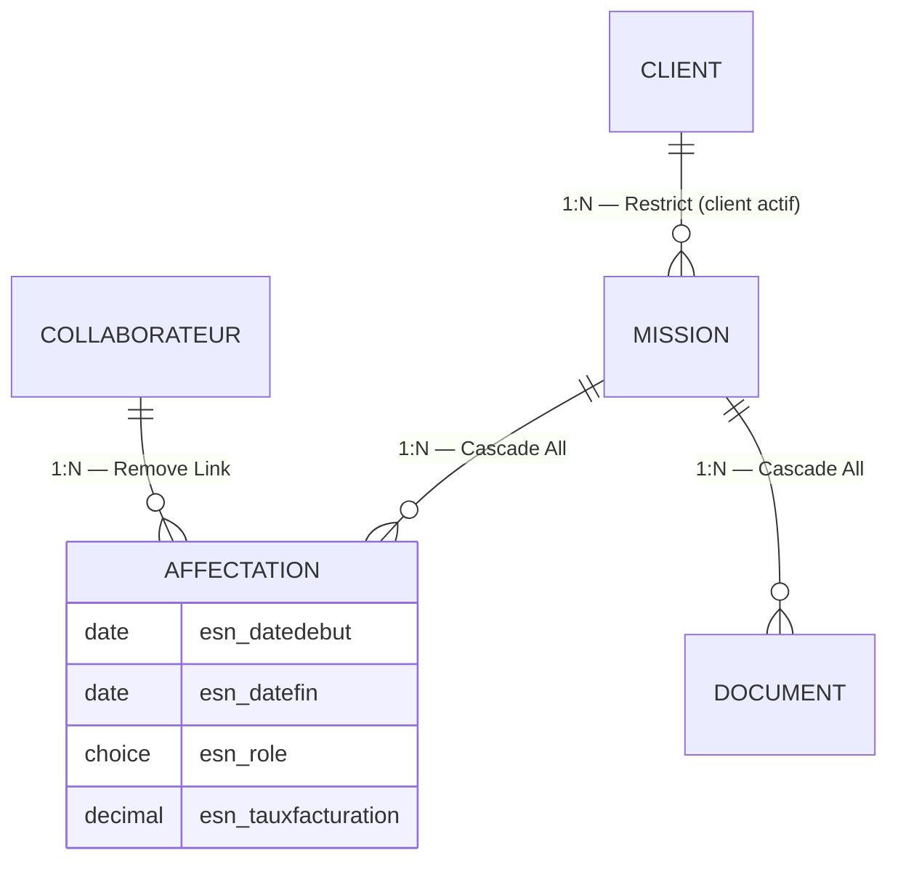
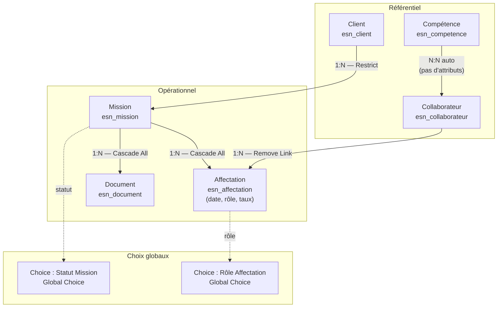

# Dataverse : modèle de données

## Objectifs pédagogiques

À l'issue de ce module, vous serez capable de :

- Distinguer les différents types de tables Dataverse et choisir le bon selon le contexte
- Identifier les types de colonnes disponibles et anticiper leurs contraintes techniques réelles
- Modéliser des relations entre tables (1-N, N-N, lookup, polymorphique) avec les bons comportements de cascade
- Lire et interpréter les métadonnées d'une table ou d'une colonne
- Détecter les anti-patterns de modélisation avant qu'ils ne dégradent la solution en production

---

## Mise en situation

Vous rejoignez l'équipe digitale d'une ESN de 3 000 collaborateurs. L'entreprise veut remplacer un suivi de missions géré dans 14 fichiers Excel disparates — chefs de projet, RH, direction commerciale, tous avec leur propre version de la vérité.

L'objectif : une application Power Apps centralisée, alimentée par Power Automate, visible dans Power BI, et accessible aux clients via un portail Power Pages.

Avant d'écrire la moindre formule ou de créer le premier flux, vous devez concevoir le modèle de données dans Dataverse. Ce modèle, c'est le contrat entre tous les outils. Si les tables sont mal pensées, tout le reste sera bancal — les relations difficiles à naviguer, les performances dégradées, la gouvernance impossible.

Une question reviendra souvent dans ce module : *la relation entre Mission et Collaborateur doit-elle être N:N automatique ou passer par une table Affectation manuelle ?* Vous saurez y répondre précisément, avec justification, à la fin de ce module.

---

## Pourquoi Dataverse n'est pas "juste une base de données"

Dans une base relationnelle standard, vous définissez vos tables, vos colonnes, vos contraintes, et c'est vous qui gérez tout : sécurité, versioning, audit, API. Dataverse, lui, embarque tout ça nativement. Chaque table que vous créez hérite automatiquement d'une API REST (OData), d'un journal de modifications, de hooks sur les événements (création, mise à jour, suppression), et d'un système de sécurité basé sur des rôles.

En contrepartie, vous n'avez pas d'accès SQL direct — vous travaillez à travers des abstractions : le maker portal, le SDK, les connecteurs. Cela change la façon dont on modélise.

🧠 **Concept clé** — Dataverse est une plateforme de données *opérationnelle et relationnelle*, conçue pour des applications transactionnelles. Elle n'est pas pensée pour des requêtes analytiques complexes ou des volumes de plusieurs centaines de millions de lignes. Pour la couche analytique, Power BI reste l'outil adapté — et les deux se complètent bien dans notre scénario ESN.

---

## Les tables : bien plus qu'un simple tableau

### Types de tables

Quand vous créez une table dans Dataverse, vous choisissez son *type*. Ce choix n'est pas cosmétique — il détermine les fonctionnalités disponibles et les comportements automatiques.

| Type | Caractéristiques | Cas d'usage typique |
|------|-----------------|---------------------|
| **Standard** | Toutes les fonctionnalités : ownership, audit, API complète | Entités métier principales (Client, Mission, Contrat) |
| **Activity** | Hérite de la table `Activity`, timeline intégrée | Email, Tâche, Rendez-vous — ou activité métier custom |
| **Virtual** | Données lues en temps réel depuis une source externe | Synchronisation légère avec un ERP, un portail tiers |
| **Elastic** | Optimisée pour de très grands volumes et insertions massives | Logs applicatifs, données IoT, événements à fort débit |

Pour 90 % des projets applicatifs, vous travaillez avec des tables **Standard**. Les tables **Elastic** répondent à des besoins spécifiques : si vous avez 500 000 logs d'appels API à stocker avec des insertions en rafale, Elastic est la bonne réponse. Si vous avez 2 000 missions avec des relations et de l'audit, Standard s'impose. Les tables **Elastic** ont été introduites récemment — si vous en avez besoin, le volume vous l'indiquera clairement.

💡 **Astuce** — Les tables de type **Activity** sont tentantes quand on veut tracer des interactions, mais elles imposent un héritage contraignant. Si votre activité custom n'a pas besoin de la timeline Dynamics 365 ni d'être envoyée par email, une table Standard est souvent plus souple.

### Tables standard vs tables custom

Dataverse est livré avec plusieurs centaines de tables préconstruites — Account, Contact, Lead, Opportunity — héritées du modèle Dynamics 365. Vous pouvez les utiliser telles quelles, les étendre en ajoutant vos propres colonnes, ou créer vos tables entièrement **custom**.

Le choix n'est pas trivial. Utiliser `Account` pour vos clients vous donne gratuitement l'intégration avec les applications Dynamics, les connecteurs Microsoft, les fonctionnalités de timeline et de hiérarchie. Créer une table `Entreprise_Client` from scratch vous donne plus de liberté, mais vous perdez ces intégrations.

⚠️ **Erreur fréquente** — Adopter une table standard sans en auditer les contraintes : champs obligatoires, relations imposées, règles de sécurité héritées. Faites cet audit avant de décider.

Une bonne façon d'intégrer les métadonnées dès le départ : les noms logiques des tables standard sont documentés par Microsoft et stables. Si vous les étendez, vos colonnes custom héritent de votre préfixe publisher — voir section suivante.

### Le préfixe de personnalisation

Chaque élément que vous créez dans Dataverse (table, colonne, relation) reçoit automatiquement un **préfixe** lié à votre publisher. Par défaut, c'est `cr4b2_` ou similaire — une chaîne générée aléatoirement.

En production, ce préfixe doit être défini *avant* de créer quoi que ce soit. Il fait partie du nom logique de chaque élément et ne peut pas être modifié après coup sans tout recréer.

```
Bonne pratique : définir le publisher avec un préfixe métier lisible (esn_, proj_, contoso_)
dans les paramètres de la solution, avant toute création d'objet.
```

---

## Les colonnes : choisir le bon type dès le départ

### Panorama des types de colonnes

| Type | Ce qu'il stocke | Points d'attention |
|------|-----------------|--------------------|
| **Text** | Chaîne jusqu'à 4 000 caractères | Longueur max à fixer — impacte l'indexation |
| **Multiline Text** | Texte long (jusqu'à 1 048 576 chars) | Non filtrable en vue standard, non indexé |
| **Integer / Decimal / Float** | Nombres | Decimal pour les montants financiers (évite les erreurs d'arrondi) |
| **Currency** | Montant + devise + taux | S'appuie sur la table Currency de Dataverse |
| **Date Only / DateTime** | Date ou horodatage | Attention au comportement timezone (voir ci-dessous) |
| **Choice / Choices** | Liste de valeurs prédéfinies | Global choice (partagée) vs locale — choix structurant |
| **Lookup** | Référence vers une autre table | Crée implicitement une relation N:1 |
| **Yes/No** | Booléen | Valeurs par défaut configurables |
| **File / Image** | Fichier binaire | Stocké dans Dataverse File Storage, pas dans la ligne |
| **Auto Number** | Numéro séquentiel généré | Configurable : préfixe, format, valeur de départ |
| **Calculated** | Valeur calculée côté serveur | Évaluation asynchrone, pas en temps réel |
| **Rollup** | Agrégation depuis lignes liées | Recalcul planifié toutes les heures max |
| **Formula** | Calcul en temps réel (Power Fx) | Évaluation synchrone — attention à la performance sur >10 000 enfants |

### Le piège des dates et des timezones

C'est probablement le problème le plus fréquent en modélisation Dataverse. Une colonne DateTime a trois comportements possibles :

- **User Local** — la valeur est stockée en UTC, affichée convertie dans le fuseau de l'utilisateur
- **Date Only** — aucune conversion, la date est celle saisie (idéal pour dates de naissance, échéances)
- **Time-Zone Independent** — valeur stockée telle quelle, sans conversion (idéal pour des créneaux horaires métier)

⚠️ **Erreur fréquente** — Utiliser `User Local` pour une date d'échéance de contrat. Un utilisateur à Paris saisit "31/12/2025", un utilisateur à New York voit "30/12/2025". La date de référence métier est perdue. Utilisez `Date Only` ou `Time-Zone Independent` pour toute date sans composante horaire métier.

### Rollup, Calculated et Formula : laquelle choisir ?

Les trois types permettent d'obtenir une valeur dérivée, mais leurs comportements sont très différents :

- **Rollup column** — agrège les enregistrements enfants (somme des jours facturés sur une mission, par exemple). Le recalcul est planifié par Dataverse, toutes les heures au maximum. La valeur peut donc avoir jusqu'à 1h de retard. Alternative : une Formula column (Power Fx) évalue la valeur de façon synchrone, mais attention à la performance sur des tables avec plus de 10 000 enregistrements enfants.
- **Calculated column** (ancien type) — même limitation asynchrone que Rollup. À éviter pour les nouveaux projets.
- **Formula column** — évaluation synchrone, recommandée pour les nouveaux projets. Si vous avez besoin d'un calcul immédiat et que le volume reste raisonnable, c'est le bon choix.

### Choices globales vs locales

Une **Choice globale** est partageable entre plusieurs tables. Si vous avez un statut "En cours / Terminé / Annulé" utilisé dans 5 tables, définir une Choice globale évite la duplication et garantit la cohérence. Une **Choice locale** est propre à la colonne qui la définit — plus simple à créer, mais impossible à réutiliser.

💡 **Astuce** — Définissez vos Choices globales en début de projet, dans la solution, avec des noms clairs. C'est invisible à ce stade mais vous évitera d'harmoniser 5 listes légèrement différentes six mois plus tard.

---

## Les relations : la colonne vertébrale du modèle

### Les trois types de relations



**Relation 1:N (One-to-Many)**
C'est la relation fondamentale de Dataverse. Un enregistrement parent a plusieurs enregistrements enfants. Elle se crée en ajoutant une colonne **Lookup** sur la table enfant, qui pointe vers la table parente. Dataverse crée automatiquement la contrainte d'intégrité référentielle.

**Relation N:N (Many-to-Many)**
Deux variantes existent — et le choix entre les deux est structurant :

- *Automatique* : Dataverse crée une table de jointure cachée. Simple, mais vous ne pouvez pas y stocker d'attributs.
- *Manuelle* : vous créez vous-même la table de jointure.

**Relation polymorphique (Customer / Regarding)**
Une colonne Lookup peut pointer vers *plusieurs* tables selon les cas. C'est ce qu'on appelle une **polymorphic lookup** ou dans le vocabulaire Dynamics, un champ `Customer` (qui peut référencer Account *ou* Contact). Utile mais plus complexe à requêter.

### Prise de décision : N:N automatique ou table manuelle ?

C'est la question qui revient systématiquement en modélisation. Voici l'arbre de décision à appliquer au scénario ESN — et à tout projet.

```
La relation entre Mission et Collaborateur doit-elle porter des données ?
│
├── OUI (date de début, date de fin, rôle, taux de facturation)
│   └── → Table de jointure MANUELLE obligatoire
│       Exemple : table esn_affectation avec esn_datedebut, esn_role, esn_tauxfacturation
│
└── NON (on veut juste savoir "quels collaborateurs sont liés à cette mission")
    │
    ├── Y a-t-il un historique ou un audit nécessaire ?
    │   └── OUI → Table manuelle recommandée (traçabilité possible)
    │
    └── NON → N:N automatique acceptable
        Exemple : lier Formation et Collaborateur sans attributs
        (relation simple, pas d'historique requis)
```

Dans notre scénario ESN, la réponse est immédiate : une Affectation porte une date de début, une date de fin, un rôle et un taux de facturation. La table manuelle est non négociable.

Le contre-exemple : si vous liez simplement `Compétence` à `Collaborateur` pour savoir quelles compétences maîtrise un collaborateur, sans attribut propre à la liaison, une N:N automatique est acceptable — et plus rapide à mettre en place.

### Comportements de cascade — et leur configuration dans le scénario ESN

Quand vous configurez une relation 1:N, vous choisissez ce qui se passe sur les enregistrements enfants quand le parent est modifié ou supprimé.

| Comportement | Suppression parent | Cas d'usage |
|--------------|--------------------|-------------|
| **Cascade All** | Supprime tous les enfants | Données dépendantes sans sens sans le parent |
| **Remove Link** | Désolidarise les enfants (lookup = null) | Enfants conservés mais sans référence |
| **Restrict** | Bloque la suppression si des enfants existent | Intégrité forte, ex. client avec missions actives |
| **None** | Aucun effet sur les enfants | Relations informelles |

⚠️ **Erreur fréquente** — Laisser le comportement par défaut sans y réfléchir. Supprimer un projet qui a des tâches enfants en mode `Cascade All` les efface silencieusement. Définissez ces comportements explicitement selon votre logique métier.

#### ⚡ Application au scénario ESN

Voici les comportements à configurer explicitement dans notre modèle :

| Relation | Comportement | Justification |
|----------|-------------|---------------|
| `Client → Mission` | **Restrict** | Un client avec des missions actives ne doit pas pouvoir être supprimé — perte de données critique |
| `Mission → Affectation` | **Cascade All** | Une Affectation n'a aucun sens sans sa Mission — suppression logique |
| `Collaborateur → Affectation` | **Remove Link** | Si un collaborateur quitte l'entreprise, ses affectations historiques doivent être conservées |
| `Mission → Document` | **Cascade All** | Les documents sont liés à la mission — suppression cohérente |

**Comment tester avant la prod :**
1. Créer un enregistrement `Client_test` et trois `Mission_test` liées.
2. Tenter de supprimer `Client_test` — vérifier que Dataverse bloque la suppression (Restrict).
3. Créer une `Mission_test2` avec deux `Affectation_test` liées, puis supprimer `Mission_test2`.
4. Vérifier que les deux `Affectation_test` ont bien été supprimées (Cascade All).
5. Répéter pour chaque relation critique avant mise en production.

---

## Métadonnées et noms logiques

Chaque élément dans Dataverse a deux noms :

- **Nom d'affichage** — ce que voit l'utilisateur final ("Nom du collaborateur")
- **Nom logique** — l'identifiant technique, immuable une fois créé ("esn_nomcollaborateur")

Le nom logique est ce que vous utilisez dans les formules Power Fx, les requêtes Fetch XML, les appels API, les flows. Il intègre le préfixe du publisher. **Vous ne pouvez pas le changer après création sans impact en cascade** — toutes les références dans les flows, formules et vues devront être mises à jour manuellement.

💡 **Astuce** — Adoptez une convention de nommage dès le départ : snake_case, sans abréviation cryptique, avec le préfixe métier. `esn_datedebut` est meilleur que `cr4b2_dd`. Documentez cette convention dans votre solution — le champ `Description` de chaque table et colonne est fait pour ça.

La **clé primaire** de type GUID (`esn_missionid`) est générée automatiquement — vous n'avez presque jamais besoin de la manipuler directement. La **Primary Name Column**, en revanche, est la colonne affichée par défaut dans les lookups et les vues. Assurez-vous qu'elle contient une valeur lisible : si c'est un GUID ou une valeur technique, tous les formulaires utilisant ce lookup seront illisibles. Test simple : créer un lookup vers cette table dans un formulaire et vérifier que le texte affiché est intelligible. Si c'est un GUID, refactoring nécessaire.

---

## Comment le modèle se tient ensemble



Ce schéma montre un modèle propre : les entités de référentiel alimentent le cœur opérationnel, les choices globales centralisent les valeurs prédéfinies, les comportements de cascade sont annotés sur chaque flèche. Chaque relation est explicite et justifiée.

---

## Anti-patterns visibles en audit

Voici les signaux d'alerte que vous rencontrerez sur des modèles qui ont vécu. Autant les connaître avant de les créer.

**Table avec 150 colonnes dont 40 jamais utilisées.** Symptôme : les développeurs ont ajouté des colonnes au fil des demandes sans jamais en supprimer. Conséquence : performances dégradées, API lourde, confusion pour les nouveaux arrivants. Remède : audit trimestriel des colonnes inutilisées, suppression dans un environnement de test avant prod.

**Colonne Multiline Text `Commentaire_Divers` qui stocke 12 choses différentes.** Symptôme : le champ contient du JSON bricolé, des notes, des identifiants externes. Signe d'un modèle sous-spécifié. Remède : identifier ce qui est structuré (et doit avoir sa propre colonne typée) de ce qui est vraiment narratif.

**Rollup column utilisée comme indicateur temps réel sur un dashboard.** Symptôme : les chiffres dans Power Apps ne correspondent pas à ce que voit Power BI. Cause : recalcul planifié, pas synchrone. Remède : passer à une Formula column ou calculer côté app.

**N:N automatique sur une relation qui aurait dû être manuelle.** Symptôme : six mois plus tard, quelqu'un veut ajouter une date de début à la relation — impossible sans tout recréer. Remède : se poser la question dès le départ (voir arbre de décision ci-dessus).

**Surmodélisation préventive.** À l'inverse, créer 30 tables pour un projet qui n'en nécessite que 8, en prévision de besoins hypothétiques. Résultat : un modèle difficile à maintenir et à expliquer. Modélisez ce qui existe aujourd'hui, avec des portes d'extension claires.

---

## Bonnes pratiques de modélisation

**Commencez par les entités, pas par les écrans.** Il est tentant de modéliser pour coller aux formulaires que vous avez en tête. Les écrans changent, les données restent. Posez d'abord une question simple pour chaque table : *qu'est-ce qu'une ligne représente ?* Si vous ne pouvez pas répondre en une phrase claire ("une ligne = une mission assignée à un client pour une période donnée"), le modèle n'est pas encore prêt.

**Testez vos comportements de cascade avant la prod.** Supprimez un enregistrement test dans un environnement dédié pour vérifier que la cascade fait ce que vous attendez. C'est le genre d'erreur qui coûte cher une fois en production.

**Documentez dans les descriptions.** Chaque table et chaque colonne Dataverse a un champ `Description`. Remplissez-le. Dans six mois, quand un autre développeur se demandera à quoi sert `esn_coefficientajuste`, la réponse sera là.

**Évitez les colonnes "fourre-tout".** Une colonne `Commentaire_Divers` de type Multiline Text qui sert à stocker 12 choses différentes selon le contexte, c'est le signe d'un modèle sous-spécifié. Préférez des colonnes nommées, quitte à en avoir plus.

**Groupez vos décisions de modélisation.** Quand vous revoyez le modèle, regroupez mentalement les décisions par thème : d'abord le setup (préfixe, publisher, solution), ensuite le design (tables, colonnes, types), enfin la validation (cascades, test, documentation). Cela évite les allers-retours et les oublis.

---

## Résumé

| Concept | Définition courte | À retenir |
|---------|------------------|-----------|
| Table Standard | Table custom avec toutes les fonctionnalités Dataverse | Type par défaut pour les entités métier |
| Table Elastic | Table optimisée pour grands volumes | Pour logs, IoT, insertions massives — pas pour les entités métier classiques |
| Nom logique | Identifiant technique immuable | Doit être défini proprement dès le départ — impossible à changer après |
| Choice globale | Liste de valeurs partagée entre tables | Préférer à la Choice locale pour les valeurs réutilisées |
| Relation 1:N | Lookup sur la table enfant | Comportements de cascade à configurer explicitement — Restrict pour les données critiques |
| Relation N:N manuelle | Table de jointure custom | Obligatoire si la relation porte des données (date, rôle, taux) |
| Rollup Column | Agrégation depuis les enfants | Recalcul max toutes les heures — pas temps réel |
| Formula Column | Calcul Power Fx synchrone | Préférer aux Calculated pour les calculs temps réel — attention performance >10k enfants |
| Comportement Restrict | Bloque la suppression si des enfants existent | Garantit l'intégrité des données critiques (ex. Client avec Missions) |
| Primary Name Column | Colonne affichée dans les lookups | Doit contenir une valeur lisible — tester avec un formulaire de lookup |

**En une phrase :** Le modèle de données Dataverse, c'est le contrat entre toutes vos applications Power Platform — investir 2 heures à bien le concevoir en évite 20 heures de refactoring plus tard.

---

<!-- snippet
id: dataverse_table_types_choice
type: concept
tech: dataverse
level: intermediate
importance: high
format: knowledge
tags: dataverse, tables, types, elastic, standard
title: Quatre types de tables dans Dataverse
context: À consulter lors de la création d'une nouvelle table — avant de valider le type dans le maker portal
content: Standard (entités métier, toutes fonctionnalités), Activity (hérite de la timeline Dynamics), Virtual (lecture temps réel depuis source externe), Elastic (très grands volumes, insertions massives). Règle de décision concrète : 500 000 logs d'appels API à stocker avec insertions en rafale → Elastic. 2 000 missions avec relations, audit et ownership → Standard. Pour 90 % des projets applicatifs métier, Standard est la bonne réponse.
description: Le type de table détermine les fonctionnalités disponibles — Standard par défaut, Elastic uniquement pour volume élevé ou débit massif.
-->

<!-- snippet
id: dataverse_prefix_publisher_naming
type: warning
tech: dataverse
level: intermediate
importance: high
format: knowledge
tags: dataverse, publisher, prefix, nommage, solution
title: Définir le préfixe publisher AVANT toute création d'objet
context: Étape obligatoire avant de créer la première table dans une nouvelle solution
content: Piège → Le préfixe est intégré dans le nom logique de chaque table, colonne et relation. Conséquence → Il ne peut pas être modifié après coup sans tout recréer et mettre à jour toutes les références dans les flows, formules et vues. Correction → Ouvrir les paramètres de la solution → Publisher → définir un préfixe métier lisible (esn_, proj_, contoso_) avant la première création d'objet.
description: Le nom logique inclut le préfixe publisher et est immuable — à configurer en priorité absolue dans les paramètres de la solution.
-->

<!-- snippet
id: dataverse_datetime_timezone_behavior
type: warning
tech: dataverse
level: intermediate
importance: high
format: knowledge
tags: dataverse, datetime, timezone, date, modele
title: Comportement timezone des colonnes DateTime dans Dataverse
context: À vérifier systématiquement lors de la création de toute colonne de type date ou horodatage
content: Piège → "User Local" convertit la valeur UTC selon le fuseau de l'utilisateur : une date saisie à Paris peut s'afficher le jour précédent pour un utilisateur à New York. Conséquence → Perte de la date de référence métier (ex. date d'échéance de contrat). Correction → Utiliser "Date Only" pour les échéances et dates sans heure (date de début de mission, date de naissance), "Time-Zone Independent" pour les créneaux horaires métier, "User Local" uniquement pour les horodatages liés à l'activité utilisateur.
description: User Local provoque des décalages de date selon le fuseau horaire — utiliser Date Only pour toute date métier sans composante horaire.
-->

<!-- snippet
id: dataverse_rollup_column_delay
type: concept
tech: dataverse
level: intermediate
importance: high
format: knowledge
tags: dataverse, rollup, calcul, performance, temps-reel
title: Les Rollup columns ne sont pas recalculées en temps réel
context: À consulter avant de choisir entre Rollup, Calculated et Formula column pour un indicateur affiché dans une app ou un dashboard
content: Une Rollup column agrège les valeurs des enregistrements enfants (somme des jours facturés, nombre de missions actives), mais Dataverse planifie le recalcul toutes les heures au maximum — la valeur peut avoir jusqu'à 1h de retard. Alternative synchrone : Formula column (Power Fx) évalue la valeur immédiatement. Attention à la performance sur les tables avec plus de 10 000 enregistrements enfants. Calculated column (ancien type) : même limitation asynchrone que Rollup — à éviter pour les nouveaux projets.
description: Rollup = recalcul planifié (max toutes les heures). Pour un calcul immédiat, utiliser une Formula column (Power Fx) en restant vigilant sur le volume.
-->

<!-- snippet
id: dataverse_nn_relation_manual_vs_auto
type: concept
tech: dataverse
level: intermediate
importance: medium
format: knowledge
tags: dataverse, relations, many-to-many, jointure, modele
title: Relation N:N automatique vs table de jointure manuelle
context: À consulter lors de la modélisation de toute relation N:N — avant de choisir entre les deux variantes dans le maker portal
content: Relation N:N automatique → Dataverse crée une table de jointure cachée, non extensible. Utiliser si la relation ne porte aucune donnée propre et qu'aucun historique n'est requis. Exemple acceptable : lier Formation et Collaborateur pour savoir quelles formations un collaborateur a suivies, sans attribut sur la liaison. Relation N:N manuelle → créer la table de join
