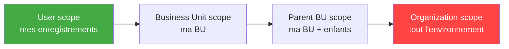

# Sécurité Dataverse : security roles et column-level security

## Objectifs pédagogiques

À l'issue de ce module, vous serez capable de :

1. **Identifier** les vecteurs de surexposition liés à une mauvaise configuration des security roles Dataverse
2. **Configurer** un security role avec les privilèges minimaux nécessaires pour un cas d'usage métier
3. **Implémenter** la column-level security pour protéger des données sensibles au niveau champ
4. **Auditer** les permissions existantes pour détecter des accès excessifs
5. **Distinguer** les erreurs de configuration fréquentes et leurs conséquences réelles en production

---

## Mise en situation

Une entreprise utilise Power Platform pour gérer ses prospects. Un consultant externe se voit attribuer un security role pour accéder à son app Canvas. Trois semaines plus tard, on constate que cet utilisateur a exporté 40 000 lignes de la table `Contact` via Power Apps — incluant les salaires annuels, numéros de sécurité sociale et scores de risque financier de tous les clients.

Ce n'est pas un hack. Aucun exploit. Aucune vulnérabilité CVE.

L'administrateur avait assigné le rôle `Salesperson` standard de Dataverse. Ce rôle donne un accès **Organization-level** en lecture sur `Contact` — soit l'intégralité des enregistrements de l'environnement. Les colonnes sensibles n'étaient pas protégées par de la column-level security. Et l'export vers Excel était activé.

C'est le cas le plus courant de fuite de données sur Power Platform : non pas une attaque, mais une **misconfiguration de privilege scope** combinée à l'**absence de restriction colonne**.

---

## Surface d'exposition : ce que Dataverse expose par défaut

Avant de parler de défense, il faut comprendre ce qui est exposé sans configuration active.

| Vecteur | Exposition par défaut | Impact potentiel |
|---|---|---|
| Security role hérité d'un rôle standard | Accès Organization-level sur tables core (Contact, Account, Lead) | Lecture de tous les enregistrements de l'environnement |
| Absence de column-level security | Toutes les colonnes visibles par qui a accès à la table | Fuite de données sensibles (RH, financier, médical) |
| Droit `Export to Excel` non retiré | L'utilisateur peut extraire en masse via l'interface | Exfiltration de volumes importants sans traçabilité fine |
| Rôle `System Administrator` accordé à un dev de test | Contrôle total de l'environnement | Modification de rôles, suppression de données, accès à tout |
| Basic User + app mal scoped | L'app ouvre plus que ce qu'elle affiche | Accès API direct aux tables sous-jacentes via le connecteur Dataverse |

🔴 **Vecteur fréquent** — Un utilisateur avec une Canvas App "limitée" peut appeler directement l'API Dataverse (`https://<org_prefix>.api.crm.dynamics.com/api/data/v9.2/contacts`) si son security role le permet, indépendamment de ce que l'app affiche. L'interface n'est pas une barrière de sécurité.

---

## Modèle de sécurité Dataverse : ce qu'il faut avoir en tête

🧠 **Concept clé** — Le modèle de sécurité Dataverse est **hiérarchique et cumulatif**. Un utilisateur peut avoir plusieurs rôles. Les permissions s'additionnent — le plus permissif l'emporte. Il n'existe pas de mécanisme natif de "deny explicite" comme dans un ACL classique.

Le modèle repose sur quatre dimensions orthogonales :

```
Qui      → User, Team, Business Unit
Quoi     → Table (Create/Read/Update/Delete/Append/AppendTo/Assign/Share)
Combien  → Scope (User / Business Unit / Parent BU / Organization)
Quelle colonne → Column-level security profiles
```

### Les scopes de privilege : le point le plus mal compris



Le scope **Organization** donne accès à **tous les enregistrements de la table**, pour tous les utilisateurs de l'environnement. C'est le scope attribué par défaut dans la plupart des rôles standard Microsoft.

⚠️ **Erreur fréquente** — Croire que "l'utilisateur ne voit que ce que l'app lui montre". Faux. Le scope est évalué au niveau de l'API Dataverse, pas au niveau de l'interface. Une app Canvas qui filtre par `User().Email` ne restreint pas les appels directs à l'API.

### Choisir le bon scope : matrice de décision

Avant de configurer un rôle, une seule question suffit pour orienter le scope de chaque privilege :

| Question | Réponse | Scope recommandé |
|---|---|---|
| L'utilisateur doit-il voir **uniquement ses propres** enregistrements ? | Oui | **User** |
| L'utilisateur doit-il voir les enregistrements de **toute sa Business Unit** ? | Oui | **Business Unit** |
| Un manager doit-il voir les enregistrements de **sa BU et des BU enfants** ? | Oui | **Parent BU** |
| L'utilisateur a un rôle analytique ou transverse nécessitant une **vue complète** ? | Oui (rare, justifié) | **Organization** |

🔴 **Règle par défaut** — En l'absence de justification explicite, toujours commencer par **User**. Élargir au scope minimum nécessaire après validation métier. Ne jamais attribuer Organization par confort ou par copie d'un rôle standard.

---

## Configurer un security role : du bon scope au moindre privilège

### Anatomy d'un security role

Un security role est un ensemble de **privilèges par table**, chacun avec un niveau de scope. La configuration se fait dans :

`Power Platform Admin Center → Environments → [env] → Settings → Users + Permissions → Security Roles`

Ou depuis la solution, dans `make.powerapps.com` → solution → Security Roles.

Chaque cellule de la grille représente une combinaison **action × scope** :

| Action | Ce que ça couvre |
|---|---|
| **Create** | Créer un enregistrement |
| **Read** | Lire un enregistrement |
| **Write** | Modifier un enregistrement existant |
| **Delete** | Supprimer |
| **Append** | Attacher à un autre enregistrement (ex : note sur contact) |
| **Append To** | Être la cible d'un Append |
| **Assign** | Changer le propriétaire d'un enregistrement |
| **Share** | Partager avec un autre utilisateur |

Les niveaux de scope sont visuellement représentés par des cercles dans l'UI :

- ⬤ vide = aucun accès
- 🟡 1/4 rempli = User
- 🟠 2/4 = Business Unit
- 🟤 3/4 = Parent BU
- 🔴 4/4 = Organization

### Construire un rôle minimal pour une app métier

Cas concret : une app de saisie d'incidents internes. L'utilisateur doit pouvoir créer et voir ses propres incidents, mais pas ceux des autres.

Configuration cible :

| Table | Create | Read | Write | Delete |
|---|---|---|---|---|
| `incident_interne` | User | User | User | Aucun |
| `contact` (lookup) | Aucun | Organization | Aucun | Aucun |
| `systemuser` (lookup user) | Aucun | Organization | Aucun | Aucun |

> Le Read Organization sur `contact` est nécessaire uniquement si l'app affiche un lookup vers les contacts. Si ce n'est pas le cas, User suffit — voire aucun.

🔒 **Contrôle de sécurité** — Créer un rôle dédié par application, pas par profil métier générique. Un rôle `App - Saisie Incidents` est auditablement plus précis qu'un rôle `Utilisateur Standard`.

### Ne jamais partir d'un rôle standard Microsoft pour le modifier

🔴 **Vecteur d'attaque** — Les rôles standard (`Salesperson`, `Marketing Manager`, `Customer Service Representative`) contiennent des dizaines d'autorisations Organization-level héritées de l'ère Dynamics 365. En copier un pour le "réduire" est risqué : on oublie des colonnes, on laisse des scopes trop larges sur des tables qu'on n'a pas vérifiées.

La bonne pratique : **partir d'un rôle vide**, ajouter uniquement les permissions nécessaires, tester.

---

## Column-level security : protéger ce qui est vraiment sensible

### Pourquoi le scope de table ne suffit pas

Un utilisateur avec Read=Organization sur `Contact` peut lire **toutes les colonnes** de tous les contacts — y compris `cr123_salary`, `cr123_ssn`, `cr123_credit_score` si ces colonnes existent dans la table.

La column-level security (CLS) opère à un niveau inférieur : elle restreint la **visibilité et la modification d'une colonne spécifique**, indépendamment du rôle table.

🧠 **Concept clé** — La CLS fonctionne via des **Column Security Profiles**. Un profil définit quelles colonnes il protège, et pour quels utilisateurs ou équipes l'accès (Read/Update/Create) est autorisé. Sans profil assigné, la colonne est accessible à qui a accès à la table.

### Activer la CLS sur une colonne

1. Dans `make.powerapps.com` → Solutions → Table → Colonne → activer **"Enable column security"**
2. Créer un **Column Security Profile** : `Power Platform Admin Center → Environments → Settings → Users + Permissions → Column Security Profiles`
3. Dans le profil, définir l'accès : Allow Read / Allow Update / Allow Create — par colonne
4. Assigner le profil à des **Users ou des Teams**

⚠️ **Comportement critique à connaître** — Quand la CLS est activée sur une colonne, les utilisateurs sans profil autorisé voient la colonne comme **null** — pas d'erreur, pas de message. Ils ne savent pas que la donnée existe. C'est un security-by-obscurity partiel, mais fonctionnel.

### Ce que la CLS ne protège pas

La CLS protège les accès via l'API Dataverse standard. Elle ne protège **pas** :
- Les exports vers Azure Synapse Link ou un Data Lake (la colonne apparaît en clair dans le lake)
- Les requêtes exécutées par un compte **System Administrator** (qui contourne la CLS par définition)
- Les plugins synchrones s'exécutant en tant que SYSTEM

Si votre donnée est ultra-sensible (données de santé, financières réglementées), la CLS est nécessaire mais pas suffisante. Elle doit être combinée avec des restrictions d'export et une surveillance des accès System Administrator.

### Impact de la CLS sur Power BI

Un point souvent ignoré en production : la CLS affecte directement les rapports Power BI connectés à Dataverse.

En mode **Import**, Power BI importe les données avec les credentials du compte de service utilisé pour la connexion. Si ce compte n'a pas de profil CLS autorisant la lecture, les colonnes protégées apparaissent `null` dans le dataset — sans erreur de refresh. Le rapport semble fonctionner, mais les données sont silencieusement tronquées.

En mode **DirectQuery**, chaque requête s'exécute avec les credentials de l'utilisateur du rapport (si RLS Power BI + SSO est configuré) ou du compte de service. Même comportement : colonne null si le compte n'a pas de profil CLS.

🔒 **Bonne pratique** — Créer un **Column Security Profile dédié au compte de service Power BI** avec les permissions de lecture minimales sur les colonnes nécessaires aux rapports. Documenter ce profil dans le dictionnaire de gouvernance.

### Exemple concret de configuration CLS

Scénario : colonne `cr123_salary` sur la table `Contact`. Accessible uniquement aux RH.

```
Étape 1 — Activer la sécurité colonne
  make.powerapps.com → Solutions → Contact → Colonnes → cr123_salary
  → "Activer la sécurité de colonne" : Oui
  → Sauvegarder

Étape 2 — Créer le profil
  Admin Center → Environments → [env] → Settings → Users + Permissions
  → Column Security Profiles → New
  → Nom : "RH - Salaire Contact"
  → Ajouter la colonne cr123_salary : Read=Allow, Update=Allow, Create=Allow

Étape 3 — Assigner le profil
  Ouvrir le profil → Users → Add → [membres équipe RH]
  Ou : Teams → Add → [Team "Ressources Humaines"]
```

🔒 **Contrôle de sécurité** — Préférer assigner les profils CLS à des **Teams** plutôt qu'à des utilisateurs individuels. Quand un RH quitte l'entreprise, il sort de l'équipe et perd l'accès automatiquement, sans manipulation de profil.

---

## Auditer les permissions existantes

Un environnement en production accumule des security roles mal configurés, des utilisateurs avec trop d'accès, des colonnes sensibles jamais protégées. Voici comment auditer sans outil tiers.

### Via Power Platform Admin Center

`Admin Center → Environments → [env] → Settings → Users + Permissions → Users`

Filtrer par rôle pour identifier qui a `System Administrator`. Ce rôle doit être réservé à moins de 3 personnes par environnement.

### Via l'API Dataverse (requêtes OData)

Les requêtes ci-dessous utilisent le format `<ORG_PREFIX>.api.crm.dynamics.com` — remplacer `<ORG_PREFIX>` par le préfixe de votre organisation Dataverse (ex : `contoso` pour `contoso.api.crm.dynamics.com`).

Lister les rôles attribués à un utilisateur :

```
GET https://<ORG_PREFIX>.api.crm.dynamics.com/api/data/v9.2/systemusers(<USER_ID>)?
  $expand=systemuserroles_association($select=name,roleid)
```

Lister tous les utilisateurs avec le rôle System Administrator :

```
GET https://<ORG_PREFIX>.api.crm.dynamics.com/api/data/v9.2/roles?
  $filter=name eq 'System Administrator'
  &$expand=systemuserroles_association($select=fullname,systemuserid)
```

💡 **Astuce** — Ces requêtes peuvent être exécutées via Power Automate (action "Perform an unbound action" ou requête HTTP vers Dataverse) pour générer un rapport hebdomadaire automatique des accès administrateurs.

Détecter les comptes cumulant System Administrator et un rôle applicatif (combinaison dangereuse — accès total + surface d'action étendue) :

```
GET https://<ORG_PREFIX>.api.crm.dynamics.com/api/data/v9.2/systemusers?
  $select=fullname,domainname
  &$expand=systemuserroles_association($select=name)
  &$filter=systemuserroles_association/any(r: r/name eq 'System Administrator')
```

Filtrer ensuite les résultats pour identifier les utilisateurs qui cumulent System Administrator avec d'autres rôles — cette combinaison contourne à la fois CLS et toutes les restrictions de scope.

### Identifier les colonnes sensibles sans CLS activée

Il n'existe pas d'UI native pour lister "toutes les colonnes sans CLS". La méthode la plus rapide utilise les métadonnées Dataverse. La syntaxe correcte pour cibler une table spécifique est :

```
GET https://<ORG_PREFIX>.api.crm.dynamics.com/api/data/v9.2/EntityDefinitions?
  $filter=LogicalName eq '<TABLE_LOGICAL_NAME>'
  &$expand=Attributes($filter=IsSecured eq false;$select=LogicalName,DisplayName,AttributeType)
```

Filtrer ensuite manuellement les colonnes à risque sur les noms contenant `salary`, `ssn`, `password`, `secret`, `token`, `score`.

> **Note** — La syntaxe `EntityDefinitions(LogicalName='...')` n'est pas supportée nativement en OData standard Dataverse. Utiliser le filtre `$filter=LogicalName eq '...'` avec `$expand` sur `Attributes` est la forme correcte. Tester la requête dans Postman avec un token Bearer valide avant toute automatisation.

---

## Hardening : checklist actionnelle

Ce qui suit est applicable en production. Chaque item a un coût réel indiqué.

| Contrôle | Action concrète | Coût / Contrainte |
|---|---|---|
| Principe de moindre privilège sur scope | Créer des rôles dédiés par app, scope User ou BU par défaut | Temps de conception initial, tests à prévoir |
| Supprimer le rôle Basic User par défaut | Ne pas attribuer `Basic User` seul — il donne Read Organization sur plusieurs tables core | Nécessite de recréer les permissions manquantes dans le rôle custom |
| CLS sur colonnes sensibles | Activer la sécurité colonne + créer des profils ciblés | Impact sur les plugins, flows et rapports Power BI qui lisent ces colonnes → tester |
| Restreindre l'export Excel | Dans le security role → onglet "Business Management" → désactiver `Export to Excel` | Peut bloquer des workflows légitimes — à documenter |
| Limiter System Administrator | Auditer trimestriellement, maximum 2-3 comptes par env | Résistance des équipes IT habituées à tout avoir |
| Désactiver les utilisateurs inactifs | Admin Center → Users → filtrer inactive → disable | Simple, souvent oublié |
| Teams plutôt qu'utilisateurs directs | Assigner rôles et profils CLS via AAD Groups / Teams | Dépend de la maturité de la gestion des groupes Azure AD |
| Profil CLS pour compte de service Power BI | Créer un profil CLS dédié avec accès lecture sur les colonnes nécessaires aux rapports | À documenter dans le dictionnaire de gouvernance |

⚠️ **Erreur fréquente** — Activer la CLS sur une colonne utilisée par un Power Automate flow. Le flow tourne avec les credentials du propriétaire de la connexion (service account). Si ce compte n'a pas de profil CLS permettant la lecture, le flow commence à retourner `null` sur ce champ — silencieusement, sans erreur. Le bug prend souvent des semaines à diagnostiquer.

---

## Cas réel en entreprise

**Contexte** : cabinet de conseil, Power Platform déployé pour la gestion des missions. Environnement production partagé entre 200 consultants et 15 managers.

**Incident** : un consultant junior accède à l'application Canvas "Suivi Missions". L'app affiche uniquement ses missions. Mais en inspectant les appels réseau (F12, onglet Network), il observe les requêtes OData vers `https://[org_prefix].api.crm.dynamics.com/api/data/v9.2/cr_missions`. Il reproduit la requête dans Postman avec son token Bearer (récupéré depuis les headers de l'app), sans aucun filtre. Il obtient les 2 000 enregistrements de toutes les missions — incluant les taux journaliers des partenaires et les marges projet.

**Cause** : security role `Basic User` + rôle custom `App Consultant` donnaient tous les deux Read=Organization sur `cr_mission`. La Canvas App filtrait les données côté UI, mais le scope API n'était pas restreint.

**Correction appliquée** :
1. Scope Read sur `cr_mission` réduit à User (le consultant ne lit que les missions dont il est propriétaire ou membre via Append)
2. Colonnes `cr_daily_rate` et `cr_margin` protégées via CLS — profil "Finance Direction" uniquement
3. Rôle `Basic User` retiré des consultants, remplacé par un rôle minimal custom
4. Ajout d'une règle dans le SIEM (Sentinel) sur les appels OData volumineux > 500 enregistrements par session

**Leçon** : la Canvas App n'est pas une barrière de sécurité. Le scope du security role s'applique à l'API, pas à l'interface.

---

## Erreurs fréquentes

**1 — Copier un rôle standard Microsoft et le "restreindre"**
Configuration dangereuse → le rôle `Salesperson` contient 150+ permissions Organization-level héritées de Dynamics 365. En retirant 5 permissions, on laisse 145 autres potentiellement trop larges.
Correction → partir d'un rôle vide, ajouter uniquement ce qui est nécessaire, documenter chaque permission ajoutée.

**2 — Attribuer un rôle directement à un utilisateur sans passer par une équipe**
Configuration dangereuse → quand l'utilisateur change de périmètre ou quitte l'entreprise, le rôle reste s'il n'y a pas de processus de déprovisionnement.
Correction → attribuer les rôles et profils CLS à des Teams liées à des groupes Azure AD. La gestion des accès devient un problème de gestion des groupes, pas de Power Platform.

**3 — Ne pas tester l'impact de la CLS sur les flows et plugins**
Configuration dangereuse → un flow qui lit une colonne protégée par CLS avec un compte sans profil retourne `null` sans erreur. Le comportement applicatif est corrompu silencieusement.
Correction → après activation de la CLS, tester systématiquement les flows et plugins en jeu avec les comptes de service utilisés. Ajouter un profil CLS au compte de service si nécessaire.

**4 — Laisser System Administrator à des comptes de développement en production**
Configuration dangereuse → un compte dev avec System Administrator peut lire toutes les données, modifier tous les rôles, accéder à toutes les colonnes (la CLS ne s'applique pas aux System Administrator).
Correction → utiliser des environnements séparés dev/prod. En prod, les accès System Administrator sont nominatifs, audités et limités à 2-3 comptes.

**5 — Oublier le compte de service Power BI lors de l'activation de la CLS**
Configuration dangereuse → les rapports Power BI connectés en Import ou DirectQuery utilisent un compte de service pour interroger Dataverse. Sans profil CLS sur ce compte, les colonnes protégées apparaissent `null` dans tous les rapports — sans erreur de refresh visible.
Correction → créer un profil CLS dédié au compte de service Power BI, avec les permissions de lecture minimales nécessaires. Vérifier les rapports après toute activation de CLS.

---

## Résumé

Le modèle de sécurité Dataverse repose sur deux niveaux complémentaires : le **security role** contrôle qui peut faire quoi sur quelle table et avec quel scope (User/BU/Organization), tandis que la **column-level security** restreint la visibilité de colonnes spécifiques indépendamment du rôle table. Le vecteur d'exposition le plus fréquent n'est pas une faille technique mais un **scope Organization attribué par défaut** sur des rôles standard, combiné à l'absence de protection colonne sur les données sensibles. La Canvas App n'est pas une barrière — l'API Dataverse est accessible directement avec le token de l'utilisateur, dans la limite de ses permissions. La CLS est efficace contre les accès API standard, mais ne protège pas contre les System Administrators, les exports Synapse Link, ni les rapports Power BI dont le compte de service n'a pas de profil assigné. En production, la bonne posture est : rôles dédiés par application, scope User par défaut (élargi au minimum nécessaire selon la matrice de décision), CLS sur toutes les colonnes sensibles avec profils assignés aux comptes de service concernés, rôles et profils gérés via Teams Azure AD.

---

<!-- snippet
id: dataverse_scope_org_vecteur
type: warning
tech: dataverse
level: intermediate
importance: high
format: knowledge
tags: dataverse,security-roles,scope,privilege,rbac
title: Scope Organization = accès à tous les enregistrements de l'env
content: "Scope Organization sur un privilege Read → l'utilisateur peut lire TOUS les enregistrements de la table, quel que soit le propriétaire. C'est le scope par défaut des rôles standard Microsoft (Salesperson, Basic User…). Correction : réduire à User ou Business Unit selon le besoin métier réel."
description: "Scope Organization est le plus permissif — il ignore le propriétaire de l'enregistrement. Souvent laissé par défaut dans les rôles standard."
-->

<!-- snippet
id: dataverse_canvas_app_pas_barriere
type: concept
tech: dataverse
level: intermediate
importance: high
format: knowledge
tags: dataverse,canvas-app,api,security,rbac
title: La Canvas App n'est pas une barrière de sécurité
content: "Un utilisateur peut reproduire les appels OData d'une Canvas App (F12 → Network) et les rejouer directement avec son Bearer token — sans les filtres UI. Si son security role a un scope Organization, il accède à tous les enregistrements, même ceux que l'app ne lui montre pas."
description: "Le scope du security role s'applique à l'API Dataverse, pas à l'interface de l'app. Toujours sécuriser au niveau du rôle, pas de l'UI."
-->

<!-- snippet
id: dataverse_cls_null_silencieux
type: warning
tech: dataverse
level: intermediate
importance: high
format: knowledge
tags: dataverse,column-level-security,power-automate,plugin,bug
title: CLS activée sans profil → colonne retourne null sans erreur
content: "Quand la column-level security est activée sur une colonne, un utilisateur (ou compte de service de flow) sans profil autorisé reçoit null — pas d'erreur, pas d'exception. Un Power Automate flow peut continuer à tourner avec des données corrompues silencieusement. Correction : ajouter un Column Security Profile au compte de service du flow avec les permissions nécessaires."
description: "CLS sans profil = null silencieux. Les flows et plugins utilisant la colonne doivent avoir un profil CLS explicitement assigné."
-->

<!-- snippet
id: dataverse_sysadmin_contourne_cls
type: concept
tech: dataverse
level: intermediate
importance: high
format: knowledge
tags: dataverse,system-administrator,column-level-security,privilege,bypass
title: System Administrator contourne la column-level security
content: "Le rôle System Administrator ignore la column-level security — il accède à toutes les colonnes protégées sans avoir de profil CLS. La CLS est inefficace si l'utilisateur à risque est System Administrator. Conséquence : limiter absolument ce rôle en production (max 2-3 comptes nominatifs, audités)."
description: "CLS ne protège pas contre System Administrator. Ce rôle doit être traité comme un accès root — restreint, nominatif, audité."
-->

<!-- snippet
id: dataverse_role_vide_partir_de_zero
type: tip
tech: dataverse
level: intermediate
importance: high
format: knowledge
tags: dataverse,security-roles,moindre-privilege,best-practice
title: Partir d'un rôle vide plutôt que de copier un rôle standard
content: "Pour créer un rôle applicatif minimal : dans make.powerapps.com → Solutions → Security Roles → New. Ajouter uniquement les tables et scopes nécessaires à l'app. Ne jamais copier Salesperson ou Basic User — ces rôles contiennent 100+ permissions Organization-level héritées de Dynamics 365 qui resteront si on oublie de les retirer. Chaque permission du rôle doit être intentionnelle et documentée."
description: "Rôle standard copié = surface d'attaque héritée non auditée. Partir de zéro garantit que chaque permission est intentionnelle."
-->

<!-- snippet
id: dataverse_api_audit_sysadmin
type: command
tech: dataverse
level: intermediate
importance: medium
format: knowledge
tags: dataverse,audit,api,odata,system-administrator
title: Lister les utilisateurs avec le rôle System Administrator via OData
context: "Remplacer <ORG_PREFIX> par le préfixe de votre organisation Dataverse (ex : contoso pour contoso.api.crm.dynamics.com). Exécuter avec un Bearer token valide dans Postman ou via une action HTTP Power Automate."
command: "GET https://<ORG_PREFIX>.api.crm.dynamics.com/api/data/v9.2/roles?$filter=name eq 'System Administrator'&$expand=systemuserroles_association($select=fullname,systemuserid)"
example: "GET https://contoso.api.crm.dynamics.com/api/data/v9.2/roles?$filter=name eq 'System Administrator'&$expand=systemuserroles_association($select=fullname,systemuserid)"
description: "Requête OData pour auditer qui a le
