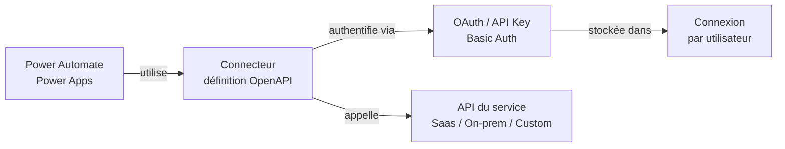
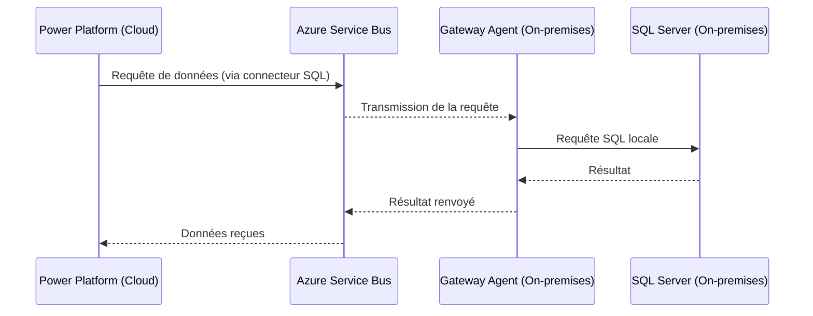

# Connecteurs, connexions et gateway

## Objectifs pédagogiques

À l'issue de ce module, vous serez capable de :

1. **Distinguer** un connecteur d'une connexion et comprendre pourquoi cette nuance change tout dans la gouvernance d'une solution
2. **Identifier** les trois catégories de connecteurs (standard, premium, custom) et leurs implications pour les licences et les architectures
3. **Configurer** une connexion vers une source de données externe depuis Power Apps ou Power Automate
4. **Expliquer** le rôle de l'on-premises data gateway et choisir entre gateway personnelle et gateway d'entreprise
5. **Diagnostiquer** les erreurs de connexion courantes dans un flux ou une application

---

## Mise en situation

Vous intégrez une entreprise qui utilise Power Automate pour automatiser des validations de commandes. Le flux existant lit des données depuis SharePoint, les enrichit avec une API externe, puis écrit dans une base SQL Server hébergée **on-premises** derrière le pare-feu interne.

Tout fonctionnait jusqu'à ce que le collègue qui avait créé le flux quitte la société. Depuis, le flux s'exécute avec son compte — et personne ne sait pourquoi. Quand vous essayez de republier, vous tombez sur une erreur de connexion pour SQL Server. Et la gateway ? Personne ne sait qui l'administre.

Ce scénario, vous le croiserez. Il concentre trois problèmes distincts : la propriété des connexions, la dépendance à une gateway mal gouvernée, et la confusion entre ce que fait le connecteur et ce que fait la connexion. Ce module démonte tout ça.

---

## Contexte et problématique

### Pourquoi les connecteurs existent

Power Platform est une plateforme de données avant d'être une plateforme de code. La plupart des applications et des flux n'ont pas besoin de traiter de la logique métier complexe — ils ont surtout besoin de **lire et écrire dans des systèmes existants** : un ERP, une messagerie, une base de données, une API REST.

Mais chaque système a son protocole, ses méthodes d'authentification, ses endpoints spécifiques. Sans abstraction, chaque développeur devrait gérer OAuth, les en-têtes HTTP, les retries, la pagination — avant même d'écrire la moindre règle métier.

Les connecteurs sont cette abstraction. Ils exposent un système tiers comme un ensemble d'**actions** et de **déclencheurs** standardisés, consommables depuis n'importe quel outil Power Platform sans écrire une ligne d'intégration bas niveau.

💡 Un connecteur n'est pas une connexion. Le connecteur est la *définition* de comment communiquer avec un service. La connexion est l'*instance authentifiée* de cette communication, liée à un compte utilisateur spécifique.

---

## Anatomie d'un connecteur

Avant de configurer quoi que ce soit, il faut comprendre ce qu'est réellement un connecteur sous le capot.

Un connecteur est une **définition OpenAPI** (anciennement Swagger) qui décrit :
- L'URL de base du service cible
- Les opérations disponibles (GET, POST, PATCH…)
- Le schéma des paramètres d'entrée et des réponses
- Le mécanisme d'authentification attendu (OAuth 2.0, API Key, Basic Auth…)

Quand vous ajoutez une action "Envoyer un e-mail" depuis le connecteur Outlook dans un flux, Power Automate appelle en réalité l'API Microsoft Graph en passant votre token OAuth — le connecteur gère la plomberie, vous ne voyez que l'action.



### Les trois familles de connecteurs

| Famille | Exemples | Licence requise | Remarque |
|---|---|---|---|
| **Standard** | SharePoint, Teams, Outlook, Excel Online | Microsoft 365 incluse | Gratuit dans les licences M365 courantes |
| **Premium** | SQL Server, Salesforce, SAP, HTTP, Dataverse (hors env. par défaut) | Power Apps / Power Automate Premium | Bloque le partage si l'utilisateur final n'a pas la licence |
| **Custom** | API internes, connecteurs maison | Premium | Développés par votre organisation |

⚠️ Le connecteur Dataverse a un statut particulier : il est **standard** dans l'environnement par défaut, mais **premium** dans un environnement dédié. C'est un piège classique en déploiement multi-environnements.

---

## Connexions : ce que personne n'explique clairement

### Une connexion est personnelle par défaut

Quand vous créez une connexion dans Power Apps ou Power Automate, vous vous authentifiez avec **votre compte**. Le token OAuth qui en résulte est stocké dans votre tenant, lié à votre identité.

Conséquence directe : si vous partagez un flux ou une application, les autres utilisateurs doivent **créer leurs propres connexions** vers les mêmes services. Ils ne réutilisent pas la vôtre — sauf dans certains scénarios de flux partagés où la connexion du créateur est utilisée implicitement.

C'est la source du scénario de départ : le flux utilisait la connexion SQL du collègue parti. Quand son compte a été désactivé, la connexion est devenue invalide, et le flux s'est mis en erreur.

### Où vivent les connexions

Dans Power Automate, allez dans **Data → Connections**. Vous verrez toutes vos connexions actives avec leur état. Une connexion peut avoir trois états :

- ✅ **Connected** — le token est valide
- ⚠️ **Fix connection** — le token a expiré ou les droits ont changé, réauthentification nécessaire
- ❌ **Error** — la ressource cible est inaccessible (gateway down, service indisponible…)

💡 Une connexion avec l'état "Fix connection" ne casse pas immédiatement un flux en production — mais dès que le flux essaie de l'utiliser, il échoue. Le monitoring proactif des connexions fait partie de l'administration d'une solution.

### Connexions dans un contexte d'équipe

Pour un flux utilisé par plusieurs personnes ou un flux de type "service account", la bonne pratique est de créer la connexion avec un **compte de service dédié** (une identité M365 non nominative), pas avec un compte personnel. Ainsi, si un membre de l'équipe quitte, rien ne se casse.

---

## On-Premises Data Gateway : le pont vers le réseau interne

### Le problème qu'elle résout

Power Platform s'exécute dans le cloud Microsoft. Votre SQL Server, votre Oracle, votre fichier partagé sur un serveur de fichiers interne — eux, ils sont dans votre réseau d'entreprise, derrière un pare-feu, sans exposition directe sur Internet.

Comment un service cloud peut-il appeler un service interne sans ouvrir de port entrant dans votre firewall ?

La gateway répond à ce problème avec une approche **inverse** : au lieu que le cloud appelle le réseau interne, c'est le gateway agent (installé sur une machine de votre réseau) qui **initie une connexion sortante persistante** vers Azure Service Bus. Les requêtes de Power Platform transitent via ce canal.



Aucun port entrant n'est ouvert. C'est la machine gateway qui sort vers Azure — ce que la plupart des politiques réseau autorisent par défaut sur le port 443.

### Gateway personnelle vs gateway d'entreprise

Il existe deux modes d'installation :

**Gateway personnelle (Personal Mode)**
- Installée sur le poste d'un utilisateur
- Utilisable uniquement par cet utilisateur
- Ne peut pas être partagée entre plusieurs personnes
- Adaptée aux scénarios de développement individuel ou de Power BI Desktop

**Gateway d'entreprise (Standard Mode)**
- Installée sur un serveur dédié (ou plusieurs, pour la haute disponibilité)
- Partageable entre plusieurs utilisateurs et environnements
- Administrée via le Power Platform Admin Center
- Recommandée pour tout usage en production

⚠️ Une gateway personnelle installée sur un laptop s'arrête quand le laptop est éteint ou en veille. Si votre flux de production s'appuie dessus, il tombera en dehors des heures de bureau. C'est un antipattern fréquent en phase de dev qui migre accidentellement en prod.

### Installer et configurer une gateway d'entreprise

La procédure se déroule en deux temps : installation de l'agent, puis enregistrement dans le tenant.

**Installation de l'agent**

Téléchargez l'installateur depuis [aka.ms/on-premises-data-gateway](https://aka.ms/on-premises-data-gateway) et exécutez-le sur la machine serveur. Pendant l'installation, vous vous connectez avec un compte M365 — ce compte devient l'administrateur principal de la gateway.

**Chemin d'administration dans le Power Platform Admin Center**

```
Power Platform Admin Center
  → Data (menu gauche)
    → On-premises data gateways
      → [Votre gateway apparaît ici]
        → Settings : région, contacts, membres autorisés
        → Status : état en temps réel, version de l'agent
```

**Associer une connexion à une gateway**

Depuis Power Automate ou Power Apps, quand vous créez une connexion vers SQL Server on-premises, un champ supplémentaire apparaît : **Gateway**. Vous sélectionnez la gateway enregistrée dans votre tenant. La connexion passera désormais par ce canal.

🧠 La gateway est enregistrée dans une **région Azure**. Si votre environnement Power Platform est dans une région différente, des latences supplémentaires apparaissent — et certaines combinaisons ne sont pas supportées. Vérifiez la cohérence de région lors du déploiement.

### Haute disponibilité de la gateway

Pour éviter qu'une seule machine soit un point de défaillance unique, vous pouvez créer un **cluster de gateway** : plusieurs agents installés sur des machines différentes, regroupés sous le même nom logique. Power Platform bascule automatiquement vers un agent disponible.

```
Lors de l'installation du second agent :
  → "Add to an existing gateway cluster"
  → Saisir le nom et la clé de récupération du cluster principal
```

---

## Custom Connectors : quand les connecteurs du catalogue ne suffisent pas

Si votre organisation expose des API internes (REST/SOAP) non couvertes par le catalogue Microsoft, vous pouvez créer un connecteur personnalisé.

Le principe : vous importez la définition OpenAPI de votre API (ou vous la décrivez manuellement), vous configurez l'authentification, et le connecteur apparaît dans Power Apps / Power Automate comme n'importe quel connecteur natif.

**Chemin de création**

```
Power Automate → Data → Custom connectors → + New custom connector
  → Import an OpenAPI file / Import from URL / Create from blank
    → Définir : host, base URL, authentification
    → Décrire les actions et triggers
    → Tester depuis l'interface
    → Publier
```

💡 Un custom connector est **premium** par définition. Tout utilisateur final d'une app ou d'un flux qui l'utilise devra avoir une licence Power Apps Premium ou Power Automate Premium.

### Partage d'un custom connector

Par défaut, un custom connector est visible uniquement par son créateur. Pour le partager :

```
Custom connectors → [Votre connecteur] → Share
  → Ajouter des utilisateurs ou "Share with everyone in my org"
```

Pour le déployer dans d'autres environnements, il doit être inclus dans une solution — ce qui est la bonne pratique ALM de toute façon.

---

## Cas réel en entreprise

**Contexte :** Une équipe RH utilise un flux Power Automate pour synchroniser les nouvelles embauches entre leur SIRH on-premises et SharePoint Online. Le flux s'exécute toutes les heures.

**Problème rencontré :** Après une mise à jour de Windows Server, la gateway cesse de fonctionner. Tous les flux dépendants s'arrêtent silencieusement — personne n'est alerté pendant 6 heures.

**Diagnostic :**

```
Power Platform Admin Center
  → Data → On-premises data gateways
    → État : Offline (dernière connexion : 6h ago)
```

L'agent gateway avait été arrêté par la mise à jour. Redémarrage manuel du service `On-premises data gateway service` depuis les services Windows, et les flux ont repris.

**Ce que l'équipe a mis en place après :**
- Ajout d'un second agent au cluster pour la haute disponibilité
- Alerte email configurée dans le Power Platform Admin Center sur les changements d'état de la gateway
- La connexion SQL a été migrée sur un compte de service dédié plutôt que le compte personnel du développeur initial

---

## Bonnes pratiques

**Sur les connexions**
- Toujours utiliser un compte de service pour les flux de production — jamais le compte d'un développeur nommé
- Documenter quelle connexion est utilisée par quel flux dans un registre (même une liste SharePoint simple suffit)
- Revalider les connexions après tout changement de mot de passe ou de politique MFA

**Sur la gateway**
- En production, toujours un cluster d'au moins deux agents
- Installer la gateway sur un serveur dédié, pas sur un poste de travail
- Garder l'agent gateway à jour — les versions trop anciennes sont dépréciées et bloquées
- Affecter au moins deux administrateurs sur chaque cluster

**Sur les custom connectors**
- Toujours inclure le custom connector dans une solution pour faciliter le déploiement entre environnements
- Versionner la définition OpenAPI dans un dépôt Git
- Tester l'authentification dans un environnement de développement avant de toucher la production

---

## Résumé

| Concept | Rôle | Points clés |
|---|---|---|
| **Connecteur** | Définition abstraite de l'intégration avec un service | Standard / Premium / Custom — impacte la licence |
| **Connexion** | Instance authentifiée, liée à un utilisateur | Personnelle par défaut — utiliser un compte de service en prod |
| **Gateway personnelle** | Pont cloud/on-prem pour un seul utilisateur | Ne pas utiliser en production |
| **Gateway d'entreprise** | Pont cloud/on-prem partagé, administré centralement | Cluster recommandé, région à aligner avec l'environnement |
| **Custom connector** | Connecteur maison pour API internes | Toujours premium, à versionner dans une solution |

La prochaine étape logique après avoir maîtrisé les connecteurs et les connexions, c'est de décider **qui a le droit d'utiliser quoi** — c'est précisément ce que les DLP Policies permettent de contrôler, en classifiant les connecteurs et en imposant des frontières entre les groupes de données.

---

<!-- snippet
id: pp_connector_vs_connection
type: concept
tech: Power Platform
level: intermediate
importance: high
format: knowledge
tags: connecteur,connexion,authentification,power-automate
title: Connecteur ≠ Connexion — distinction fondamentale
content: Un connecteur est une définition OpenAPI décrivant comment appeler un service (endpoints, auth, schéma). Une connexion est l'instance authentifiée de ce connecteur, liée à un compte utilisateur spécifique et stockant le token OAuth. On partage un connecteur, mais chaque utilisateur a sa propre connexion.
description: Si la connexion est créée avec le compte d'un employé qui quitte, tous les flux qui l'utilisent tombent en erreur dès la désactivation du compte.
-->

<!-- snippet
id: pp_connection_service_account
type: tip
tech: Power Platform
level: intermediate
importance: high
format: knowledge
tags: connexion,compte-de-service,production,power-automate,gouvernance
title: Toujours utiliser un compte de service pour les connexions en prod
content: Créer une connexion avec un compte M365 non nominatif dédié (ex : svc-powerautomate@contoso.com). Ainsi, le départ d'un collaborateur ne casse aucun flux. Configurer ce compte avec une licence Power Automate Premium et une politique de non-expiration de mot de passe.
description: Les flux qui utilisent la connexion d'un compte personnel tombent silencieusement en erreur dès que ce compte est désactivé ou que son MFA expire.
-->

<!-- snippet
id: pp_gateway_personal_vs_enterprise
type: warning
tech: Power Platform
level: intermediate
importance: high
format: knowledge
tags: gateway,on-premises,production,high-availability
title: Gateway personnelle interdite en production
content: Piège : la gateway personnelle s'arrête dès que le poste est éteint ou en veille. Conséquence : tous les flux on-premises tombent en dehors des heures de bureau. Correction : installer une gateway d'entreprise sur un serveur dédié, idéalement en cluster avec au moins deux agents.
description: Ce piège survient fréquemment quand un dev installe une gateway personnelle sur son laptop en phase de développement et que la solution migre en production sans changement.
-->

<!-- snippet
id: pp_gateway_cluster_config
type: tip
tech: Power Platform
level: intermediate
importance: medium
format: knowledge
tags: gateway,cluster,haute-disponibilite,on-premises
title: Ajouter un agent à un cluster de gateway existant
content: Lors de l'installation du second agent gateway, sélectionner "Add to an existing gateway cluster", puis saisir le nom du cluster et sa clé de récupération. Power Platform bascule automatiquement vers un agent disponible en cas de défaillance du premier.
description: Sans cluster, une mise à jour serveur ou un redémarrage non planifié suffit à bloquer tous les flux on-premises pendant plusieurs heures.
-->

<!-- snippet
id: pp_dataverse_connector_premium
type: warning
tech: Power Platform
level: intermediate
importance: high
format: knowledge
tags: dataverse,connecteur,premium,environnement,licence
title: Dataverse est standard dans l'env par défaut, premium ailleurs
content: Piège : le connecteur Dataverse est classé standard uniquement dans l'environnement par défaut du tenant. Dans tout environnement dédié (dev, test, prod), il devient premium. Un flux migré de l'environnement par défaut vers un environnement de production nécessite donc une licence Premium pour tous les utilisateurs finaux.
description: Ce changement de classification bloque le partage de l'application ou du flux si les utilisateurs finaux n'ont pas la bonne licence.
-->

<!-- snippet
id: pp_connection_fix_state
type: warning
tech: Power Platform
level: intermediate
importance: medium
format: knowledge
tags: connexion,erreur,monitoring,power-automate
title: L'état "Fix connection" ne casse pas immédiatement un flux
content: Piège : une connexion en état "Fix connection" (token expiré, MFA révoqué) ne génère pas d'erreur visible tant que le flux ne s'exécute pas. Le flux peut sembler sain dans le tableau de bord, puis échouer à la prochaine exécution. Surveiller l'état des connexions dans Power Automate → Data → Connections de façon proactive.
description: En production, monitorer les connexions critiques au moins hebdomadairement pour détecter les tokens expirés avant qu'ils impactent les utilisateurs.
-->

<!-- snippet
id: pp_custom_connector_solution
type: tip
tech: Power Platform
level: intermediate
importance: medium
format: knowledge
tags: custom-connector,solution,alm,deploiement
title: Toujours inclure un custom connector dans une solution
content: Un custom connector créé hors solution est non déployable via pipeline ALM et invisible dans les autres environnements. Créer le connecteur directement depuis Soluions → [votre solution] → + Add existing → Automation → Custom connector. Versionner la définition OpenAPI dans Git en parallèle.
description: Sans solution, le custom connector ne peut pas être exporté/importé entre environnements, ce qui bloque tout processus de déploiement structuré.
-->

<!-- snippet
id: pp_gateway_region_alignment
type: warning
tech: Power Platform
level: intermediate
importance: medium
format: knowledge
tags: gateway,region,azure,latence,configuration
title: Aligner la région de la gateway avec celle de l'environnement Power Platform
content: Piège : la gateway est enregistrée dans une région Azure au moment de l'installation. Si l'environnement Power Platform est dans une région différente, les requêtes transitent entre régions — latence accrue et certaines combinaisons non supportées. Vérifier la région dans Power Platform Admin Center → Data → On-premises data gateways → Settings.
description: Un décalage de région peut provoquer des timeout inexplicables ou des erreurs de connexion intermittentes difficiles à diagnostiquer.
-->

<!-- snippet
id: pp_gateway_admin_center
type: tip
tech: Power Platform
level: intermediate
importance: medium
format: knowledge
tags: gateway,admin-center,monitoring,administration
title: Superviser l'état d'une gateway depuis le Power Platform Admin Center
content: Chemin : Power Platform Admin Center → Data → On-premises data gateways → [Nom du cluster] → Status. Affiche l'état en temps réel de chaque agent (Online/Offline), la version installée et la date de dernière connexion. Configurer une alerte email sur changement d'état depuis l'onglet Settings du cluster.
description: Sans alerte configurée, une gateway hors ligne passe inaperçue jusqu'à ce qu'un utilisateur signale une erreur dans un flux ou une app.
-->
