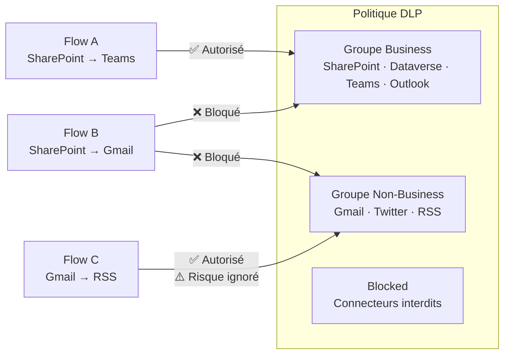
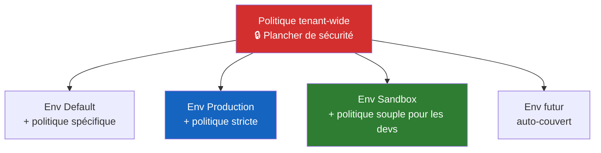

# DLP Policies et gouvernance des connecteurs

## Objectifs pédagogiques

À l'issue de ce module, vous serez capable de :

- **Identifier** les configurations de connecteurs qui ouvrent une fuite de données involontaire entre systèmes sensibles et systèmes publics
- **Analyser** une politique DLP existante pour détecter ses angles morts et ses incohérences
- **Diagnostiquer** pourquoi un flow ou une app est bloqué par une DLP policy et distinguer un vrai blocage d'une mauvaise classification
- **Choisir** une stratégie de classification des connecteurs cohérente avec le profil de risque d'une organisation donnée — startup, ETI, banque, administration publique
- **Intégrer** les DLP policies dans un processus opérationnel de gouvernance : alertes, audit, revue, escalade

---

## Mise en situation

En 2023, une collectivité territoriale française utilisant Power Automate voit ses données RH partir vers un service SaaS externe. Le flow incriminé avait été créé par un utilisateur métier, sans revue IT. Il lisait des données dans une liste SharePoint contenant des informations nominatives d'agents publics, puis les envoyait automatiquement vers un compte Gmail via le connecteur Gmail — entièrement configuré par l'utilisateur, sans aucune approbation.

Le tenant n'avait pas de DLP policy active. L'administrateur pensait que les droits sur les données SharePoint suffisaient à protéger les données. Ce n'est pas le cas : **un utilisateur qui peut lire des données dans Power Apps ou Power Automate peut les envoyer n'importe où, tant qu'un connecteur le permet**.

C'est exactement le problème que les DLP policies sont conçues à résoudre — et c'est aussi exactement là qu'elles échouent quand elles sont mal configurées.

---

## Ce que les DLP policies régulent réellement

### Ce n'est pas du chiffrement, c'est de la topologie

🧠 **Concept clé** — Les DLP policies Power Platform ne chiffrent pas les données, n'auditent pas leur contenu et ne détectent pas les informations sensibles au sens RGPD. Elles régulent **quels connecteurs peuvent coexister dans un même flow ou une même app**.

La logique est celle d'une frontière réseau logique : deux connecteurs dans des groupes différents ne peuvent pas être utilisés ensemble dans la même ressource. C'est tout. Si un utilisateur contourne en créant deux flows distincts — l'un qui lit, l'autre qui écrit — la DLP n'y voit rien.

Ce n'est pas une faiblesse à déplorer, c'est une contrainte de conception à intégrer dans votre modèle de gouvernance.

### Les trois groupes

Une DLP policy classifie chaque connecteur dans l'un de ces trois groupes :

| Groupe | Comportement | Cas d'usage typique |
|---|---|---|
| **Business** | Peut communiquer avec les autres connecteurs du groupe Business | Connecteurs approuvés pour les données d'entreprise : SharePoint, Dataverse, Teams, Outlook |
| **Non-Business** | Peut communiquer avec les autres connecteurs Non-Business, mais jamais avec Business | Connecteurs consommateur ou non validés : Twitter, Gmail, RSS |
| **Blocked** | Le connecteur ne peut pas être utilisé du tout dans ce périmètre | Services totalement interdits : connecteurs tiers non homologués |

Un flow qui tente de mélanger un connecteur Business et un connecteur Non-Business est bloqué à l'enregistrement — pas à l'exécution. C'est important : un flow créé avant la mise en place d'une politique reste en place, mais ne peut plus être modifié ni réactivé.



⚠️ **Erreur fréquente** — Placer un connecteur dans "Non-Business" en pensant qu'il est alors "sécurisé". Il peut toujours être utilisé avec d'autres connecteurs Non-Business. Si Gmail et un connecteur d'export CSV sont tous les deux en Non-Business, un utilisateur peut construire un flow qui exporte n'importe quelle donnée Non-Business vers Gmail — sans déclencher la moindre alerte DLP.

Exemple concret : un flow Non-Business 100% conforme à la politique DLP peut enchaîner :

1. Lire une liste Planner (Non-Business)
2. Formater les données via Data Operation (Non-Business)
3. Envoyer le fichier CSV résultant vers Gmail (Non-Business)

Chaque étape est conforme. L'ensemble constitue une exfiltration. Seul le groupe **Blocked** interdit réellement l'usage d'un connecteur.

---

## Périmètre d'application : tenant vs environnement

C'est la première décision structurante à prendre, et la plus souvent mal comprise.

### Deux niveaux, deux intentions

Une DLP policy peut s'appliquer à :

- **Tous les environnements du tenant** (y compris ceux créés dans le futur)
- **Des environnements spécifiques** (liste d'inclusion)
- **Tous les environnements sauf certains** (liste d'exclusion)

La politique tenant-wide est la politique de sécurité de base. Elle définit le plancher de sécurité qui s'applique partout, y compris aux environnements Default — celui que tout utilisateur M365 peut utiliser sans demander de permission.

Une politique d'environnement peut être **plus restrictive** que la politique tenant, jamais plus permissive. Si la politique tenant interdit Gmail, une politique d'environnement ne peut pas le réautoriser.



🔴 **Vecteur d'attaque** — L'environnement Default est le vecteur de fuite de données le plus courant sur les tenants mal gouvernés. Tout utilisateur M365 peut y créer des flows et des apps. Sans politique DLP sur cet environnement, n'importe qui peut construire un flow qui lit SharePoint et écrit dans n'importe quel service externe. La première politique DLP à déployer n'est pas celle de la production — c'est celle de l'environnement Default.

---

## Diagnostiquer une politique DLP existante

### Les quatre questions à poser

Avant de modifier une politique DLP, posez-vous ces quatre questions dans l'ordre :

**1. Quels connecteurs sont actuellement en Business ?**

Allez dans [Power Platform Admin Center](https://admin.powerplatform.microsoft.com) → Policies → DLP Policies → sélectionnez la politique → onglet Connectors. Filtrez par groupe "Business" et exportez la liste. Tout connecteur Business peut potentiellement accéder à vos données Dataverse ou SharePoint.

**2. Y a-t-il des connecteurs custom dans la politique ?**

Les connecteurs custom (créés par les développeurs pour appeler des APIs tierces) ne sont pas automatiquement inclus dans une DLP policy. Par défaut, ils tombent dans le groupe "Non-Business". Si votre organisation a des connecteurs custom qui accèdent à des données sensibles, vérifiez qu'ils sont explicitement classifiés en "Business" ou "Blocked" selon leur usage.

**3. La politique couvre-t-elle l'environnement Default ?**

C'est le point de contrôle le plus critique. Une politique qui ne couvre que les environnements de production laisse l'environnement Default entièrement ouvert.

**4. Des flows existants sont-ils en état "suspended" depuis le déploiement de la politique ?**

Quand une politique DLP rend non conforme un flow existant, ce flow est suspendu automatiquement. Il ne tourne plus, mais il n'est pas supprimé. Allez dans Power Automate → My Flows → filtrez par statut "Suspended" pour identifier les flows impactés.

### Lire un conflit DLP

Quand un utilisateur essaie de sauvegarder un flow bloqué par une DLP, l'erreur ressemble à ceci :

```
This app/flow uses connectors that are not compatible under the current 
Data Loss Prevention policy:
- SharePoint (Business)
- Gmail (Non-Business)

These connectors cannot be used together in the same app or flow.
```

Ce message donne exactement le diagnostic : deux connecteurs de groupes différents dans la même ressource. La correction est soit de changer la classification d'un des connecteurs dans la politique, soit de scinder le flow en deux.

💡 **Astuce** — Avant de modifier une politique en production, utilisez le bouton "What's the impact?" disponible dans l'interface DLP du Power Platform Admin Center. Il liste les flows et apps qui seront suspendus par le changement. Si l'outil remonte 15 flows suspendus dont 3 marqués comme critiques par le métier, ne déployez pas avant d'avoir proposé une alternative conforme à leurs propriétaires. Ne sautez jamais cette étape sur un tenant avec plus de quelques dizaines d'utilisateurs.

---

## Surface d'exposition : ce que la DLP ne voit pas

| Vecteur | Exposition | Impact potentiel |
|---|---|---|
| Flow en deux étapes (lire + écrire séparés) | Non détecté par la DLP | Contournement total possible par un utilisateur averti |
| Connecteur HTTP générique | Très large — toute URL | Exfiltration vers n'importe quelle endpoint externe |
| Connecteur custom non classifié | Non-Business par défaut | Données métier accessibles via API sans contrôle |
| Power Apps Canvas avec export Excel | Non contrôlé par la DLP | Extraction manuelle hors périmètre numérique |
| Environnement Default sans politique | Aucune restriction | N'importe quel utilisateur M365 peut créer des flows non conformes |

### Le contournement en deux flows : comprendre le vecteur

La DLP analyse les connecteurs d'une même ressource, pas les chaînes entre ressources. Un utilisateur peut donc construire :

```
Flow A (100% Business) :
  SharePoint → lire ligne RH → stocker dans variable Dataverse

Flow B (100% Non-Business) :
  Dataverse → lire variable → Gmail → envoyer email
```

Chaque flow est individuellement conforme. Ensemble, ils forment une chaîne d'exfiltration invisible pour la DLP. Ce contournement est le plus souvent **involontaire** — l'utilisateur n'a pas eu l'intention de contourner une règle, il a juste résolu son problème en deux étapes. C'est précisément pour ça qu'il est difficile à détecter sans audit de flux de données croisé.

🔴 **Vecteur d'attaque — le connecteur HTTP** — Le connecteur HTTP (Premium) est le plus dangereux à laisser en "Business". Il permet d'appeler n'importe quelle URL avec n'importe quel payload. Un utilisateur peut lire des données Dataverse, les formater en JSON et les POST vers une URL externe via une seule action HTTP, sans jamais déclencher d'alerte DLP. Le flow est 100% Business, 100% conforme, et exfiltre des données vers un webhook Zapier ou un endpoint inconnu. Si votre organisation n'a pas de besoin légitime pour ce connecteur en Business, mettez-le en Blocked.

---

## Quelle politique DLP pour quel profil d'organisation ?

C'est la question que les frameworks de gouvernance évitent souvent de trancher — parce que la réponse dépend du contexte. Voici un arbre décisionnel basé sur trois critères objectifs : **sensibilité des données**, **maturité de gouvernance**, et **taille de la base d'utilisateurs**.

### Matrice de classification par profil de risque

| Profil | Caractéristiques | Gmail / Réseaux sociaux | HTTP générique | Connecteurs custom | OneDrive Personnel |
|---|---|---|---|---|---|
| **Startup / petite structure** | Données peu sensibles, gouvernance naissante, moins de 50 makers | Non-Business | Non-Business | Business si usage métier | Non-Business |
| **ETI** | Données clients/RH, gouvernance partielle, 50–500 makers | Blocked | Blocked | Business après revue | Blocked |
| **Grand compte / banque** | Données réglementées, gouvernance structurée, >500 makers | Blocked | Blocked | Blocked par défaut, Business sur exception | Blocked |
| **Administration publique** | Données nominatives agents/citoyens, contraintes RGPD/RGS, makers variés | Blocked | Blocked | Blocked par défaut | Blocked |

**Comment lire ce tableau :** chaque ligne correspond à un niveau de restrictivité croissant. Une startup peut se permettre de laisser Gmail en Non-Business parce que ses données ne sont pas réglementées et que bloquer des outils familiers nuirait à l'adoption sans gain réel. Une banque n'a pas ce luxe.

### Le dilemme classique : usabilité vs sécurité

Voici un vrai conflit de contraintes, résolu de manière transparente.

**Problème :** une équipe de 50 utilisateurs métier utilise quotidiennement Outlook et Teams (Business). Elle a aussi besoin d'un service de chatbot externe (Non-Business) pour enrichir automatiquement ses tickets. Si vous mettez le chatbot en Non-Business, ses utilisateurs ne peuvent plus mixer Outlook et le chatbot dans le même flow. Si vous le mettez en Business, vous l'autorisez à accéder à toutes les données SharePoint de l'organisation.

**Réflexion :** la question n'est pas "Business ou Non-Business ?" mais "ce connecteur a-t-il été audité, son éditeur est-il fiable, et l'accès à nos données est-il justifié ?"

**Compromis retenu :**
1. Auditer le connecteur chatbot : qui l'édite, quelles données transite-t-il, quelles sont ses conditions d'utilisation ?
2. Si l'éditeur est fiable et l'usage limité : créer un **environnement dédié** pour cette équipe avec une politique DLP spécifique où le chatbot est en Business — isolé du reste du tenant.
3. Sur la politique tenant-wide : le chatbot reste Non-Business ou Blocked.

C'est le principe de l'environnement comme périmètre d'exception : vous ne relâchez pas la sécurité globale, vous créez un silo contrôlé pour le cas particulier.

> ⚠️ **La règle d'or** — Une politique DLP trop permissive expose vos données. Une politique trop restrictive génère des contournements : les utilisateurs trouvent d'autres outils, hors périmètre Power Platform, totalement invisibles. Le bon niveau de restrictivité est celui que vos utilisateurs respectent — parce qu'ils comprennent pourquoi.

---

## Cas réel : diagnostic d'un tenant mal gouverné

### Contexte

Une ESN déploie Power Platform pour un client grand compte. Après 6 mois de production, l'équipe de sécurité réalise qu'il existe 340 flows actifs sur le tenant, dont 87 dans l'environnement Default — créés par des utilisateurs métier sans aucune revue. La DLP en place ne couvre que les environnements de production et de recette.

### Ce que l'audit révèle

En inspectant les flows de l'environnement Default via le Power Platform Admin Center → Resources → Flows, l'équipe identifie :

- 12 flows utilisant le connecteur Gmail avec des données SharePoint RH en entrée
- 3 flows utilisant le connecteur OneDrive Personnel (et non OneDrive Entreprise) pour stocker des données de clients
- 1 flow utilisant le connecteur HTTP pour envoyer des données vers un webhook Zapier externe

Aucun de ces flows n'est malveillant. Tous ont été créés avec de bonnes intentions par des utilisateurs qui ne connaissaient pas les contraintes de gouvernance.

### La séquence de correction — avec justification des choix

**Étape 1 : Étendre la politique DLP existante à l'environnement Default — immédiatement.**

Pourquoi maintenant ? Parce que chaque jour supplémentaire sans politique, de nouveaux flows peuvent être créés. Les flows suspendus ne disparaissent pas et peuvent être revus tranquillement. Les nouveaux flows non conformes, eux, s'accumulent.

**Étape 2 : Inventorier les flows suspendus — identifier ceux qui ont un usage légitime.**

Pour ceux-là, proposer une alternative conforme. Remplacer Gmail par Outlook, OneDrive Personnel par SharePoint. Ne jamais supprimer un flow suspendu sans avoir identifié son usage — certains peuvent être critiques pour le métier.

**Étape 3 : Mettre Gmail en Blocked sur la politique tenant-wide — pas en Non-Business.**

Pourquoi Blocked et pas Non-Business ? Parce que Non-Business n'interdit pas Gmail, il empêche seulement son mélange avec Business. Un flow Gmail → export CSV (tous deux Non-Business) resterait parfaitement valide. Sur un profil grand compte avec des données RH, ce risque résiduel n'est pas acceptable. Gmail n'a aucun usage légitime dans ce contexte professionnel — il doit être interdit, pas reclassifié.

**Étape 4 : Mettre OneDrive Personal en Blocked pour la même raison.**

OneDrive Personnel n'est pas un stockage d'entreprise. Les données clients qui y transitent échappent au contrôle du tenant. Le risque de conformité RGPD est direct.

**Étape 5 : Mettre le connecteur HTTP en Blocked sauf pour les environnements de développement où son usage est contrôlé.**

Le webhook Zapier identifié à l'étape d'audit est le cas typique : un utilisateur a résolu un problème réel (intégration avec un outil externe) via le chemin de moindre résistance. La bonne réponse n'est pas de bloquer sans alternative — c'est de bloquer HTTP globalement et de proposer un custom connector audité pour ce cas légitime.

**Étape 6 : Activer les alertes sur la création de flows dans Default via Purview et Admin Analytics.**

---

## Gouvernance opérationnelle : au-delà du blocage technique

Une DLP policy ne génère pas d'alertes par elle-même. Elle bloque ou suspend — elle n'informe pas proactivement. Pour détecter les tentatives de contournement ou les dérives de configuration, la politique technique doit s'inscrire dans un processus opérationnel.

### Le processus en trois temps

**Alertes en temps quasi-réel — via Microsoft Purview**

Configurez des alertes sur ces événements critiques dans le portail de conformité Purview :

| Événement | Ce qu'il signale | Qui est notifié |
|---|---|---|
| `CreateFlow` dans Default env | Création non contrôlée | Équipe sécurité + admin Power Platform |
| `UpdateDLPPolicy` | Modification d'une politique DLP — qui, quand, quoi | Responsable sécurité (toujours, même si l'admin est légitime) |
| `AddConnector` (custom connector) | Nouveau connecteur custom à classifier | Admin Power Platform |
| `FlowSuspended` | Flow rendu non conforme — identifier l'auteur | Admin + propriétaire du flow |

La configuration se fait dans Purview → Audit → Alert policies → New alert policy → choisir l'activité Power Platform correspondante.

**Audit hebdomadaire — via Power Platform Admin Analytics**

Chaque semaine, un administrateur désigné consulte le tableau de bord Admin Analytics :
- Nouveaux flows créés dans Default depuis la semaine précédente → revue manuelle
- Connecteurs utilisés par environnement → comparer avec la liste autorisée en Business
- Utilisateurs les plus actifs → identifier les "shadow IT makers" sans formation gouvernance

Durée estimée : 30 minutes par semaine pour un tenant de taille intermédiaire.

**Revue mensuelle — DLP et classification des connecteurs**

Une fois par mois, le CoE ou l'équipe de gouvernance vérifie :
- Nouveaux connecteurs Microsoft sortis depuis la dernière revue → à classifier avant que les utilisateurs les découvrent
- Connecteurs custom créés dans le mois → classification à valider
- Politique DLP : des exceptions temporaires accordées le mois précédent sont-elles toujours justifiées ?

### Escalade en cas de violation détectée

Voici la chaîne de décision quand un événement suspect est détecté :

```
Alerte Purview : CreateFlow dans Default avec connecteur HTTP
        ↓
Admin Power Platform : identifier le flow, son propriétaire, son usage déclaré
        ↓
Usage légitime ?
    OUI → proposer migration vers environnement dédié + custom connector audité
    NON → suspendre le flow + contacter le propriétaire + notifier le RSSI
        ↓
Récidive ou refus de coopération ?
    → Escalade au management + revue des droits maker de l'utilisateur
```

SLA recommandé : alerte détectée → premier contact propriétaire du flow sous 48h ouvrées.

---

## Checklist : audit DLP d'un tenant existant

Vous venez de prendre en charge un tenant Power Platform. Par où commencer ?

```
☐ 1. Lister toutes les DLP policies actives
      Admin Center → Policies → DLP Policies
      → Vérifier combien il y en a (trop = fragmentation; zéro = urgence)

☐ 2. Vérifier la couverture de l'environnement Default
      → Existe-t-il une politique tenant-wide ou une politique spécifique Default ?
      → Si non : déploiement urgent avant toute autre action

☐ 3. Inventorier les connecteurs en groupe Business
      → Exporter la liste pour chaque politique
      → Y a-t-il des connecteurs à risque (HTTP, Gmail, OneDrive Personal) en Business ?

☐ 4. Vérifier la classification des connecteurs custom
      Admin Center → Policies → DLP → onglet Custom Connectors
      → Tous les connecteurs custom sont-ils explicitement classifiés ?
      → Les connecteurs accédant à des données métier sont-ils en Business ?

☐ 5. Identifier les flows suspendus par environnement
      Admin Center → Resources → Flows → filtrer par Suspended
      → Inventorier, contacter les propriétaires, décider : migrer ou supprimer

☐ 6. Identifier les flows en état d'exception ou non conformes
      → Chercher des flows créés avant les politiques actuelles et jamais modifiés
      → Ils tournent encore mais ne peuvent plus être édités — risque de dette silencieuse

☐ 7. Vérifier si le connecteur HTTP est en Business dans une politique
      → Si oui : justification ? Usage légitime documenté ?
      → Si non documenté : proposer migration vers Blocked

☐ 8. Lister les environnements non couverts par une politique
      → Environnements créés récemment qui auraient échappé à une politique d'exclusion
      → Vérifier que la politique tenant-wide couvre bien "tous les environnements"

☐ 9. Vérifier les alertes Purview actives
      → Existe-t-il des alertes sur UpdateDLPPolicy, CreateFlow, FlowSuspended ?
      → Si non : configurer avant la prochaine revue

☐ 10. Documenter l'état courant
       → Formaliser une cartographie : environnement → politique DLP → connecteurs Business
       → Base de référence pour les revues mensuelles
```

---

## Erreurs fréquentes de configuration

**Erreur 1 : Croire que "Non-Business" signifie "interdit"**

Configuration dangereuse → un connecteur classifié Non-Business peut toujours être utilisé, seul ou avec d'autres connecteurs Non-Business.
Conséquence → un utilisateur peut construire un flow 100% Non-Business qui exfiltre des données vers Gmail ou un service externe sans déclencher aucune alerte.
Correction → si un connecteur est dangereux, mettez-le en **Blocked**, pas en Non-Business.

---

**Erreur 2 : Appliquer une DLP uniquement sur les environnements nommés**

Configuration dangereuse → la politique exclut l'environnement Default ou les environnements créés automatiquement.
Conséquence → tout utilisateur M365 peut créer des flows non gouvernés dans Default.
Correction → déployez systématiquement une politique **tenant-wide** comme première couche, et affinez par environnement ensuite.

---

**Erreur 3 : Laisser les connecteurs custom en classification par défaut**

Configuration dangereuse → un connecteur custom développé pour accéder à l'ERP de l'entreprise est laissé en Non-Business (valeur par défaut).
Conséquence → il peut être utilisé dans un flow avec des connecteurs non approuvés.
Correction → **classifiez explicitement chaque connecteur custom** dès sa création. Un connecteur qui accède à des données métier doit être en Business.

---

**Erreur 4 : Ne pas utiliser "What's the impact?" avant de modifier une politique**

Configuration dangereuse → modification d'une politique DLP en production sans vérification préalable.
Conséquence → des flows critiques sont suspendus, des processus métier s'arrêtent silencieusement.
Correction → toujours utiliser l'outil d'impact avant toute modification. Si l'outil remonte des flows critiques, planifier une fenêtre de maintenance et prévenir les propriétaires avant le déploiement.

---

**Erreur 5 : Créer trop de politiques DLP fragmentées**

Configuration dangereuse → une politique par environnement, sans politique tenant-wide de référence.
Conséquence → les nouveaux environnements créés ne sont couverts par aucune politique. La gouvernance dépend de la mémoire de l'admin qui a créé la politique, pas d'une règle structurelle.
Correction → une politique tenant-wide comme socle, des politiques d'environnement uniquement pour les exceptions justifiées et documentées.

---

## Résumé

Les DLP policies Power Platform ne protègent pas les données au sens du contenu — elles contrôlent la **topologie des connecteurs** dans un flow ou une app. Leur efficacité repose entièrement sur trois choses : la qualité de la classification des connecteurs, le périmètre d'application (l'environnement Default est la priorité absolue), et l'inscription dans un processus opérationnel de gouvernance.

Le bon niveau de restrictivité n'est pas universel. Une startup et une banque ne partagent pas le même profil de risque — la matrice de classification par profil donne des repères objectifs pour arbitrer. Le dilemme usabilité vs sécurité se résout rarement par un choix binaire : l'environnement dédié comme périmètre d'exception est souvent le bon compromis.

Les angles morts principaux sont le connecteur HTTP générique, les connecteurs custom non classifiés, le contournement en deux flows distincts, et la distinction perçue entre "Non-Business" et "Blocked". La DLP ne génère pas d'alertes — elle bloque et suspend. La détection active nécessite des alertes Purview, un audit hebdomadaire Admin Analytics et une revue mensuelle des classifications. La checklist en 10 étapes est le point d'entrée sur tout nouveau tenant.

Le module suivant (P0-T7) aborde les solutions managed et unmanaged — le mécanisme d'ALM qui conditionne le déploiement propre des politiques DLP elles-mêmes en environnements Dev/Test/Prod.

---

<!-- snippet
id: dlp_nonbusiness_flow_exfiltration
type: concept
tech: Power Platform
level: intermediate
importance: high
format: knowledge
tags: dlp, classification, non-business, exfiltration, connecteurs
title: Un flow 100% Non-Business peut exfiltrer des données librement
content: "Un connecteur en groupe Non-Business peut être utilisé dans un flow avec d'autres connecteurs Non-Business — il est seulement interdit de le mixer avec Business. Exemple concret d'exfiltration conforme DLP : Flow A lit une liste Planner (Non-Business) → Data Operation formate les données (Non-Business) → Gmail envoie le fichier CSV (Non-Business). Chaque étape est conforme. L'ensemble constitue une exfiltration. Pour interdire réellement un connecteur, la seule classification efficace est Blocked."
description: "Non-Business ≠ Blocked. Un flow entièrement Non-Business peut exfiltrer des données sans déclencher aucune alerte. Seul Blocked interdit vraiment l'usage."
-->

<!-- snippet
id: dlp_default_env_risk
type: warning
tech: Power Platform
level: intermediate
importance: high
format: knowledge
tags: dlp, gouvernance, environnement-default, power-automate
title: L'environnement Default n'est jamais couvert par défaut
content: "Tout utilisateur M365 peut créer des flows dans l'environnement Default sans restriction. Sans politique DLP explicitement appliquée à cet environnement,
