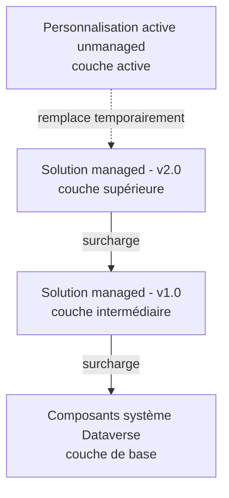
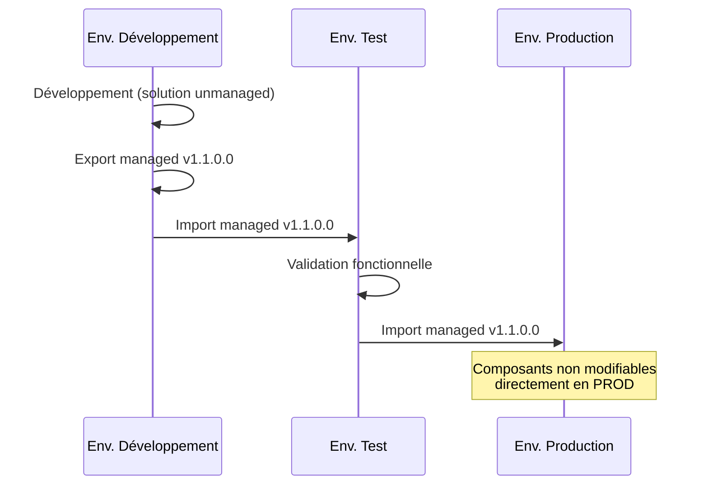

# Solutions managed et unmanaged

## Objectifs pédagogiques

À l'issue de ce module, vous serez capable de :

- Distinguer une solution managed d'une solution unmanaged et choisir laquelle utiliser selon le contexte
- Organiser vos composants Power Platform dans une solution structurée
- Comprendre ce qui se passe réellement lors d'un import de solution dans un environnement cible
- Identifier les erreurs classiques de déploiement et les corriger
- Mettre en place un workflow minimal de promotion solution : DEV → TEST → PROD

---

## Mise en situation

Vous travaillez dans une équipe de trois développeurs sur une application Power Apps liée à un processus RH. Pendant six mois, tout le monde a travaillé directement dans l'environnement de production — parce que c'était plus rapide, parce que le projet était "juste un POC", parce que l'environnement de dev n'existait pas encore.

Résultat aujourd'hui : personne ne sait exactement ce qui a été modifié par qui, les flows et tables Dataverse sont dispersés sans organisation, et migrer l'application vers un nouvel environnement revient à refaire manuellement chaque composant.

Ce scénario n'est pas exceptionnel — c'est l'état par défaut d'un projet Power Platform qui n'a pas été structuré dès le départ autour de la notion de **solution**.

Le système de solutions Power Platform est la réponse à ce problème. Mais pour l'utiliser correctement, il faut comprendre une distinction fondamentale que beaucoup de développeurs découvrent au mauvais moment : la différence entre une solution **unmanaged** et une solution **managed**.

---

## Contexte et problématique

### Pourquoi les solutions existent

Dans Dataverse, tous les composants que vous créez — tables, colonnes, apps, flows, connecteurs personnalisés, variables d'environnement, etc. — existent dans un espace appelé la **couche de personnalisation**. Par défaut, si vous créez un composant sans l'associer à une solution, il atterrit dans la solution système par défaut. Cette solution est non transportable, non versionnée, non gérable.

Une solution, c'est simplement un **conteneur déclaratif** : elle ne stocke pas les composants, elle référence ceux qui existent dans l'environnement. Quand vous exportez une solution, Power Platform génère un fichier ZIP qui décrit ces composants et leur configuration — un peu comme un manifeste.

Ce qui change tout, c'est le **type** de solution : unmanaged ou managed. Le type n'est pas une propriété du fichier en soi, c'est le résultat de la façon dont vous exportez et importez ce fichier.

### La distinction centrale

Une solution **unmanaged** est celle dans laquelle vous travaillez activement. Elle vit dans votre environnement de développement. Les composants qu'elle référence sont modifiables librement, et la solution peut être modifiée, étendue, supprimée partiellement sans effet de bord.

Une solution **managed** est celle que vous déployez dans vos environnements cibles (test, UAT, production). Elle impose des contraintes : les composants qu'elle apporte ne peuvent pas être modifiés directement dans l'environnement cible. Supprimer la solution managed supprime tous ses composants. Elle crée une relation de dépendance contrôlée.

🧠 **Concept clé** — La même solution peut exister des deux façons. Vous exportez en mode "unmanaged" pour sauvegarder votre travail de développement, et en mode "managed" pour déployer. Ce sont deux exports différents du même état, pas deux objets différents.

---

## Architecture des solutions et des couches

### Comment Dataverse gère les couches

Dataverse fonctionne avec un système de **couches de personnalisation** (customization layers). Quand plusieurs solutions touchent le même composant, elles s'empilent — la couche supérieure l'emporte.

Ce modèle a une implication directe : dans un environnement de production, vous ne devriez avoir **aucune personnalisation unmanaged**. Si quelqu'un ouvre le customizer en production et modifie un composant géré, cette modification s'applique dans la couche unmanaged par-dessus — et survivra à une mise à jour de la solution managed. C'est le genre de situation qui crée des comportements inexplicables six mois plus tard.

### Ce qu'une solution peut contenir

| Catégorie | Exemples de composants |
|-----------|----------------------|
| Données et modèle | Tables, colonnes, relations, vues, formulaires, graphiques |
| Logique | Flows Power Automate, plugins, actions personnalisées, règles métier |
| Interface | Apps canvas, apps model-driven, tableaux de bord |
| Intégration | Connecteurs personnalisés, variables d'environnement, connexions de référence |
| Sécurité | Rôles de sécurité, équipes |
| UI | Ressources web (JS, HTML, CSS), icônes |

⚠️ **Erreur fréquente** — Les *données* ne font pas partie d'une solution. Une solution transporte la *structure* (la table, ses colonnes, ses formulaires), pas les enregistrements. Si vous avez besoin de migrer des données de référence, il faut passer par un mécanisme séparé (import Excel, Configuration Migration Tool, ou un flow de seeding).

---

## Travailler avec les solutions

### Créer une solution et l'organiser

Tout commence dans **make.powerapps.com**. La règle d'or : **ne jamais créer un composant en dehors d'une solution**. Ouvrez d'abord votre solution, puis créez depuis l'intérieur.

**Chemin :** `make.powerapps.com → Solutions → Nouvelle solution`

Lors de la création, vous devez renseigner :
- **Nom d'affichage** — lisible par les humains
- **Nom** (unique) — identifiant technique, sans espaces
- **Éditeur** — élément critique : il définit le préfixe des composants (`cr7a_`, `contoso_`, etc.)
- **Version** — au format `1.0.0.0`

🧠 **Concept clé** — L'éditeur n'est pas cosmétique. Son préfixe est gravé dans le nom technique de chaque composant créé dans la solution. Si vous changez d'éditeur en cours de projet, vos composants gardent l'ancien préfixe. Définissez un éditeur cohérent dès le départ, jamais l'éditeur "Default".

### Ajouter des composants existants

Si un composant a été créé hors solution (dans la solution par défaut), vous pouvez l'y ajouter : **Solutions → votre solution → Ajouter existant**. Attention : cela *référence* le composant, ça ne le déplace pas physiquement. Un même composant peut être référencé dans plusieurs solutions.

💡 **Astuce** — Utilisez **Ajouter les objets requis** après avoir ajouté un composant. Cette option identifie automatiquement les dépendances manquantes (ex : une table utilisée par un formulaire, un connecteur requis par un flow) et les ajoute à la solution. Sans ça, l'export sera incomplet et l'import échouera silencieusement ou partiellement.

### Gérer les dépendances

Avant d'exporter, vérifiez les dépendances : **Solutions → votre solution → menu "..." → Voir les dépendances**. Power Platform liste les composants requis par votre solution qui ne sont pas inclus dedans.

Les dépendances non résolues sont la première cause d'échec d'import. Soit vous les incluez dans la solution, soit vous vous assurez qu'elles sont déjà présentes dans l'environnement cible.

---

## Export et import — ce qui se passe vraiment

### Exporter une solution

**Chemin :** `Solutions → votre solution → Exporter`

L'assistant vous propose deux options :

- **Non managée (unmanaged)** — pour sauvegarder votre travail de dev ou partager avec un autre développeur qui doit modifier les composants
- **Managée (managed)** — pour déployer dans un environnement cible

L'export produit un fichier `.zip`. À l'intérieur, vous trouverez un `solution.xml` (métadonnées, version, éditeur), un `customizations.xml` (tous les composants sérialisés en XML), et des dossiers pour les ressources web et les autres assets.

💡 **Astuce** — Avant d'exporter en managed pour la production, exportez d'abord en unmanaged et committez le ZIP dans votre dépôt Git. C'est votre sauvegarde. Le fichier unmanaged vous permet de restaurer l'état de dev si quelque chose se passe mal. L'outillage `pac solution unpack` (abordé dans le module suivant) va encore plus loin en décompressant ce ZIP en fichiers individuels versionnables.

### Importer une solution

**Chemin :** `make.powerapps.com → Solutions → Importer une solution`

L'import d'une solution managed dans un environnement où une version précédente existe déjà est une **mise à jour**. Dataverse compare les versions et applique les différences. C'est pour ça que la gestion de version est critique : si vous importez la v1.0.0.0 sur une v1.0.0.0 existante, Power Platform va vous demander explicitement si vous voulez écraser.

### Les variables d'environnement — la pièce manquante

Une URL de SharePoint, une adresse d'API, un identifiant de boîte mail : ces valeurs changent entre DEV, TEST et PROD. Mettre ces valeurs en dur dans un flow ou une app est une erreur classique qui force à modifier manuellement les composants après import.

Les **variables d'environnement** résolvent ce problème. Vous les déclarez dans votre solution (avec une valeur par défaut optionnelle), vous les utilisez dans vos flows et apps, et au moment de l'import dans l'environnement cible, Power Platform vous demande de fournir les valeurs pour cet environnement.

⚠️ **Erreur fréquente** — Les variables d'environnement ont deux composants : la *définition* (le schéma, inclus dans la solution) et la *valeur* (stockée séparément, spécifique à l'environnement). Si vous incluez la valeur dans la solution, elle sera écrasée à chaque import. La bonne pratique est de n'inclure que la définition dans la solution, et de gérer les valeurs séparément par environnement.

---

## Construction progressive : de l'environnement unique au pipeline ALM

### V1 — Isolation minimale

Même sans pipeline automatisé, la première étape est d'arrêter de travailler en production. Créez un environnement de développement (sandbox), travaillez-y, exportez en managed, importez en production manuellement.

C'est peu, mais c'est déjà beaucoup mieux que rien : vous avez une version exportée, un historique minimal, et vous pouvez revenir en arrière.

### V2 — Trois environnements, deux types de solutions

La configuration standard en entreprise :

| Environnement | Type de solution | Qui y travaille |
|---------------|-----------------|-----------------|
| DEV | Unmanaged | Développeurs, modifications libres |
| TEST | Managed | Testeurs, aucune modification directe |
| PROD | Managed | Utilisateurs finaux, lecture seule sur les composants |

Cette configuration implique que les développeurs ne touchent jamais directement TEST ou PROD. Toute modification passe par DEV, puis par un export/import contrôlé.

### V3 — Pipelines de déploiement

Power Platform propose les **Pipelines** (fonctionnalité native) pour automatiser le chemin DEV → TEST → PROD depuis l'interface, sans code. Chaque étape peut inclure des validations, des approbations, et des logs de déploiement.

Pour aller plus loin avec Azure DevOps ou GitHub Actions, on utilise la CLI `pac` — c'est le sujet du module suivant.

---

## Diagnostic — erreurs fréquentes à l'import

| Symptôme | Cause probable | Correction |
|----------|---------------|------------|
| "Missing dependency" à l'import | Un composant requis n'est pas dans la solution et n'existe pas dans l'env. cible | Ajouter les dépendances manquantes (option "Objets requis") et réexporter |
| Flow importé mais désactivé | Les connexions de référence ne sont pas configurées | Configurer les connexions dans l'env. cible avant import, ou post-import via les connexions de référence |
| Import réussi mais app affiche une erreur | Variable d'environnement sans valeur dans l'env. cible | Renseigner les valeurs des variables d'environnement après import |
| Impossible de modifier un composant en TEST/PROD | Normal : composant géré par une solution managed | Modifier en DEV et redéployer. Ne jamais contourner en désinstallant la solution managed |
| Import échoue sur un conflit de version | Version importée <= version existante | Incrémenter le numéro de version avant l'export |

💡 **Astuce** — Lors d'un import en erreur, téléchargez les **journaux d'opération**. Ils sont disponibles dans le panneau d'import juste après l'échec et donnent la liste exacte des composants en échec avec le message d'erreur détaillé — bien plus utile que le message générique affiché dans l'interface.

---

## Cas réel en entreprise

**Contexte :** Une DSI déploie une application de gestion des congés pour 800 employés. L'app est construite sur Dataverse, inclut 4 tables, un flow d'approbation, un connecteur personnalisé vers le SIRH, et deux apps canvas (salarié et manager).

**Problème initial :** Tout est développé dans l'environnement de production. Une mise à jour du flow d'approbation casse les notifications pendant 3 heures un lundi matin. Il n'y a pas de version précédente à restaurer.

**Ce qui a été mis en place :**

1. Création d'une solution `CongesRH` avec l'éditeur `dsicorp` (préfixe `dsc_`) dans un environnement DEV dédié
2. Migration de tous les composants existants dans la solution via "Ajouter existant"
3. Remplacement des URLs et identifiants codés en dur par des variables d'environnement
4. Mise en place de trois environnements (DEV / UAT / PROD) avec import managed dans UAT et PROD
5. Politique interne : toute modification passe par DEV, validée en UAT pendant 48h, puis déployée en PROD chaque lundi matin

**Résultat :** Six mois plus tard, cinq mises à jour ont été déployées sans incident. Lors d'un bug critique, l'équipe a pu identifier la version problématique, réimporter la version précédente en 12 minutes, et corriger dans DEV avant de redéployer.

---

## Bonnes pratiques

**1. Un éditeur, une convention, dès le premier jour.** Définissez votre éditeur (préfixe court, lié à l'organisation ou au projet) avant de créer quoi que ce soit. Ce préfixe sera dans le nom technique de tous vos composants — il ne change pas.

**2. Versionnez systématiquement.** Incrémentez le numéro de version à chaque export destiné à la production. Le format `MAJEUR.MINEUR.PATCH.BUILD` (ex: `1.3.0.0`) permet de tracer l'historique et d'éviter les conflits d'import.

**3. Ne jamais modifier directement en production.** Même pour un correctif urgent. Faites le correctif en DEV, testez en UAT (même rapidement), déployez. Si c'est vraiment urgent, créez une hotfix branch mentale — mais documentez ce que vous avez fait.

**4. Variables d'environnement pour tout ce qui change entre envs.** URLs, comptes de service, IDs de sites SharePoint, adresses mail de notification — tout ça doit être une variable d'environnement, pas une valeur codée dans un flow.

**5. Séparez les solutions par domaine fonctionnel.** Une solution pour le modèle de données partagé, une solution par application ou processus métier. Évitez la solution monolithique qui contient tout — les dépendances croisées deviennent ingérables.

**6. Incluez les rôles de sécurité dans vos solutions.** C'est souvent oublié. Si votre app nécessite un rôle personnalisé, incluez-le dans la solution pour qu'il soit déployé automatiquement avec elle.

**7. Testez l'import dans un environnement vierge au moins une fois.** Avant la première mise en production, importez votre solution managed dans un environnement sandbox vide pour valider que toutes les dépendances sont bien incluses et que rien ne manque.

---

## Résumé

Le système de solutions Power Platform est le mécanisme central du cycle de vie des applications. Sans lui, les composants s'accumulent dans l'environnement par défaut, impossibles à versionner ou migrer proprement.

La distinction unmanaged / managed n'est pas une complexité artificielle : elle traduit deux états naturels d'une solution — *en cours de construction* (unmanaged, modifiable, dans DEV) et *déployée* (managed, protégée, dans TEST/PROD). Comprendre que les deux exports viennent du même état, et que Dataverse gère des couches de personnalisation empilées, explique la majorité des comportements surprenants qu'on rencontre en production.

Les variables d'environnement complètent le dispositif en permettant de paramétrer les connexions et valeurs spécifiques à chaque environnement sans toucher au code. Avec ces trois briques — organisation en solutions, export managed pour les déploiements, variables d'environnement — vous avez un ALM fonctionnel, même sans pipeline automatisé.

L'étape suivante logique est d'automatiser ces exports et imports avec la CLI `pac`, pour les intégrer dans des pipelines CI/CD.

---

<!-- snippet
id: powerplatform_solution_managed_vs_unmanaged
type: concept
tech: Power Platform
level: intermediate
importance: high
format: knowledge
tags: solutions,managed,unmanaged,alm,dataverse
title: Managed vs Unmanaged — la différence fondamentale
content: Une solution unmanaged est l'état de développement actif : composants modifiables librement, suppression partielle sans effet de bord. Une solution managed est l'état déployé : composants verrouillés en modification directe, suppression de la solution = suppression de tous ses composants. Ce sont deux exports du même état, pas deux types d'objets différents.
description: Le type managed/unmanaged n'est pas une propriété du fichier mais le résultat de l'option choisie à l'export — même solution, deux usages distincts.
-->

<!-- snippet
id: powerplatform_solution_editeur_prefixe
type: warning
tech: Power Platform
level: intermediate
importance: high
format: knowledge
tags: solutions,éditeur,préfixe,convention,dataverse
title: L'éditeur et son préfixe sont gravés définitivement
content: Piège : créer une solution avec l'éditeur "Default" ou en changer en cours de projet. Conséquence : le préfixe (ex. cr7a_) est intégré dans le nom technique de chaque composant créé — il ne peut pas être modifié après coup. Correction : définir un éditeur avec un préfixe cohérent (ex. contoso_, dsc_) avant de créer le moindre composant.
description: Le préfixe de l'éditeur est inscrit dans le nom technique de chaque composant — impossible à changer sans recréer les composants.
-->

<!-- snippet
id: powerplatform_solution_variables_env
type: concept
tech: Power Platform
level: intermediate
importance: high
format: knowledge
tags: solutions,variables-environnement,déploiement,alm
title: Variables d'environnement — définition vs valeur
content: Une variable d'environnement a deux parties distinctes : la définition (schéma, type, valeur par défaut) incluse dans la solution, et la valeur réelle stockée séparément par environnement. Si vous incluez la valeur dans la solution, elle écrase la valeur de l'environnement cible à chaque import. Bonne pratique : inclure seulement la définition, gérer les valeurs par environnement après import.
description: Inclure la valeur d'une variable d'environnement dans la solution écrase la valeur de l'env. cible à chaque déploiement — inclure seulement la définition.
-->

<!-- snippet
id: powerplatform_solution_dependances_manquantes
type: error
tech: Power Platform
level: intermediate
importance: high
format: knowledge
tags: solutions,dépendances,import,erreur,déploiement
title: Erreur d'import — dépendances manquantes
content: Symptôme : import échoue avec "Missing dependency" ou composants partiellement importés. Cause : un composant requis (table, connecteur, role) n'est pas inclus dans la solution exportée ET n'existe pas dans l'environnement cible. Correction : dans la solution source, utiliser "Ajouter les objets requis" pour inclure automatiquement les dépendances, puis réexporter.
description: Les dépendances manquantes sont la première cause d'échec d'import — utiliser "Ajouter les objets requis" avant chaque export.
-->

<!-- snippet
id: powerplatform_solution_unmanaged_prod
type: warning
tech: Power Platform
level: intermediate
importance: high
format: knowledge
tags: solutions,production,managed,bonne-pratique,alm
title: Personnalisation unmanaged en production — danger invisible
content: Piège : modifier un composant géré (managed) directement en production via le customizer. Conséquence : la modification s'applique dans la couche unmanaged par-dessus la solution managed — elle survit aux mises à jour de la solution et crée des comportements inexplicables. Correction : toujours modifier en DEV, déployer via solution managed.
description: Modifier un composant managed directement en PROD crée une couche unmanaged silencieuse qui survit aux déploiements suivants.
-->

<!-- snippet
id: powerplatform_solution_versioning
type: tip
tech: Power Platform
level: intermediate
importance: medium
format: knowledge
tags: solutions,versioning,déploiement,alm,convention
title: Incrémenter la version avant chaque export vers PROD
content: Avant chaque export managed destiné à la production, incrémenter le numéro de version dans les propriétés de la solution (format 1.3.0.0). Un import avec une version égale ou inférieure à la version existante force un écrasement explicite et bloque les pipelines automatisés. Règle pratique : MAJEUR pour rupture, MINEUR pour nouvelle fonctionnalité, PATCH pour correctif.
description: Importer une version <= à la version existante provoque un conflit d'import — incrémenter avant chaque export vers un environnement cible.
-->

<!-- snippet
id: powerplatform_solution_logs_import
type: tip
tech: Power Platform
level: intermediate
importance: medium
format: knowledge
tags: solutions,import,debug,logs,diagnostic
title: Télécharger les journaux d'opération après un import en échec
content: Après un import en erreur, le message affiché dans l'interface est souvent générique. Les journaux détaillés (disponibles dans le panneau d'import, bouton "Télécharger les journaux") listent chaque composant en échec avec le message d'erreur précis — indispensable pour diagnostiquer les conflits de dépendances ou de version.
description: Le message d'erreur générique de l'interface cache le détail — télécharger les journaux d'opération pour identifier le composant exact en échec.
-->

<!-- snippet
id: powerplatform_solution_donnees_exclues
type: concept
tech: Power Platform
level: intermediate
importance: medium
format: knowledge
tags: solutions,données,dataverse,migration,structure
title: Une solution transporte la structure, pas les données
content: Une solution exporte la définition des tables (colonnes, formulaires, vues, relations) mais pas les enregistrements. Pour migrer des données de référence (listes de pays, types de contrats, etc.), il faut un mécanisme séparé : import Excel, Configuration Migration Tool (CMT), ou un flow de seeding déclenché post-déploiement.
description: Les enregistrements Dataverse ne font pas partie d'une solution — prévoir un mécanisme séparé pour les données de référence à migrer.
-->
