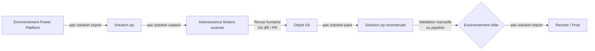

# PAC CLI et outillage développeur

## Objectifs pédagogiques

- Installer et configurer PAC CLI pour se connecter à un environnement Power Platform
- Utiliser les commandes essentielles pour gérer solutions, environnements et profils d'authentification
- Intégrer PAC CLI dans un workflow de développement avec VS Code
- Identifier les limites réelles de PAC CLI et savoir quand revenir à l'interface web
- Éviter les pièges d'authentification et de ciblage d'environnement fréquents chez les nouveaux utilisateurs

---

## Mise en situation

Vous intégrez une équipe qui développe une solution Power Platform pour automatiser la gestion des demandes RH. L'équipe travaille à plusieurs : une consultante qui configure les formulaires Power Apps, un développeur qui code des plugins Dataverse, et un responsable plateforme qui valide avant déploiement.

Pendant les deux premières semaines, tout se passe dans l'interface web. Puis les problèmes arrivent : quelqu'un exporte la mauvaise version de la solution, un autre déploie en prod sans passer par l'environnement de test, et personne ne sait exactement ce qui a changé entre deux versions.

La réponse habituelle c'est "on va faire plus attention". La vraie réponse, c'est d'outiller le workflow. PAC CLI est le point d'entrée vers ce workflow — c'est l'outil en ligne de commande officiel de Microsoft pour interagir avec Power Platform depuis un terminal, un script ou une pipeline CI/CD.

Ce module se concentre sur la prise en main de l'outil. Le sujet plus large de l'ALM (gestion du cycle de vie des applications) sera traité dans le module suivant.

---

## Contexte et problématique

L'interface web de Power Platform couvre 90 % des besoins pour créer et tester. Mais elle atteint ses limites dès qu'on cherche à **automatiser**, **versionner** ou **tracer** les opérations. Exporter une solution à la main depuis le portail, c'est un clic, un fichier ZIP sur votre bureau, et zéro traçabilité.

PAC CLI (Power Apps CLI, rebaptisé *Power Platform CLI* dans sa forme actuelle) est l'outil qui comble ce fossé. Il permet de :

- **S'authentifier** sur un ou plusieurs environnements (dev, test, prod) depuis le terminal
- **Exporter et importer** des solutions de manière scriptable
- **Scaffolder** des projets PCF (composants personnalisés) et plugins
- **Interagir avec Dataverse** directement en ligne de commande
- **Lancer des opérations ALM** qui s'intègrent dans des pipelines Azure DevOps ou GitHub Actions

C'est aussi l'outil que vous utiliserez dans VS Code via l'extension Power Platform Tools — donc même si vous ne touchez jamais un terminal, vous interagissez indirectement avec PAC.

---

## Installation et mise en place

### Prérequis

PAC CLI est distribué sous forme de package .NET global. Il vous faut donc :

- **.NET SDK 6.0 ou supérieur** (vérifier avec `dotnet --version`)
- Un accès à un environnement Power Platform (même un environnement développeur gratuit suffit pour s'entraîner)
- Optionnel mais fortement recommandé : **VS Code** avec l'extension *Power Platform Tools*

### Installation

```bash
# Installer PAC CLI comme outil global .NET
dotnet tool install --global Microsoft.PowerApps.CLI.Tool

# Vérifier l'installation
pac help

# Mettre à jour si déjà installé
dotnet tool update --global Microsoft.PowerApps.CLI.Tool
```

Sur Windows, PAC CLI est aussi disponible via le **Power Platform CLI MSI** téléchargeable depuis le portail développeur Microsoft — pratique si vous n'avez pas .NET installé. Sur macOS et Linux, la voie .NET est la méthode standard.

💡 **Astuce** — Après installation, fermez et rouvrez votre terminal. Le binaire `pac` est ajouté au PATH lors de l'installation, mais la session en cours ne le voit pas encore.

Vérifiez que tout fonctionne :

```bash
pac --version
# Attendu : quelque chose comme 1.30.x ou supérieur
```

### Installation de l'extension VS Code

Dans VS Code, chercher *Power Platform Tools* dans le marketplace (éditeur : Microsoft). Cette extension embarque sa propre version de PAC CLI et ajoute un panneau dédié dans la sidebar — vous pouvez gérer vos connexions et solutions sans quitter l'éditeur.

⚠️ **Erreur fréquente** — L'extension VS Code et PAC CLI installé globalement sont deux instances indépendantes. Elles peuvent avoir des versions différentes. Pour diagnostiquer un comportement incohérent entre les deux : exécutez `pac --version` dans le terminal intégré VS Code, puis comparez avec la version affichée dans l'onglet Extensions (clic sur *Power Platform Tools* → *Details*). Si les versions divergent, mettez à jour le PAC global (`dotnet tool update --global Microsoft.PowerApps.CLI.Tool`) et redémarrez VS Code.

---

## Authentification et gestion des profils

C'est le sujet sur lequel les nouveaux utilisateurs perdent le plus de temps. Bien comprendre le modèle d'authentification de PAC évite beaucoup de frustration.

PAC CLI utilise un système de **profils d'authentification** nommés. Un profil = une identité + un tenant. Vous pouvez en avoir plusieurs (compte pro, compte de démo, compte client) et basculer entre eux.

```bash
# Créer un nouveau profil d'auth (ouvre le navigateur pour le consentement OAuth)
pac auth create --name <NOM_PROFIL>

# Exemple concret
pac auth create --name dev-contoso

# Lister tous les profils configurés
pac auth list

# Sélectionner un profil actif
pac auth select --index <NUMERO>

# Supprimer un profil
pac auth delete --index <NUMERO>
```

Quand vous exécutez `pac auth create`, PAC ouvre votre navigateur pour un flux OAuth standard — vous vous connectez avec votre compte Microsoft 365, vous autorisez l'accès, et le token est stocké localement. Pas de mot de passe dans vos scripts.

🧠 **Concept clé** — PAC stocke les tokens dans le profil local de l'utilisateur (`~/.pac` sous Linux/macOS, `%APPDATA%\pac` sous Windows). Ces tokens sont rafraîchis automatiquement. Si vous travaillez sur une pipeline CI/CD (agent non-interactif), vous utiliserez à la place un **Service Principal** avec `--applicationId`, `--clientSecret` et `--tenant` — mais c'est le territoire du module ALM.

Une erreur courante en authentification interactive : le message `AADSTS70011: The provided request must include a 'scope' input parameter` ou un timeout du navigateur. Cela indique généralement un problème de proxy ou un token expiré. La solution la plus simple : `pac auth delete --index <N>` suivi d'un nouveau `pac auth create`.

Une fois authentifié, chaque commande PAC s'exécute dans le contexte du profil actif. Pour cibler un environnement spécifique, vous pouvez soit le spécifier dans chaque commande, soit le définir comme environnement par défaut du profil :

```bash
# Lister les environnements accessibles avec le profil actif
pac env list

# Sélectionner un environnement par défaut pour les commandes suivantes
pac env select --environment <URL_OU_ID_ENVIRONNEMENT>

# Exemple
pac env select --environment https://myorg.crm.dynamics.com
```

---

## Commandes essentielles

Voici les commandes que vous utiliserez vraiment au quotidien, dans un ordre logique : comprendre où vous êtes → travailler sur les solutions → inspecter Dataverse.

### Naviguer dans les environnements

```bash
# Voir quel profil et quel environnement sont actifs
pac org who

# Résultat typique :
# Connected to... myorg (https://myorg.crm.dynamics.com)
# Logged in as: jane.doe@contoso.com
```

`pac org who` est votre commande réflexe avant toute opération sensible. Elle confirme que vous êtes bien sur le bon environnement — pas en train d'exporter depuis la prod par inadvertance.

### Gestion des solutions

```bash
# Lister les solutions présentes dans l'environnement actif
pac solution list

# Exporter une solution (non managée par défaut)
pac solution export --name <NOM_SOLUTION> --path <DOSSIER_DESTINATION>

# Exporter en version managée
pac solution export --name <NOM_SOLUTION> --path <DOSSIER_DESTINATION> --managed

# Importer une solution
pac solution import --path <CHEMIN_VERS_ZIP>

# Exemple complet — exporter la solution HRPortal vers le dossier courant
pac solution export --name HRPortal --path ./exports/HRPortal.zip
```

💡 **Astuce** — L'export PAC CLI crée un fichier ZIP identique à ce que vous obtiendriez depuis le portail. La différence, c'est que vous pouvez l'intégrer dans un script, planifier l'export, ou le brancher directement dans un pipeline Git.

### Décompresser une solution pour Git

C'est une des fonctionnalités les plus utiles pour le travail en équipe : PAC peut décompresser une solution ZIP en une arborescence de fichiers XML/JSON versionnables.

```bash
# Décompresser une solution exportée en fichiers sources
pac solution unpack --zipfile <CHEMIN_ZIP> --folder <DOSSIER_CIBLE> --packagetype <TYPE>

# Exemple — solution non managée
pac solution unpack --zipfile ./exports/HRPortal.zip --folder ./src/HRPortal --packagetype Unmanaged

# Recompresser depuis les sources
pac solution pack --zipfile ./exports/HRPortal_rebuilt.zip --folder ./src/HRPortal --packagetype Unmanaged
```

Le paramètre `--packagetype` accepte `Unmanaged`, `Managed`, ou `Both`.

Voici ce à quoi ressemble la structure générée après un unpack complet :

```
src/HRPortal/
├── CanvasApps/
│   └── HRPortalApp/
│       ├── HRPortalApp.msapp       ← Canvas App (format binaire, diff limité)
│       └── Src/                    ← si Power Apps Source File Format activé
├── Workflows/
│   └── NotificationFlow.json       ← Flow en JSON — diff lisible
├── Entities/
│   └── hr_request/
│       ├── Entity.xml              ← définition de la table
│       └── Attributes/             ← une colonne = un fichier XML
├── Plugins/
│   └── HRValidation.dll            ← binaire — ne pas modifier à la main
├── solution.xml                    ← métadonnées de la solution
└── customizations.xml              ← composants non couverts ailleurs
```

Chaque composant est un fichier distinct — ce qui rend les diffs Git lisibles et les revues de code possibles. Les Flows JSON et les Entity XML sont les composants les plus utiles à inspecter. Les Canvas Apps (`.msapp`) restent partiellement binaires sauf si le *Power Apps Source File Format* est activé dans les paramètres de l'environnement.



### Travailler avec Dataverse

```bash
# Lister les paramètres de l'environnement actif
pac env list-settings

# Créer un projet de plugin Dataverse (scaffold)
pac plugin init

# Créer un projet PCF (composant personnalisé)
pac pcf init --namespace <NAMESPACE> --name <NOM_COMPOSANT> --template field

# Exemple
pac pcf init --namespace Contoso --name StarRating --template field
```

⚠️ **Erreur fréquente** — `pac pcf init` crée un projet Node.js avec des dépendances npm. Si vous n'avez pas Node.js installé, le scaffold réussit mais le `npm install` suivant échoue avec `npm not found`. Vérifiez `node --version` (v16+ recommandé) avant de vous lancer. Sur macOS : `brew install node`. Sur Windows : téléchargez l'installateur depuis nodejs.org ou utilisez `winget install OpenJS.NodeJS`.

---

## Intégration VS Code — le workflow au quotidien

L'extension Power Platform Tools dans VS Code ajoute plusieurs capacités concrètes :

**Panneau Power Platform** dans la sidebar :
- Connexion directe à vos environnements (utilise les profils PAC)
- Navigation dans les solutions et leurs composants
- Raccourcis pour exporter/importer sans passer par le terminal

**IntelliSense Power Fx** dans les fichiers `.fx.yaml` :
- Autocomplétion des formules Power Fx pour les Canvas Apps
- Vérification de types en temps réel
- Navigation vers les définitions des connecteurs

**Terminal intégré** :
- La même instance PAC CLI est accessible directement depuis le terminal VS Code — pas besoin de jongler entre applications.

Pour les équipes qui débutent avec PAC, VS Code est souvent le meilleur point d'entrée : l'extension abstrait la gestion des profils dans une UI, et vous pouvez progressivement migrer vers les commandes brutes quand vous êtes à l'aise.

---

## Cas réel en entreprise

**Contexte :** Une équipe de 4 personnes développe une solution de gestion des incidents pour un service client. Deux développeurs travaillent en parallèle sur des composants différents — l'un sur les Canvas Apps, l'autre sur les automatisations Power Automate.

**Problème initial :** Sans workflow structuré, les exports manuels depuis le portail créaient des conflits. Impossible de savoir ce qui avait changé entre deux versions, et le déploiement en recette demandait 30 minutes de manipulation manuelle.

**Pourquoi unpack/pack plutôt qu'une autre approche ?** L'alternative la plus simple aurait été de versionner les fichiers ZIP directement dans Git. C'est tentant — un seul fichier, pas de commande supplémentaire. Mais Git traite les ZIP comme des binaires opaques : impossible de voir ce qui a changé entre deux versions, et les conflits entre développeurs sont irréparables sans écraser le travail de l'un d'eux. L'approche unpack/pack résout exactement ce problème : les Flows deviennent des fichiers JSON différençables, les tables Dataverse deviennent des fichiers XML par colonne. Le coût ? Deux commandes supplémentaires dans le workflow. Le bénéfice ? Des pull requests lisibles et des conflits Git détectables à la ligne près.

**Ce qu'ils ont mis en place :**

1. Chaque développeur travaille sur son propre environnement Power Platform (environnement développeur gratuit)
2. Avant de partager leur travail, ils font `pac solution export` + `pac solution unpack` vers un dossier Git local
3. La pull request contient les fichiers décompressés — la revue de code devient possible
4. Un script shell reconstruit le ZIP (`pac solution pack`) et l'importe dans l'environnement de recette après validation humaine

```bash
#!/bin/bash
# Script de déploiement vers recette — exemple simplifié
SOLUTION_NAME="IncidentManager"
ENV_URL="https://test-env.crm.dynamics.com"

pac auth select --index 1
pac env select --environment $ENV_URL

# Vérification explicite avant toute opération
pac org who

pac solution export --name $SOLUTION_NAME --path ./dist/$SOLUTION_NAME.zip --environment $ENV_URL
pac solution unpack --zipfile ./dist/$SOLUTION_NAME.zip --folder ./src/$SOLUTION_NAME --packagetype Unmanaged

echo "Export terminé — vérifier ./src/$SOLUTION_NAME avant commit"
```

**Et les conflits Git sur les fichiers décompressés ?** Ils arrivent — surtout quand deux développeurs modifient le même Flow. La bonne nouvelle : Git peut les détecter à la ligne près dans le JSON. La mauvaise : la résolution reste manuelle, et un conflit mal résolu peut produire un XML invalide que PAC refusera d'importer. La règle de l'équipe : un seul développeur par composant à la fois, ou une coordination explicite avant de toucher aux Flows partagés.

**Résultat :** Le déploiement en recette est passé de 30 minutes à 3 minutes. Les conflits ont quasiment disparu parce que les fichiers décompressés sont assez granulaires pour que Git détecte les vrais conflits et les ignore quand il n'y en a pas.

---

## Limites de PAC CLI : quand revenir au portail

PAC CLI est puissant, mais il ne remplace pas tout. Voici ce qu'il ne sait pas (bien) faire à ce stade :

**Ce que PAC CLI ne couvre pas :**

- **Rollback automatique** — PAC peut importer une version antérieure si vous l'avez conservée, mais il n'y a pas de commande `pac solution rollback`. La gestion des versions reste manuelle ou via votre pipeline CI/CD.
- **Déploiement de composants hors solution** — PAC travaille sur des solutions. Les composants non inclus dans une solution (connexions, profils de publication) ne sont pas exportables via PAC.
- **Création et configuration des environnements** — `pac env list` et `pac env select` naviguent parmi les environnements existants, mais la création d'un environnement nécessite le portail Admin Center ou l'API Admin.
- **Gestion des licences et capacités** — Hors périmètre de PAC : ça reste dans le portail Admin Center.
- **Pipeline CI/CD sans agent interactif** — Avec un compte utilisateur classique, PAC fonctionne en mode interactif (navigateur OAuth). Pour une pipeline automatisée (Azure DevOps, GitHub Actions, sans intervention humaine), vous aurez besoin d'un Service Principal — sujet traité dans le module ALM.
- **Résolution de conflits complexes dans les Canvas Apps** — Les fichiers `.msapp` restent partiellement binaires. Les conflits sur une Canvas App modifiée par deux personnes en parallèle sont difficiles à résoudre via Git seul.

**Quand rester sur le portail :**
- Configuration initiale d'un environnement
- Gestion des connexions et credentials de connecteurs
- Débogage visuel d'un Flow ou d'une Canvas App
- Administration des licences et groupes de sécurité

Le portail et PAC CLI ne sont pas en compétition — ils sont complémentaires. Le portail pour configurer et déboguer, PAC pour versionner et automatiser.

---

## Bonnes pratiques

**Toujours vérifier l'environnement actif avant d'importer.** Un `pac org who` prend 2 secondes et évite d'écraser la mauvaise instance. Prenez l'habitude — surtout si vous jonglons entre plusieurs tenants.

**Nommez vos profils d'authentification de manière explicite.** `dev-contoso`, `test-fabrikam` plutôt que les noms par défaut générés automatiquement. Quand vous avez 5 profils dans `pac auth list`, vous serez content de pouvoir les distinguer au premier coup d'œil.

**Versionnez les sources décompressées, pas les ZIP.** Un fichier ZIP est binaire pour Git — vous perdez tout le bénéfice du diff. Les fichiers issus de `pac solution unpack` sont du XML et du JSON lisibles. C'est ça qui va dans le dépôt.

**Ne commitez jamais de credentials dans vos scripts.** PAC gère les tokens OAuth localement. Pour les pipelines CI/CD, utilisez des variables secrètes d'environnement — jamais un mot de passe en dur dans un script shell ou un fichier YAML de pipeline.

**Gardez PAC CLI à jour.** Microsoft publie des mises à jour régulières qui corrigent des bugs et ajoutent le support de nouvelles fonctionnalités Dataverse. `dotnet tool update --global Microsoft.PowerApps.CLI.Tool` prend 30 secondes.

**Utilisez `--environment` explicitement dans les scripts automatisés.** Ne vous fiez pas à l'environnement "actif" dans un contexte CI/CD — passez toujours l'URL ou l'ID d'environnement explicitement pour éviter qu'une sélection manuelle antérieure ne pollue votre pipeline.

---

## Résumé

PAC CLI est l'outil qui fait le lien entre le développement dans l'interface Power Platform et un workflow professionnel versionnable et automatisable. L'installation passe par .NET ou un MSI Windows, l'authentification repose sur des profils OAuth sans mot de passe en dur, et les commandes essentielles gravitent autour de trois opérations : gérer les connexions (`pac auth`, `pac env`), travailler sur les solutions (`pac solution export/import/unpack/pack`), et scaffolder des projets techniques (`pac pcf init`, `pac plugin init`).

La fonctionnalité `unpack` mérite une attention particulière : elle transforme un ZIP opaque en arborescence de fichiers texte que Git peut réellement différencier — Flows en JSON, tables Dataverse en XML par colonne. C'est le fondement de tout travail en équipe sérieux sur Power Platform, et la raison pour laquelle on préfère cette approche au simple versionnage des ZIP.

PAC CLI a ses limites : pas de rollback automatique, pas de création d'environnement, pas de gestion des composants hors solution, et les pipelines CI/CD non-interactives nécessitent un Service Principal plutôt qu'un compte utilisateur. Ces sujets s'appuient directement sur ce que vous venez d'apprendre et sont couverts dans le module suivant sur l'ALM.

L'extension VS Code Power Platform Tools offre une surface d'entrée plus accessible, mais repose sur les mêmes mécanismes PAC en dessous. Les deux approches sont complémentaires, pas exclusives.

---

<!-- snippet
id: pac_auth_create
type: command
tech: pac-cli
level: intermediate
importance: high
tags: pac,authentification,profil,power-platform,oauth
title: Créer un profil d'authentification PAC CLI
command: pac auth create --name <NOM_PROFIL>
example: pac auth create --name dev-contoso
description: Ouvre un flux OAuth dans le navigateur et stocke le token localement sous ~/.pac. Chaque profil = une identité + un tenant.
-->

<!-- snippet
id: pac_org_who
type: command
tech: pac-cli
level: intermediate
importance: high
tags: pac,environnement,verification,authentification
title: Vérifier l'environnement et l'identité actifs
command: pac org who
description: Affiche l'URL de l'environnement actif et l'email connecté. À exécuter avant toute opération d'import ou d'export pour éviter de cibler le mauvais environnement.
-->

<!-- snippet
id: pac_solution_export
type: command
tech: pac-cli
level: intermediate
importance: high
tags: pac,solution,export,zip
title: Exporter une solution depuis un environnement
command: pac solution export --name <NOM_SOLUTION> --path <CHEMIN_ZIP>
example: pac solution export --name HRPortal --path ./exports/HRPortal.zip
description: Exporte la solution non managée par défaut. Ajouter --managed pour obtenir la version managée. Équivalent scriptable de l'export manuel depuis le portail.
-->

<!-- snippet
id: pac_solution_unpack
type: command
tech: pac-cli
level: intermediate
importance: high
tags: pac,solution,unpack,git,versioning
title: Décompresser une solution en fichiers sources versionnables
command: pac solution unpack --zipfile <CHEMIN_ZIP> --folder <DOSSIER_CIBLE> --packagetype <TYPE>
example: pac solution unpack --zipfile ./exports/HRPortal.zip --folder ./src/HRPortal --packagetype Unmanaged
description: Décompose le ZIP en fichiers XML/JSON par composant (Canvas App, Flow, Table…). Ces fichiers sont lisibles par Git et permettent des diffs réels entre versions.
-->

<!-- snippet
id: pac_solution_pack
type: command
tech: pac-cli
level: intermediate
importance: medium
tags: pac,solution,pack,reconstruction
title: Recompresser des sources en fichier ZIP solution
command: pac solution pack --zipfile <CHEMIN_ZIP> --folder <DOSSIER_SOURCES> --packagetype <TYPE>
example: pac solution pack --zipfile ./dist/HRPortal.zip --folder ./src/HRPortal --packagetype Unmanaged
description: Reconstruit un ZIP importable depuis l'arborescence de fichiers sources. Utilisé après modification des sources ou dans un script de déploiement.
-->

<!-- snippet
id: pac_solution_unpack_concept
type: concept
tech: pac-cli
level: intermediate
importance: high
tags: pac,solution,git,versioning,arborescence
title: Pourquoi unpack rend une solution versionnables
content: Un ZIP Power Platform est binaire pour Git — impossible de voir ce qui a changé. pac solution unpack le transforme en arborescence XML/JSON : un fichier par composant (Canvas App, Flow, Table Dataverse). Git peut alors produire des diffs lisibles, détecter les conflits réels et ignorer les modifications sans impact. C'est le format à commiter, pas le ZIP. Limite : les Canvas Apps (.msapp) restent partiellement binaires sans Power Apps Source File Format activé.
description: unpack crée une arborescence texte par composant — les diffs Git deviennent possibles et les revues de code réalisables.
-->

<!-- snippet
id: pac_auth_profiles_warning
type: warning
tech: pac-cli
level: intermediate
importance: high
tags: pac,authentification,profil,cicd,securite
title: Ne pas confondre profil actif et environnement cible dans un script
content: Piège : dans un script automatisé, l'environnement "actif" peut avoir été changé manuellement lors d'une session précédente. Conséquence : le script opère sur le mauvais environnement sans message d'erreur. Correction : toujours passer --environment explicitement dans les commandes de script, ne jamais se fier à la sélection interactive. Exemple : pac solution export --name MySolution --path ./dist/MySolution.zip --environment https://myorg.crm.dynamics.com
description: L'environnement actif persiste entre sessions. Dans un script CI/CD, toujours spécifier --environment explicitement plutôt que de dépendre de pac env select.
-->

<!-- snippet
id: pac_vscode_extension_versions
type: tip
tech: pac-cli
level: intermediate
importance: medium
tags: pac,vscode,extension,version,compatibilite,diagnostic
title: Diagnostiquer une désynchronisation de version entre PAC global et l'extension VS Code
context: À utiliser quand un comportement diffère entre le terminal VS Code et l'UI de l'extension Power Platform Tools
content: "Étape 1 — dans le terminal VS Code, exécuter : pac --version (résultat attendu : ex. 1.30.6 ou supérieur). Étape 2 — dans VS Code, aller dans Extensions → Power Platform Tools → Details : la version de l'extension est affichée sous le nom. Si les deux versions divergent significativement, mettre à jour PAC global : dotnet tool update --global Microsoft.PowerApps.CLI.Tool, puis redémarrer VS Code."
description: L'extension VS Code embarque PAC CLI en interne — versions potentiellement différentes du PAC installé globalement via dotnet tool.
-->

<!-- snippet
id: pac_install_dotnet
type: command
tech: pac-cli
level: intermediate
importance: medium
tags: pac,installation,dotnet,setup
title: Installer PAC CLI via dotnet tool
command: dotnet tool install --global Microsoft.PowerApps.CLI.Tool
description: Méthode d'installation standard sur Linux, macOS et Windows avec .NET SDK. Après installation, rouvrir le terminal pour que pac soit disponible dans le PATH.
-->

<!-- snippet
id: pac_pcf_node_warning
type: warning
tech: pac-cli
level: intermediate
importance: medium
tags: pac,pcf,nodejs,prerequis,composant
title: pac pcf init nécessite Node.js — le scaffold réussit mais npm install échoue sans lui
content: Piège : pac pcf init génère le scaffold sans erreur même si Node.js est absent. Le problème arrive au npm install suivant avec "npm not found" ou "node not found". Correction : vérifier node --version (v16+ recommandé) avant de démarrer tout projet PCF. Installation : macOS → brew install node | Windows → winget install OpenJS.NodeJS ou téléchargement direct sur nodejs.org.
description: Le scaffold PCF est découplé de Node.js mais le build ne fonctionne pas sans lui. Vérifier node --version avant pac pcf init.
-->

<!-- snippet
id: pac_env_select
type: command
tech: pac-cli
level: intermediate
importance: medium
tags: pac,environnement,selection,workflow
title: Définir l'environnement cible par défaut pour les commandes suivantes
command: pac env select --environment <URL_OU_ID>
example: pac env select --environment https://myorg.crm.dynamics.com
description: Définit l'environnement actif pour toutes les commandes suivantes de la session. Pratique en usage interactif — à éviter dans les scripts au profit du flag --environment explicite.
-->

<!-- snippet
id
