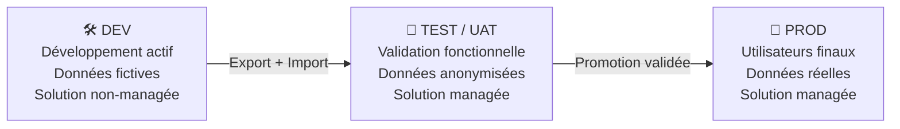
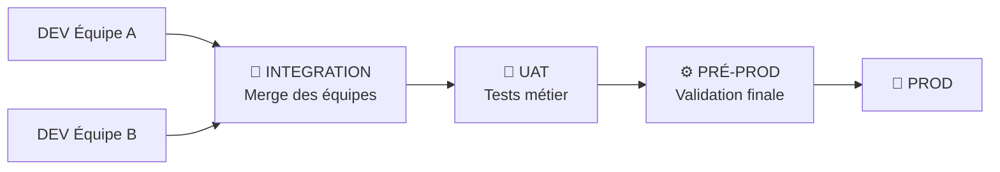
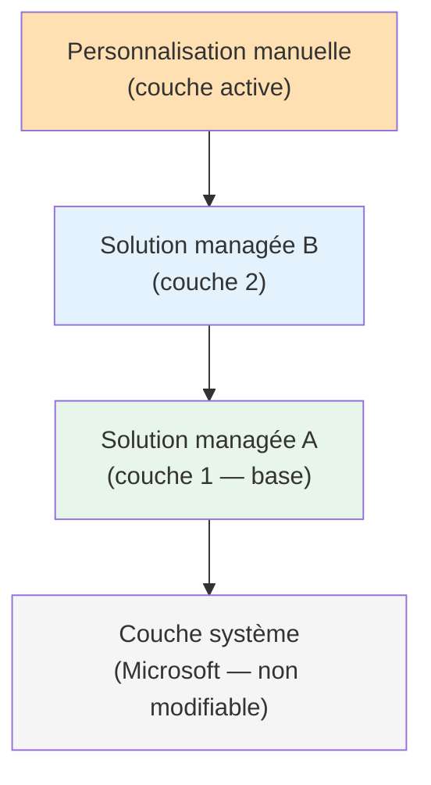
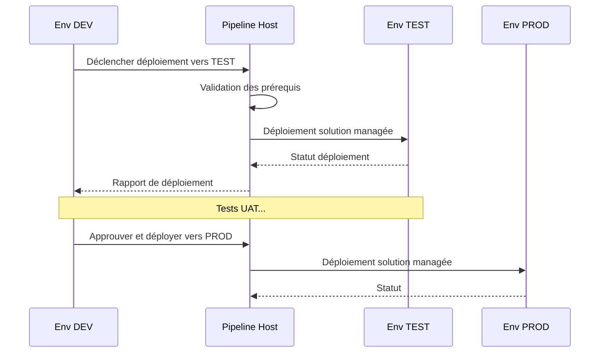

# ALM, pipelines et stratégie Dev/Test/Prod

## Objectifs pédagogiques

À l'issue de ce module, vous serez capable de :

- Expliquer pourquoi une stratégie ALM est indispensable dès qu'une équipe dépasse un seul développeur
- Concevoir une topologie d'environnements Dev / Test / Prod adaptée à votre contexte
- Distinguer solutions managées et non-managées, et savoir quand utiliser chacune
- Mettre en place un pipeline de déploiement avec Power Platform Pipelines ou Azure DevOps
- Identifier les pièges classiques de déploiement : connexions cassées, dépendances manquantes, données de configuration en dur

---

## Mise en situation

Imaginons une équipe de trois personnes : un consultant fonctionnel, un développeur Power Platform, et un administrateur. Ils ont livré une première app Canvas en deux semaines, directement dans l'environnement de production. Ça marche. Tout le monde est content.

Trois mois plus tard, l'application a grandi : vingt flows, quatre tables Dataverse personnalisées, des connexions vers SharePoint et Teams, quelques variables d'environnement. Le développeur corrige un bug un vendredi à 17h, écrase sans le vouloir une modification faite par le consultant fonctionnel la veille, et casse un flow critique que les utilisateurs utilisent le lundi matin.

Personne n'a de sauvegarde. Pas de trace de ce qui a changé. Pas de moyen de revenir en arrière.

C'est exactement pour éviter ce scénario que l'ALM (*Application Lifecycle Management*) existe. Sur Power Platform, les mécanismes sont disponibles nativement — encore faut-il comprendre leur logique pour les utiliser correctement.

---

## Contexte et problématique

### Ce que "ALM" veut dire concrètement sur Power Platform

L'ALM n'est pas un outil unique. C'est une discipline qui couvre toute la vie d'une solution : de sa conception jusqu'à sa mise en retraite, en passant par le développement, les tests, les déploiements, et la gestion des versions.

Sur Power Platform, l'ALM repose sur trois piliers :

| Pilier | Ce que ça recouvre |
|--------|-------------------|
| **Packaging** | Regrouper les composants d'une solution dans une unité déployable |
| **Versioning** | Tracer les changements, pouvoir comparer et revenir en arrière |
| **Déploiement** | Transporter une solution d'un environnement à l'autre de manière fiable et reproductible |

La plupart des équipes débutantes gèrent correctement le premier pilier — elles créent des solutions. Elles négligent le deuxième et le troisième jusqu'au premier incident.

### Pourquoi Power Platform a ses propres défis ALM

Contrairement à une application web classique où le code source *est* le livrable, Power Platform produit des artefacts visuels stockés dans Dataverse. Un flow Power Automate n'est pas un fichier `.py` ou `.js` — c'est un enregistrement en base de données. Une app Canvas est un binaire compressé.

Ça change tout pour la gestion de version : vous ne pouvez pas juste faire un `git diff` sur votre flow. Il faut explicitement exporter les composants, les décompresser en fichiers lisibles, et les versionner. C'est faisable — et même automatisable — mais ça demande une mécanique spécifique que ce module détaille.

---

## Architecture des environnements

### La topologie de base : trois environnements minimum

La règle fondamentale est simple : **on ne développe jamais en production**. Ça paraît évident, mais sur Power Platform, beaucoup d'équipes le font faute de licence ou d'organisation.

Voici la topologie recommandée pour une équipe sérieuse :



Chaque environnement a un rôle distinct et des règles différentes :

**Environnement DEV** — c'est le bac à sable. Les développeurs y travaillent avec des solutions non-managées, ce qui leur permet de modifier librement tous les composants. Les données sont fictives ou générées pour les tests. Idéalement, chaque développeur a son propre environnement DEV pour éviter les conflits entre modifications simultanées.

**Environnement TEST / UAT** — ici, on valide. La solution arrive sous forme managée, les utilisateurs métier font leurs tests d'acceptation, et l'équipe technique vérifie que le déploiement lui-même s'est bien passé. On ne modifie rien directement dans cet environnement.

**Environnement PROD** — les utilisateurs finaux. La solution est managée, les modifications directes sont impossibles (c'est voulu), et chaque changement passe obligatoirement par le pipeline.

### Topologie étendue pour les projets complexes

Pour les projets avec plusieurs équipes, des cycles de release longs, ou des exigences réglementaires, on peut ajouter des environnements intermédiaires :



Ce niveau de sophistication n'est pas nécessaire pour toutes les équipes. Pour une équipe de 2-3 personnes sur un projet moyen, la topologie à trois environnements est largement suffisante.

---

## Solutions managées vs non-managées

C'est probablement la notion la plus importante à maîtriser pour comprendre comment l'ALM fonctionne sur Power Platform.

### La distinction fondamentale

Une **solution non-managée** est une solution en cours de développement. Vous pouvez modifier tous ses composants directement dans l'environnement qui la contient. Quand vous exportez une solution non-managée, vous obtenez un `.zip` que vous pouvez réimporter et modifier.

Une **solution managée** est une solution "scellée". Une fois importée dans un environnement, ses composants ne sont pas modifiables directement. Si vous essayez de modifier une app qui appartient à une solution managée, Power Platform vous en empêche — ou vous crée une couche de personnalisation par-dessus (ce qu'on appelle une *customization layer*).

> 🧠 **Concept clé** — La distinction managé/non-managé n'est pas une propriété intrinsèque de la solution. C'est le mode d'export qui détermine comment la solution se comportera à l'import. La même solution peut être exportée des deux façons. En pratique : non-managée pour DEV, managée pour TEST et PROD.

### Pourquoi les solutions managées protègent la production

Quand vous importez une solution managée en PROD, vous obtenez plusieurs garanties :

- Impossible de modifier les composants à la main directement dans l'environnement
- La désinstallation de la solution supprime proprement tous ses composants
- Les mises à jour peuvent être appliquées de façon contrôlée (upgrade vs. mise à jour)
- Les conflits entre solutions sont plus prévisibles (le système de couches gère les priorités)

La contrepartie, c'est que toute modification doit passer par le cycle complet : modifier en DEV, exporter, importer en TEST, valider, importer en PROD. C'est contraignant par conception — c'est exactement l'objectif.

⚠️ **Erreur fréquente** — Importer une solution non-managée en production "pour gagner du temps". Vous perdez toutes les protections, et surtout : si vous réimportez ensuite la même solution en mode managé, des conflits de couches peuvent apparaître et se révèlent très difficiles à résoudre proprement.

---

## Fonctionnement interne du système de solutions

### Ce qu'une solution contient réellement

Une solution Power Platform est un conteneur. Elle ne *possède* pas les composants — elle y fait référence. Quand vous ajoutez une table Dataverse à une solution, vous créez une référence vers cette table. La table elle-même existe dans Dataverse indépendamment.

Cette nuance a des conséquences pratiques importantes :

- Un composant peut appartenir à plusieurs solutions simultanément
- Supprimer une solution managée supprime les composants qu'elle a créés (sauf si d'autres solutions en dépendent)
- Modifier un composant dans une solution non-managée modifie le composant réel, pas une copie

### Le système de couches (*layering*)

Quand plusieurs solutions modifient le même composant, Dataverse empile les modifications sous forme de couches. La couche la plus récente ou la plus haute priorité l'emporte.



Ce mécanisme de couches explique pourquoi retirer une solution managée peut "révéler" une couche antérieure plutôt que supprimer complètement un comportement. C'est parfois surprenant si on ne l'anticipe pas.

---

## Variables d'environnement et données de configuration

Un problème récurrent lors des déploiements : les valeurs qui changent selon l'environnement. L'URL d'une API, l'identifiant d'une liste SharePoint, le nom d'une boîte mail — tout ça est différent entre DEV, TEST et PROD.

### La mauvaise approche (et pourquoi elle échoue)

La tentation est de coder ces valeurs en dur dans les flows ou les apps. Le résultat est systématiquement le même : après l'import en PROD, les flows pointent vers les ressources DEV. Les erreurs sont parfois silencieuses — le flow s'exécute mais écrit dans la mauvaise liste, envoie un email depuis la mauvaise boîte, ou appelle l'API de sandbox plutôt que de production.

### Avant / après : ce que ça change concrètement

**Sans variables d'environnement** — une URL codée en dur dans l'action HTTP d'un flow :

```
GET https://api-dev.contoso.com/orders
```

Après import en PROD, le flow appelle toujours l'API de DEV. Personne ne le remarque immédiatement. Les données de production partent dans l'environnement de développement pendant plusieurs jours.

**Avec une variable d'environnement** — le flow référence `contoso_ApiBaseUrl` :

```
GET @{parameters('contoso_ApiBaseUrl')}/orders
```

Dans Admin Center → **Solutions** → *[votre solution]* → **Variables d'environnement**, vous configurez :

| Environnement | Valeur de `contoso_ApiBaseUrl` |
|---------------|-------------------------------|
| DEV | `https://api-dev.contoso.com` |
| TEST | `https://api-test.contoso.com` |
| PROD | `https://api.contoso.com` |

Même package, même flow, comportement automatiquement adapté à l'environnement cible. Aucune modification manuelle après import.

### Connection References : le même principe pour les connecteurs

Les variables d'environnement gèrent les valeurs scalaires. Pour les connecteurs (SharePoint, Outlook, Teams…), les **Connection References** jouent le même rôle : elles dissocient la définition du connecteur (dans la solution) de l'identité qui l'utilise (dans chaque environnement). En DEV, la Connection Reference pointe vers le compte du développeur. En PROD, elle pointe vers le compte de service applicatif. Même solution, identités différentes.

> 💡 **Astuce** — Configurez vos variables d'environnement et Connection References *avant* de déclencher le premier import dans un nouvel environnement. Les reconfigurer après coup est possible, mais force un redémarrage des flows concernés et peut laisser des exécutions en état d'erreur dans l'historique.

---

## Construction progressive d'un pipeline

### Version 1 — Pipeline manuel avec export/import

Même sans outillage, vous pouvez avoir un processus ALM fiable. C'est la version minimale viable.

**Processus complet :**

```
Admin Center → Solutions → [Votre solution] → Exporter
  → Mode : Managée
  → Version : 1.0.x.x (incrémenter le patch)
  → Télécharger le .zip

Admin Center (env TEST) → Solutions → Importer
  → Sélectionner le .zip
  → Configurer connexions et variables d'environnement
  → Valider

[Tests UAT réussis]

Admin Center (env PROD) → Solutions → Importer
  → Même .zip
  → Configurer connexions et variables d'environnement PROD
```

C'est manuel, c'est lent, mais c'est 100% fiable et ne nécessite pas de licence supplémentaire. Pour une petite équipe avec des releases peu fréquentes, c'est parfaitement acceptable.

### Version 2 — Power Platform Pipelines (natif, low-code)

Power Platform Pipelines est la réponse native de Microsoft pour automatiser cette promotion. C'est un outil intégré à l'Admin Center, pensé pour les équipes qui veulent de l'ALM sans avoir à gérer Azure DevOps.

Un pipeline est configuré dans un environnement dédié appelé *host environment*. Il référence les environnements source et cibles, et orchestre les déploiements.



**Ce que ça apporte par rapport au manuel :**

- Traçabilité complète des déploiements (qui a déployé quoi, quand)
- Approbateurs obligatoires configurables avant PROD
- Gestion automatique des versions
- Aucun script à écrire

**Limite principale :** les Power Platform Pipelines restent basiques pour les intégrations complexes (conditions, tests automatisés, branches multiples). Pour ces cas, Azure DevOps est plus adapté.

### Version 3 — Pipeline Azure DevOps avec pac CLI

Pour les équipes avec des exigences DevOps avancées — tests automatisés, intégration avec d'autres systèmes, gestion de branches Git — Azure DevOps (ou GitHub Actions) devient le bon choix.

Un pipeline de déploiement type ressemble à ça :

```yaml
# Exemple simplifié — azure-pipeline.yml
stages:
  - stage: Build
    jobs:
      - job: ExportSolution
        steps:
          - task: PowerPlatformToolInstaller@2
          - task: PowerPlatformExportSolution@2
            inputs:
              authenticationType: PowerPlatformSPN
              PowerPlatformSPN: $(ServiceConnection_DEV)
              SolutionName: MonApplication
              SolutionOutputFile: $(Build.ArtifactStagingDirectory)/MonApplication_managed.zip
              Managed: true

  - stage: DeployTest
    dependsOn: Build
    jobs:
      - job: ImportToTest
        steps:
          - task: PowerPlatformImportSolution@2
            inputs:
              authenticationType: PowerPlatformSPN
              PowerPlatformSPN: $(ServiceConnection_TEST)
              SolutionInputFile: $(Pipeline.Workspace)/MonApplication_managed.zip

  - stage: DeployProd
    dependsOn: DeployTest
    condition: and(succeeded(), eq(variables['Build.SourceBranch'], 'refs/heads/main'))
    jobs:
      - deployment: ToProd
        environment: Production  # Déclenche une approbation manuelle
        steps:
          - task: PowerPlatformImportSolution@2
            inputs:
              authenticationType: PowerPlatformSPN
              PowerPlatformSPN: $(ServiceConnection_PROD)
              SolutionInputFile: $(Pipeline.Workspace)/MonApplication_managed.zip
```

L'authentification dans les pipelines Azure DevOps se fait via un **Service Principal** (application Entra ID avec permissions sur les environnements). Ne jamais utiliser des credentials personnels dans un pipeline — ils se périment, changent, ou partent quand la personne quitte l'équipe.

---

## Versioning des solutions avec Git

Exporter une solution pour Git ne se résume pas à versionner le `.zip`. Un fichier zip est un binaire : Git le stocke en entier à chaque changement, et vous ne pouvez pas voir ce qui a changé entre deux versions.

La bonne pratique est de décompresser la solution en fichiers individuels avant de la commiter. La commande `pac solution unpack` transforme le zip en arborescence de fichiers XML et JSON lisibles.

```
MonApplication/
├── src/
│   ├── Other/
│   │   └── Solution.xml          ← métadonnées de la solution
│   ├── Entities/
│   │   └── contact/              ← customisations de table
│   ├── Workflows/
│   │   └── MonFlow.json          ← définition du flow
│   └── CanvasApps/
│       └── MonApp_msapp_src/     ← app décompressée en sources YAML
```

Avec cette structure, un `git diff` devient lisible. Vous pouvez voir exactement quelle étape d'un flow a changé, quelle propriété d'un champ a été modifiée, et qui a fait quoi.

⚠️ **Erreur fréquente** — Versionner uniquement la solution exportée (le `.zip`). C'est mieux que rien, mais vous perdez tout l'intérêt du diff. Investissez le temps de configurer `pac solution unpack` dans votre pipeline d'export.

---

## Cas réel en entreprise

**Contexte :** Une DSI d'une ETI de 800 personnes veut industrialiser une suite de 4 applications Power Platform développées par une équipe de 3 personnes. Les apps tournent en PROD depuis 8 mois, toutes dans le même environnement, sans process ALM.

**Problèmes observés :** Deux incidents de production liés à des modifications simultanées. Impossible de savoir quelle version est en production. Peur de déployer des évolutions car "ça marche, on ne touche plus".

**Mise en place :**

**Étape 1 — Création de la topologie d'environnements.** Un environnement DEV par développeur, un TEST partagé, un PROD. Migration des solutions existantes en mode managé sur TEST et PROD via export/import manuel.

**Étape 2 — Décomposition des solutions.** La solution monolithique de départ a été scindée en deux : une solution *core* (tables Dataverse, modèle de données) et une solution *apps* (applications et flows). La solution *core* est déployée en premier, la solution *apps* en dépend.

**Étape 3 — Refactorisation des Connection References.** C'est l'étape la plus longue et la plus risquée. Chaque flow qui utilisait une connexion implicite (liée au compte du développeur) a dû être modifié pour référencer une Connection Reference. Difficultés rencontrées : des connexions expirées dans l'ancien environnement qui faisaient échouer silencieusement l'export, des permissions manquantes sur le compte de service pour certains connecteurs SharePoint, et trois flows dont le propriétaire avait quitté l'entreprise — les connexions associées étaient orphelines et n'apparaissaient plus dans l'interface. Résolution : réassigner manuellement ces flows à un compte de service, puis recréer les Connection References.

**Étape 4 — Migration des valeurs en dur vers des variables d'environnement.** Durée totale pour les étapes 3 et 4 combinées : ~3 jours. Chaque URL, identifiant de liste et adresse mail a été recensé dans un tableur avant migration, pour ne rien oublier. Après import en TEST, deux flows ont quand même échoué — une URL avait été manquée car elle était concaténée dynamiquement dans une expression plutôt que déclarée statiquement.

**Étape 5 — Pipeline Azure DevOps.** Export automatique depuis DEV sur chaque merge dans la branche `develop`. Déploiement sur TEST automatique. Déploiement sur PROD avec approbation obligatoire du responsable applicatif.

**Résultats mesurables :** Zéro incident de production lié à un conflit de déploiement sur les 6 mois suivants. Délai moyen de mise en production d'une évolution : de 3 heures (déploiement manuel stressant) à 25 minutes (pipeline). Onboarding d'un nouveau développeur : 1 journée au lieu de 3.

---

## Prise de décision : quel niveau d'ALM pour quelle équipe ?

La question n'est pas "faut-il faire de l'ALM ?" — la réponse est toujours oui. La vraie question est : quel est le coût du désordre par rapport au coût de la rigueur, et où se situe le bon équilibre pour votre contexte ?

Quelques signaux concrets pour calibrer votre niveau d'outillage :

| Contexte | Signaux | Recommandation |
|----------|---------|----------------|
| 1 développeur, app non-critique | < 2 déploiements/mois, < 10 utilisateurs | 2 environnements (DEV + PROD), export manuel avant chaque déploiement |
| 2-4 développeurs, app métier importante | 5-10 déploiements/mois, équipe mixte dev/fonctionnel | Power Platform Pipelines + Git avec `pac solution unpack` |
| Équipe > 4 personnes, app critique ou réglementée | > 10 déploiements/mois, SLA, audit trail requis | Azure DevOps / GitHub Actions + Service Principals + revue de code obligatoire |
| Plusieurs équipes, solutions interdépendantes | Releases coordonnées, dépendances entre solutions | ALM complet avec gestion des dépendances, environnements d'intégration |

Le piège à éviter : mettre en place un pipeline Azure DevOps complet pour une app de 2 flows utilisée par 10 personnes. L'overhead de maintenance du pipeline devient supérieur à la valeur ajoutée. Calibrez votre ALM à la criticité réelle.

---

## Bonnes pratiques et compromis

**Une solution = un périmètre fonctionnel cohérent.** Évitez la solution fourre-tout qui contient 80 composants sans lien entre eux. Préférez des solutions ciblées avec des dépendances explicites. Sans cette discipline, impossible de déployer une évolution ciblée sans embarquer des composants non liés — chaque déploiement devient un risque.

**Versionnez les numéros de solution de façon cohérente.** Le format `Major.Minor.Build.Patch` est standard. Si vous ne l'automatisez pas, vous allez oublier d'incrémenter — et se retrouver avec trois versions de solution portant le même numéro est un problème de diagnostic réel, pas hypothétique.

**Jamais de données de configuration en dur dans les flows.** Variables d'environnement ou table de configuration Dataverse — toujours. Le coût de la discipline : quelques minutes lors de la création. Le coût de l'ignorer : un incident en PROD silencieux, un audit de tous les flows pour retrouver les valeurs codées en dur, et une refactorisation sous pression.

**Testez votre pipeline de déploiement régulièrement.** Un pipeline qui n'a pas déployé depuis 3 mois peut avoir des connexions expirées, des permissions révoquées, ou des dépendances cassées. Déployez sur TEST à chaque sprint, même pour une petite évolution. Découvrir qu'un pipeline est cassé le jour d'un déploiement critique est l'un des scénarios les plus stressants — et les plus évitables.

**Documentez les Connection References dans le README de la solution.** Lors d'un déploiement dans un nouvel environnement, savoir quelles connexions reconfigurer évite des heures de débogage. Sans cette documentation, la personne qui déploie six mois plus tard — ou dans une autre entreprise — repart de zéro.

**Gardez DEV propre.** Un environnement DEV qui accumule des composants non-utilisés, des flows de test, des apps abandonnées devient un problème : les exports sont plus longs, les dépendances sont opaques, et les nouveaux arrivants ne savent pas quoi ignorer. Nettoyage régulier ou environnements DEV éphémères.

**Le Service Principal qui déploie ne doit pas être propriétaire des flows en production.** C'est le piège décrit dans la section suivante — il mérite sa propre entrée ici. Le SP déploie, un compte de service applicatif dédié est propriétaire. Séparer ces deux rôles prend 30 minutes à configurer et évite une panne de production potentiellement longue à diagnostiquer.

---

## Résumé

L'ALM sur Power Platform repose sur une mécanique claire : les solutions comme unités de packaging, les environnements comme étapes de validation, et les pipelines comme mécanismes de transport contrôlé. La distinction entre solutions managées et non-managées est la clé de voûte du système — elle enforce les bonnes pratiques structurellement plutôt que de les laisser à la bonne volonté des équipes.

Variables d'environnement et Connection References sont les deux abstractions à maîtriser absolument pour que vos packages soient vraiment portables entre environnements. Sans elles, chaque import en PROD est une opération manuelle risquée. Avec elles, c'est une promotion reproductible.

Le bon niveau d'outillage dépend de la taille de l'équipe et de la criticité de la solution : de l'export manuel pour les petits projets, aux Power Platform Pipelines pour la plupart des équipes métier, jusqu'à Azure DevOps pour les environnements DevOps matures. La migration depuis un état sans ALM est toujours faisable — mais c'est la refactorisation des Connection References qui prend le plus de temps : anticipez-la.

La prochaine étape naturelle après avoir sécurisé le cycle de déploiement est de sécuriser l'accès aux données et aux ressources elles-mêmes — c'est l'objet du module suivant sur la sécurité, l'identité et la conformité.

---

<!-- snippet
id: powerplatform_solutions_managed_vs_unmanaged
type: concept
tech: power platform
level: intermediate
importance: high
format: knowledge
tags: solutions,managed,unmanaged,alm,déploiement
title: Solutions managées vs non-managées — la distinction fondamentale
content: Le mode managé/non-managé n'est pas une propriété fixe de la solution — c'est le mode d'export qui le détermine. Non-managée : composants modifiables directement dans l'environnement cible. Managée : composants scellés, modifications impossibles sans passer par le pipeline. Conséquence directe : toujours exporter en non-managé pour travailler en DEV, toujours en managé pour déployer sur TEST et PROD.
description: Même solution, deux modes d'export possibles. Non-managée = bac à sable. Managée = verrouillée, protège la prod contre les modifications directes.
-->

<!-- snippet
id: powerplatform_alm_env_topology
type: concept
tech: power platform
level: intermediate
importance: high
format: knowledge
tags: environnements,alm,dev,test,prod,topology
title: Topologie d'environnements recommandée — DEV / TEST / PROD
content: Règle de base : DEV contient la solution non-managée (modifiable librement), TEST et PROD contiennent la solution managée (scellée). Chaque environnement a ses propres connexions et variables d'environnement. Idéalement, un environnement DEV par développeur pour éviter les conflits de modifications simultanées.
description: DEV = non-managée + données fictives. TEST = managée + UAT. PROD = managée + approbation. Ne jamais modifier directement en PROD.
-->

<!-- snippet
id: powerplatform_env_variables_config
type: tip
tech: power platform
level: intermediate
importance: high
format: knowledge
tags: variables-environnement,connexions,connection-reference,configuration,déploiement
title: Variables d'environnement pour les valeurs spécifiques à chaque env
context: Configurer
