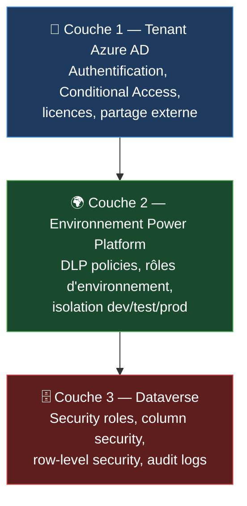
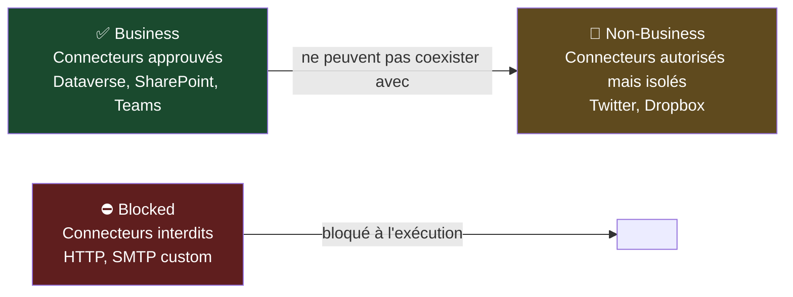

# Sécurité, identité et conformité

## Objectifs pédagogiques

À l'issue de ce module, vous serez capable de :

1. **Identifier** les vecteurs d'attaque spécifiques à une plateforme low-code comme Power Platform
2. **Décrire** l'architecture de sécurité multicouche (tenant, environnement, données) et le rôle de chaque couche
3. **Configurer** des politiques DLP pour isoler les connecteurs sensibles des connecteurs non business
4. **Analyser** les security roles Dataverse et leur impact sur l'exposition des données
5. **Choisir** entre DLP, Column Security et Access Teams selon le besoin de protection et le coût de maintenance

---

## Mise en situation

En 2022, un analyste métier d'une grande banque européenne publie une Power App en partage externe pour "faciliter les échanges avec un partenaire". L'app est connectée à un environnement de production Dataverse contenant des données clients. Le connecteur HTTP est actif. Aucune politique DLP ne l'interdit.

Trois semaines plus tard, le partenaire — dont le tenant n'est pas géré — transfère l'app à un tiers non identifié. Ce tiers construit un Flow pointant sur le même environnement via le connecteur partagé, exfiltre 40 000 enregistrements clients par appels API successifs, et disparaît.

La défense naïve aurait été : "l'app est interne, seuls nos gens y accèdent". Sauf que Power Platform, par défaut, n'est pas interne. Le partage externe est activé. Le connecteur HTTP est dans le groupe "par défaut". Et les security roles Dataverse autorisent la lecture sur l'ensemble de la table pour tous les utilisateurs authentifiés.

Ce module décrit comment ce scénario devient structurellement impossible à reproduire avec la bonne architecture de sécurité.

---

## Le modèle de menace Power Platform

Power Platform n'est pas une application web classique. C'est une plateforme de composition : n'importe quel utilisateur avec une licence peut assembler des connecteurs, des flux et des tables Dataverse sans écrire une ligne de code. Ce modèle crée une surface d'attaque inhabituelle.

### Acteurs de menace réalistes

| Acteur | Vecteur | Actif ciblé |
|---|---|---|
| Employé mal informé | Partage accidentel d'app vers externe | Données Dataverse / SharePoint |
| Insider malveillant | Création de Flow avec connecteur non surveillé | Exfiltration vers stockage externe |
| Compte compromis | Connexion partagée réutilisée dans un Flow | Accès aux données de la connexion originale |
| Attaquant externe | Tenant non géré, guest user ajouté au mauvais groupe | Accès environnement si partage permis |
| Shadow IT interne | Environnement créé hors gouvernance, sans DLP | Bypass des politiques tenant |

### Actifs à protéger

- **Les données Dataverse** : tables, colonnes, lignes — structurées et accessibles via API REST standard (OData)
- **Les connexions partagées** : une connexion à un service externe peut être réutilisée par quiconque accède à l'app
- **Les Flows** : ils s'exécutent sous l'identité d'un compte de service ou d'un utilisateur — et peuvent être planifiés, déclenchés par webhook, ou appelés depuis l'extérieur
- **Les environnements** : un environnement sans DLP est une zone libre pour tout connecteur disponible dans le tenant

🧠 **Concept clé** — La menace principale sur Power Platform n'est pas l'injection SQL ou le XSS. C'est la **configuration excessive** : trop de permissions, trop de connecteurs autorisés, trop de visibilité entre environnements. L'attaquant n'a souvent pas besoin d'exploiter une CVE — il utilise ce que la plateforme autorise légitimement.

---

## Architecture de sécurité : les trois couches

La sécurité Power Platform s'organise en couches concentriques. Chaque couche peut être contournée si la couche extérieure est mal configurée.



Si un attaquant passe la couche 1 (compte compromis ou guest autorisé), il arrive sur l'environnement. Si la couche 2 ne l'arrête pas (DLP absent, rôle trop large), il accède à Dataverse. Si la couche 3 est permissive (security role "Basic User" avec Read sur toutes les tables), il exfiltre. Chaque couche doit être configurée indépendamment — aucune ne compense une autre.

---

### Couche 1 — Tenant Azure AD

L'authentification Power Platform repose entièrement sur Azure AD / Microsoft Entra ID. Un compte valide dans le tenant (ou un guest autorisé) peut potentiellement interagir avec la plateforme selon ses licences et les politiques actives.

**Conditional Access appliqué à Power Platform**

Le Conditional Access (CA) s'applique à Power Platform comme à n'importe quelle application Entra. Les trois applications à cibler explicitement sont :

- `PowerApps` — `475226c6-020e-4fb2-8a90-7a972cbfc1d4`
- `Power Automate` — `d3590ed6-52b3-4102-aeff-aad2292ab01c`
- `Dataverse` — `00000007-0000-0000-c000-000000000000`

La politique CA se configure depuis le portail Entra ID :

```
Entra ID → Protection → Conditional Access → New policy
  Name : PP-Production-Require-Compliant-Device
  Users : [groupe sécurité makers + utilisateurs PP]
  Target resources : Select apps
    → PowerApps (475226c6-...)
    → Power Automate (d3590ed6-...)
    → Dataverse (00000007-...)
  Conditions :
    → Device platforms : Any
    → Filter for devices : device.isCompliant -ne True
  Grant :
    → Require MFA
    → Require compliant device (Intune)
    → Require all selected controls
  Enable policy : On
```

⚠️ **Erreur fréquente** — Appliquer le CA uniquement sur "Microsoft 365" ou "All cloud apps" sans cibler explicitement Dataverse. L'API Dataverse est une application Entra distincte — elle peut rester accessible depuis un poste non conforme si elle n'est pas dans le scope de la politique.

**Partage externe et tenants non gérés**

Par défaut, un utilisateur Power Platform peut partager une app avec n'importe quelle adresse email — y compris des comptes dans des tenants non gérés. Ces comptes n'ont aucune politique de sécurité, aucun CA, aucun Intune.

```
Power Platform Admin Center → Policies → Tenant settings
  → "Share with everyone" : OFF
  → "Share canvas apps with guest users" : OFF
    (ou restreindre aux tenants partenaires via B2B Entra External ID)
```

---

### Couche 2 — Environnements et Data Loss Prevention

Un environnement Power Platform est un conteneur logiquement isolé : sa propre base Dataverse, ses propres apps, ses propres Flows, ses propres connexions. L'isolation est suffisante si configurée correctement.

**Rôles d'environnement**

| Rôle | Capacités | Risque si sur-attribué |
|---|---|---|
| **Environment Admin** | Gérer l'environnement, modifier les DLP locaux, accéder à tous les assets | Peut supprimer des DLP, créer des connexions sans restriction |
| **Environment Maker** | Créer apps, Flows, connexions, tables Dataverse | Peut créer un Flow exfiltrant des données si DLP mal configuré |

Le rôle Maker est accordé par défaut à tous les utilisateurs licensiés dans certaines configurations de tenant. C'est un vecteur d'exposition massif dans les grandes organisations.

```
Power Platform Admin Center → Environments → [Environnement] → Settings → Users + Permissions
  → Environment roles → Environment Maker
    → Retirer "All licensed users"
    → Assigner un groupe de sécurité Azure AD explicite
```

**Data Loss Prevention — la couche de contrôle des connecteurs**

Les DLP policies contrôlent quels connecteurs peuvent coexister dans une même app ou un même Flow. Chaque connecteur est classé dans l'un de trois groupes :



Un connecteur **Business** et un connecteur **Non-Business** ne peuvent pas coexister dans la même app ou le même Flow. Un Flow ne peut pas simultanément lire des données Dataverse (Business) et les envoyer vers Dropbox (Non-Business). Mais si aucune DLP n'est définie, tous les connecteurs coexistent librement.

🔴 **Vecteur d'attaque** — Le connecteur HTTP est dans Non-Business par défaut, pas dans Blocked. Dans l'environnement par défaut sans DLP, HTTP et Dataverse coexistent librement. Un insider peut créer un Flow qui lit Dataverse et poste vers un endpoint externe — exfiltration silencieuse, aucune alerte. La correction est de déplacer HTTP dans Blocked au niveau tenant.

Pour créer une DLP tenant-level couvrant tous les environnements (y compris le défaut) :

```
Power Platform Admin Center → Policies → + New Policy
  Name : [Tenant] DLP Baseline
  Scope : Add all environments (tenant-level)
  Business connectors :
    Dataverse, SharePoint, Teams, Outlook, OneDrive Business,
    Microsoft Forms, Power BI
  Blocked connectors :
    HTTP, HTTP with Azure AD, HTTP Webhook,
    SMTP (custom), custom connectors non validés
  Non-Business : le reste par défaut
  Save
```

⚠️ **Erreur fréquente** — Créer une DLP "pour les environnements de production" en oubliant l'environnement par défaut. Une DLP tenant-level couvre tous les environnements sans exception. Une DLP par environnement ne couvre pas le défaut.

**Connecteurs personnalisés et DLP**

Un connecteur personnalisé est une définition OpenAPI enregistrée dans un environnement. Par défaut, il tombe en Non-Business. Un insider peut créer un connecteur custom pointant vers un endpoint externe contrôlé, l'utiliser dans un Flow pour exfiltrer, et contourner toute politique qui ne bloque pas explicitement les custom connectors non certifiés.

Bloquer la création de connecteurs personnalisés dans les environnements hors développement, ou exiger une validation via pipeline ALM avant tout déploiement en production.

---

### Couche 3 — Dataverse : security roles, colonnes et lignes

Dataverse est une base de données relationnelle exposée via API REST OData. Sans restriction, n'importe quel utilisateur authentifié ayant le rôle Basic User peut lire l'ensemble des tables auxquelles ce rôle donne accès — souvent plusieurs dizaines de tables dans une solution métier non durcie.

**Architecture des security roles**

Un security role Dataverse définit des permissions sur quatre axes :

| Axe | Portée | Exemple |
|---|---|---|
| Table | Create / Read / Write / Delete / Append / Assign | Read sur `Account` |
| Scope | User / Business Unit / Parent BU / Organization | Voir ses propres lignes vs toutes les lignes |
| Colonne | Column Security Profile | Bloquer la lecture de `SSN` ou `Salary` |
| Hiérarchie | Manager hierarchy | Accès aux données des subordonnés directs |

🧠 **Concept clé** — Le scope "Organization" sur une permission Read signifie que l'utilisateur peut lire **toutes les lignes** de la table, quelle que soit leur propriétaire. Basic User a ce scope sur plusieurs tables système par défaut. Un utilisateur peut donc interroger directement l'API OData et récupérer l'intégralité d'une table, même si son app ne lui en montre qu'une partie.

Pour auditer les security roles via PowerShell (Power Platform CLI) :

```powershell
# Lister les security roles d'un environnement
pac auth create --url https://<ORG>.crm.dynamics.com
pac org who

# Appel OData pour extraire les rôles et leurs membres
$headers = @{ Authorization = "Bearer $token" }
Invoke-RestMethod `
  -Uri "https://<ORG>.api.crm.dynamics.com/api/data/v9.2/roles?`$select=name,roleidunique" `
  -Headers $headers `
  -Method GET | ConvertTo-Json -Depth 5

# Vérifier les membres d'un rôle spécifique
Invoke-RestMethod `
  -Uri "https://<ORG>.api.crm.dynamics.com/api/data/v9.2/roles(<ROLE_ID>)/systemusers_association?`$select=fullname,internalemailaddress" `
  -Headers $headers `
  -Method GET | ConvertTo-Json -Depth 5
```

**Column Security Profiles**

Dataverse permet de restreindre l'accès à des colonnes spécifiques via les Column Security Profiles. Une colonne marquée "secured" n'est visible que par les utilisateurs associés au profil — même si leur security role autorise Read sur la table.

```
make.powerapps.com → [Environnement] → Tables → [Table] → Colonnes → [Colonne]
  → "Column security" : Enable
  → Dataverse → Column security profiles → New profile
    Name : [Table]-Sensitive-ReadOnly
    → Read : Allow pour les rôles concernés
    → Assign : [groupe sécurité ou utilisateurs autorisés]
```

Pour vérifier la différence de comportement OData avec et sans Column Security Profile actif :

```
# Sans Column Security Profile actif sur la colonne "salary"
GET https://<ORG>.api.crm.dynamics.com/api/data/v9.2/contacts?$select=fullname,salary
→ Réponse : { "fullname": "Alice Martin", "salary": 85000 }

# Avec Column Security Profile actif, utilisateur non autorisé
GET https://<ORG>.api.crm.dynamics.com/api/data/v9.2/contacts?$select=fullname,salary
→ Réponse : { "fullname": "Alice Martin", "salary": null }
# La colonne est retournée null — pas d'erreur 403, juste une valeur masquée
```

⚠️ **Erreur fréquente** — Croire que masquer une colonne dans une Power App suffit à la protéger. Le masquage est côté UI uniquement. Si aucun Column Security Profile n'est actif, l'endpoint OData retourne la valeur en clair à n'importe quel utilisateur dont le security role autorise Read sur la table.

**Row-Level Security via Business Units**

Les Business Units (BU) sont la structure hiérarchique de Dataverse. Un enregistrement appartient à une BU via son propriétaire. En configurant le scope des permissions à "Business Unit" plutôt qu'"Organization", un utilisateur ne voit que les lignes appartenant à sa BU. Pour des cas plus complexes (segmentation par client, par projet), les Access Teams permettent de partager des enregistrements spécifiques sans modifier les security roles globaux.

---

## Prise de décision — DLP, Column Security ou Access Teams

Ces trois mécanismes ne sont pas interchangeables. Voici quand appliquer chacun :

| Besoin | Mécanisme | Coût cognitif | Impact performance | Maintenance |
|---|---|---|---|---|
| Empêcher un connecteur d'exfiltrer | **DLP Policy** | Faible | Nul | Faible — politique tenant centralisée |
| Masquer une colonne sensible à certains utilisateurs | **Column Security Profile** | Moyen | Faible | Moyen — gérer les profils par table |
| Restreindre l'accès à des lignes spécifiques selon le contexte métier | **Access Teams / BU scope** | Élevé | Modéré sur grandes tables | Élevé — logique par enregistrement |
| Bloquer l'accès complet à une table | **Security Role (supprimer Read)** | Faible | Nul | Faible — rôle centralisé |

**Règle de décision rapide** :

- Si la question est "quel connecteur peut parler à quoi" → **DLP**
- Si la question est "quelle colonne est visible pour qui" → **Column Security Profile**
- Si la question est "quelles lignes sont visibles pour qui" → **BU scope ou Access Teams**
- Si la question est "qui peut accéder à cette table du tout" → **Security Role**

Ne pas empiler les trois mécanismes pour compenser un modèle de données mal conçu. Column Security ne remplace pas un mauvais security role. Access Teams ne compensent pas l'absence de DLP.

---

## Zero Trust appliqué à Power Platform

Le modèle Zero Trust se traduit concrètement sur Power Platform par quatre principes opérationnels :

**1. Vérifier explicitement** — Conditional Access sur les trois applications cibles, MFA obligatoire, device compliance.

**2. Moindre privilège** — Security roles réduits au minimum fonctionnel. Pas de Basic User avec scope Organization sur les tables sensibles. Makers limités à des groupes explicites.

**3. Supposer la compromission** — Activer les audit logs Dataverse pour toutes les tables sensibles. Configurer des alertes sur les volumes d'accès inhabituels.

**4. Isoler les environnements** — Les données de production ne doivent jamais être accessibles depuis un environnement de développement. Les connexions de production ne doivent jamais être réutilisées en dev.

Pour activer l'audit Dataverse sur un environnement de production :

```
Power Platform Admin Center → Environments → [Prod] → Settings → Auditing
  → Start auditing : ON
  → Audit user access : ON
  → Log access : ON

make.powerapps.com → Tables → [Table sensible] → Properties → Advanced
  → Auditing : Enable
```

---

## Gestion des connexions partagées

Une connexion Power Platform embarque des credentials. Quand un Flow utilise cette connexion, il s'exécute avec les droits du compte qui a créé la connexion — pas nécessairement de l'utilisateur qui déclenche le Flow.

🔴 **Vecteur d'attaque** — Un admin crée un Flow de provisioning avec une connexion SQL sous son compte administrateur. Il partage le Flow avec une équipe. Chaque membre peut désormais déclencher des requêtes SQL avec les droits admin SQL — sans accès direct à la base, et sans que l'UI le signale.

**Types de connexions**

| Type | Mécanisme | Risque |
|---|---|---|
| **User connection** | OAuth — l'utilisateur s'authentifie lui-même | L'app agit en son nom, scope limité à ses droits |
| **Shared connection (owner)** | Le créateur partage ses credentials embarqués | N'importe qui avec accès au Flow hérite des droits |
| **Service Principal** | Application Entra ID avec client credentials | Droits gérés explicitement, rotation possible, auditable |

Pour les Flows de production critiques, remplacer les owner connections par un Service Principal :

```
# 1. Créer l'App Registration Entra
Entra ID → App registrations → New registration
  Name : sp-powerplatform-prod-flows
  → Certificates & secrets → New client secret
    Description : prod-flows-secret-2025
    Expires : 12 months
    → Copier la valeur (stocker en Azure Key Vault, jamais en dur)

# 2. Enregistrer comme Application User dans Power Platform
Power Platform Admin Center → [Environnement] → Settings → Application users → New app user
  → Select app : sp-powerplatform-prod-flows (App ID depuis Entra)
  → Business unit : [BU appropriée]
  → Security roles : [rôle custom minimal — uniquement les tables nécessaires]

# 3. Utiliser dans le connecteur Dataverse du Flow
  Connection → Service Principal
  → Tenant ID : <TENANT_ID>
  → Client ID : <APP_ID>
  → Client Secret : <SECRET_VALUE>
```

---

## Conformité et traçabilité

**Audit trail Dataverse**

Les logs d'audit Dataverse enregistrent les opérations CRUD sur les tables activées. Ils sont accessibles depuis le Power Platform Admin Center et peuvent être exportés vers Microsoft Sentinel ou un SIEM tiers via les connecteurs Purview / Defender for Cloud Apps.

🧠 **Concept clé** — La rétention par défaut des audit logs Dataverse est de **30 jours** en Managed Environment. Pour des obligations réglementaires (RGPD, secteur financier), configurer l'export vers un stockage long terme avant l'expiration.

**Microsoft Purview et sensitivity labels**

Dans les environnements Managed, l'intégration avec Microsoft Purview permet d'appliquer des sensitivity labels aux environnements Dataverse. Un environnement labellisé "Confidential" peut hériter de politiques DLP renforcées automatiquement. Cette intégration est partiellement en preview à la date de rédaction — vérifier la disponibilité GA avant de s'appuyer dessus en architecture de production.

**Managed Environments**

Les Managed Environments (licence Power Platform Premium ou add-on) ajoutent :

- **Weekly digest** : rapport automatique des apps, Flows actifs, makers, connexions utilisées
- **Sharing limits** : limiter le nombre d'utilisateurs avec qui une app peut être partagée
- **IP firewall** : restreindre l'accès à l'environnement à des plages IP définies

```
Power Platform Admin Center → Environments → [Prod] → Edit
  → Managed Environments : Enable
  → IP firewall : Add IP ranges
    → [plage réseau corporate]
    → [plage VPN]
  Save
```

L'IP firewall seul élimine la majorité des scénarios d'accès depuis des postes non gérés hors réseau.

---

## Erreurs fréquentes

**1. Laisser l'environnement par défaut sans DLP**

L'environnement par défaut est accessible à tous les utilisateurs licensiés du tenant. Sans DLP, un connecteur comme HTTP ou Gmail peut y être utilisé librement pour exfiltrer des données SharePoint ou Teams. La correction : DLP tenant-level stricte couvrant l'environnement par défaut. Ne pas s'en remettre à une DLP par environnement.

**2. Security role "System Administrator" sur des comptes de service**

Un compte de service utilisé pour un Flow de synchronisation n'a pas besoin du rôle System Administrator. Ce rôle donne un accès complet à toutes les tables, tous les paramètres, toute la configuration de l'environnement. Créer un security role custom avec uniquement les tables et opérations nécessaires.

**3. Partage de connexions entre environnements**

Réutiliser une connexion de production (SQL, API externe) dans un Flow de développement expose les données de production à un environnement non durci. Une connexion par environnement, avec des comptes de service distincts et des droits distincts. En dev, pointer sur des données anonymisées ou synthétiques.

**4. Ignorer les connecteurs tiers dans l'inventaire DLP**

Les connecteurs tiers (Salesforce, ServiceNow, Jira) sont en Non-Business par défaut. Un Flow peut lire Dataverse et pousser vers Salesforce si les deux groupes sont compatibles ou si la DLP est mal construite. Auditer régulièrement les connecteurs via le centre d'administration, et reclasser en Blocked ceux qui ne font pas partie de l'architecture approuvée.

💡 **Astuce** — Le CoE Starter Kit (composant Inventory) génère automatiquement la liste de tous les connecteurs utilisés dans le tenant, par environnement, par maker. C'est le premier outil à déployer pour auditer une situation existante.

---

## Cas réel en entreprise

**Contexte** : grand groupe industriel, 12 000 utilisateurs M365, Power Platform en libre service depuis 2 ans sans gouvernance formalisée. L'équipe sécurité découvre lors d'un audit interne 847 Flows actifs dans le tenant, dont 134 utilisant le connecteur HTTP vers des endpoints externes non répertoriés.

**Impact** : parmi ces 134 Flows, 12 envoyaient des données incluant des noms, emails et numéros de contrats vers des services webhook. Pas d'exfiltration malveillante confirmée, mais une violation RGPD potentielle sur le transfert de données personnelles vers des destinataires non qualifiés.

**Mesures correctives déployées** :

1. DLP tenant-level déployée en 48h : HTTP déplacé en Blocked pour tous les environnements sauf deux environnements dev isolés
2. Les 134 Flows en violation ont été suspendus automatiquement par la DLP (comportement normal : un Flow utilisant un connecteur devenu Blocked est désactivé)
3. Revalidation des 134 Flows par les makers propriétaires — 89 Flows légitimes réactivés après correction, 45 abandonnés
4. Managed Environments activés sur les 5 environnements de production
5. CoE Starter Kit déployé pour inventaire continu
6. Formation makers obligatoire avant réactivation — 320 makers formés en 3 semaines

**KPI post-correction (6 semaines)** : 0 nouveau Flow avec HTTP non approuvé en production, 23 tentatives bloquées automatiquement par la DLP, taux de Flows en anomalie passé de 16 % à 0,4 %.

---

## Résumé

Power Platform présente une surface d'attaque dominée par la misconfiguration plutôt que par des vulnérabilités classiques. L'architecture de sécurité s'organise en trois couches indépendantes — tenant Azure AD, environnement avec DLP, Dataverse avec security roles — et chaque couche doit être configurée explicitement. Le Conditional Access sur les trois applications cibles (PowerApps, Power Automate, Dataverse), les DLP tenant-level avec HTTP en Blocked, les security roles custom avec scope minimal, et les Managed Environments sur la production constituent le socle minimal. La prise de décision entre DLP, Column Security et Access Teams suit une logique claire : DLP pour les flux de données entre connecteurs, Column Security pour les colonnes sensibles, scopes BU pour les lignes. Ce qui reste à surveiller : la dérive silencieuse via les makers non formés, les connecteurs tiers non audités, et la réutilisation de connexions de production hors des environnements contrôlés.

---

<!-- snippet
id: powerplatform_dlp_http_block
type: warning
tech: power-platform
level: intermediate
importance: high
format: knowledge
tags: dlp, connecteur, exfiltration, power-automate, configuration
title: HTTP non bloqué dans DLP = exfiltration possible
content: Si le connecteur HTTP est dans le groupe Non-Business (comportement par défaut), un Flow peut lire Dataverse (Business) uniquement si la DLP sépare les groupes. Mais dans l'environnement par défaut sans DLP, HTTP et Dataverse coexistent librement. Un insider crée un Flow : trigger Dataverse → action HTTP POST vers endpoint externe → exfiltration silencieuse. Correction : déplacer HTTP dans Blocked au niveau tenant, sauf exceptions explicites pour environnements dev isolés.
description: Le connecteur HTTP en Non-Business par défaut permet l'exfiltration depuis Dataverse si aucune DLP tenant-level ne le bloque explicitement.
-->

<!-- snippet
id: powerplatform_dlp_policy_create
type: command
tech: power-platform
level: intermediate
importance: high
format: knowledge
tags: dlp, admin-center, tenant, configuration, connecteurs
title: Créer une DLP policy tenant-level via Admin Center
context: À exécuter dans Power Platform Admin Center pour couvrir tous les environnements y compris le défaut
command: Power Platform Admin Center → Policies → + New Policy → Scope : Add all environments → Business : <BUSINESS_CONNECTORS> → Blocked : <BLOCKED_CONNECTORS>
example: Power Platform Admin Center → Policies → + New Policy → Scope : Add all environments → Business : Dataverse, SharePoint, Teams, Outlook → Blocked : HTTP, HTTP with Azure AD, HTTP Webhook, SMTP custom
description: Une DLP tenant-level couvre tous les environnements sans exception — c'est la seule garantie que l'environnement par défaut est protégé.
-->

<!-- snippet
id: powerplatform_conditional_access_dataverse
type: warning
tech: power-platform
level: intermediate
importance: high
format
