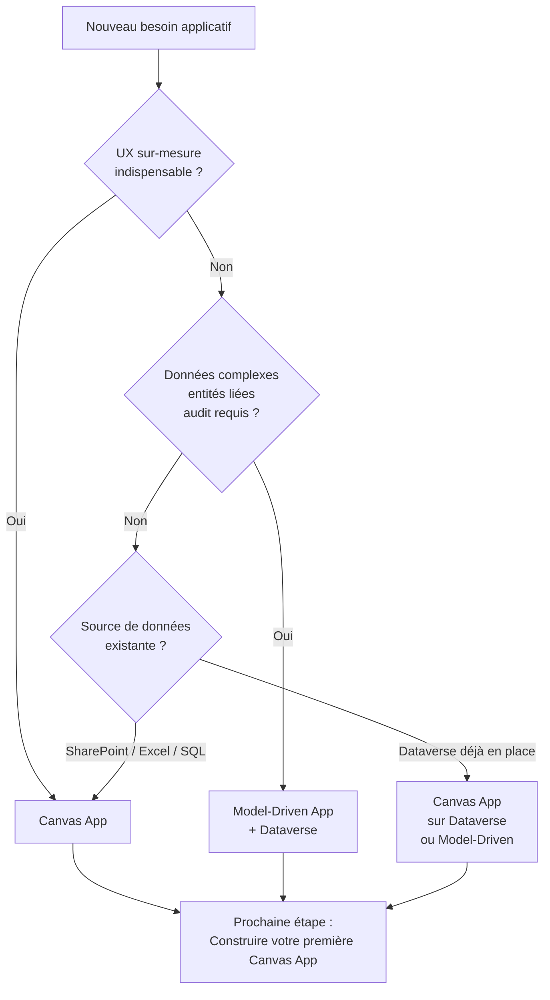

# Types d'applications Power Apps

## Objectifs pédagogiques

À l'issue de ce module, vous serez capable de :

- Distinguer une Canvas App d'une Model-Driven App selon leurs principes de fonctionnement
- Identifier le type d'application adapté à un besoin métier donné
- Comprendre le rôle de Dataverse dans le choix du type d'application
- Lire un diagramme de décision et justifier un choix d'architecture applicative

---

## Mise en situation

Vous rejoignez une équipe qui doit outiller deux équipes différentes. La première équipe est terrain : des techniciens qui remplissent des rapports d'intervention depuis leur téléphone, avec un formulaire simple mais une mise en page soignée. La seconde équipe est back-office : des gestionnaires qui suivent des dossiers clients complexes, naviguent entre des entités liées, et ont besoin de vues, de règles métier et d'un historique automatique.

Un seul outil — Power Apps — peut répondre aux deux besoins. Mais pas avec le même type d'application.

---

## Ce que Power Apps propose vraiment

Power Apps n'est pas un seul type d'application avec des options. C'est une plateforme qui propose deux philosophies de développement fondamentalement différentes, chacune optimisée pour une famille de problèmes.

La question n'est pas "quelle est la meilleure ?". C'est "laquelle correspond à ce que vous construisez ?".

---

## Canvas App — quand la mise en page prime

### Le principe

Une Canvas App, c'est littéralement une toile blanche. Vous posez vos composants visuels où vous voulez, vous connectez chaque élément à la source de données de votre choix, et vous contrôlez l'expérience pixel par pixel. L'analogie la plus juste : c'est PowerPoint avec des données.

Ce qui distingue fondamentalement ce modèle, c'est que **l'interface pilote la logique**. Vous dessinez d'abord, vous branchez les données ensuite. Aucune structure de données n'impose quoi que ce soit à votre écran.

### Ce que ça donne en pratique

- Un écran de rapport terrain avec photo, géolocalisation, champ texte libre et bouton de soumission — disposés exactement comme vous le voulez
- Une application mobile avec navigation personnalisée, couleurs de marque, animations de transition
- Un formulaire multi-étapes avec des règles d'affichage conditionnelles (si ce champ vaut X, afficher cette section)

### La flexibilité a un prix

Cette liberté implique que **vous êtes responsable de tout** : la navigation entre écrans, la gestion des erreurs, la logique métier, les appels de données. Chaque bouton doit être câblé manuellement via des formules (pensez Excel, mais pour déclencher des actions).

⚠️ **Erreur fréquente** : traiter une Canvas App comme un formulaire glorifié. Sa vraie puissance est dans des scénarios où l'UX compte autant que les données — si vous construisez une interface qui ressemble à un ERP, vous êtes probablement sur le mauvais outil.

### Sources de données

Une Canvas App peut se connecter à presque n'importe quoi : SharePoint, Excel, SQL Server, Dataverse, API REST, Salesforce, et 600+ autres connecteurs. C'est l'outil le plus polyglotte de la plateforme.

---

## Model-Driven App — quand le modèle de données pilote tout

### Le principe

À l'opposé, une Model-Driven App part des données, pas de l'écran. Vous définissez vos tables, vos colonnes, vos relations dans Dataverse — et l'application génère automatiquement les formulaires, les vues, les dashboards et la navigation.

L'analogie : c'est comme si Dynamics 365 générait une interface à partir de votre schéma de base de données.

🧠 **Concept clé** : une Model-Driven App est **indissociable de Dataverse**. Vous ne pouvez pas en créer une sans lui. Ce n'est pas une contrainte technique arbitraire — c'est parce que l'application tire sa structure (formulaires, relations, règles métier) directement du modèle de données stocké dans Dataverse.

### Ce que vous gagnez

Le gain principal est massif pour les scénarios complexes : vous ne codez pas l'interface, elle existe automatiquement dès que votre modèle de données est défini. Vous ajoutez une colonne dans une table → elle apparaît dans le formulaire. Vous définissez une relation entre deux tables → la navigation entre les enregistrements existe sans effort.

Autres bénéfices natifs, sans une ligne de code :
- Audit trail (qui a modifié quoi, quand)
- Contrôle d'accès granulaire par rôle de sécurité (couvert dans le module Sécurité du pilier 0)
- Règles métier déclaratives (rendre un champ obligatoire si un autre vaut X)
- Vues filtrées et triées configurables
- Timeline des activités sur chaque enregistrement

### La contrepartie

Vous ne contrôlez pas l'interface. Le layout des formulaires suit des conventions fixes. Si votre besoin est "je veux que ce bouton soit en haut à gauche avec cette couleur et cette animation", la Model-Driven App va vous résister.

💡 **Astuce** : depuis 2022, il est possible d'intégrer des composants Canvas dans une Model-Driven App pour obtenir le meilleur des deux mondes sur des zones spécifiques. Mais c'est une technique avancée — à garder en tête pour plus tard.

---

## La comparaison côte à côte

| Critère | Canvas App | Model-Driven App |
|---|---|---|
| Point de départ | L'interface (écran blanc) | Le modèle de données (Dataverse) |
| Contrôle visuel | Total | Limité aux zones configurables |
| Sources de données | 600+ connecteurs | Dataverse uniquement |
| Navigation | Manuelle (formules) | Générée automatiquement |
| Règles métier | Formules dans l'app | Déclaratives dans Dataverse |
| Audit / historique | À construire | Natif |
| Courbe de prise en main | Progressive (formules) | Forte au départ (modèle de données) |
| Cas d'usage typique | Formulaire terrain, app mobile, UX sur-mesure | Gestion de dossiers, CRM interne, suivi d'entités complexes |
| Prérequis Dataverse | Non (mais possible) | Oui, obligatoire |

---

## Comment choisir ?

La question à se poser n'est pas technique au départ. C'est une question métier.

```
Est-ce que l'expérience utilisateur doit être sur-mesure ?
    → Oui                          → Non / standard suffit
    ↓                              ↓
Canvas App                Est-ce que les données sont complexes
                          avec des relations entre entités ?
                              → Oui        → Non
                              ↓            ↓
                          Model-Driven  Canvas App
                              App       sur Dataverse
                                        ou SharePoint
```

Voici un diagramme de décision plus formel :



### Trois situations concrètes pour ancrer le choix

**Situation 1 — Rapport d'intervention terrain**
Des techniciens saisissent des comptes-rendus depuis leur téléphone : photos, signature, commentaire libre, géolocalisation. L'UX doit être simple et rapide. Les données vont dans SharePoint.
→ **Canvas App**. La mise en page compte, les données sont simples, SharePoint suffit.

**Situation 2 — Suivi de dossiers clients internes**
Une équipe gère des dossiers avec des contacts, des opportunités liées, des tâches associées, un historique d'interactions. Il faut des droits différents selon les rôles.
→ **Model-Driven App**. La complexité relationnelle et les besoins de sécurité pointent vers Dataverse + Model-Driven.

**Situation 3 — Dashboard de validation de budget**
Un manager doit approuver ou rejeter des demandes qui viennent d'un système SAP. Interface simple, workflow clair, mais intégration externe.
→ **Canvas App**. La source de données est externe (SAP via connecteur), la logique de validation sera dans Power Automate, et l'UX doit être épurée.

---

## Ce qu'il faut retenir

Power Apps propose deux types d'applications qui répondent à deux visions opposées du développement : partir de l'interface (Canvas) ou partir des données (Model-Driven).

La Canvas App donne une liberté totale sur l'expérience visuelle, au prix d'une responsabilité totale sur la logique. Elle fonctionne avec pratiquement n'importe quelle source de données. La Model-Driven App génère l'interface à partir du modèle Dataverse, avec des fonctionnalités avancées (audit, sécurité, relations) disponibles dès le départ, mais une flexibilité visuelle réduite.

Le bon choix dépend d'une seule question de fond : est-ce que c'est l'expérience utilisateur ou la richesse du modèle de données qui est le facteur critique de votre projet ? Dans le module suivant, vous construirez votre première Canvas App en partant de zéro.

---

<!-- snippet
id: powerapps_canvas_principe
type: concept
tech: power-apps
level: beginner
importance: high
format: knowledge
tags: canvas app, interface, connecteurs, formules, low-code
title: Canvas App — l'interface pilote la logique
content: Dans une Canvas App, vous partez d'un écran blanc et placez chaque composant manuellement. La logique (navigation, données, conditions) est écrite en formules Power Fx. Avantage : contrôle visuel total et connexion à 600+ sources de données. Contrepartie : vous gérez tout vous-même, y compris la navigation entre écrans et la gestion des erreurs.
description: Modèle "interface d'abord" — liberté totale sur l'UX mais responsabilité totale sur la logique métier et les données.
-->

<!-- snippet
id: powerapps_modeldriven_principe
type: concept
tech: power-apps
level: beginner
importance: high
format: knowledge
tags: model-driven, dataverse, formulaires, vues, securite
title: Model-Driven App — le modèle de données génère l'interface
content: Une Model-Driven App part du schéma Dataverse : tables, colonnes, relations → l'application génère formulaires, vues et navigation automatiquement. Audit trail, contrôle d'accès par rôle et règles métier déclaratives sont natifs. Contrainte : source de données exclusivement Dataverse, mise en page non personnalisable librement.
description: Modèle "données d'abord" — Dataverse obligatoire, mais formulaires, vues et audit générés sans code.
-->

<!-- snippet
id: powerapps_modeldriven_dataverse_obligatoire
type: warning
tech: power-apps
level: beginner
importance: high
format: knowledge
tags: model-driven, dataverse, prerequis, architecture
title: Model-Driven App — Dataverse est obligatoire, pas optionnel
content: Il est impossible de créer une Model-Driven App sans Dataverse. Ce n'est pas une contrainte contournable : l'application tire sa structure (formulaires, relations, règles) directement du modèle de données Dataverse. Tenter de connecter une autre source ne fonctionne pas pour ce type d'app.
description: Piège classique du débutant : Dataverse n'est pas une option pour les Model-Driven Apps, c'est un prérequis architectural.
-->

<!-- snippet
id: powerapps_choix_ux_vs_donnees
type: tip
tech: power-apps
level: beginner
importance: high
format: knowledge
tags: canvas app, model-driven, choix, architecture, decision
title: Choisir le bon type d'app en une question
content: Posez-vous cette seule question : "Est-ce que l'expérience utilisateur doit être sur-mesure ?" Si oui → Canvas App. Si non, demandez : "Les données sont-elles complexes avec des entités liées et un audit requis ?" Si oui → Model-Driven App. Ce filtre couvre 90% des cas réels.
description: La règle de décision tient en deux questions : UX sur-mesure ? → Canvas. Données complexes + audit ? → Model-Driven.
-->

<!-- snippet
id: powerapps_canvas_sources_donnees
type: concept
tech: power-apps
level: beginner
importance: medium
format: knowledge
tags: canvas app, connecteurs, sharepoint, sql, dataverse, sources
title: Canvas App — compatible avec 600+ sources de données
content: Une Canvas App peut se connecter à SharePoint, Excel, SQL Server, Dataverse, Salesforce, API REST et plus de 600 connecteurs. C'est l'outil le plus polyglotte de Power Platform. Contrairement à la Model-Driven App, elle ne force aucune source spécifique. Cela la rend idéale quand les données existent déjà dans un système tiers.
description: Canvas App = maximum de flexibilité sur la source de données. Aucune contrainte — SharePoint, SQL, API, Dataverse, tout fonctionne.
-->

<!-- snippet
id: powerapps_modeldriven_natif
type: tip
tech: power-apps
level: beginner
importance: medium
format: knowledge
tags: model-driven, audit, securite, regles-metier, dataverse
title: Model-Driven App — ce qui est natif sans une ligne de code
content: Dès qu'une Model-Driven App est créée sur Dataverse, vous obtenez gratuitement : audit trail (qui a modifié quoi, quand), contrôle d'accès par rôle de sécurité, règles métier déclaratives (champ obligatoire si condition), vues filtrées/triées configurables, timeline des activités. Ces fonctionnalités représentent des semaines de développement sur une Canvas App.
description: Choisir Model-Driven quand audit + sécurité granulaire + relations entre entités sont requis — tout est natif, rien à coder.
-->

<!-- snippet
id: powerapps_canvas_modeldriven_hybride
type: tip
tech: power-apps
level: beginner
importance: low
format: knowledge
tags: canvas app, model-driven, composants, hybride, pcf
title: Intégrer un composant Canvas dans une Model-Driven App
content: Depuis 2022, il est possible d'intégrer des sections Canvas App directement dans un formulaire Model-Driven (via "Canvas component" dans le form editor). Cela permet une UX sur-mesure sur une zone précise tout en gardant l'audit et les règles Dataverse. Technique avancée — à considérer uniquement quand le besoin UX est ciblé et justifié.
description: Hybridation possible : Canvas component dans Model-Driven pour UX sur-mesure sur une zone, sans sacrifier les fonctionnalités Dataverse.
-->
